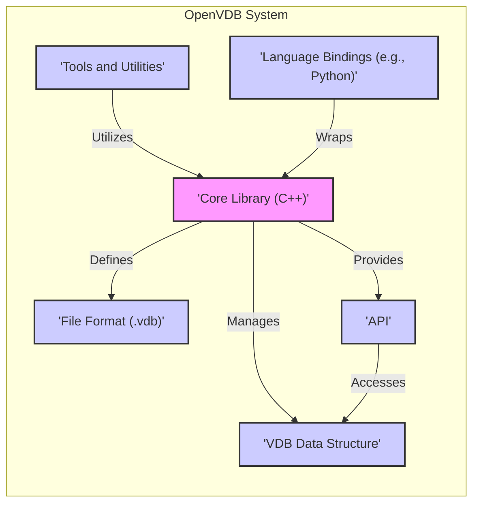
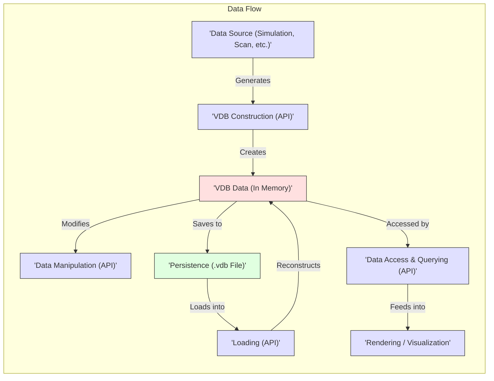

# Project Design Document: OpenVDB

**Version:** 1.1
**Date:** October 26, 2023
**Author:** AI Software Architect

## 1. Introduction

This document provides an enhanced and detailed design overview of the OpenVDB project, an open-source C++ library for the efficient storage and manipulation of sparse volumetric data. This document is specifically tailored to serve as a robust foundation for subsequent threat modeling activities, offering a comprehensive understanding of the system's architecture, key components, data flow pathways, and potential security considerations.

## 2. Project Overview

OpenVDB is a sophisticated hierarchical and dynamically adaptable data structure, coupled with a rich suite of tools, designed for the storage and manipulation of sparse volumetric data discretized on a three-dimensional grid. Its primary applications lie within visual effects (VFX) and scientific simulations, where it excels at representing complex volumetric phenomena such as smoke, fire, clouds, and fluid dynamics. The library is engineered for efficient memory utilization and rapid data access, making it indispensable for large-scale simulations and high-performance rendering workflows.

## 3. Goals

* Deliver a highly efficient and scalable data structure optimized for sparse volumetric data representation.
* Offer a comprehensive and extensible set of tools for advanced manipulation and in-depth analysis of volumetric data.
* Ensure seamless interoperability between diverse software packages through a well-defined and standardized file format.
* Cultivate a thriving and collaborative open-source development environment, encouraging community contributions and innovation.

## 4. Target Audience

This document is primarily intended for:

* Security engineers and architects tasked with performing thorough threat modeling and security assessments.
* Software developers actively working with or integrating the OpenVDB library into larger systems.
* DevOps engineers responsible for the secure deployment, configuration, and ongoing maintenance of systems utilizing OpenVDB.

## 5. System Architecture

OpenVDB's architecture is modular and centers around the following core components, each playing a crucial role in its functionality:

* **Core Library (C++):** This forms the fundamental building block of OpenVDB, providing the underlying data structures (specifically, the VDB tree) and a rich set of algorithms for manipulating and processing volumetric data. It handles memory management, tree traversal, and core data operations.
* **VDB Data Structure:** A key innovation of OpenVDB, this hierarchical tree structure is specifically optimized for the efficient storage of sparse data. It employs nodes at varying levels of resolution, enabling efficient representation of both densely populated and sparsely populated regions within the volumetric domain.
* **File Format (.vdb):** A well-defined and standardized binary file format designed for the persistent storage of VDB data on disk. This format encapsulates not only the volumetric data itself but also crucial metadata pertaining to the grid structure, its topological properties, and the nature of the data contained within.
* **API (Application Programming Interface):** A comprehensive C++ API that serves as the primary interface for developers to interact with the OpenVDB library. It provides functions for creating, modifying, querying, and iterating over VDB data structures.
* **Tools and Utilities:** A valuable collection of command-line tools and utility functions that extend the functionality of the core library. These tools facilitate tasks such as converting between various data formats, performing detailed inspections of VDB files, and executing basic operations directly on VDB grids.
* **Language Bindings (e.g., Python):**  Wrapper libraries that enable developers to leverage the power of OpenVDB functionality from other programming languages, most notably Python, broadening its accessibility and integration potential.

## 6. Data Flow

Understanding the typical data flow within the OpenVDB system is crucial for identifying potential security vulnerabilities. The process generally involves these stages:

* **Data Creation/Ingestion:** Volumetric data originates from diverse sources, including simulation software, 3D scanning devices, or procedural generation algorithms. This raw data represents the initial state of the volumetric phenomenon.
* **VDB Construction (via API):** The raw input data is then organized and structured into the hierarchical VDB tree format using the functions provided by the OpenVDB API. This process involves discretizing the continuous data onto a 3D grid and populating the nodes of the VDB tree according to the data's spatial distribution.
* **In-Memory VDB Data Manipulation (via API):** Once constructed, the VDB data residing in memory can be manipulated through the API. This includes a wide range of operations such as filtering noise, smoothing surfaces, applying transformations, combining multiple grids, and performing complex mathematical operations on the volumetric data.
* **Persistence to Disk (.vdb File):** The in-memory VDB data can be saved to persistent storage using the standardized `.vdb` file format. This process serializes the tree structure and data, allowing for later retrieval and sharing.
* **Loading from Disk (via API):** Conversely, `.vdb` files stored on disk can be loaded back into memory using the API, reconstructing the VDB tree and making the data available for further processing or visualization.
* **Data Access and Querying (via API):** Applications can access and query the data stored within the VDB structure through the API. This involves traversing the tree and retrieving values at specific locations or within defined regions.
* **Rendering and Visualization:** The final stage often involves using the VDB data as input for rendering engines or specialized visualization tools. These applications interpret the volumetric data to create visual representations of the simulated or captured phenomena.

## 7. Security Considerations

Given OpenVDB's role in processing potentially large and complex datasets, and its implementation in C++, several security considerations are paramount:

* **File Format Vulnerabilities:**  Maliciously crafted `.vdb` files could exploit vulnerabilities in the file parsing logic. This could lead to buffer overflows, arbitrary code execution, or denial-of-service attacks if an application attempts to load a compromised file.
* **Memory Management Issues:** As a C++ library, OpenVDB requires careful memory management. Potential vulnerabilities include buffer overflows (when writing beyond allocated memory), use-after-free errors (accessing memory that has been deallocated), and memory leaks (failure to release allocated memory). These can lead to crashes, unpredictable behavior, or exploitable conditions.
* **Input Validation Failures:** Insufficient validation of input data during VDB construction or manipulation can lead to unexpected states, crashes, or even security vulnerabilities. For example, providing extremely large grid dimensions or invalid data types could trigger errors.
* **Dependency Vulnerabilities:** OpenVDB relies on external libraries. Vulnerabilities discovered in these dependencies (TBB, Blosc, zlib, half, jemalloc) could indirectly impact the security of applications using OpenVDB. Regularly updating dependencies is crucial.
* **Integer Overflows:** Operations involving very large grid sizes, voxel counts, or data values could potentially lead to integer overflows. This can result in incorrect calculations, unexpected behavior, or even exploitable conditions if the overflow affects memory allocation or indexing.
* **Denial of Service (DoS):** Processing exceptionally large or highly complex VDB files could consume excessive computational resources (CPU, memory), potentially leading to denial-of-service conditions in applications that rely on OpenVDB. This is especially relevant in scenarios where users can upload or provide arbitrary VDB files.
* **API Misuse:** Incorrect usage of the OpenVDB API by developers can inadvertently introduce security vulnerabilities. For example, failing to properly handle exceptions or not checking return values could lead to unexpected program states.
* **Lack of Authentication/Authorization:** While OpenVDB itself doesn't handle network communication, applications using it might process VDB files from untrusted sources. Without proper authentication and authorization mechanisms at the application level, malicious VDB files could be introduced into the system.

## 8. Dependencies

OpenVDB's functionality relies on the following external libraries, each potentially introducing its own set of security considerations:

* **TBB (Threading Building Blocks):** Used for parallel processing and multi-threading, potential vulnerabilities could arise in its task scheduling or synchronization mechanisms.
* **Blosc:** Provides high-performance data compression. Vulnerabilities in its compression or decompression algorithms could be exploited.
* **zlib:** A widely used library for data compression. Known vulnerabilities exist and require careful management and updates.
* **half:**  Handles half-precision floating-point numbers. While generally less prone to direct security issues, bugs could lead to incorrect data representation.
* **jemalloc (optional):** An alternative memory allocator. Security considerations depend on the specific version and its known vulnerabilities.

Maintaining up-to-date versions of these dependencies is crucial for mitigating potential security risks.

## 9. Deployment Considerations

The way OpenVDB is deployed and integrated into larger systems has implications for security:

* **Compilation and Linking:** Ensuring that OpenVDB and its dependencies are compiled with appropriate security flags (e.g., stack canaries, address space layout randomization - ASLR) can help mitigate certain types of vulnerabilities.
* **Dependency Management:**  Using robust dependency management tools and practices is essential to track and update dependencies, addressing known vulnerabilities promptly.
* **Platform Compatibility:** Security features and vulnerabilities can vary across different operating systems and architectures. Deployment needs to consider these platform-specific nuances.
* **Resource Management:** Applications using OpenVDB need to implement proper resource limits and monitoring to prevent denial-of-service attacks caused by processing excessively large VDB files.
* **Sandboxing/Isolation:** In security-sensitive environments, consider running applications that process untrusted VDB files within sandboxed or isolated environments to limit the potential impact of vulnerabilities.
* **Secure File Handling:** When dealing with VDB files from external sources, implement secure file handling practices, including input validation, sanitization, and potentially virus scanning.

## 10. Future Considerations

Ongoing development and future enhancements to OpenVDB should consider the following security aspects:

* **Enhanced File Format Security:** Explore options for adding cryptographic signatures or checksums to the `.vdb` file format to ensure data integrity and detect tampering. Consider optional encryption for sensitive data.
* **Improved Error Handling and Reporting:** Implement more detailed and informative error messages to aid in debugging and identifying potential security issues. Avoid exposing sensitive information in error messages.
* **Static and Dynamic Analysis:** Integrate static and dynamic analysis tools into the development process to proactively identify potential vulnerabilities in the codebase.
* ** নিয়মিত Security Audits:** Conduct regular security audits and penetration testing to identify and address potential weaknesses.
* **Fuzzing:** Employ fuzzing techniques to test the robustness of the file parsing logic and other critical components against malformed or unexpected inputs.
* **Community Security Engagement:** Encourage security researchers to report vulnerabilities through a responsible disclosure process.

This enhanced design document provides a more detailed and security-focused overview of the OpenVDB project. It serves as a valuable resource for conducting thorough threat modeling and implementing appropriate security measures when using or integrating OpenVDB into software systems.