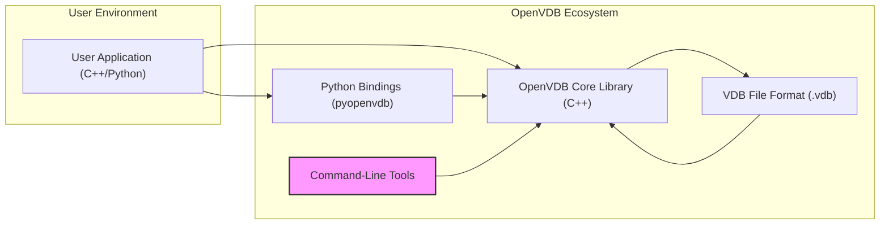

# Project Design Document: OpenVDB for Threat Modeling

## 1. Project Overview

### 1.1. Project Name

OpenVDB

### 1.2. Project Repository

[https://github.com/academysoftwarefoundation/openvdb](https://github.com/academysoftwarefoundation/openvdb)

### 1.3. Project Goals and Objectives

OpenVDB is an open-source C++ library and a suite of tools designed for the efficient storage, manipulation, and rendering of sparse volumetric data. Originating from DreamWorks Animation and now part of the Academy Software Foundation, OpenVDB aims to establish an industry standard for volumetric data representation and processing.  Its open-source nature fosters community review and transparency, contributing to its robustness and security over time.

**Key Objectives:**

*   **Efficient Sparse Data Representation:**  Utilize a hierarchical data structure (VDB tree) to minimize memory footprint and maximize processing efficiency for sparse volumetric grids, which are common in VFX and scientific data.
*   **High-Performance Volumetric Operations:** Provide a rich set of optimized algorithms for core volumetric operations, including but not limited to: filtering, boolean operations, level set manipulation, spatial transformations, and data analysis.
*   **Scalability for Large Datasets:** Enable the processing and management of extremely large and complex volumetric datasets, crucial for high-resolution simulations and detailed scenes.
*   **Broad Interoperability:**  Facilitate seamless integration with a wide range of Digital Content Creation (DCC) applications, rendering engines (both offline and real-time), and scientific software through robust file format support (VDB) and well-defined APIs (C++ and Python).
*   **Open Standard for Volumetrics:** Promote and maintain OpenVDB as an open, vendor-neutral, and widely adopted standard for volumetric data exchange within the visual effects, animation, scientific computing, and related industries.

### 1.4. Target Audience and Use Cases

OpenVDB is designed to serve a diverse range of users and applications:

*   **Visual Effects (VFX) and Animation Studios:**  Core tool for representing and manipulating volumetric effects such as smoke, fire, explosions, clouds, fog, and gaseous phenomena in film, television, and animation production.
*   **Scientific Computing and Research:**  Essential for representing and analyzing volumetric data arising from simulations (e.g., fluid dynamics, climate modeling), medical imaging (e.g., CT, MRI), and other scientific domains requiring 3D data analysis.
*   **Game Development:**  Increasingly used for creating dynamic and realistic environmental effects, particle systems, and interactive volumetric elements in modern games.
*   **Software Developers and Tool Creators:**  Provides a robust library for developers building custom tools, plugins, and applications that require advanced volumetric data processing capabilities.
*   **Researchers in Computer Graphics and Data Structures:**  Serves as a platform for research and development in sparse data structures, volumetric algorithms, and high-performance computing techniques.

**Illustrative Use Cases:**

*   **Simulation Data Management and Processing:** Efficiently storing, accessing, and manipulating the large volumetric outputs of fluid, particle, and other physics-based simulations.
*   **Volumetric Rendering and Visualization:** Representing volumetric data for rendering in various rendering pipelines, from offline ray tracers to real-time rasterization engines, and for scientific visualization purposes.
*   **Data Format Conversion and Interoperability:** Bridging the gap between different volumetric data formats and enabling data exchange and collaboration across diverse software ecosystems.
*   **Procedural Volumetric Content Generation:**  Leveraging OpenVDB's algorithms to procedurally create complex and detailed volumetric content, such as terrains, textures, and special effects.
*   **Volumetric Data Analysis and Feature Extraction:**  Analyzing volumetric datasets to extract meaningful features, perform measurements, and gain insights from complex 3D data.

### 1.5. High-Level System Architecture

OpenVDB's architecture is structured around a central C++ core library that implements the VDB data structure and a comprehensive suite of algorithms.  To enhance accessibility and usability, it also provides Python bindings for scripting and rapid prototyping, along with command-line tools for common utility operations.



**Component Descriptions:**

*   **OpenVDB Core Library (C++):**  The foundational component of OpenVDB, written in highly optimized C++. It provides the core VDB data structure, a rich set of algorithms for volumetric manipulation, and the primary API for C++ applications to interact with OpenVDB.  Performance and memory efficiency are key design considerations.
*   **Python Bindings (pyopenvdb):**  A set of Python wrappers built around the C++ core library. These bindings enable Python scripts to leverage the full functionality of OpenVDB, facilitating rapid prototyping, scripting workflows, and integration with Python-based pipelines.
*   **Command-Line Tools:**  A collection of standalone executable utilities designed for performing common VDB-related tasks from the command line. Examples include `vdb_view` (for visualizing VDB files), `vdb_combine` (for merging VDB grids), and `vdb_convert` (for format conversion). These tools are primarily built using the OpenVDB Core Library.
*   **VDB File Format (.vdb):**  A standardized, efficient, and portable file format specifically designed for storing and exchanging VDB grids. The format supports features like compression and metadata, and is the primary means of persistent storage and data interchange for OpenVDB.

## 2. System Architecture Deep Dive

### 2.1. Components and Modules (Detailed)

The OpenVDB Core Library is further modularized into functional units:

*   **VDB Data Structure Module:**
    *   `Tree`: The central hierarchical octree-like data structure optimized for sparse grids. Manages nodes and efficient traversal.
    *   `Node Types`: Defines different node types within the VDB tree hierarchy: internal nodes (for branching) and leaf nodes (containing voxel data).
    *   `Leaf Nodes / Blocks`:  Represents small, dense arrays (blocks) of voxels at the deepest level of the tree, storing the actual volumetric data values.
    *   `Accessor and Iterators`: Provides efficient mechanisms for accessing, querying, and iterating over voxel data within the VDB grid, handling sparsity and tree traversal transparently.
*   **Algorithms and Operations Module:**
    *   `Filtering Algorithms`:  Implements various filters for smoothing, sharpening, noise reduction, and feature enhancement of volumetric data (e.g., Gaussian filters, median filters).
    *   `Boolean Operations`:  Provides algorithms for performing set operations (union, intersection, difference) between VDB grids, enabling constructive solid geometry operations on volumes.
    *   `Level Set Algorithms`:  Includes algorithms for working with level sets, such as distance field computation, surface extraction (e.g., marching cubes), and level set re-initialization.
    *   `Spatial Transformations`:  Offers functionalities for transforming VDB grids in 3D space, including translation, rotation, scaling, and shearing.
    *   `Data Analysis Algorithms`:  Provides tools for analyzing volumetric data, such as gradient computation, curvature estimation, and volume integration.
    *   `Input/Output (IO) Module`:  Handles reading and writing VDB files, data serialization and deserialization, and potentially supports other volumetric data formats for import/export.
*   **Utilities and Support Module:**
    *   `Math Library`:  Provides essential mathematical functions and data structures, including vector and matrix operations, geometry primitives, and numerical algorithms.
    *   `Threading and Parallelism Support`:  Implements mechanisms for leveraging multi-core processors and parallel computing architectures to accelerate computationally intensive VDB operations.
    *   `Memory Management`:  Employs efficient memory allocation and deallocation strategies to minimize memory overhead and improve performance, especially when dealing with large datasets.
    *   `Diagnostics and Debugging`:  Includes tools and utilities for debugging, profiling, and diagnosing issues within the OpenVDB library.

### 2.2. Data Flow Diagram (Detailed)

This diagram expands on the previous data flow, illustrating more specific stages and data transformations within an OpenVDB processing pipeline.

```mermaid
graph LR
    subgraph "Data Input Sources"
        A["Input VDB Files (.vdb)"]
        B["Procedural Generation Scripts"]
        C["External Simulation Data"]
        D["Sensor Data (e.g., LiDAR)"]
    end
    subgraph "OpenVDB Processing Pipeline"
        E["Data Loading (VDB IO)"]
        F["VDB Grid Construction"]
        G["Algorithm Application (Filtering, Boolean Ops, etc.)"]
        H["Grid Manipulation & Transformation"]
        I["Data Analysis & Feature Extraction"]
    end
    subgraph "Data Output Destinations"
        J["Output VDB Files (.vdb)"]
        K["Rendering Engine (Integration)"]
        L["Visualization Software"]
        M["Data Export (Other Formats: e.g., OBJ, PLY)"]
        N["In-Memory Data Access (API)"]
    end

    A --> E
    B --> F
    C --> F
    D --> F
    E --> F
    F --> G
    G --> H
    H --> I
    I --> J
    I --> K
    I --> L
    I --> M
    I --> N
    G --> F  :::loopback  <!-- Iterative Algorithms & Refinement -->

    classDef loopback stroke:#f9f,stroke-width:2px;
```

### 2.3. Key Technologies and Dependencies

*   **Core Programming Language:** C++ (ISO C++11 standard or later is typically required) - Emphasizing performance, memory control, and cross-platform compatibility.
*   **Scripting Language:** Python (Primarily for bindings and scripting, often requiring a specific Python version).
*   **Build System and Toolchain:** CMake (Cross-platform build system), standard C++ compiler (e.g., GCC, Clang, MSVC).
*   **External Dependencies (Libraries):**
    *   **Boost Libraries:** (Potentially, depending on build options and features enabled) - May be used for various utilities, smart pointers, and potentially for specific algorithms.
    *   **Blosc:** (Optional, but highly recommended for efficient VDB file compression) - A high-performance compressor/decompressor.
    *   **OpenEXR:** (Optional, for integration with image-based workflows and potentially for reading/writing image data within VDB tools) -  An open standard for high dynamic range images.
    *   **zlib:** (Commonly used for general-purpose compression, may be a dependency of other libraries or used directly).
    *   **Threading Libraries:** (Platform-specific or standard C++ threading) - For enabling parallel processing capabilities.
    *   **Operating System Libraries:** Standard libraries provided by target operating systems (Linux, macOS, Windows) for system-level functionalities.

### 2.4. Deployment Environment and Considerations

OpenVDB is primarily designed for deployment as a library integrated into larger software systems.

*   **Library Integration (Primary Deployment):** Compiled as a shared or static library and linked into C++ applications, Python scripts, DCC tools, rendering engines, and scientific applications.  Deployment involves distributing the compiled library and header files.
*   **Command-Line Tools Deployment (Secondary):** Command-line tools are distributed as standalone executables for direct user interaction via the command line. Deployment involves distributing compiled executables for target platforms.
*   **Cross-Platform Compatibility (Key Feature):**  Designed to be highly cross-platform, supporting major operating systems including Linux, macOS, and Windows. Build systems and code are structured to ensure portability.
*   **Cloud and HPC Environments:** Well-suited for deployment in cloud-based rendering farms, high-performance computing (HPC) clusters, and distributed simulation environments due to its scalability and efficiency.
*   **Containerization (e.g., Docker):** Can be easily containerized for consistent deployment and dependency management in various environments, including cloud and local development setups.

## 3. Security Considerations for Threat Modeling

### 3.1. Security Goals (CIA Triad - Emphasizing Integrity)

*   **Integrity (Paramount):** Maintaining the accuracy, consistency, and fidelity of volumetric data throughout its lifecycle. Preventing unauthorized or accidental modification, corruption, or data loss.  Integrity is especially critical in scientific simulations and VFX pipelines where data accuracy directly impacts results and visual fidelity.
*   **Availability:** Ensuring that the OpenVDB library, tools, and processed volumetric data are accessible and operational when required. Preventing denial-of-service attacks, resource exhaustion vulnerabilities, or any issues that could disrupt workflows or render systems unusable.
*   **Confidentiality (Context Dependent):** Protecting sensitive volumetric data from unauthorized access and disclosure. While OpenVDB itself is open source, the data it processes can be highly confidential (e.g., proprietary studio assets, medical patient data, classified scientific data). Confidentiality is primarily managed at the application and system level integrating OpenVDB, but vulnerabilities within OpenVDB could potentially be exploited to compromise data confidentiality in a broader context.

### 3.2. Trust Boundaries (Expanded)

*   **User Application <-> OpenVDB Library API:**  The boundary between the integrating application (potentially untrusted or containing vulnerabilities) and the trusted OpenVDB library API.  Malicious or malformed input passed from the application to OpenVDB functions is a primary threat vector.
*   **VDB File I/O <-> OpenVDB Core Parser:**  The critical boundary between reading and writing VDB files (potentially from untrusted sources) and the core VDB file parsing logic.  Maliciously crafted VDB files are a significant threat.
*   **OpenVDB <-> External Dependencies (Supply Chain):** The boundary between OpenVDB and its external library dependencies (Boost, Blosc, etc.). Vulnerabilities in these dependencies can indirectly impact OpenVDB's security.  Compromised dependencies represent a supply chain risk.
*   **Command-Line Tools <-> User Input & Environment:** The boundary between command-line tools and user-provided arguments, input files, environment variables, and shell commands.  Command injection and path traversal are potential threats.
*   **Network Boundary (If Applicable):** In scenarios where OpenVDB is used in a distributed system or network-accessible service (less common for core library, but possible in applications), network communication channels represent a trust boundary.

### 3.3. Data Sensitivity and Classification (Examples)

*   **High Sensitivity:**
    *   Proprietary VFX Assets and Scene Data: Unreleased movie assets, studio-confidential animation data, proprietary volumetric effects techniques.
    *   Medical Imaging Data (PHI): Patient health information contained in CT scans, MRI data, etc., subject to HIPAA and other regulations.
    *   Classified Scientific or Military Simulation Data: Sensitive research data, defense-related simulations, requiring strict access control.
*   **Medium Sensitivity:**
    *   Non-Proprietary VFX Assets: Publicly released assets, stock volumetric effects.
    *   General Scientific Simulation Data: Research data that is intended for public release but may have embargo periods.
    *   Game Development Assets: Game environment volumes, particle effects that are not yet publicly released.
*   **Low Sensitivity:**
    *   Test Data and Examples: Volumetric datasets used for testing, tutorials, and public examples.
    *   Synthetic or Procedurally Generated Volumes: Data created for demonstration or non-critical purposes.

### 3.4. Authentication and Authorization (Application Responsibility)

*   **No Built-in Authentication/Authorization:** OpenVDB itself does not incorporate any built-in authentication or authorization mechanisms. It operates on data provided to it by the integrating application.
*   **Application-Level Security is Crucial:** Security measures for authentication, authorization, and access control must be implemented at the application level that utilizes OpenVDB. This includes:
    *   User authentication to verify identity.
    *   Role-based access control (RBAC) to manage permissions.
    *   Data encryption at rest and in transit (if confidentiality is a concern).
*   **File System Permissions (VDB File Access):** Standard operating system file system permissions are essential for controlling access to VDB files stored on disk. Proper configuration of file permissions is critical to prevent unauthorized access or modification of VDB data.

### 3.5. Input Validation and Output Encoding (Focus on Input)

*   **Critical VDB File Parsing Validation:** Robust and rigorous input validation is absolutely essential during VDB file parsing. This is the primary defense against vulnerabilities arising from maliciously crafted VDB files. Validation must include:
    *   Format validation: Ensuring the file adheres to the VDB file format specification.
    *   Size limits: Preventing excessively large files that could cause resource exhaustion.
    *   Data range checks: Validating data values are within expected ranges.
    *   Structure validation: Checking the integrity of the VDB tree structure.
*   **API Input Validation (C++ and Python):** Input validation should be performed on all data passed to OpenVDB API functions from user applications. This includes validating data types, ranges, sizes, and formats to prevent unexpected behavior, crashes, or vulnerabilities.
*   **Output Encoding (Less Direct Threat):** While output encoding is less of a direct threat for OpenVDB itself, applications using OpenVDB should consider appropriate output encoding when displaying or exporting processed volumetric data, especially if the data is used in web contexts or other systems where injection vulnerabilities are a concern.

### 3.6. Logging and Monitoring (Application Integration)

*   **Limited OpenVDB Internal Logging:** The OpenVDB core library itself may have limited built-in logging capabilities, primarily focused on debugging and development.
*   **Application-Level Logging and Auditing (Essential):** Applications integrating OpenVDB must implement comprehensive logging and auditing to track security-relevant events, errors, and potential security incidents. This should include:
    *   Logging of VDB file access (reads and writes).
    *   Error logging during VDB parsing and processing.
    *   Auditing of user actions related to VDB data (if applicable).
    *   Monitoring of resource usage (CPU, memory) during VDB operations to detect potential DoS attempts.
*   **System-Level Monitoring:** Standard system monitoring practices should be applied to environments running OpenVDB-based applications to detect performance anomalies, resource exhaustion, unauthorized access attempts, and other suspicious activities.

## 4. Threat Modeling Focus Areas (Specific Vulnerability Examples)

Based on the architecture, security goals, and trust boundaries, the following areas are prioritized for threat modeling of OpenVDB and applications that utilize it:

*   **VDB File Format Parsing Vulnerabilities (High Priority):**
    *   **Threats:** Maliciously crafted VDB files are the most significant threat vector. Exploitable vulnerabilities in the VDB file parsing logic could lead to:
        *   **Buffer Overflows:** Writing beyond allocated memory buffers during parsing, potentially leading to arbitrary code execution.
        *   **Integer Overflows/Underflows:** Causing incorrect memory allocation sizes or logic errors, leading to crashes or memory corruption.
        *   **Format String Bugs:** Exploiting format string vulnerabilities in logging or error handling during parsing (less likely in modern C++, but still possible).
        *   **Denial of Service (DoS):** Crafting files that consume excessive resources (CPU, memory, disk I/O) during parsing, leading to application hang or crash.
        *   **Path Traversal (Less likely in core parsing, but possible in tools):** If file paths are not properly sanitized during file loading in tools, attackers might be able to access files outside of intended directories.
    *   **Focus:**  In-depth security review of the VDB file format specification and the parsing code within `openvdb/io/`.  Extensive fuzzing of the VDB file parser with a wide range of malformed, oversized, and specially crafted VDB files is crucial. Static analysis tools can also help identify potential vulnerabilities in the parsing code.

*   **API Vulnerabilities in Core Library (C++) (High Priority):**
    *   **Threats:** Improper handling of input data or internal state within C++ API functions could result in:
        *   **Memory Safety Issues:** Buffer overflows, use-after-free vulnerabilities, double-free vulnerabilities, memory leaks due to incorrect memory management in API functions.
        *   **Race Conditions and Concurrency Issues:** If OpenVDB algorithms are not properly thread-safe, race conditions could lead to data corruption or unpredictable behavior in multi-threaded applications.
        *   **Algorithmic Complexity Attacks:**  Exploiting algorithms with high computational complexity by providing inputs that trigger worst-case performance, leading to DoS.
    *   **Focus:**  Rigorous code review of critical API functions, especially those dealing with memory allocation, data manipulation, external data interaction, and parallel processing. Static analysis tools (e.g., Coverity, SonarQube) and dynamic analysis (e.g., Valgrind, AddressSanitizer) should be employed to detect memory safety and concurrency issues.

*   **Python Bindings (pyopenvdb) Vulnerabilities (Medium Priority):**
    *   **Threats:** Vulnerabilities in the Python bindings layer could arise from:
        *   **Incorrect C++/Python Interface:** Errors in wrapping C++ code for Python access, leading to type confusion, memory management mismatches, or incorrect object lifetime management.
        *   **Python Interpreter Vulnerabilities:** While less likely to be directly caused by OpenVDB, vulnerabilities in the underlying Python interpreter could be exploited if OpenVDB bindings interact with vulnerable Python features.
        *   **Input Validation Gaps in Python Layer:** If input validation is insufficient in the Python bindings, vulnerabilities from the C++ layer might be exposed through the Python API.
    *   **Focus:** Security review of the Python binding code (`pyopenvdb` directory). Ensure proper error handling, type checking, and memory management at the Python API level.  Testing the Python bindings with various input types and edge cases is important.

*   **Denial of Service (DoS) Attacks (Medium Priority):**
    *   **Threats:**  Resource exhaustion attacks targeting OpenVDB's processing capabilities:
        *   **Memory Exhaustion:** Providing extremely large or complex VDB datasets that consume excessive memory, leading to application crashes or system instability.
        *   **CPU Exhaustion:** Triggering computationally intensive algorithms with inputs that maximize processing time, leading to DoS.
        *   **Algorithmic Complexity Exploitation:**  Specifically crafting VDB data or API calls to exploit algorithms with poor worst-case time complexity.
    *   **Focus:** Analyze resource usage patterns of core OpenVDB algorithms, especially for operations that process large grids or complex data structures. Implement resource limits, input size validation, and algorithm complexity analysis to mitigate DoS risks.

*   **Dependency Vulnerabilities (Ongoing Monitoring):**
    *   **Threats:** Vulnerabilities in external libraries (Boost, Blosc, OpenEXR, zlib, etc.) that OpenVDB depends on could indirectly compromise OpenVDB and applications using it.
    *   **Focus:** Implement a robust dependency management process. Regularly monitor and update dependencies to address known vulnerabilities. Utilize dependency scanning tools (e.g., OWASP Dependency-Check, Snyk) to identify and track potential risks in dependencies.  Consider using "vendoring" or similar techniques to manage dependencies and reduce supply chain risks.

*   **Command-Line Tool Vulnerabilities (Medium Priority):**
    *   **Threats:** Vulnerabilities specific to the command-line tools:
        *   **Command Injection:** If command-line tools execute external commands based on user input without proper sanitization, command injection vulnerabilities could allow attackers to execute arbitrary commands on the system.
        *   **Argument Injection:** Improper handling of command-line arguments could allow attackers to inject malicious arguments that alter the tool's behavior or access unintended files.
        *   **Path Traversal:** If file paths provided to command-line tools are not properly validated, path traversal vulnerabilities could allow access to files outside of intended directories.
    *   **Focus:**  Security review of the command-line tool code, particularly input handling and command execution logic. Implement robust input validation and sanitization for all user-provided arguments, file paths, and environment variables. Avoid executing external commands based on untrusted input if possible.

This detailed design document and threat modeling focus areas provide a comprehensive starting point for securing OpenVDB and applications built upon it. Continuous security assessment, code review, and vulnerability testing are essential for maintaining a robust and secure volumetric data processing ecosystem. Remember to prioritize threat areas based on risk and impact, and to iterate on the threat model as the project evolves and new threats emerge.