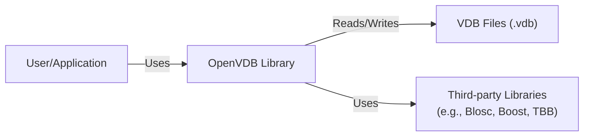
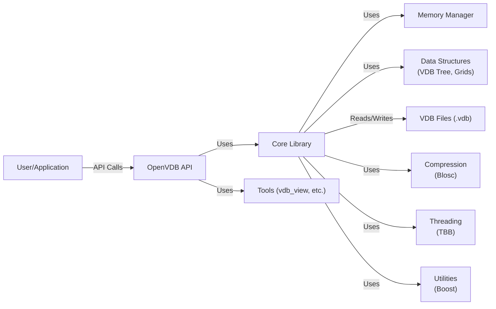
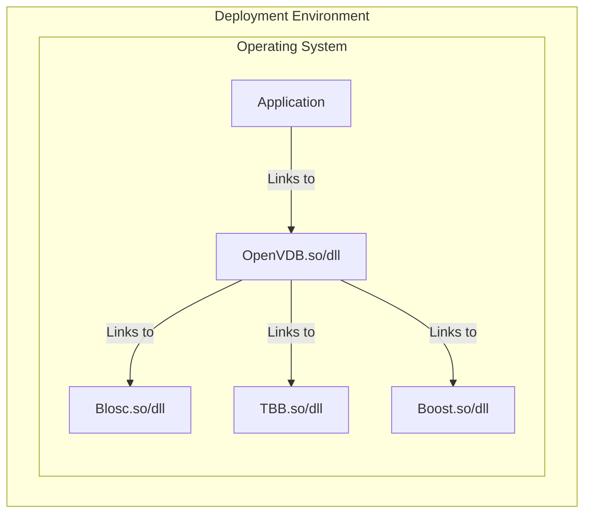
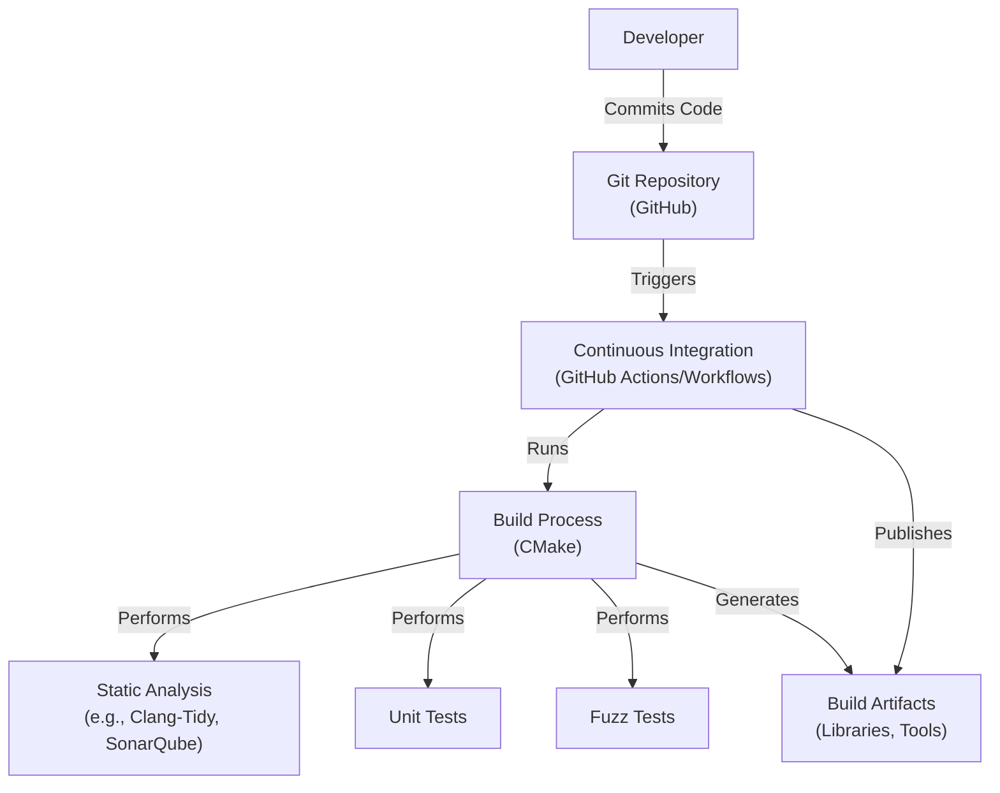

# Project Design Document: OpenVDB

## BUSINESS POSTURE

OpenVDB is an open-source library primarily focused on efficient storage and manipulation of sparse volumetric data, commonly used in computer graphics for visual effects and simulations. It's developed and maintained by the Academy Software Foundation (ASWF).

Priorities and Goals:

*   Provide a high-performance, industry-standard library for sparse volume data.
*   Maintain compatibility with a wide range of software and hardware platforms.
*   Foster a collaborative, open-source development environment.
*   Ensure the library is robust and reliable for use in production environments.
*   Minimize memory footprint and maximize computational efficiency.

Business Risks:

*   Data corruption or loss due to bugs in the library, leading to incorrect rendering or simulation results.
*   Performance bottlenecks hindering real-time or interactive applications.
*   Security vulnerabilities allowing malicious actors to exploit the library (less likely, but still a consideration given its use in production pipelines).
*   Incompatibility with evolving hardware and software standards, leading to obsolescence.
*   Lack of adoption by key industry players, limiting its impact and development resources.

## SECURITY POSTURE

Existing Security Controls:

*   security control: Code reviews: The GitHub repository indicates a pull request-based development workflow, suggesting code reviews are part of the process.
*   security control: Static analysis: The presence of CMake files and continuous integration (CI) workflows suggests the potential use of static analysis tools, although specific configurations need verification.
*   security control: Community scrutiny: As an open-source project under the ASWF, OpenVDB benefits from community scrutiny, increasing the likelihood of identifying and addressing vulnerabilities.
*   security control: Fuzz testing: Based on the repository, it is highly likely that fuzz testing is used.

Accepted Risks:

*   accepted risk: The library is primarily designed for performance and efficiency, which may lead to prioritizing these aspects over certain security hardening measures.
*   accepted risk: The library's focus is on data representation and manipulation, not on providing secure communication or authentication mechanisms. These are expected to be handled by the applications using OpenVDB.
*   accepted risk: The library might have dependencies on other libraries, which could introduce their own security vulnerabilities.

Recommended Security Controls:

*   security control: Integrate a comprehensive suite of static analysis tools (e.g., Coverity, SonarQube) into the CI pipeline, addressing any identified issues.
*   security control: Implement regular fuzz testing to identify potential vulnerabilities related to input handling and data parsing.
*   security control: Conduct a dependency analysis to identify and track vulnerabilities in third-party libraries.
*   security control: Establish a clear security vulnerability reporting and disclosure process.
*   security control: Consider adding runtime checks (assertions) for critical data structures to detect corruption early, even if it impacts performance slightly.

Security Requirements:

*   Authentication: Not directly applicable to the library itself. Authentication should be handled by the application using OpenVDB.
*   Authorization: Not directly applicable to the library itself. Authorization should be handled by the application using OpenVDB.
*   Input Validation: The library should validate input data to prevent unexpected behavior or crashes due to malformed or out-of-bounds data. This is crucial for preventing buffer overflows or other memory-related vulnerabilities.
*   Cryptography: Not directly applicable, as OpenVDB does not handle sensitive data requiring encryption. If encryption is needed, it should be handled at the application level.

## DESIGN

### C4 CONTEXT

Element Descriptions:

*   Element:
    *   Name: User/Application
    *   Type: External Entity (Software System or User)
    *   Description: Represents any software application or user that utilizes the OpenVDB library for volumetric data processing.
    *   Responsibilities:
        *   Integrates and utilizes the OpenVDB library.
        *   Provides input data to OpenVDB.
        *   Processes output data from OpenVDB.
        *   Handles user interaction and application logic.
    *   Security controls:
        *   Implements appropriate authentication and authorization mechanisms.
        *   Performs input validation before passing data to OpenVDB.
        *   Handles sensitive data securely.

*   Element:
    *   Name: OpenVDB Library
    *   Type: Software System
    *   Description: The core OpenVDB library, providing functionalities for storing, accessing, and manipulating sparse volumetric data.
    *   Responsibilities:
        *   Provides an API for creating, modifying, and querying VDB data structures.
        *   Manages memory allocation and deallocation for VDB data.
        *   Implements algorithms for efficient data access and manipulation.
        *   Provides tools for reading and writing VDB files.
    *   Security controls:
        *   Performs input validation on data passed to its API.
        *   Uses safe memory management practices.
        *   Is regularly reviewed and tested for vulnerabilities.

*   Element:
    *   Name: VDB Files (.vdb)
    *   Type: Data Store
    *   Description: Files containing volumetric data stored in the OpenVDB format.
    *   Responsibilities:
        *   Stores volumetric data in a persistent format.
    *   Security controls:
        *   None directly within the file format itself. Security relies on the application using OpenVDB and the underlying file system.

*   Element:
    *   Name: Dependencies
    *   Type: External Dependencies
    *   Description: Third-party libraries that OpenVDB relies on, such as Blosc for compression, Boost for utilities, and TBB for parallel processing.
    *   Responsibilities:
        *   Provides specific functionalities required by OpenVDB.
    *   Security controls:
        *   Security relies on the security practices of the respective library developers. OpenVDB should track and update these dependencies regularly to address known vulnerabilities.

### C4 CONTAINER

Element Descriptions:

*   Element:
    *   Name: User/Application
    *   Type: External Entity
    *   Description:  Represents any software application or user that utilizes the OpenVDB library.
    *   Responsibilities: Integrates and utilizes the OpenVDB library.
    *   Security controls: Implements appropriate authentication, authorization, and input validation.

*   Element:
    *   Name: OpenVDB API
    *   Type: API
    *   Description: The public interface of the OpenVDB library, providing functions for interacting with VDB data.
    *   Responsibilities: Exposes functions for creating, modifying, and querying VDB data structures.
    *   Security controls: Performs input validation on data passed to API functions.

*   Element:
    *   Name: Core Library
    *   Type: Library
    *   Description: The core logic of OpenVDB, implementing the VDB data structure and algorithms.
    *   Responsibilities: Manages VDB tree structure, grid operations, and data access.
    *   Security controls: Uses safe memory management practices, performs internal data validation.

*   Element:
    *   Name: Tools
    *   Type: Tools
    *   Description: Command-line tools provided with OpenVDB (e.g., vdb_view, vdb_print).
    *   Responsibilities: Provides utilities for inspecting and manipulating VDB files.
    *   Security controls: Performs input validation on command-line arguments and file data.

*   Element:
    *   Name: Memory Manager
    *   Type: Component
    *   Description: Manages memory allocation and deallocation for VDB data.
    *   Responsibilities: Allocates and frees memory for VDB nodes and grids.
    *   Security controls: Uses safe memory management practices to prevent memory leaks and buffer overflows.

*   Element:
    *   Name: Data Structures
    *   Type: Component
    *   Description: Implements the VDB tree structure and various grid types.
    *   Responsibilities: Stores and organizes volumetric data efficiently.
    *   Security controls: Internal data validation and consistency checks.

*   Element:
    *   Name: VDB Files (.vdb)
    *   Type: Data Store
    *   Description: Files containing volumetric data in the OpenVDB format.
    *   Responsibilities: Stores volumetric data persistently.
    *   Security controls: None directly within the file format.

*   Element:
    *   Name: Compression
    *   Type: Library (External)
    *   Description:  Handles data compression (typically using Blosc).
    *   Responsibilities: Compresses and decompresses VDB data blocks.
    *   Security controls: Relies on the security of the Blosc library.

*   Element:
    *   Name: Threading
    *   Type: Library (External)
    *   Description: Provides threading support (typically using TBB).
    *   Responsibilities: Enables parallel processing of VDB data.
    *   Security controls: Relies on the security of the TBB library.

*   Element:
    *   Name: Utilities
    *   Type: Library (External)
    *   Description: Provides utility functions (typically using Boost).
    *   Responsibilities: Offers various helper functions and data structures.
    *   Security controls: Relies on the security of the Boost library.

### DEPLOYMENT

Possible Deployment Solutions:

1.  Static Linking: OpenVDB can be statically linked into the application using it. This simplifies deployment as all dependencies are bundled into a single executable.
2.  Dynamic Linking: OpenVDB can be dynamically linked, requiring the OpenVDB shared libraries (and its dependencies) to be present on the target system.
3.  Containerization (Docker): The application using OpenVDB, along with OpenVDB and its dependencies, can be packaged into a Docker container for easy deployment and consistent environments.

Chosen Solution (Dynamic Linking - most common for libraries):

Element Descriptions:

*   Element:
    *   Name: Application
    *   Type: Application
    *   Description: The software application that utilizes the OpenVDB library.
    *   Responsibilities: Performs the main application logic, utilizing OpenVDB for volumetric data processing.
    *   Security controls: Implements application-level security measures.

*   Element:
    *   Name: OpenVDB.so/dll
    *   Type: Shared Library
    *   Description: The dynamically linked OpenVDB library.
    *   Responsibilities: Provides the OpenVDB functionality to the application.
    *   Security controls: Relies on the security measures implemented during the build process and the security of its dependencies.

*   Element:
    *   Name: Blosc.so/dll, TBBLib.so/dll, BoostLib.so/dll
    *   Type: Shared Library
    *   Description: Dynamically linked libraries that OpenVDB depends on.
    *   Responsibilities: Provide specific functionalities required by OpenVDB.
    *   Security controls: Relies on the security of these libraries. The system should keep them updated to address known vulnerabilities.

*   Element:
    *   Name: Operating System
    *   Type: Operating System
    *   Description: The underlying operating system (e.g., Linux, Windows, macOS).
    *   Responsibilities: Provides the runtime environment for the application and libraries.
    *   Security controls: Relies on the security features and updates of the operating system.

### BUILD

Build Process Description:

1.  Developers commit code changes to the Git repository hosted on GitHub.
2.  The commit triggers a Continuous Integration (CI) pipeline, likely using GitHub Actions or Workflows.
3.  The CI pipeline executes the build process, which is managed by CMake.
4.  During the build process:
    *   Static analysis tools (e.g., Clang-Tidy, and potentially SonarQube) are run to identify potential code quality and security issues.
    *   Unit tests are executed to verify the correctness of individual components.
    *   Fuzz tests are performed to check for vulnerabilities related to input handling.
    *   The build process generates the build artifacts, including the OpenVDB library (static or dynamic) and associated tools.
5.  The CI pipeline publishes the build artifacts, making them available for download or deployment.

Security Controls in Build Process:

*   security control: Code reviews (via pull requests) before merging code into the main branch.
*   security control: Static analysis to identify potential vulnerabilities early in the development cycle.
*   security control: Unit tests to ensure the correctness of code and prevent regressions.
*   security control: Fuzz testing to discover vulnerabilities related to unexpected or malicious input.
*   security control: Automated build process (CMake and CI) to ensure consistency and reproducibility.
*   security control: Dependency management (likely through CMake) to track and update third-party libraries.

## RISK ASSESSMENT

Critical Business Processes:

*   Rendering of visual effects in film and animation.
*   Scientific simulations involving volumetric data.
*   Any application relying on accurate and efficient representation of sparse volumes.

Data Sensitivity:

*   The OpenVDB library itself primarily deals with volumetric data, which is not typically considered *sensitive* in the traditional sense (like PII or financial data). However, the *content* of the volumetric data could be sensitive depending on the application. For example:
    *   A medical imaging application using OpenVDB might store patient scans, which are highly sensitive.
    *   A visual effects studio might use OpenVDB to store proprietary assets, which have commercial value.
    *   Scientific simulations might involve confidential research data.
*   Therefore, while OpenVDB itself doesn't handle data sensitivity, the *applications* using it might. The sensitivity of the data is determined by the *context* of its use.

## QUESTIONS & ASSUMPTIONS

Questions:

*   What specific static analysis tools are currently integrated into the CI pipeline?
*   What is the coverage and scope of the existing fuzz testing?
*   What is the process for managing and updating dependencies?
*   Is there a formal security vulnerability reporting and disclosure process?
*   Are there any specific performance requirements or constraints that might impact security decisions?
*   What are the target deployment environments (operating systems, hardware)?
*   Are there plans to support any specific cloud platforms or services?

Assumptions:

*   BUSINESS POSTURE: The primary concern is the integrity and reliability of the volumetric data, rather than confidentiality.
*   SECURITY POSTURE: The development team follows secure coding practices, but there is room for improvement in terms of formal security processes and tooling.
*   DESIGN: The library is designed for performance and efficiency, and security considerations are balanced against these goals. The application using OpenVDB is responsible for handling sensitive data and implementing appropriate security controls at the application level.