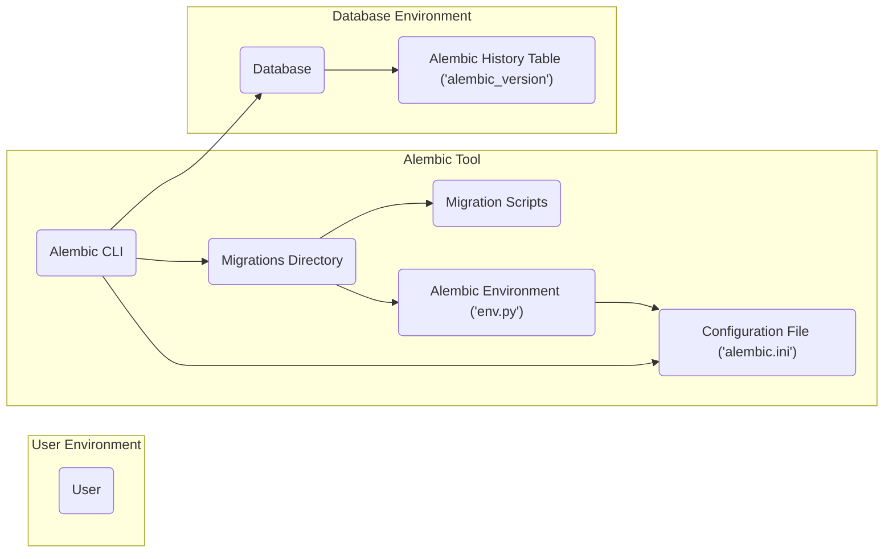
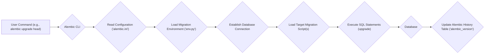
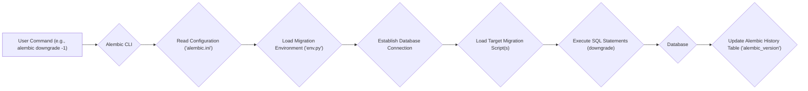

# Project Design Document: Alembic Database Migration Tool

**Document Version:** 1.1
**Date:** October 26, 2023
**Author:** AI Software Architect

## 1. Introduction

This document provides an enhanced and detailed design overview of the Alembic database migration tool. It aims to clearly describe the system's architecture, key components, and data flow, serving as a robust foundation for subsequent threat modeling activities. This document is intended for security engineers, developers, operations teams, and anyone involved in the security assessment and deployment of systems utilizing Alembic.

## 2. Project Overview

Alembic is a lightweight and flexible database schema migration tool for Python. It is most commonly used in conjunction with SQLAlchemy, a popular Python SQL toolkit and Object-Relational Mapper (ORM). Alembic enables developers to define, version control, and manage changes to database schemas in a systematic and reproducible manner. It achieves this through the use of human-readable "migration scripts" written in Python, which contain instructions for modifying the database structure.

## 3. System Architecture

Alembic primarily functions as a command-line interface (CLI) application. Its core operations involve interpreting configuration settings, interacting with version-controlled migration scripts, and executing SQL commands against a designated target database.

### 3.1. Key Components

*   **Alembic CLI:** This is the primary user interface for interacting with Alembic. Users execute commands via the CLI to initiate actions such as creating new migration scripts, applying pending migrations, downgrading the database schema, and inspecting the migration history.
*   **Configuration File (`alembic.ini`):** This INI-formatted file stores crucial configuration parameters for Alembic. Key settings include:
    *   `sqlalchemy.url`: The database connection string, which contains sensitive information like the database type, hostname, port, username, and password.
    *   `script_location`: The path to the directory containing the migration scripts.
    *   `version_table`: The name of the table used by Alembic to track applied migrations (default: `alembic_version`).
    *   Other environment-specific settings.
*   **Migrations Directory:** This directory, specified in the configuration file, houses the individual migration scripts. Each script represents a discrete set of changes to the database schema. The scripts are typically organized sequentially based on a revision identifier.
*   **Migration Scripts:** These are Python files that contain the actual logic for modifying the database schema. Each script typically defines two key functions:
    *   `upgrade()`: Contains the SQL statements or ORM operations required to apply the changes defined in the migration.
    *   `downgrade()`: Contains the SQL statements or ORM operations required to revert the changes introduced by the `upgrade()` function.
*   **Alembic Environment (`env.py`):** This Python script, located within the migrations directory, sets up the execution environment for the migration scripts. It is responsible for:
    *   Establishing the database connection using the settings from `alembic.ini`.
    *   Integrating with SQLAlchemy (if used).
    *   Providing access to the database connection for the migration scripts.
*   **Database:** This refers to the target database management system (e.g., PostgreSQL, MySQL, SQLite, SQL Server) that Alembic is managing the schema for.
*   **Alembic History Table (`alembic_version`):** This table is automatically created in the target database by Alembic. It stores a record of which migration scripts have been successfully applied to the database, allowing Alembic to track the current schema version and manage upgrades and downgrades.

### 3.2. Architectural Diagram

### 3.3. Component Interaction

1. The **User** interacts with the **Alembic CLI** by executing commands such as `alembic upgrade head` to apply all pending migrations or `alembic downgrade base` to revert all migrations.
2. The **Alembic CLI** begins by reading the **Configuration File ('alembic.ini')** to retrieve essential settings, including the database connection details and the location of the migrations.
3. Based on the command issued, the **Alembic CLI** interacts with the **Migrations Directory** to locate and load the relevant **Migration Scripts**.
4. The **Alembic Environment ('env.py')** script is executed. This script establishes a connection to the **Database** using the credentials specified in the configuration file. It also sets up any necessary integration with SQLAlchemy or other database interaction libraries.
5. The selected **Migration Scripts** are then executed. The `upgrade()` or `downgrade()` functions within these scripts contain SQL statements or ORM operations that are executed against the **Database** to modify its schema.
6. After successfully applying or reverting a migration, Alembic updates the **Alembic History Table ('alembic_version')** to reflect the current state of the database schema. This table is crucial for tracking which migrations have been applied and for determining the correct sequence of operations for future upgrades or downgrades.

## 4. Data Flow

The primary data flow within Alembic involves the process of applying or reverting changes to the database schema through the execution of migration scripts.

### 4.1. Migration Application Flow

### 4.2. Migration Downgrade Flow

## 5. Security Considerations

Several aspects of Alembic's design and usage present potential security considerations that need to be addressed:

*   **Sensitive Data in Configuration:** The `alembic.ini` file frequently contains sensitive database credentials in plaintext. Secure storage, access control, and potentially encryption of this file are paramount.
    *   Consider using environment variables or secure vault solutions to manage database credentials instead of directly embedding them in `alembic.ini`.
*   **Migration Script Vulnerabilities:** Migration scripts execute arbitrary SQL code. Maliciously crafted or poorly written scripts can introduce significant security risks, including:
    *   SQL Injection vulnerabilities leading to data breaches or manipulation.
    *   Data corruption or accidental data deletion.
    *   Denial-of-service attacks by executing resource-intensive queries.
    *   Privilege escalation if the database connection has elevated privileges.
*   **Access Control to Alembic Operations:** Restricting who can execute Alembic commands and modify migration scripts is crucial to prevent unauthorized database changes.
    *   Implement appropriate file system permissions on the migrations directory and `alembic.ini`.
    *   Consider integrating Alembic execution with an authentication and authorization system.
*   **Command Injection Risks:** If migration scripts or the Alembic environment interact with external systems or execute shell commands (e.g., using `os.system()` or similar functions), there is a risk of command injection vulnerabilities.
    *   Carefully review and sanitize any external input used in migration scripts.
    *   Avoid unnecessary interaction with external systems from within migration scripts.
*   **Integrity of Migration History:** If the `alembic_version` table is compromised, it could lead to inconsistencies in the tracked migration state, potentially causing issues with rollbacks or future migrations.
    *   Implement appropriate database security measures to protect the integrity of this table.
*   **Accidental Exposure of Sensitive Data:** Developers might inadvertently include sensitive data within migration scripts (e.g., sample data, API keys).
    *   Implement code review processes to identify and remove such sensitive information.
    *   Avoid hardcoding sensitive data in migration scripts.

## 6. Future Considerations (Out of Scope for Initial Threat Model)

While not directly part of the core functionality for the initial threat model, future extensions or common usage patterns could introduce new security considerations:

*   **Remote Execution of Migrations:** If Alembic is integrated into a system that allows remote triggering of migrations (e.g., through an API or web interface), robust authentication, authorization, and secure communication protocols are essential.
*   **Web Interface for Alembic Management:** Providing a web-based interface for managing migrations would introduce typical web application security concerns, such as Cross-Site Scripting (XSS), Cross-Site Request Forgery (CSRF), and authentication/authorization vulnerabilities.
*   **Integration with CI/CD Pipelines:** Automated execution of migrations within Continuous Integration/Continuous Deployment (CI/CD) pipelines requires secure storage and management of database credentials and careful handling of potential failure scenarios. Secrets management solutions should be employed.

## 7. Conclusion

This enhanced document provides a comprehensive and detailed overview of the Alembic database migration tool's architecture, key components, and data flow. It emphasizes critical security considerations that should be addressed during the design, development, and deployment of systems utilizing Alembic. This document serves as a valuable resource for conducting thorough threat modeling and implementing appropriate security measures to ensure the secure management of database schemas.
