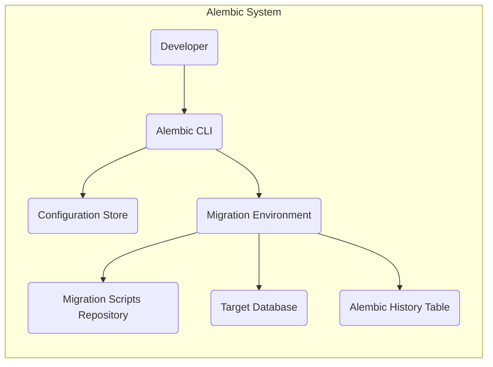
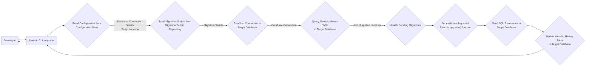

# Project Design Document: Alembic Database Migration Tool

**Version:** 1.1
**Date:** October 26, 2023
**Prepared By:** Gemini (AI Architecture Expert)

## 1. Introduction

This document provides a detailed design overview of the Alembic database migration tool, intended to facilitate effective threat modeling. It clearly articulates the system's architecture, components, and data flow, enabling security professionals to identify potential vulnerabilities and attack vectors.

### 1.1. Purpose

The primary purpose of this document is to provide a comprehensive architectural understanding of Alembic to support thorough threat modeling activities. It outlines the key components, their interactions, and the data they handle, enabling security professionals to identify potential vulnerabilities and attack vectors.

### 1.2. Scope

This document covers the core functionality of Alembic, focusing on its role in managing database schema changes through migration scripts. It includes the command-line interface, configuration mechanisms, and interaction with the target database. It specifically focuses on the actions performed by Alembic itself and does not delve into the intricacies of specific database dialect implementations or the internal workings of the SQLAlchemy library, which Alembic utilizes.

### 1.3. Goals

*   Clearly define the major components within the Alembic system.
*   Thoroughly describe the interactions between these components.
*   Illustrate the flow of data within the system during typical operations.
*   Provide sufficient technical detail for informed security analysis and threat identification.

## 2. System Overview

Alembic is a lightweight and flexible database migration tool tightly integrated with the SQLAlchemy ORM. It empowers developers to define and manage database schema evolutions through version-controlled migration scripts.

### 2.1. Key Components

*   **Developer:** The user interacting with Alembic, typically a software developer responsible for authoring, applying, and managing database schema changes.
*   **Alembic CLI (Command-Line Interface):** The primary interface for interacting with Alembic. It exposes a set of commands for initializing, creating, applying, and inspecting migrations.
*   **Configuration Store:**  The location where Alembic's configuration is persisted, typically an `alembic.ini` file. This holds essential settings for database connectivity and migration management.
*   **Migration Environment:** The runtime context in which Alembic operates. This environment is responsible for loading configuration, discovering and executing migration scripts, and interacting with the database.
*   **Migration Scripts Repository:** The directory (typically named `versions`) where individual migration scripts are stored as Python files. These scripts contain the instructions for database schema modifications.
*   **Target Database:** The specific database instance (e.g., PostgreSQL, MySQL, SQLite) whose schema is being managed and modified by Alembic.
*   **Alembic History Table:** A dedicated table within the target database (conventionally named `alembic_version`) used by Alembic to persistently track which migration scripts have been successfully applied.

## 3. Component Details

### 3.1. Alembic CLI

*   **Functionality:** Provides the command-line interface for users to interact with Alembic's features.
*   **Key Actions:**
    *   `init`: Initializes a new Alembic environment, generating the `alembic.ini` configuration file and the `versions` directory for migration scripts.
    *   `revision`: Creates a new migration script template, prompting the developer to define the `upgrade` and `downgrade` logic.
    *   `upgrade`: Applies pending migration scripts to the target database, bringing the database schema up to the latest (or a specified) revision.
    *   `downgrade`: Reverts previously applied migration scripts, moving the database schema to an earlier revision.
    *   `history`: Displays a chronological list of applied migration scripts, as recorded in the Alembic history table.
    *   `current`: Shows the current migration revision that the database is considered to be at, based on the Alembic history table.
    *   `stamp`: Manually marks specific revisions as applied in the Alembic history table, without actually executing the migration logic.
*   **Input:** User-provided commands and arguments, as well as implicitly reading configuration settings.
*   **Output:** Actions performed on the database, status messages indicating success or failure, and potential error messages.

### 3.2. Configuration Store

*   **Functionality:** Persistently stores the configuration settings required for Alembic to operate correctly.
*   **Data Stored:**
    *   `sqlalchemy.url`: The database connection string, which may include database credentials (username, password).
    *   `script_location`: The path to the `versions` directory where migration scripts are located.
    *   `prepend_sys_path`:  Allows adding directories to Python's `sys.path` for importing modules within migration scripts.
    *   `file_template`:  The template used when generating new migration scripts.
    *   Other environment-specific or project-specific settings.
*   **Storage Mechanism:** Typically stored in a plain text file named `alembic.ini`.

### 3.3. Migration Environment

*   **Functionality:** Provides the necessary runtime context for executing Alembic commands and managing the migration process.
*   **Key Responsibilities:**
    *   **Configuration Loading:** Reads and parses the configuration settings from the Configuration Store.
    *   **Script Discovery:** Locates and loads available migration scripts from the Migration Scripts Repository.
    *   **Database Connection Management:** Establishes and manages connections to the Target Database using the credentials from the configuration.
    *   **Transaction Management:**  Encloses migration script execution within database transactions to ensure atomicity (all changes succeed or none are applied).
    *   **History Tracking Interaction:** Queries and updates the Alembic History Table to determine the current migration state and record applied migrations.
    *   **Script Execution:** Executes the `upgrade()` or `downgrade()` functions within the migration scripts.
*   **Key Components:**
    *   Alembic's internal logic for managing migrations.
    *   SQLAlchemy's engine for database interaction.
    *   Python interpreter for executing migration scripts.

### 3.4. Migration Scripts Repository

*   **Functionality:** Serves as the storage location for version-controlled migration scripts.
*   **Structure:** A directory (conventionally `versions`) containing individual Python files. Each file typically represents a single migration step.
*   **Script Contents:** Each script contains:
    *   A unique revision identifier.
    *   Optional dependencies on previous revisions.
    *   An `upgrade()` function containing the logic to apply the migration (e.g., creating tables, adding columns). This often involves using SQLAlchemy's schema manipulation tools or executing raw SQL.
    *   A `downgrade()` function containing the logic to revert the migration, returning the database to its previous state.
*   **Naming Convention:** Scripts are typically named with the revision identifier followed by a descriptive name (e.g., `123_create_users_table.py`).

### 3.5. Target Database

*   **Functionality:** The database system whose schema is being managed and modified by Alembic.
*   **Interaction with Alembic:**
    *   Alembic connects to the database using the connection details specified in the Configuration Store.
    *   Alembic executes SQL statements (generated either directly in migration scripts or via SQLAlchemy) to alter the database schema.
    *   Alembic queries the database to check the status of the Alembic History Table.
    *   Alembic updates the Alembic History Table to record applied migrations.

### 3.6. Alembic History Table

*   **Functionality:** Provides a persistent record of which migration scripts have been successfully applied to the Target Database.
*   **Structure:** A table within the Target Database, typically named `alembic_version`. It usually contains a single column named `version_num` which stores the revision identifier of the applied migration script.
*   **Purpose:**
    *   Allows Alembic to determine which migrations need to be applied during an `upgrade` operation.
    *   Enables Alembic to correctly revert migrations during a `downgrade` operation.
    *   Provides an audit trail of schema changes.

## 4. Data Flow

The following diagram illustrates the typical data flow during an Alembic `upgrade` operation:

**Description of Data Flow:**

1. The **Developer** initiates the `alembic upgrade` command through the **Alembic CLI**.
2. The **Alembic CLI** instructs the **Migration Environment** to **Read Configuration from the Configuration Store**. This retrieves vital information like database connection details and the location of migration scripts.
3. The **Migration Environment** uses the script location to **Load Migration Scripts from the Migration Scripts Repository**.
4. The **Migration Environment** utilizes the database connection details to **Establish a Connection to the Target Database**.
5. The **Migration Environment** **Queries the Alembic History Table in the Target Database** to retrieve a list of already applied migration revisions.
6. The **Migration Environment** **Identifies Pending Migrations** by comparing the available migration scripts with the revisions recorded in the history table.
7. **For each pending script**, the **Migration Environment** executes the `upgrade()` function within the script.
8. The `upgrade()` function generates SQL statements that are **Sent to the Target Database** for execution.
9. Upon successful execution of a migration script, the **Migration Environment** **Updates the Alembic History Table in the Target Database** with the revision identifier of the applied script.
10. The **Alembic CLI** provides feedback to the **Developer** regarding the success or failure of the upgrade operation.

## 5. Deployment Architecture

Alembic is primarily a development and deployment tool and not a continuously running service. Its execution is typically part of a deployment pipeline or performed manually by developers.

*   **Development Environment:** Developers utilize Alembic locally to manage database schema changes during the development process. This often involves running Alembic commands directly from their development machines.
*   **Staging/Testing Environments:** Alembic is frequently integrated into automated testing and staging environments to ensure database schema consistency before deploying to production.
*   **Production Environment:** In production, Alembic commands are typically executed as part of the application deployment process. This ensures that the database schema is updated to the required version when new application code is deployed. This execution is often automated within CI/CD pipelines.

## 6. Security Considerations (Detailed)

This section outlines potential security considerations associated with Alembic, providing a basis for more in-depth threat modeling.

*   **Configuration Store Security:**
    *   **Threat:** Exposure of sensitive database credentials (username, password) stored in plain text within the `alembic.ini` file.
    *   **Mitigation:** Avoid storing credentials directly in `alembic.ini`. Utilize environment variables, secrets management tools (e.g., HashiCorp Vault, AWS Secrets Manager), or operating system credential stores. Implement strict access control on the `alembic.ini` file.
*   **Migration Scripts Repository Security:**
    *   **Threat:** Malicious or compromised migration scripts could execute arbitrary SQL, leading to data breaches, data corruption, or denial of service.
    *   **Mitigation:** Implement code review processes for all migration scripts. Store migration scripts in a version control system with appropriate access controls. Employ static analysis tools to scan scripts for potential vulnerabilities. Ensure the integrity of the repository.
*   **Alembic CLI Access Control:**
    *   **Threat:** Unauthorized users executing Alembic commands in sensitive environments (e.g., production) could lead to unintended or malicious schema changes.
    *   **Mitigation:** Restrict access to the systems where Alembic commands are executed. Implement role-based access control (RBAC) and authentication mechanisms for accessing deployment pipelines or servers.
*   **Database Connection Security:**
    *   **Threat:** If the database connection is not secured (e.g., using unencrypted connections), credentials and data transmitted during migration execution could be intercepted.
    *   **Mitigation:** Always use secure, encrypted connections to the database (e.g., TLS/SSL). Ensure proper database firewall rules are in place.
*   **Alembic History Table Manipulation:**
    *   **Threat:** If an attacker gains write access to the Alembic History Table, they could manipulate the recorded migration history, potentially causing inconsistencies or allowing for the re-execution of already applied migrations.
    *   **Mitigation:** Restrict write access to the Alembic History Table to the Alembic user or service account. Implement database auditing to track modifications to this table.
*   **Injection Vulnerabilities in Migration Scripts:**
    *   **Threat:** Migration scripts that dynamically construct SQL queries based on external input could be vulnerable to SQL injection attacks.
    *   **Mitigation:** Avoid dynamic SQL construction where possible. Utilize parameterized queries or SQLAlchemy's ORM features to prevent SQL injection. Sanitize any external input used in migration scripts.
*   **Secure Storage of Migration Scripts in Transit:**
    *   **Threat:** If migration scripts are transferred insecurely during deployment, they could be intercepted and potentially altered.
    *   **Mitigation:** Ensure secure transfer of migration scripts using encrypted protocols (e.g., HTTPS, SSH). Verify the integrity of the scripts after transfer.

## 7. Future Considerations

*   Enhanced integration with Infrastructure-as-Code (IaC) tools for managing database schema alongside infrastructure.
*   More granular control over migration execution order and dependencies.
*   Improved mechanisms for testing and verifying migration scripts before deployment.
*   Support for more advanced migration strategies, such as blue/green deployments for schema changes.

This improved document provides a more detailed and comprehensive understanding of the Alembic database migration tool, serving as a stronger foundation for conducting thorough threat modeling activities.