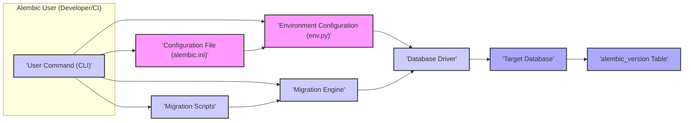

# Project Design Document: Alembic Database Migration Tool

**Version:** 1.1
**Date:** October 26, 2023
**Author:** AI Software Architect

## 1. Introduction

This document provides a detailed design overview of the Alembic database migration tool, focusing on aspects relevant to security and operational considerations. It outlines the system's architecture, key components, data flow, and deployment considerations. This document serves as a foundation for subsequent threat modeling activities, providing the necessary context for identifying potential vulnerabilities and attack vectors.

## 2. Goals and Objectives

*   Provide a clear and comprehensive understanding of Alembic's architecture and functionality, with a focus on security implications.
*   Identify key components and their interactions, detailing the data exchanged and potential security risks at each interaction point.
*   Describe the data flow within the system, highlighting sensitive data and potential points of compromise.
*   Outline typical deployment scenarios, emphasizing security best practices for each.
*   Serve as a robust basis for identifying potential security vulnerabilities and informing mitigation strategies during threat modeling.

## 3. Target Audience

This document is intended for:

*   Security engineers and architects responsible for threat modeling and security assessments.
*   Software developers working with or extending Alembic, requiring a deep understanding of its internal workings and security considerations.
*   Operations engineers responsible for deploying, configuring, and maintaining applications utilizing Alembic in various environments.

## 4. System Overview

Alembic is a Python-based, lightweight database migration tool primarily used with SQLAlchemy. It enables developers to manage and version-control database schema changes through the creation and application of "migration scripts." These scripts, written in Python, contain instructions for both upgrading and downgrading the database schema, ensuring a consistent and reproducible process for database evolution. Alembic tracks the application of these scripts, providing a history of schema changes.

## 5. Key Components

*   **Configuration File (`alembic.ini`):**
    *   Purpose: Stores global configuration settings for Alembic.
    *   Content: Includes the database connection string (potentially sensitive), the location of the migration scripts directory, the template used for generating new scripts, and logging configurations.
    *   Security Relevance: Contains sensitive database credentials that require secure storage and access control.

*   **Environment Configuration (`env.py`):**
    *   Purpose: A Python script executed at the beginning of any Alembic operation to set up the runtime environment.
    *   Functionality: Responsible for:
        *   Establishing the database connection using the information from `alembic.ini` or environment variables.
        *   Importing the SQLAlchemy `MetaData` object, which defines the application's database schema.
        *   Configuring the Alembic migration context, which manages the execution of migration operations.
        *   Potentially executing custom logic for environment setup.
    *   Security Relevance: Handles database credentials and sets up the environment for executing potentially privileged database operations.

*   **Migration Scripts (Python Files):**
    *   Purpose: Individual Python files containing the logic for specific database schema changes.
    *   Structure: Each script includes:
        *   A revision identifier.
        *   `upgrade()` function: Contains the code to apply the schema changes.
        *   `downgrade()` function: Contains the code to revert the schema changes.
        *   Optional dependencies on other revisions.
    *   Security Relevance: These scripts execute arbitrary Python code and SQL against the database. Malicious or poorly written scripts can lead to data corruption, unauthorized access, or denial of service.

*   **Command-Line Interface (CLI):**
    *   Purpose: The primary interface for users (developers, CI/CD systems) to interact with Alembic.
    *   Functionality: Provides commands for:
        *   `init`: Initializes the migration environment, creating the `alembic.ini` file and the `versions` directory.
        *   `revision`: Creates a new migration script based on the current database schema or a specified message.
        *   `upgrade`: Applies pending migration scripts to the database.
        *   `downgrade`: Reverts applied migration scripts from the database.
        *   `history`: Displays the history of applied migrations.
        *   `current`: Shows the current migration state of the database.
    *   Security Relevance: The entry point for executing potentially sensitive database operations. Access to the CLI needs to be controlled.

*   **Migration Engine:**
    *   Purpose: The core component responsible for interpreting and executing the migration scripts.
    *   Functionality:
        *   Reads the migration scripts in the correct order.
        *   Executes the `upgrade()` or `downgrade()` functions within each script.
        *   Uses the database connection established in `env.py` to interact with the target database.
        *   Tracks the applied migrations in an `alembic_version` table within the database.
    *   Security Relevance: Directly interacts with the database and executes the logic defined in the migration scripts. Vulnerabilities in the engine could lead to database compromise.

*   **Database (Target):**
    *   Purpose: The relational database system whose schema is being managed by Alembic.
    *   Interaction: Alembic interacts with the database through a database driver (e.g., `psycopg2`, `mysqlclient`).
    *   Security Relevance: The ultimate target of the migration process. Security of the database itself is paramount, and Alembic's actions can directly impact its integrity and availability.

## 6. Data Flow

**Detailed Data Flow:**

1. **Command Initiation:** A user (developer or CI/CD system) executes an Alembic command via the CLI (e.g., `alembic upgrade head`). This command specifies the desired migration operation.
2. **Configuration Loading:** The Alembic CLI parses the command and loads configuration parameters from the `alembic.ini` file. This includes the database connection string and the location of migration scripts.
3. **Environment Setup:** The CLI executes the `env.py` script.
    *   `env.py` retrieves the database connection details, potentially from `alembic.ini` or environment variables. This data is sensitive and needs to be handled securely.
    *   `env.py` establishes a connection to the target database using the appropriate `Database Driver`. The connection parameters are passed to the driver.
    *   `env.py` imports the SQLAlchemy `MetaData`, providing Alembic with the current definition of the application's database schema.
    *   The migration context is configured, which manages the execution of the migration process.
4. **Migration Script Processing:** Based on the command (e.g., `upgrade head`), the `Migration Engine` determines the set of migration scripts to be applied or reverted.
5. **Script Execution:** The `Migration Engine` reads and executes the selected `Migration Scripts` in order.
    *   For an `upgrade`, the `upgrade()` function in each script is executed. This function contains Python code that uses SQLAlchemy or raw SQL to modify the database schema. The SQL commands are generated based on the script's logic.
    *   For a `downgrade`, the `downgrade()` function is executed, containing the logic to revert the schema changes.
6. **Database Interaction:** The `Migration Engine` uses the established connection and the `Database Driver` to send SQL commands to the `Target Database`. These commands perform the actual schema modifications.
7. **Database Modification:** The `Target Database` executes the received SQL commands, altering its schema according to the migration script's instructions.
8. **Migration Tracking:** After successful execution of a migration script, the `Migration Engine` updates the `alembic_version Table` in the `Target Database`. This table records the revisions that have been applied to the database, ensuring that migrations are not run multiple times and allowing for rollback.
9. **Result Reporting:** Alembic reports the success or failure of the migration process back to the user via the CLI.

## 7. Deployment Model

Alembic is commonly used in the following deployment scenarios, each with its own security considerations:

*   **Local Development Environment:**
    *   Description: Developers use Alembic on their local machines to manage database schema changes during development.
    *   Configuration: `alembic.ini` and migration scripts reside within the project's codebase. The target database is often a local instance (e.g., a Docker container).
    *   Security Considerations: While less critical than production, ensure that database credentials in `alembic.ini` are not accidentally committed to version control. Consider using separate configuration files for development and production.

*   **Continuous Integration/Continuous Deployment (CI/CD) Pipelines:**
    *   Description: Alembic is integrated into CI/CD pipelines to automate database migrations as part of the deployment process.
    *   Configuration: The CI/CD pipeline executes Alembic commands (e.g., `alembic upgrade head`) after deploying new application code. Database connection details are typically managed as secure environment variables or secrets within the CI/CD environment.
    *   Security Considerations: Securely manage database credentials within the CI/CD pipeline. Ensure that only authorized pipelines can trigger migration commands. Implement proper logging and auditing of migration executions.

*   **Manual Deployment on Staging/Production Servers:**
    *   Description: Operations teams manually execute Alembic commands on staging or production servers to apply database migrations.
    *   Configuration: This often involves SSH access to the servers and direct execution of Alembic commands. Database credentials might be stored in configuration files on the server or passed as command-line arguments (less secure).
    *   Security Considerations: Implement strong access controls for servers where Alembic is executed. Securely store database credentials, avoiding plain text storage. Implement auditing of all manual migration executions. Use mechanisms like restricted shell access or dedicated deployment tools to limit the scope of potential damage.

## 8. Security Considerations

This section details potential security considerations for each component and the overall system:

*   **Configuration File (`alembic.ini`):**
    *   Threat: Exposure of database credentials (username, password, host, port).
    *   Vulnerability: Storing credentials in plain text within the file.
    *   Mitigation: Avoid storing credentials directly. Use environment variables or secure secret management solutions. Restrict file system permissions to limit access.

*   **Environment Configuration (`env.py`):**
    *   Threat: Exposure of database credentials if hardcoded. Potential for malicious code execution during environment setup.
    *   Vulnerability: Hardcoding credentials, insecure handling of environment variables.
    *   Mitigation: Retrieve credentials from secure sources (environment variables, secret managers). Sanitize any external input used in the script. Implement code reviews to identify potential vulnerabilities.

*   **Migration Scripts (Python Files):**
    *   Threat: SQL injection vulnerabilities if raw SQL is used improperly. Introduction of malicious code that could compromise the database or the system. Data corruption due to flawed logic.
    *   Vulnerability: Lack of input validation, insecure use of raw SQL, insufficient testing.
    *   Mitigation: Prefer using SQLAlchemy's ORM for database interactions to mitigate SQL injection risks. Implement thorough code reviews and testing of migration scripts. Restrict who can create and modify migration scripts. Consider using static analysis tools to identify potential vulnerabilities.

*   **Command-Line Interface (CLI):**
    *   Threat: Unauthorized execution of migration commands, leading to unintended schema changes or data loss.
    *   Vulnerability: Lack of authentication and authorization for executing commands.
    *   Mitigation: Restrict access to the servers or environments where Alembic commands can be executed. Implement role-based access control. Audit all executed commands.

*   **Migration Engine:**
    *   Threat: Vulnerabilities in the engine itself could be exploited to bypass security measures or compromise the database.
    *   Vulnerability: Software bugs or design flaws in Alembic.
    *   Mitigation: Keep Alembic updated to the latest version to patch known vulnerabilities. Follow security best practices for Python development.

*   **Database (Target):**
    *   Threat: Unauthorized access or modification of the database due to compromised Alembic components or poorly written migration scripts.
    *   Vulnerability: Weak database security configurations, overly permissive database users used by Alembic.
    *   Mitigation: Follow database security best practices, including strong authentication, authorization, and regular security audits. Use least privilege principles for the database user used by Alembic.

*   **`alembic_version` Table:**
    *   Threat: Manipulation of this table could lead to incorrect migration state and potential issues during upgrades or downgrades.
    *   Vulnerability: Insufficient protection of the `alembic_version` table.
    *   Mitigation: Restrict write access to this table to the Alembic process.

## 9. Assumptions and Constraints

*   Alembic is used in conjunction with a relational database.
*   The primary use case is managing schema changes for applications developed in Python.
*   This document focuses on the core functionality of Alembic and does not cover all possible extensions or integrations.
*   It is assumed that the underlying operating system and network infrastructure are reasonably secure.

## 10. Future Considerations

*   Integration with schema diffing tools for automated and more secure migration generation.
*   Enhanced logging and auditing capabilities with more granular detail for security monitoring.
*   Support for more robust secret management integration directly within Alembic.
*   Consideration of signing migration scripts to ensure integrity and authenticity.
*   Exploring options for more fine-grained control over permissions required for different migration operations.