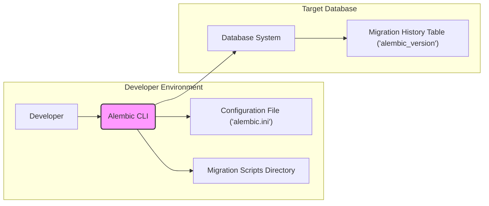
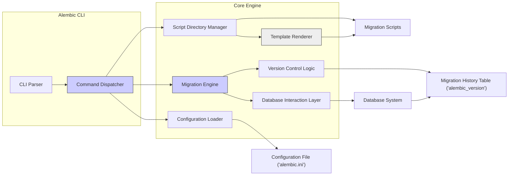
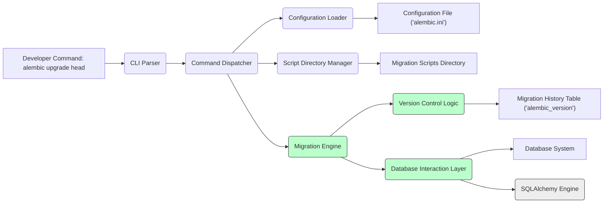

# Project Design Document: Alembic Database Migration Tool

**Version:** 1.1
**Date:** October 26, 2023
**Author:** Gemini (AI Expert in Software, Cloud, and Cybersecurity Architecture)

## 1. Introduction

This document provides a detailed design overview of Alembic, a lightweight database migration tool for SQLAlchemy, Python, and other databases. Alembic is used to manage database schema changes in a version-controlled manner, allowing developers to evolve database structures alongside application code. This document is intended to serve as a foundation for threat modeling and security analysis of Alembic and its usage within software projects. This document aims to be more detailed and provide a clearer picture of Alembic's internal workings and potential security implications.

## 2. Goals and Objectives

The primary goals of Alembic are:

*   **Database Schema Version Control:** To track and manage database schema changes as code, enabling version control principles to be applied to database evolution, ensuring auditability and traceability.
*   **Automated Migration Management:** To automate the process of applying and reverting database schema changes, reducing manual errors, inconsistencies, and deployment risks.
*   **Environment Consistency:** To ensure consistent database schemas across different environments (development, staging, production) by applying migrations in a controlled and repeatable manner, minimizing environment-specific issues.
*   **Collaboration and Teamwork:** To facilitate collaborative database schema development within teams by providing a structured and versioned approach to migrations, improving team efficiency and reducing conflicts.
*   **Rollback Capabilities:** To provide mechanisms for rolling back database schema changes to previous versions in case of errors, issues, or the need to revert to a prior application state, enhancing system resilience.
*   **Database Agnostic (to a degree):** To support various database systems through SQLAlchemy's dialect system, allowing for migrations to be applied across different database platforms, increasing flexibility and portability.
*   **Maintainability of Migrations:** To create a system that encourages the creation of clear, understandable, and maintainable migration scripts, reducing technical debt and simplifying future schema evolution.

## 3. System Architecture

### 3.1. High-Level Architecture

Alembic operates as a command-line tool that interacts with a database and a set of migration scripts. The core components involved in Alembic's operation are:

*   **Alembic CLI:** The command-line interface used by developers to interact with Alembic, execute commands, and manage migrations. This is the primary entry point for users.
*   **Configuration File (`alembic.ini`):**  A configuration file that stores settings for Alembic, including database connection details (database URL, SQLAlchemy configuration), migration script location, script template configurations, and other operational parameters.
*   **Migration Scripts:** Python files, typically stored in a dedicated directory, containing instructions for database schema changes (upgrade and downgrade operations). These scripts are versioned and ordered to represent the evolution of the database schema.
*   **Database:** The target database system (e.g., PostgreSQL, MySQL, SQLite, Oracle, MSSQL) that Alembic manages. Alembic leverages SQLAlchemy to interact with various database systems.
*   **Migration History Table (`alembic_version`):** A table within the database, automatically created and managed by Alembic, used to track applied migrations and the current schema version. This table is crucial for Alembic to understand the current state of the database and determine which migrations need to be applied or reverted.

**Description:**

1.  The **Developer** initiates migration management by interacting with the **Alembic CLI** through commands like `upgrade`, `downgrade`, `revision`, etc.
2.  The **Alembic CLI** starts by reading and parsing the **Configuration File (`alembic.ini`)** to obtain essential settings such as database connection strings, script directory paths, and other configurations.
3.  Based on the command and configuration, the **Alembic CLI** interacts with the **Migration Scripts Directory** to locate, generate, or execute migration scripts.
4.  The **Alembic CLI** establishes a connection to the **Database System** using the connection details from the configuration.
5.  For migration operations (upgrade/downgrade), the **Alembic CLI** executes the logic defined in the **Migration Scripts** against the **Database System**, applying schema changes.
6.  During and after migration operations, Alembic updates or queries the **Migration History Table (`alembic_version`)** within the **Database System** to maintain a record of applied migrations and the current database schema version. This table acts as the source of truth for Alembic's version control.

### 3.2. Component-Level Architecture

The Alembic tool can be further broken down into more granular logical components, illustrating the internal workings:

**Component Descriptions:**

*   **CLI Parser:** Parses commands and arguments provided by the user through the Alembic CLI. It uses a library like `Click` to define and interpret command-line syntax.
*   **Command Dispatcher:**  Routes parsed commands to the appropriate components within the Alembic engine. Based on the parsed command (e.g., `upgrade`, `downgrade`, `revision`), it invokes the relevant functions in other components.
*   **Configuration Loader:** Reads and parses the `alembic.ini` configuration file, loading settings such as database connection URLs (using SQLAlchemy's URL handling), script locations, template configurations (for script generation), and environment-specific variables.
*   **Script Directory Manager:** Manages the directory containing migration scripts. This includes:
    *   Creating new migration scripts using templates and naming conventions.
    *   Listing existing scripts and their revisions.
    *   Ensuring proper script naming conventions and organization within the directory.
    *   Potentially validating script structure and metadata.
*   **Template Renderer:** Utilizes Jinja2 templating engine to generate migration script files based on predefined templates and user-provided arguments (e.g., migration message). This ensures consistency in script structure and reduces boilerplate code.
*   **Migration Engine:** The core component responsible for executing migration operations. It orchestrates the entire migration process:
    *   Reading migration scripts in the correct order (based on revision identifiers).
    *   Establishing database connections using the Database Interaction Layer.
    *   Managing database transactions to ensure atomicity of migrations.
    *   Executing the "upgrade" or "downgrade" functions within each migration script.
    *   Handling dependencies between migrations (if implemented).
    *   Error handling and reporting during migration execution.
*   **Database Interaction Layer:**  Abstracts database-specific operations using SQLAlchemy. This layer provides:
    *   Database connection management (pooling, connection lifecycle).
    *   Transaction management (start, commit, rollback).
    *   Execution of SQL statements generated from migration scripts or SQLAlchemy operations.
    *   Database dialect handling to ensure compatibility across different database systems.
*   **Version Control Logic:** Manages the `alembic_version` table, which is critical for tracking the state of migrations. It performs the following functions:
    *   Querying the `alembic_version` table to determine the currently applied revisions.
    *   Inserting new revision records into the `alembic_version` table after successful migration application.
    *   Potentially deleting revision records during downgrade operations.
    *   Comparing the current database version with available migration scripts to determine which migrations need to be applied or reverted.
    *   Ensuring migrations are applied in the correct sequential order based on revision identifiers.
    *   Preventing the application of the same migration multiple times by checking the `alembic_version` table.

## 4. Data Flow

The typical data flow during a migration operation (e.g., `alembic upgrade head`) is as follows, providing a more detailed step-by-step breakdown:

**Data Flow Steps:**

1.  **Developer Command:** The developer executes an Alembic command (e.g., `alembic upgrade head`) via the CLI, initiating the migration process.
2.  **CLI Parsing:** The **CLI Parser** parses the command and its arguments, breaking down the command into its components and parameters.
3.  **Command Dispatching:** The **Command Dispatcher** identifies the requested operation (upgrade) and routes the execution flow to the appropriate components within the Alembic engine.
4.  **Configuration Loading:** The **Configuration Loader** reads and parses the **Configuration File (`alembic.ini`)** to retrieve database connection details (URL, credentials), script locations, and other relevant settings.
5.  **Script Directory Management:** The **Script Directory Manager** accesses the **Migration Scripts Directory** to locate and list available migration scripts, typically ordered by their revision identifiers.
6.  **Migration Engine Orchestration:** The **Migration Engine** takes control, orchestrating the core migration process.
7.  **Version Control Check:** The **Version Control Logic** queries the **Migration History Table (`alembic_version`)** in the **Database System** to determine the currently applied migrations and the current database schema version.
8.  **Migration Script Selection:** Based on the current version and the target revision (`head` in this case), the **Migration Engine** selects the migration scripts that need to be applied in sequence.
9.  **Database Interaction Initialization:** The **Database Interaction Layer** initializes a connection to the **Database System** using the SQLAlchemy Engine (M), based on the configuration loaded earlier.
10. **Transaction Management:** The **Database Interaction Layer** starts a database transaction to ensure atomicity of the migration process. If any migration script fails, the entire transaction can be rolled back.
11. **Migration Script Execution:** The **Migration Engine** iterates through the selected migration scripts in order. For each script:
    *   It executes the `upgrade()` function defined within the script. This function contains Python code that uses SQLAlchemy or raw SQL to modify the database schema.
    *   The **Database Interaction Layer** executes the SQL operations against the **Database System** via the SQLAlchemy Engine.
12. **Version Control Update:** After successful execution of each migration script, the **Version Control Logic** updates the **Migration History Table (`alembic_version`)** by inserting a new record representing the applied revision.
13. **Transaction Commit/Rollback:** If all migration scripts are executed successfully, the **Database Interaction Layer** commits the database transaction, making the schema changes permanent. If any script fails, the transaction is rolled back, reverting any changes made within the transaction and ensuring database consistency.
14. **Completion and Reporting:** The Alembic CLI reports the success or failure of the migration process to the developer.

## 5. Technology Stack

Alembic is built upon and leverages the following technologies:

*   **Python:** The primary programming language for Alembic itself and for writing migration scripts. Python's flexibility and extensive libraries make it suitable for this task.
*   **SQLAlchemy:** A powerful Python SQL toolkit and Object-Relational Mapper (ORM). Alembic relies heavily on SQLAlchemy for:
    *   Database abstraction and dialect support, enabling compatibility with various database systems.
    *   Database connection management and pooling.
    *   Transaction management.
    *   Providing a Pythonic way to define and execute database schema changes, although raw SQL is also supported within migration scripts.
*   **Database Systems:** Alembic's database support is inherited from SQLAlchemy. It supports a wide range of database systems, including but not limited to:
    *   PostgreSQL
    *   MySQL/MariaDB
    *   SQLite
    *   Oracle
    *   Microsoft SQL Server (MSSQL)
    *   Other databases supported by SQLAlchemy dialects.
*   **Jinja2:** A modern and designer-friendly templating language for Python. Alembic uses Jinja2 to:
    *   Generate migration script templates, providing a consistent structure for new migration files.
    *   Allow customization of script templates through configuration.
*   **Click:** A Python package for building beautiful command-line interfaces in a composable way. Alembic uses Click to:
    *   Define the Alembic CLI structure, commands, and options.
    *   Handle command-line argument parsing and user interaction.
*   **Setuptools/Pip:** Standard Python packaging and distribution tools used for managing Alembic's dependencies and installation.

## 6. Deployment Architecture

Alembic is primarily a development and deployment tool, not a continuously running service. Its deployment architecture is defined by how it's used within different environments:

*   **Local Development Environment:** Developers install Alembic (typically via `pip install alembic`) in their local Python environment. They use the Alembic CLI directly from their terminals to generate, apply, and manage migrations on local development databases (often SQLite, PostgreSQL, or Dockerized database instances).
*   **Continuous Integration/Continuous Deployment (CI/CD) Pipelines:** Alembic is a crucial component in automated CI/CD pipelines. In CI/CD:
    *   Alembic is installed in the CI/CD environment.
    *   Migration commands (usually `alembic upgrade head`) are executed as part of the deployment process, typically before application code deployment.
    *   This ensures that database schema changes are automatically applied to target environments (staging, production) whenever new application versions are deployed.
    *   CI/CD pipelines often use environment variables or secure secret management to provide database credentials to Alembic without hardcoding them in configuration files.
*   **Staging and Production Environments:** In staging and production environments, Alembic is typically executed as part of the application deployment process. This can be done:
    *   Manually by system administrators or deployment engineers.
    *   Automated through deployment scripts or orchestration tools (e.g., Ansible, Kubernetes Jobs).
    *   It's critical to ensure that Alembic is executed with the correct database credentials and in a controlled manner in these environments to avoid unintended schema changes or downtime.

Alembic's "deployment" essentially means ensuring the Alembic package and its dependencies are available in the environment where database migrations need to be performed, along with proper configuration and access to the target database.

## 7. Security Considerations (Detailed)

This section provides a more detailed analysis of security considerations for Alembic, categorized by potential threats and mitigation strategies.

*   **Database Credentials Management (Confidentiality, Integrity, Availability):**
    *   **Threat:** Database credentials (usernames, passwords, connection strings) required by Alembic are often stored in the `alembic.ini` file or environment variables. If this configuration is exposed, insecurely stored, or accessed by unauthorized individuals, it can lead to:
        *   **Unauthorized Database Access:** Attackers can gain full access to the database, potentially reading sensitive data, modifying data, or causing data breaches.
        *   **Data Manipulation/Corruption:** Malicious actors could use compromised credentials to execute arbitrary SQL commands, corrupting or deleting data.
        *   **Denial of Service (DoS):** Attackers might overload the database with requests or intentionally disrupt database operations.
    *   **Mitigation Strategies:**
        *   **Secure Storage:** Never store database credentials directly in version control. Use environment variables, secure secret management systems (e.g., HashiCorp Vault, AWS Secrets Manager, Azure Key Vault), or encrypted configuration files.
        *   **Access Control:** Restrict access to the `alembic.ini` file and environment variables to only authorized personnel and processes. Use file system permissions and access control lists (ACLs).
        *   **Principle of Least Privilege:** Grant Alembic database users only the necessary privileges required for migration operations (e.g., `CREATE TABLE`, `ALTER TABLE`, `DROP TABLE`, `INSERT`, `UPDATE`, `DELETE` on the `alembic_version` table). Avoid granting overly permissive roles like `db_owner` or `superuser`.
        *   **Credential Rotation:** Regularly rotate database credentials to limit the impact of potential compromises.

*   **Migration Script Security (Integrity, Availability):**
    *   **Threat:** Migration scripts are Python code that directly interacts with the database. Maliciously crafted or poorly written migration scripts can introduce various vulnerabilities:
        *   **SQL Injection:** If migration scripts construct SQL queries dynamically without proper parameterization, they can be vulnerable to SQL injection attacks, allowing attackers to execute arbitrary SQL code.
        *   **Data Corruption:** Errors in migration logic (e.g., incorrect data transformations, data type mismatches) can lead to data corruption or inconsistencies.
        *   **Denial of Service (DoS):** Inefficient or resource-intensive migration scripts can cause performance degradation or database outages during migration execution.
        *   **Backdoor Creation:** Malicious scripts could introduce backdoors into the database schema (e.g., adding new users with default passwords, creating vulnerable stored procedures).
    *   **Mitigation Strategies:**
        *   **Code Review:** Implement mandatory code reviews for all migration scripts before they are applied to production environments. Reviewers should focus on SQL injection vulnerabilities, data integrity, and potential performance issues.
        *   **Secure Coding Practices:** Follow secure coding guidelines when writing migration scripts. Use SQLAlchemy's ORM or parameterized queries to prevent SQL injection. Avoid dynamic SQL construction where possible.
        *   **Testing:** Thoroughly test migration scripts in development and staging environments before applying them to production. Include unit tests for migration logic and integration tests against a test database.
        *   **Static Analysis:** Use static analysis tools to scan migration scripts for potential security vulnerabilities and code quality issues.
        *   **Principle of Least Functionality:** Migration scripts should only perform necessary schema changes. Avoid including unnecessary or complex logic that could introduce vulnerabilities.

*   **Access Control to Alembic Tool (Confidentiality, Integrity, Availability):**
    *   **Threat:** Unrestricted access to the Alembic CLI and configuration files can allow unauthorized users to:
        *   **Apply Malicious Migrations:** Attackers could create and apply malicious migration scripts to compromise the database.
        *   **Disrupt Database Operations:** Unauthorized users could intentionally or accidentally execute commands that disrupt database operations (e.g., `downgrade` to an old revision, causing data loss or application incompatibility).
        *   **Expose Sensitive Information:** Access to `alembic.ini` might reveal database credentials or other sensitive configuration details.
    *   **Mitigation Strategies:**
        *   **Role-Based Access Control (RBAC):** Implement RBAC to control access to the Alembic tool and its configuration files. Restrict access to authorized developers, deployment engineers, and system administrators.
        *   **Environment Isolation:** Isolate development, staging, and production environments. Ensure that Alembic access is appropriately controlled in each environment.
        *   **Audit Logging:** Log all Alembic commands executed, including the user, command, timestamp, and outcome. This helps in tracking activities and identifying potential security incidents.

*   **Dependency Vulnerabilities (Confidentiality, Integrity, Availability):**
    *   **Threat:** Alembic depends on various Python packages (SQLAlchemy, Jinja2, Click, etc.). Vulnerabilities in these dependencies can indirectly affect Alembic's security:
        *   **Exploitation of Vulnerabilities:** Attackers could exploit known vulnerabilities in Alembic's dependencies to compromise the Alembic tool or the database.
        *   **Supply Chain Attacks:** Compromised dependencies could be injected with malicious code, leading to backdoors or other security breaches.
    *   **Mitigation Strategies:**
        *   **Dependency Scanning:** Regularly scan Alembic's dependencies for known vulnerabilities using vulnerability scanning tools (e.g., `pip-audit`, Snyk, OWASP Dependency-Check).
        *   **Dependency Updates:** Keep Alembic's dependencies up-to-date with the latest security patches. Automate dependency updates where possible.
        *   **Dependency Pinning:** Pin dependency versions in `requirements.txt` or `Pipfile` to ensure consistent and reproducible builds and reduce the risk of unexpected dependency updates introducing vulnerabilities.
        *   **Software Composition Analysis (SCA):** Use SCA tools to analyze Alembic's dependencies and identify potential security risks and license compliance issues.

*   **SQL Injection Risks (Integrity, Confidentiality):**
    *   **Threat:** Even with SQLAlchemy's protection, migration scripts that directly execute raw SQL queries or construct dynamic SQL can still be vulnerable to SQL injection if not handled carefully.
    *   **Mitigation Strategies:**
        *   **Parameterized Queries:** Always use parameterized queries or SQLAlchemy's ORM when interacting with the database in migration scripts. Avoid string concatenation to build SQL queries.
        *   **Input Validation:** If migration scripts accept user input (though less common), validate and sanitize all input before using it in SQL queries.
        *   **Least Privilege Database User:** Use a database user with limited privileges for Alembic operations, reducing the impact of potential SQL injection vulnerabilities.

*   **Migration History Table Manipulation (Integrity, Availability):**
    *   **Threat:** If an attacker gains direct access to the database and can manipulate the `alembic_version` table, they could:
        *   **Bypass Migration Logic:** Tampering with the history table could allow attackers to bypass migration application logic or apply migrations out of order, leading to database inconsistencies.
        *   **Cause Rollback Issues:** Modifying the history table could disrupt rollback operations or make it impossible to revert to a previous database state.
        *   **Hide Malicious Migrations:** Attackers could potentially insert records into the history table to falsely indicate that malicious migrations have been applied, masking their actions.
    *   **Mitigation Strategies:**
        *   **Database Access Control:** Implement strong database access controls to restrict direct access to the database and the `alembic_version` table.
        *   **Database Auditing:** Enable database auditing to track modifications to the `alembic_version` table and other critical database objects.
        *   **Integrity Monitoring:** Implement monitoring to detect unexpected changes to the `alembic_version` table.

*   **Secrets in Migration Scripts or Configuration (Confidentiality):**
    *   **Threat:** Hardcoding sensitive information (API keys, passwords, encryption keys, etc.) directly in migration scripts or the `alembic.ini` file is a significant security risk. If these files are compromised or exposed, secrets can be leaked.
    *   **Mitigation Strategies:**
        *   **Avoid Hardcoding Secrets:** Never hardcode secrets in migration scripts or configuration files.
        *   **Environment Variables:** Use environment variables to pass secrets to Alembic at runtime.
        *   **Secret Management Systems:** Integrate with secure secret management systems to retrieve secrets dynamically during migration execution.
        *   **Configuration Encryption:** Consider encrypting the `alembic.ini` file if it contains sensitive configuration data (though environment variables or secret management are generally preferred for credentials).

## 8. Assumptions and Constraints

*   **SQLAlchemy Dependency:** Alembic's functionality is intrinsically tied to SQLAlchemy. It assumes SQLAlchemy is correctly installed, configured, and compatible with the target database system.
*   **Python Environment:** Alembic requires a functional Python environment (with a compatible Python version) and the necessary Python packages (dependencies) installed.
*   **Database Access Permissions:** Alembic assumes it is provided with database credentials that grant sufficient permissions to connect to the target database and perform schema modifications (DDL operations) and data manipulation (DML operations on the `alembic_version` table).
*   **Migration Script Correctness and Safety:** Alembic operates under the assumption that migration scripts are developed and reviewed to be logically correct, safe, and idempotent (where applicable). Alembic itself does not inherently validate the correctness or security of migration script logic.
*   **Configuration File Integrity and Security:** It is assumed that the `alembic.ini` configuration file is stored securely, protected from unauthorized modification, and that access to it is controlled to prevent credential leakage or configuration tampering.
*   **Network Security:** For remote database deployments, it's assumed that network security measures (firewalls, VPNs, TLS encryption for database connections) are in place to protect communication between Alembic and the database server.

## 9. Glossary

*   **Migration:** A versioned set of changes applied to a database schema to evolve its structure over time. Represented by a migration script.
*   **Revision:** A specific version of a migration, uniquely identified by a revision identifier (typically a timestamp or UUID). Revisions represent points in the database schema's history.
*   **Head Revision:** The latest applied migration revision in the database. Represents the most current database schema state according to Alembic.
*   **Base Revision:** The initial state of the database schema before any migrations are applied. Often implicitly defined or can be explicitly set.
*   **Upgrade:** The process of applying migrations to move the database schema forward to a newer revision, typically to the `head` revision.
*   **Downgrade:** The process of reverting migrations to move the database schema backward to an older revision.
*   **Alembic CLI:** Alembic's command-line interface, the primary tool for interacting with Alembic and managing migrations.
*   **`alembic.ini`:** Alembic's configuration file, containing settings for database connections, script locations, and other operational parameters.
*   **`alembic_version`:** The migration history table in the database, used by Alembic to track applied migrations and the current schema version. This table is crucial for Alembic's version control mechanism.
*   **Migration Script:** A Python file containing `upgrade()` and `downgrade()` functions that define the database schema changes for a specific revision.

This improved design document provides a more detailed and comprehensive overview of Alembic, particularly in the security considerations section. It should serve as a stronger foundation for threat modeling and security assessments of projects utilizing Alembic for database migrations.