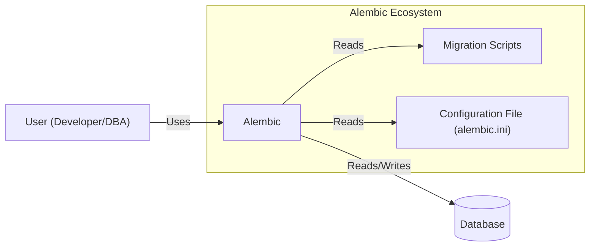
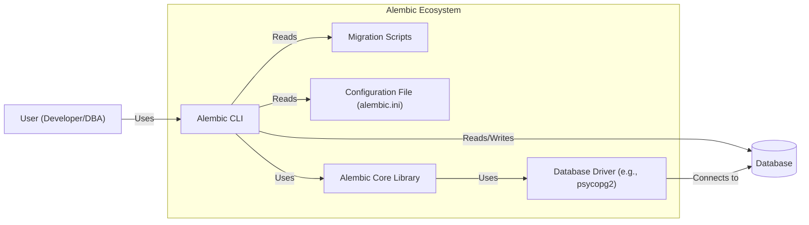
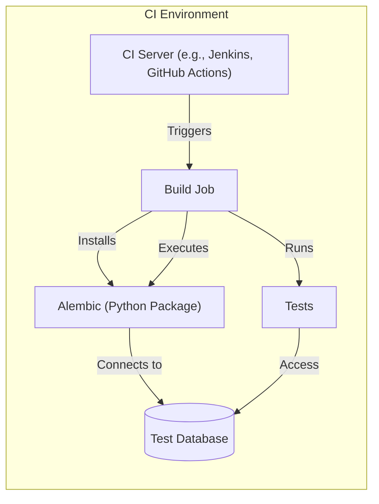
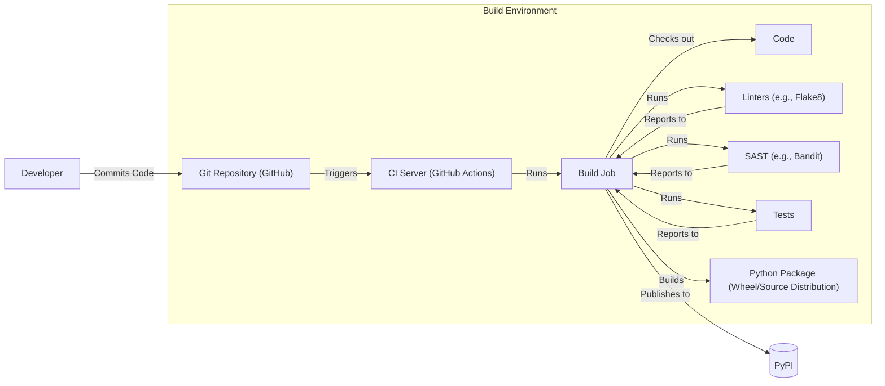

Okay, let's create a design document for the Alembic project, focusing on aspects relevant for threat modeling.

# BUSINESS POSTURE

Alembic is a database migration tool.  Its primary business purpose is to provide a reliable, flexible, and scriptable way to manage changes to database schemas.  It's targeted at developers and database administrators who need to evolve database structures alongside application code in a controlled and predictable manner.  The project's success hinges on its accuracy, ease of use, and compatibility with various database systems.

Business Priorities:

*   Reliability: Migrations must be applied correctly and consistently, avoiding data loss or corruption.
*   Maintainability: The codebase should be easy to understand, modify, and extend.
*   Usability:  The tool should be easy to learn and use, with clear documentation and helpful error messages.
*   Compatibility: Support a wide range of database systems (PostgreSQL, MySQL, SQLite, etc.).
*   Community: Foster an active and engaged community of users and contributors.

Business Goals:

*   Provide a robust and reliable database migration solution.
*   Reduce the risk of database schema changes causing application downtime or data loss.
*   Improve developer productivity by automating database migration tasks.
*   Become a standard tool for database migrations in the Python ecosystem.

Most Important Business Risks:

*   Data Loss/Corruption: Incorrectly applied migrations could lead to irreversible data loss or database corruption. This is the most critical risk.
*   Downtime:  Failed or long-running migrations could cause application downtime.
*   Security Vulnerabilities:  Vulnerabilities in Alembic could be exploited to gain unauthorized access to databases or execute malicious code.
*   Compatibility Issues:  Lack of support for specific database features or versions could limit adoption.
*   Reputation Damage:  Bugs or usability issues could damage the project's reputation and discourage adoption.

# SECURITY POSTURE

Existing Security Controls:

*   security control: Code Reviews: Alembic, being an open-source project on GitHub, likely benefits from community code reviews, although the rigor and consistency may vary. (Described in GitHub repository's contribution guidelines).
*   security control: Testing: Alembic has a test suite (visible in the repository) that aims to ensure the correctness of its functionality, including migration application and rollback. (Described in the `tests` directory of the repository).
*   security control: Input Validation: Alembic likely performs some input validation on migration scripts and configuration files to prevent errors and potential injection vulnerabilities. (Partially implied by the code and documentation, but needs further investigation).
*   security control: Dependency Management: The project uses `setup.py` or `pyproject.toml` to manage dependencies, which helps track and update external libraries, reducing the risk of using vulnerable components. (Described in `setup.py` or `pyproject.toml` in the repository).
*   security control: Documentation: The project has extensive documentation, which can help users understand how to use Alembic securely and avoid common pitfalls. (Available on Read the Docs).

Accepted Risks:

*   accepted risk: User-Generated Migration Scripts: Alembic executes user-provided migration scripts, which inherently carries the risk of malicious or erroneous code being executed against the database. This is a fundamental aspect of the tool's functionality.
*   accepted risk: Limited Control over Database Environment: Alembic operates within the security context of the database user provided in the configuration. It relies on the database's own security mechanisms for access control and protection.
*   accepted risk: Potential for Misconfiguration: Incorrect configuration of Alembic (e.g., using weak database credentials) can expose the database to risks.

Recommended Security Controls:

*   security control: Static Analysis: Integrate static analysis tools (e.g., Bandit, SonarQube) into the development workflow to automatically detect potential security vulnerabilities in the Alembic codebase.
*   security control: Security Audits: Conduct periodic security audits of the codebase and infrastructure to identify and address potential vulnerabilities.
*   security control: Fuzz Testing: Implement fuzz testing to identify edge cases and unexpected behavior that could lead to vulnerabilities.

Security Requirements:

*   Authentication:
    *   Alembic itself does not handle authentication; it relies on the database connection credentials provided by the user. The security of these credentials is the user's responsibility.
*   Authorization:
    *   Alembic does not implement its own authorization mechanisms. It relies on the database's built-in authorization system (e.g., GRANT/REVOKE privileges) to control access to database objects.
*   Input Validation:
    *   Alembic should validate the structure and content of migration scripts to prevent common errors and potential injection vulnerabilities. This includes:
        *   Checking for valid SQL syntax.
        *   Preventing the execution of arbitrary shell commands.
        *   Validating configuration file parameters.
*   Cryptography:
    *   Alembic does not directly handle sensitive data that requires encryption. However, it should support connecting to databases using encrypted connections (e.g., SSL/TLS) when configured by the user.

# DESIGN

## C4 CONTEXT

Element Descriptions:

*   Element:
    *   Name: User (Developer/DBA)
    *   Type: Person
    *   Description: A developer or database administrator who uses Alembic to manage database schema changes.
    *   Responsibilities:
        *   Writes migration scripts.
        *   Configures Alembic.
        *   Runs Alembic commands.
        *   Monitors migration progress.
    *   Security controls:
        *   Uses strong database credentials.
        *   Follows secure coding practices when writing migration scripts.

*   Element:
    *   Name: Alembic
    *   Type: Software System
    *   Description: The database migration tool itself.
    *   Responsibilities:
        *   Reads and interprets migration scripts.
        *   Connects to the database.
        *   Executes SQL commands to apply or revert migrations.
        *   Manages migration history.
    *   Security controls:
        *   Input validation on migration scripts and configuration files.
        *   Relies on database's authentication and authorization mechanisms.

*   Element:
    *   Name: Database
    *   Type: Database System
    *   Description: The target database that Alembic manages.
    *   Responsibilities:
        *   Stores application data.
        *   Executes SQL commands.
        *   Enforces database-level security controls.
    *   Security controls:
        *   Authentication and authorization mechanisms.
        *   Access controls (e.g., GRANT/REVOKE).
        *   Encryption (if configured).
        *   Auditing (if configured).

*   Element:
    *   Name: Migration Scripts
    *   Type: Files
    *   Description: User-written scripts that define the database schema changes.
    *   Responsibilities:
        *   Contain SQL commands to create, alter, or drop database objects.
        *   Define the upgrade and downgrade paths for each migration.
    *   Security controls:
        *   Code review of migration scripts.
        *   Avoidance of hardcoded credentials.

*   Element:
    *   Name: Configuration File (alembic.ini)
    *   Type: File
    *   Description: A configuration file that specifies database connection parameters, migration directory, and other settings.
    *   Responsibilities:
        *   Provides Alembic with necessary information to connect to the database and manage migrations.
    *   Security controls:
        *   Protection of sensitive information (e.g., database credentials) using appropriate file permissions or environment variables.

## C4 CONTAINER

Since Alembic is a relatively simple command-line tool, the container diagram is essentially an extension of the context diagram.

Element Descriptions:

*   Element:
    *   Name: Alembic CLI
    *   Type: Command-Line Interface
    *   Description: The command-line interface that users interact with to run Alembic commands.
    *   Responsibilities:
        *   Parses command-line arguments.
        *   Loads the configuration file.
        *   Calls the Alembic Core Library to execute migrations.
    *   Security controls:
        *   Input validation of command-line arguments.

*   Element:
    *   Name: Alembic Core Library
    *   Type: Library
    *   Description: The core logic of Alembic, responsible for managing migrations and interacting with the database.
    *   Responsibilities:
        *   Reads and interprets migration scripts.
        *   Manages migration history.
        *   Executes SQL commands through the database driver.
    *   Security controls:
        *   Input validation of migration scripts.
        *   Relies on database driver for secure communication with the database.

*   Element:
    *   Name: Database Driver (e.g., psycopg2)
    *   Type: Library
    *   Description: A database-specific library that Alembic uses to connect to and interact with the database.
    *   Responsibilities:
        *   Establishes a connection to the database.
        *   Executes SQL commands.
        *   Handles data type conversions.
    *   Security controls:
        *   Uses secure communication protocols (e.g., SSL/TLS) if configured.
        *   Protects against SQL injection vulnerabilities (responsibility of the driver itself).

*   Element:
    *   Name: User (Developer/DBA)
    *   Type: Person
    *   Description: A developer or database administrator who uses Alembic to manage database schema changes.
    *   Responsibilities:
        *   Writes migration scripts.
        *   Configures Alembic.
        *   Runs Alembic commands.
        *   Monitors migration progress.
    *   Security controls:
        *   Uses strong database credentials.
        *   Follows secure coding practices when writing migration scripts.

*   Element:
    *   Name: Database
    *   Type: Database System
    *   Description: The target database that Alembic manages.
    *   Responsibilities:
        *   Stores application data.
        *   Executes SQL commands.
        *   Enforces database-level security controls.
    *   Security controls:
        *   Authentication and authorization mechanisms.
        *   Access controls (e.g., GRANT/REVOKE).
        *   Encryption (if configured).
        *   Auditing (if configured).

*   Element:
    *   Name: Migration Scripts
    *   Type: Files
    *   Description: User-written scripts that define the database schema changes.
    *   Responsibilities:
        *   Contain SQL commands to create, alter, or drop database objects.
        *   Define the upgrade and downgrade paths for each migration.
    *   Security controls:
        *   Code review of migration scripts.
        *   Avoidance of hardcoded credentials.

*   Element:
    *   Name: Configuration File (alembic.ini)
    *   Type: File
    *   Description: A configuration file that specifies database connection parameters, migration directory, and other settings.
    *   Responsibilities:
        *   Provides Alembic with necessary information to connect to the database and manage migrations.
    *   Security controls:
        *   Protection of sensitive information (e.g., database credentials) using appropriate file permissions or environment variables.

## DEPLOYMENT

Alembic is typically installed as a Python package using `pip`.  It doesn't have a specific "deployment" in the traditional sense of a web application.  However, it's used *within* the deployment process of applications that use databases.

Possible Deployment Solutions:

1.  Local Development Environment: Alembic is installed directly on the developer's machine.
2.  Continuous Integration (CI) Environment: Alembic is installed as part of the CI pipeline to run migrations against a test database.
3.  Production Environment: Alembic is used (with extreme caution) to apply migrations to the production database, often as part of a controlled deployment process.

Chosen Solution (CI Environment): This is a critical use case for Alembic and highlights important security considerations.

Element Descriptions:

*   Element:
    *   Name: CI Server (e.g., Jenkins, GitHub Actions)
    *   Type: Software System
    *   Description: The CI server that orchestrates the build and test process.
    *   Responsibilities:
        *   Monitors code repositories for changes.
        *   Triggers build jobs.
        *   Provides a controlled environment for running builds and tests.
    *   Security controls:
        *   Access controls to the CI server.
        *   Secure storage of credentials (e.g., database credentials for the test database).
        *   Isolation of build jobs.

*   Element:
    *   Name: Build Job
    *   Type: Process
    *   Description: A specific build job within the CI pipeline.
    *   Responsibilities:
        *   Installs dependencies (including Alembic).
        *   Runs Alembic migrations against the test database.
        *   Executes application tests.
    *   Security controls:
        *   Runs in a sandboxed environment.
        *   Uses temporary credentials for the test database.

*   Element:
    *   Name: Alembic (Python Package)
    *   Type: Software Component
    *   Description: The installed Alembic package.
    *   Responsibilities: Same as in the Container diagram.
    *   Security controls: Same as in the Container diagram.

*   Element:
    *   Name: Test Database
    *   Type: Database System
    *   Description: A database used for testing purposes, typically a separate instance from the production database.
    *   Responsibilities:
        *   Provides a realistic environment for testing database migrations and application code.
    *   Security controls:
        *   Isolated from the production database.
        *   Uses temporary credentials.
        *   Regularly reset to a known state.

*   Element:
    *   Name: Tests
    *   Type: Software Component
    *   Description: Application tests that verify the functionality of the application after migrations have been applied.
    *   Responsibilities:
        *   Accesses the test database to verify data integrity and application behavior.
    *   Security controls:
        *   Tests should not contain hardcoded credentials.

## BUILD

Alembic, as a Python package, is built and published to PyPI (Python Package Index).

Security Controls in the Build Process:

*   Source Code Management (GitHub): Provides version control, access control, and audit trails for code changes.
*   CI/CD (GitHub Actions): Automates the build, test, and packaging process, ensuring consistency and reducing manual errors.
*   Linters (e.g., Flake8): Enforce coding style and identify potential code quality issues.
*   Static Application Security Testing (SAST) (e.g., Bandit): Analyzes the source code for potential security vulnerabilities.
*   Tests: Verify the functionality of Alembic and ensure that migrations are applied correctly.
*   Package Management (PyPI): Provides a central repository for distributing Alembic packages.  PyPI has its own security measures, but developers should verify package integrity (e.g., using checksums).
*   Dependency Management: Using `setup.py` or `pyproject.toml` to manage and freeze dependencies, reducing the risk of supply chain attacks. Tools like `pip-audit` can be used to check for known vulnerabilities in dependencies.

# RISK ASSESSMENT

Critical Business Processes to Protect:

*   Database Schema Management: The core process of applying and managing database schema changes.  Failure of this process can lead to data loss, application downtime, and security breaches.
*   Application Deployment: Alembic is often used as part of the application deployment process.  Ensuring that migrations are applied correctly and securely is crucial for successful deployments.

Data to Protect and Sensitivity:

*   Database Credentials (Stored in `alembic.ini` or environment variables): Highly sensitive.  Compromise of these credentials could grant unauthorized access to the database.
*   Migration Scripts (Stored in the `versions` directory): Moderately sensitive.  Malicious or erroneous scripts could lead to data loss or corruption.  While the SQL within is the most sensitive part, the scripts themselves reveal information about the database schema.
*   Database Schema: Moderately to highly sensitive, depending on the application.  The schema itself reveals information about the structure of the data, which could be valuable to attackers.
*   Application Data (Stored in the database): Sensitivity varies greatly depending on the application.  This could range from non-sensitive test data to highly sensitive personal or financial information. Alembic itself does not directly handle this data, but its actions directly impact the database where this data resides.

# QUESTIONS & ASSUMPTIONS

Questions:

*   What is the expected frequency of database schema changes? This impacts the importance of Alembic's performance and efficiency.
*   What specific database systems are used in production and testing environments? This determines the required compatibility and testing matrix.
*   What is the existing process for managing database migrations (if any)? This helps understand the current pain points and potential improvements.
*   What are the security policies and procedures of the organization using Alembic? This informs the necessary security controls and compliance requirements.
*   Are there any specific regulatory requirements (e.g., GDPR, HIPAA) that apply to the data stored in the database?
*   What level of access do developers have to the production database?
*   Is there a formal code review process for migration scripts?

Assumptions:

*   BUSINESS POSTURE: The organization prioritizes data integrity and application availability. They have a moderate risk tolerance, but data loss is unacceptable.
*   SECURITY POSTURE: The organization has basic security controls in place (e.g., firewalls, access controls), but may not have a dedicated security team or advanced security tools. They are willing to invest in improving security, but within reasonable cost and effort constraints.
*   DESIGN: Alembic is used primarily in a CI/CD environment for automated testing and deployment. Developers have access to a test database but limited or no direct access to the production database. Migration scripts are reviewed by at least one other developer before being applied to production. Database credentials are not stored in the source code repository.