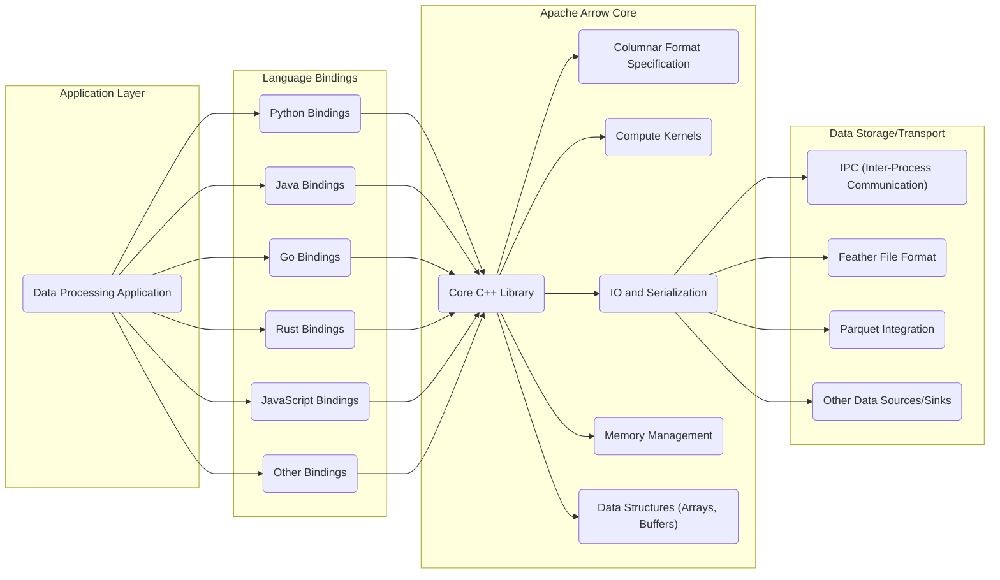
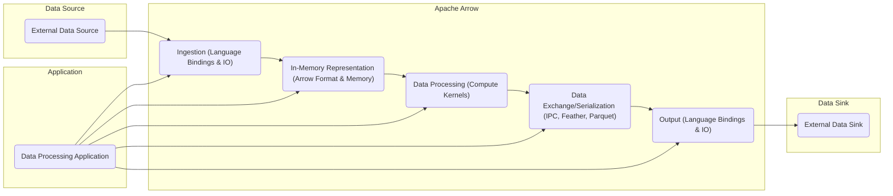

## Project Design Document: Apache Arrow for Threat Modeling (Improved)

**1. Project Overview**

Apache Arrow is a foundational, cross-language development platform for in-memory data, critical for modern data analytics and interchange. It defines a standardized, language-agnostic columnar memory format optimized for analytical operations on contemporary hardware. Beyond the format, Arrow provides a suite of computational libraries and facilitates zero-copy data streaming and inter-process communication (IPC), enabling efficient data sharing across different systems and languages. This design document focuses on dissecting the core architecture and key components of Apache Arrow, specifically to lay the groundwork for comprehensive threat modeling activities.

**2. Goals and Objectives**

*   To furnish a detailed and easily understandable description of the Apache Arrow project's architecture, highlighting its essential components and their interactions.
*   To clearly delineate the primary data flows and communication pathways within the Arrow ecosystem.
*   To proactively identify potential areas of security vulnerability and concern within the Arrow project, serving as a starting point for focused threat modeling.
*   To establish a foundational document that can be utilized for ongoing security assessments, the development of mitigation strategies, and secure coding practices.

**3. Target Audience**

*   Security engineers and architects tasked with performing threat modeling and security assessments on systems and applications that leverage Apache Arrow.
*   Developers actively contributing to the Apache Arrow project, requiring a deep understanding of the security implications associated with their code contributions.
*   Operations teams responsible for deploying, managing, and maintaining applications that are built upon and depend on Apache Arrow.

**4. Scope**

This document concentrates on the fundamental architecture and core functionalities of the Apache Arrow project, specifically including:

*   The specification for the in-memory columnar format.
*   The core C++ implementation of the Arrow libraries.
*   Key language bindings, such as those for Python, Java, Go, and Rust.
*   The mechanisms for Inter-Process Communication (IPC) and the Feather file format for data serialization.
*   The primary computational libraries offered by Arrow for data manipulation and analysis.

This document explicitly excludes:

*   Specific applications or end-user systems that are built utilizing Apache Arrow as a dependency.
*   Fine-grained implementation details of every individual language binding.
*   Integrations with third-party libraries or external systems.
*   Specific deployment environments, infrastructure configurations, or operational procedures.

**5. High-Level Architecture**

**6. Key Components**

*   **Columnar Format Specification:**
    *   A rigorously defined, language-independent specification for representing tabular data in memory.
    *   Dictates data types (e.g., integers, floats, strings, nested types), memory layouts (contiguous arrays), and metadata encoding.
    *   Enables zero-copy data sharing and manipulation across different programming languages and processes.
*   **Core C++ Library:**
    *   The foundational implementation of the Arrow format and provides the core functionalities of the project.
    *   Offers low-level APIs for direct memory manipulation, buffer management, and efficient data structure creation.
    *   Serves as the underlying engine for all language bindings, ensuring consistent behavior and performance.
*   **Language Bindings (Python, Java, Go, Rust, JavaScript, etc.):**
    *   Provide programming language-specific interfaces and abstractions for interacting with Arrow data structures and functionalities.
    *   Typically wrap the core C++ library using mechanisms like Cython (for Python), JNI (for Java), cgo (for Go), and Rust's FFI.
    *   Aim to provide an idiomatic and user-friendly experience for developers in each respective language.
*   **Compute Kernels:**
    *   A collection of highly optimized implementations of common data processing operations that operate directly on Arrow columnar data.
    *   Includes kernels for filtering, aggregation, sorting, mathematical operations, string manipulation, and more.
    *   Designed for maximum performance by leveraging techniques like SIMD instructions and efficient memory access patterns.
*   **IO and Serialization:**
    *   Manages the reading and writing of Arrow data to and from various external sources and sinks.
    *   Supports the Arrow IPC format for efficient streaming of data between processes.
    *   Includes implementations for the Feather file format (a lightweight on-disk format) and integrations with other formats like Parquet.
    *   Handles serialization and deserialization of Arrow data structures.
*   **Memory Management:**
    *   Provides robust mechanisms for allocating, managing, and deallocating memory used by Arrow data structures.
    *   Includes features like memory pools and buffer allocation strategies to optimize memory usage and prevent fragmentation.
    *   Critical for performance and for preventing memory-related errors (e.g., leaks, corruption).
*   **Data Structures (Arrays, Buffers):**
    *   Fundamental building blocks of the Arrow format.
    *   `Arrays` represent sequences of values of a specific data type.
    *   `Buffers` are contiguous blocks of memory used to store the actual data within arrays.
    *   These structures are designed for efficient access and manipulation.
*   **IPC (Inter-Process Communication):**
    *   A protocol designed for high-performance, zero-copy transfer of Arrow data between different processes.
    *   Enables efficient data sharing between applications potentially written in different programming languages.
    *   Supports both streaming and message-based communication patterns.
*   **Feather File Format:**
    *   A lightweight, language-agnostic, columnar file format specifically designed for storing Arrow data on disk.
    *   Optimized for fast read and write operations, making it suitable for intermediate data storage and exchange.
*   **Parquet Integration:**
    *   Provides capabilities to read and write data in the Apache Parquet format, a widely used columnar storage format.
    *   Allows seamless interoperability between Arrow's in-memory representation and Parquet's on-disk format.

**7. Data Flow**

Data within the Apache Arrow ecosystem typically progresses through these stages:

*   **Data Ingestion:**
    *   Data is acquired from diverse sources, including files (CSV, JSON, Parquet), databases (SQL, NoSQL), and network streams.
    *   Language bindings utilize Arrow's IO libraries to parse and transform the incoming data into the Arrow columnar format. For instance, reading a CSV file might involve parsing each row and populating Arrow `Arrays`.
*   **In-Memory Representation:**
    *   The ingested data is structured and stored in memory according to the Arrow columnar format specification.
    *   Data is organized into fundamental structures like `Arrays` (representing columns of data) and higher-level structures like `Tables` (collections of arrays). Memory management ensures efficient allocation and access.
*   **Data Processing:**
    *   Applications leverage language bindings to interact with and manipulate the in-memory Arrow data.
    *   Compute kernels provide optimized functions for performing analytical operations directly on the columnar data. For example, filtering a table based on a condition or calculating the average of a column.
*   **Data Exchange/Serialization:**
    *   Arrow data can be efficiently exchanged between processes using the IPC format, enabling zero-copy data sharing. This is crucial for distributed computing scenarios.
    *   Data can be serialized to disk using formats like Feather or Parquet for persistent storage or data transfer.
*   **Data Output:**
    *   Processed data can be written to various destinations, such as files, databases, or transmitted over network streams.
    *   Language bindings offer functionalities to convert Arrow data back to other formats if required by the target system.

**8. Security Considerations (Initial)**

This section outlines initial security considerations that warrant further investigation during dedicated threat modeling sessions.

*   **Memory Safety Vulnerabilities:**
    *   **Buffer Overflows:** Potential vulnerabilities in the core C++ library when manipulating array data or handling variable-length data (e.g., strings), potentially leading to arbitrary code execution.
    *   **Use-After-Free:** Risks associated with accessing memory after it has been deallocated, which can cause crashes or exploitable conditions. This is particularly relevant in manual memory management within the C++ core.
    *   **Dangling Pointers:**  Pointers that point to invalid memory locations, potentially leading to unpredictable behavior or security vulnerabilities if dereferenced.
*   **Data Integrity Issues:**
    *   **Data Corruption during IPC:** Potential for data corruption during inter-process communication if the IPC implementation has flaws or if there are issues with serialization/deserialization.
    *   **Tampering with Feather/Parquet Files:**  If not properly secured, Feather or Parquet files could be maliciously modified, leading to incorrect data being loaded and processed.
*   **Deserialization Attacks:**
    *   **Exploiting Parsing Logic:** Vulnerabilities in the IO libraries when parsing data from external sources (including IPC streams and file formats) could be exploited by crafting malicious input data.
    *   **Type Confusion:**  Exploiting weaknesses in type handling during deserialization to cause unexpected behavior or potentially execute arbitrary code.
*   **Access Control Deficiencies:**
    *   **Lack of Built-in Authorization:** Arrow itself doesn't provide built-in access control mechanisms. Applications using Arrow must implement their own authorization logic, and flaws in this implementation can lead to unauthorized data access.
    *   **Insecure IPC Channels:** If IPC communication is not properly secured (e.g., using encryption and authentication), it could be vulnerable to eavesdropping or tampering.
*   **Dependency Management Risks:**
    *   **Vulnerabilities in Third-Party Libraries:** Arrow and its language bindings rely on various third-party libraries. Vulnerabilities in these dependencies could be indirectly exploitable.
    *   **Supply Chain Attacks:** Risks associated with compromised dependencies or build processes.
*   **Code Injection Vulnerabilities:**
    *   **Unsafe Construction of Compute Operations:** If user input is directly used to construct compute operations without proper sanitization, it could lead to code injection vulnerabilities.
    *   **Exploiting Language Binding Interfaces:** Potential vulnerabilities in how language bindings interact with the core C++ library could be exploited to inject malicious code.
*   **Denial of Service (DoS) Attacks:**
    *   **Memory Exhaustion:**  Maliciously crafted data or requests could be designed to consume excessive memory, leading to denial of service.
    *   **CPU Exhaustion:**  Exploiting computationally intensive operations within compute kernels with crafted input to overwhelm the system.
*   **Cross-Language Boundary Issues:**
    *   **Security Gaps in FFI/JNI Bridges:** Potential vulnerabilities in the mechanisms used by language bindings to interact with the core C++ library (e.g., Foreign Function Interface, Java Native Interface).
    *   **Incorrect Handling of Memory Across Languages:**  Errors in managing memory ownership and lifetimes when crossing language boundaries can lead to vulnerabilities.

**9. Assumptions and Constraints**

*   It is assumed that standard secure coding practices are followed during the development of Apache Arrow and its language bindings.
*   The underlying operating systems and infrastructure on which Arrow is deployed are assumed to have a reasonable level of security.
*   This design document focuses primarily on the logical architecture and does not delve into the specifics of particular deployment configurations or operational procedures.
*   A dedicated threat modeling exercise will be conducted as a separate activity, building upon the information presented in this document.
*   The scope of security considerations is limited to the core Apache Arrow project and its immediate components, not extending to end-user applications built on top of it.

**10. Future Considerations**

*   Development of more detailed design documents for specific sub-components within Arrow, such as the Compute Kernels implementation or the IPC protocol specification.
*   Integration of static analysis tools and security scanning into the Arrow development pipeline to proactively identify potential vulnerabilities.
*   Creation and maintenance of comprehensive secure coding guidelines specifically tailored for Apache Arrow contributors.
*   Regular security audits and penetration testing engagements conducted by independent security experts to assess the project's security posture.
*   Exploration of incorporating security features directly into the Arrow format or core libraries, where appropriate (e.g., optional integrity checks).