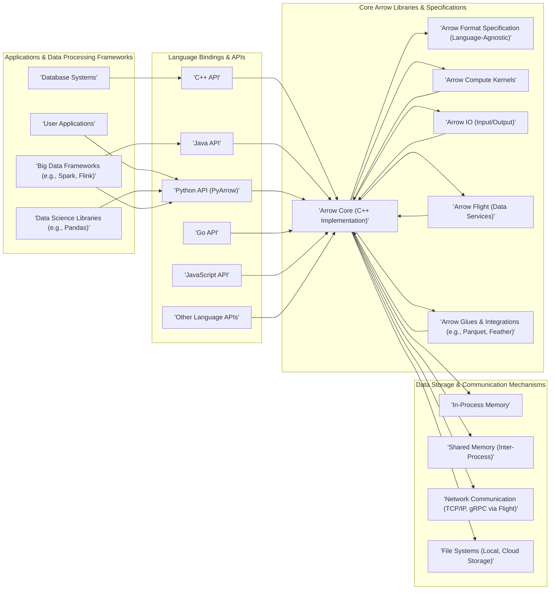

# Project Design Document: Apache Arrow (Improved)

**1. Introduction**

This document provides an enhanced architectural design of the Apache Arrow project, building upon the previous version. It aims to offer a more detailed and nuanced understanding of the project's components, interactions, and data flows. This refined design will serve as a more robust foundation for subsequent threat modeling activities, enabling a deeper and more comprehensive assessment of potential security risks.

Apache Arrow is a foundational, cross-language development platform for in-memory data. Its core contribution is a standardized, language-independent columnar memory format designed for both flat and hierarchical data. This format is meticulously organized to facilitate efficient analytical operations on modern hardware. Beyond the format, Arrow provides a suite of computational libraries that operate directly on this memory layout, enabling high-performance data manipulation.

**2. Goals and Objectives**

The fundamental goals of Apache Arrow are:

*   **Ultra-Efficient Data Interchange:** To enable true zero-copy data sharing between disparate processing systems and programming languages, minimizing overhead and maximizing performance.
*   **Significant Acceleration of Analytics:** To provide a columnar in-memory representation that is inherently optimized for analytical workloads, allowing for vectorized operations and reduced data access costs.
*   **Seamless Interoperability:** To act as a universal data layer, facilitating smooth and efficient integration between a diverse range of data processing frameworks, tools, and libraries.
*   **Broad Language Agnosticism:** To offer comprehensive support for a wide spectrum of programming languages through well-maintained and idiomatic language bindings, ensuring accessibility for diverse development teams.
*   **Solid Foundation for Data Science Ecosystem:** To serve as a reliable and performant building block upon which higher-level data science tools, libraries, and applications can be constructed.

**3. High-Level Architecture**

The Apache Arrow project's architecture can be conceptually divided into the following interacting layers:

**4. Component Details (Expanded)**

*   **Arrow Core (C++ Implementation):**
    *   The bedrock of the Apache Arrow project, implemented in highly performant C++.
    *   Provides the canonical implementation of the Arrow columnar memory format.
    *   Offers fundamental data structures like `Array`, `ChunkedArray`, `RecordBatch`, and `Table`.
    *   Manages memory allocation and deallocation for Arrow data structures.
    *   Serves as the foundation upon which all other language bindings are built, often through Foreign Function Interfaces (FFI).

*   **Arrow Format Specification (Language-Agnostic):**
    *   A meticulously defined, language-independent specification that details the precise layout of data in memory.
    *   Covers a wide range of data types, including primitive types, nested types (lists, structs, maps), and dictionary encoding.
    *   Ensures bit-level compatibility across different language implementations, guaranteeing seamless data interchange.
    *   Acts as the single source of truth for how Arrow data should be represented.

*   **Language Bindings & APIs (C++, Java, Python, Go, JavaScript, etc.):**
    *   Provide idiomatic access to Arrow functionality from a variety of programming languages, catering to diverse developer preferences.
    *   Often wrap the core C++ library for performance-critical operations, while providing higher-level abstractions for ease of use.
    *   Implement language-specific APIs for creating, manipulating, and accessing Arrow data structures, adhering to the conventions of each language.
    *   Examples include PyArrow (Python), Arrow for Java, and the Go Arrow library.

*   **Arrow Compute Kernels:**
    *   A collection of highly optimized, vectorized computational functions designed to operate directly on Arrow data in memory.
    *   Includes kernels for common data manipulation tasks such as filtering, aggregation (sum, mean, min, max), sorting, type casting, and string operations.
    *   Leverages Single Instruction, Multiple Data (SIMD) instructions and other hardware optimizations for maximum performance.
    *   Extensible, allowing developers to add custom compute kernels.

*   **Arrow IO (Input/Output):**
    *   Handles the reading and writing of Arrow data to and from various storage formats and systems.
    *   Supports reading and writing to file formats like Parquet, Feather, CSV, and JSON, often with optimized implementations.
    *   Provides mechanisms for streaming large datasets and working with data in chunks or batches.
    *   Includes support for interacting with different storage backends, including local file systems and cloud storage services (e.g., AWS S3, Azure Blob Storage).

*   **Arrow Flight (Data Services):**
    *   A high-performance, language-independent framework built on gRPC and Arrow for building efficient data services.
    *   Enables fast and reliable data transfer over networks with features like bidirectional streaming and efficient serialization.
    *   Provides built-in support for authentication (e.g., using tokens) and authorization, allowing for secure data access control.
    *   Designed for scenarios requiring high-throughput data exchange between applications or services.

*   **Arrow Glues & Integrations (e.g., Parquet, Feather):**
    *   Libraries that bridge the gap between the Arrow format and other popular data formats and systems.
    *   Provide optimized readers and writers for formats like Apache Parquet and Apache Feather, leveraging the efficiency of the Arrow format in memory.
    *   Facilitate seamless conversion between these formats and Arrow, enabling interoperability.

**5. Data Flow (Detailed)**

The following illustrates common data flow patterns within the Apache Arrow ecosystem, providing more granular detail:

```mermaid
graph LR
    subgraph "Data Origin"
        DO["'External Data Source (e.g., Relational Database, NoSQL Store, Sensor Data)'"]
    end
    subgraph "Ingestion & Conversion (Processing System 1)"
        PS1_Read["'Read Data (e.g., JDBC, API Call, File Read)'"]
        PS1_Convert["'Convert to Arrow Format (using Language Bindings)'"]
        PS1_Memory["'Arrow Data in Memory'"]
    end
    subgraph "Data Interchange Mechanism"
        IPC_SM["'Shared Memory Transfer'"]
        IPC_Flight_S["'Arrow Flight (gRPC) - Serialization'"]
        IPC_Flight_N["'Network Transport'"]
        IPC_Flight_D["'Arrow Flight (gRPC) - Deserialization'"]
    end
    subgraph "Processing & Consumption (Processing System 2)"
        PS2_Receive_SM["'Receive Arrow Data (Shared Memory)'"]
        PS2_Receive_Flight["'Receive Arrow Data (Arrow Flight)'"]
        PS2_Process["'Process Arrow Data (using Compute Kernels or Language APIs)'"]
        PS2_Output["'Output Data (e.g., Write to File, Display, Further Processing)'"]
    end
    subgraph "Data Destination"
        DD["'Data Sink (e.g., Data Lake, Reporting System, Visualization Tool)'"]
    end

    DO --> PS1_Read
    PS1_Read --> PS1_Convert
    PS1_Convert --> PS1_Memory
    PS1_Memory -- "Same Process" --> PS2_Process
    PS1_Memory -- "Different Process (Same Machine)" --> IPC_SM
    PS1_Memory -- "Different Machine" --> IPC_Flight_S
    IPC_SM --> PS2_Receive_SM
    IPC_Flight_S --> IPC_Flight_N
    IPC_Flight_N --> IPC_Flight_D
    IPC_Flight_D --> PS2_Receive_Flight
    PS2_Receive_SM --> PS2_Process
    PS2_Receive_Flight --> PS2_Process
    PS2_Process --> PS2_Output
    PS2_Output --> DD
```

**Detailed Data Flow Steps:**

1. **Data Origination:** Data resides in an external source, which could be a database, a file, a sensor stream, or any other data-producing system.
2. **Ingestion and Conversion:**
    *   A processing system initiates the data ingestion process, reading data from the source using appropriate connectors or APIs.
    *   The data is then converted into the Apache Arrow columnar format in memory. This conversion is typically handled by the language bindings (e.g., PyArrow, Arrow for Java). The structure of the Arrow data adheres to the Arrow Format Specification.
    *   The resulting Arrow data is held in the system's memory.
3. **Data Interchange:**
    *   **Same Process:** If the data needs to be accessed by another part of the same application, it can be accessed directly in memory.
    *   **Shared Memory (Inter-Process):** For communication between processes on the same machine, Arrow data can be shared efficiently using shared memory segments. This avoids the overhead of copying data.
    *   **Arrow Flight (Network):** For communication between processes on different machines or when a robust data service is needed, Arrow Flight is employed.
        *   **Serialization:** The Arrow data is serialized into a message stream using gRPC.
        *   **Network Transport:** The serialized data is transmitted over the network using protocols like TCP/IP. This phase may involve security measures like TLS encryption.
        *   **Deserialization:** The receiving process deserializes the message stream back into Arrow data structures.
4. **Processing and Consumption:**
    *   The receiving processing system accesses the Arrow data (either from shared memory or after deserialization from Arrow Flight).
    *   Data processing is performed using Arrow Compute kernels for optimized operations or through language-specific APIs provided by the Arrow bindings.
5. **Data Output:** The processed Arrow data can be used for various purposes:
    *   Writing to a data sink, such as a data lake in Parquet format.
    *   Displaying results to a user interface.
    *   Feeding data into another processing pipeline.

**6. Security Considerations (Enhanced)**

This section expands on the initial security considerations, providing more specific examples and potential attack vectors:

*   **Data Integrity:**
    *   **Risk:** Data corruption during memory manipulation or transfer.
    *   **Threats:** Malicious code modifying Arrow buffers, bit flips during network transmission.
    *   **Mitigation:** Employing checksums or cryptographic hashes to verify data integrity, using secure communication protocols.
*   **Access Control:**
    *   **Risk:** Unauthorized access to sensitive data.
    *   **Threats:** Lack of authentication or authorization in Arrow Flight services, vulnerabilities in application logic exposing Arrow data.
    *   **Mitigation:** Implementing robust authentication (e.g., token-based) and authorization mechanisms in Arrow Flight, enforcing access controls at the application level.
*   **Memory Safety:**
    *   **Risk:** Memory corruption leading to crashes or arbitrary code execution.
    *   **Threats:** Buffer overflows in C++ code or language bindings, use-after-free vulnerabilities.
    *   **Mitigation:** Rigorous code reviews, static and dynamic analysis tools, utilizing memory-safe programming practices, keeping Arrow libraries up-to-date.
*   **Serialization/Deserialization Vulnerabilities:**
    *   **Risk:** Exploiting vulnerabilities in the serialization or deserialization process.
    *   **Threats:** Buffer overflows when handling malformed data, injection attacks if deserialized data is used unsafely.
    *   **Mitigation:** Input validation and sanitization, using secure serialization libraries, adhering to secure coding practices.
*   **Dependency Management:**
    *   **Risk:** Vulnerabilities in third-party libraries used by Arrow.
    *   **Threats:** Exploiting known vulnerabilities in dependencies to compromise the system.
    *   **Mitigation:** Regularly scanning dependencies for vulnerabilities, keeping dependencies up-to-date, using dependency management tools.
*   **Network Security (Arrow Flight):**
    *   **Risk:** Eavesdropping or tampering with data transmitted over the network.
    *   **Threats:** Man-in-the-middle attacks, eavesdropping on unencrypted communication.
    *   **Mitigation:** Enforcing TLS encryption for Arrow Flight communication, using secure authentication protocols.
*   **Denial of Service (DoS):**
    *   **Risk:** Exhausting resources or making Arrow services unavailable.
    *   **Threats:** Sending a large number of requests to Arrow Flight services, exploiting inefficient compute kernels.
    *   **Mitigation:** Implementing rate limiting, resource quotas, input validation to prevent resource exhaustion.
*   **Code Injection:**
    *   **Risk:** Execution of malicious code through vulnerabilities.
    *   **Threats:** Exploiting vulnerabilities in custom compute kernels or language binding integrations.
    *   **Mitigation:** Secure coding practices for custom kernels, careful validation of inputs to compute functions.

**7. Deployment Considerations (Elaborated)**

Apache Arrow's deployment models have significant implications for security:

*   **Embedded Library:**
    *   **Scenario:** Arrow libraries are directly linked into applications.
    *   **Security Implications:** Security relies heavily on the security of the host application. Vulnerabilities in the application can expose Arrow data. Memory safety issues in Arrow can directly impact the application.
*   **Component within Data Processing Frameworks:**
    *   **Scenario:** Arrow is used internally by systems like Spark or Flink.
    *   **Security Implications:** Security is a shared responsibility between Arrow and the framework. Vulnerabilities in either can be exploited. Data access control is often managed by the framework.
*   **Standalone Arrow Flight Service:**
    *   **Scenario:** Arrow Flight is deployed as a dedicated service for data access.
    *   **Security Implications:** Requires careful configuration of authentication, authorization, and network security (TLS). Vulnerabilities in the Flight service itself are a direct risk. Proper isolation and resource management are crucial.

**8. Future Considerations**

*   **Advanced Security Features:** Exploring the integration of more sophisticated security mechanisms directly within the Arrow core, such as built-in encryption or fine-grained access control.
*   **Formal Security Audits:** Conducting regular, independent security audits of the Arrow codebase to identify and address potential vulnerabilities proactively.
*   **Standardized Security Best Practices:** Developing and promoting best practices for securely using and deploying Apache Arrow in various environments.
*   **Enhanced Threat Modeling Documentation:** Providing more detailed guidance and resources for users to perform threat modeling on their specific Arrow deployments.

This improved design document provides a more comprehensive and detailed understanding of the Apache Arrow project's architecture, enhancing its value as a foundation for thorough threat modeling. The expanded component descriptions, detailed data flow diagrams, and enhanced security considerations offer a more robust basis for identifying and mitigating potential security risks.