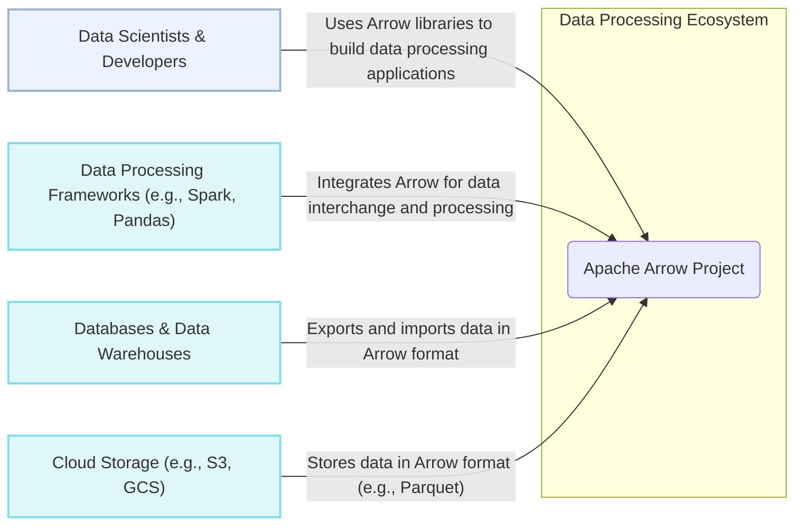
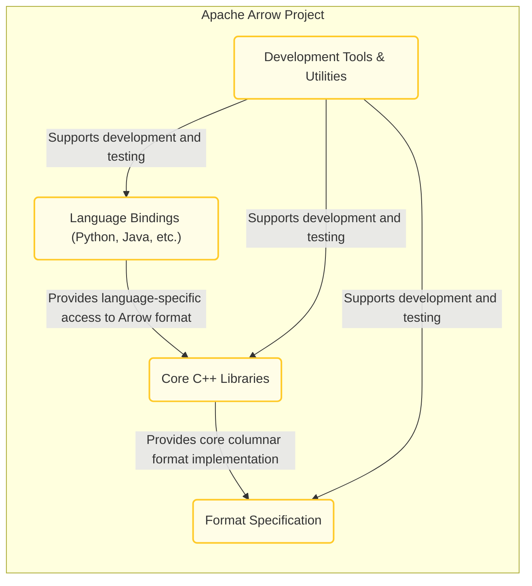

# BUSINESS POSTURE

The Apache Arrow project aims to define a language-agnostic columnar memory format for flat and hierarchical data, optimized for data locality and analytical operations. It provides libraries to enable systems to process and move data faster. The primary business priorities and goals are:

- Improve performance of data processing and analytics by providing an efficient in-memory columnar format.
- Enhance interoperability between different data processing systems and programming languages by establishing a standard data representation.
- Reduce data serialization and deserialization overhead, leading to faster data exchange.
- Foster a vibrant ecosystem of tools and libraries built around the Arrow format.
- Enable efficient data access and manipulation for large datasets.

Key business risks associated with these priorities and goals include:

- Performance bottlenecks in specific use cases or platforms despite the general performance focus.
- Interoperability issues arising from incomplete or inconsistent implementations across different languages and systems.
- Adoption risk if the Arrow format does not gain widespread acceptance and usage within the data processing community.
- Security vulnerabilities in the core Arrow libraries that could impact a wide range of dependent systems.
- Data integrity issues due to bugs in the format specification or library implementations.

# SECURITY POSTURE

Existing security controls:

- security control: Code reviews are conducted by project committers and contributors as part of the pull request process. (Location: GitHub pull request review process)
- security control: Static analysis tools are likely used within development and CI pipelines, although specific tools and configurations are not explicitly documented in the repository. (Assumption based on common open-source development practices)
- security control: Vulnerability reporting through the Apache Security Team and JIRA. (Location: Apache Security website and project documentation)
- security control: Regular updates and maintenance of the codebase by a community of developers. (Location: GitHub commit history and release notes)
- accepted risk: Reliance on community contributions for security vulnerability discovery and patching, which may have variable response times.
- accepted risk: Potential for vulnerabilities to exist in dependencies used by Arrow libraries.
- accepted risk: Security of user applications that integrate Arrow libraries is the responsibility of the application developers.

Recommended security controls:

- security control: Implement automated security scanning tools (SAST, DAST, dependency scanning) in the CI/CD pipeline and regularly review the results.
- security control: Conduct periodic security audits by external security experts to identify potential vulnerabilities in the Arrow libraries and format specification.
- security control: Establish a formal Security Response process with defined SLAs for addressing reported vulnerabilities.
- security control: Generate and publish Software Bill of Materials (SBOM) for Arrow releases to improve supply chain transparency.
- security control: Implement fuzzing and property-based testing to proactively discover potential vulnerabilities in core components.

Security requirements:

- Authentication: Not directly applicable to the Apache Arrow library itself, as it is a data format and library, not a service requiring user authentication. However, applications using Arrow might require authentication, which is outside the scope of the Arrow project itself.
- Authorization: Not directly applicable to the Apache Arrow library itself. Authorization is handled by the applications and systems that use Arrow to process data.
- Input validation: Critical for Arrow libraries to prevent vulnerabilities. Arrow libraries must perform robust validation of input data, especially when deserializing data from external sources or untrusted inputs. This includes validating data types, schema consistency, and data ranges to prevent buffer overflows, format string vulnerabilities, and other input-related issues.
- Cryptography: Cryptography is not a core requirement for the Arrow format itself. However, Arrow can be used to represent and process encrypted data. If applications using Arrow need to handle sensitive data, they should implement appropriate encryption mechanisms at the application level, potentially leveraging cryptographic libraries alongside Arrow. Arrow libraries should be designed to handle binary data securely without introducing vulnerabilities when processing encrypted data.

# DESIGN

## C4 CONTEXT



Context Diagram Elements:

- Name: Apache Arrow Project
  - Type: Software System
  - Description: The Apache Arrow project provides a language-agnostic columnar memory format and libraries for efficient data processing and interchange.
  - Responsibilities:
    - Define and maintain the Arrow columnar format specification.
    - Develop and maintain core Arrow libraries in multiple programming languages (C++, Python, Java, etc.).
    - Ensure performance and correctness of Arrow implementations.
    - Foster community adoption and contribution to the project.
  - Security controls:
    - Code reviews for all contributions.
    - Vulnerability reporting and response process.
    - Community security awareness.

- Name: Data Scientists & Developers
  - Type: Person
  - Description: Users who utilize Arrow libraries to build data processing applications, analytics tools, and data integration solutions.
  - Responsibilities:
    - Integrate Arrow libraries into their applications.
    - Utilize Arrow format for data exchange and processing.
    - Report issues and contribute to the Arrow project.
  - Security controls:
    - Secure coding practices in applications using Arrow.
    - Input validation and sanitization in applications using Arrow.
    - Dependency management for Arrow libraries in applications.

- Name: Data Processing Frameworks (e.g., Spark, Pandas)
  - Type: Software System
  - Description: Existing data processing frameworks that integrate Arrow to improve performance and interoperability.
  - Responsibilities:
    - Leverage Arrow format for internal data representation and exchange.
    - Provide APIs for users to interact with Arrow within the framework.
    - Contribute to Arrow adoption within the data processing ecosystem.
  - Security controls:
    - Secure integration of Arrow libraries into the framework.
    - Input validation when interacting with Arrow data within the framework.
    - Regular updates of Arrow libraries within the framework.

- Name: Databases & Data Warehouses
  - Type: Software System
  - Description: Databases and data warehouses that support exporting and importing data in the Arrow format, enabling efficient data transfer.
  - Responsibilities:
    - Implement support for reading and writing data in Arrow format.
    - Utilize Arrow for efficient data loading and unloading operations.
    - Improve data integration with systems using Arrow.
  - Security controls:
    - Secure data export and import processes using Arrow.
    - Access controls for data stored in databases and data warehouses.
    - Data validation during import from Arrow format.

- Name: Cloud Storage (e.g., S3, GCS)
  - Type: Software System
  - Description: Cloud storage services where data in Arrow-based formats like Parquet are stored and accessed.
  - Responsibilities:
    - Store and retrieve data in Arrow-based file formats.
    - Provide scalable and reliable data storage.
    - Ensure data availability and durability.
  - Security controls:
    - Access control mechanisms for data stored in cloud storage.
    - Encryption of data at rest and in transit in cloud storage.
    - Data integrity checks for stored data.

## C4 CONTAINER



Container Diagram Elements:

- Name: Core C++ Libraries
  - Type: Container
  - Description: The foundational C++ libraries that implement the Arrow columnar format, data structures, and algorithms. These libraries are the core engine of Arrow and are used by other language bindings.
  - Responsibilities:
    - Implement the Arrow format specification in C++.
    - Provide efficient data structures for columnar data representation.
    - Offer high-performance algorithms for data processing and manipulation.
    - Serve as the basis for language bindings.
  - Security controls:
    - Memory safety checks in C++ code.
    - Input validation within core library functions.
    - Static analysis and fuzzing of C++ code.

- Name: Language Bindings (Python, Java, etc.)
  - Type: Container
  - Description: Language-specific libraries that provide access to the Arrow format and functionality from various programming languages like Python, Java, R, Go, etc. These bindings wrap the core C++ libraries.
  - Responsibilities:
    - Expose Arrow functionality to different programming languages.
    - Provide user-friendly APIs for working with Arrow data.
    - Handle language-specific memory management and integration.
    - Ensure consistency with the core C++ implementation.
  - Security controls:
    - Secure wrapping of C++ libraries to prevent language-specific vulnerabilities.
    - Input validation in language binding APIs.
    - Memory management and resource handling in language bindings.

- Name: Format Specification
  - Type: Container
  - Description: The formal specification document that defines the Arrow columnar format, data types, and protocols. This specification ensures interoperability across different implementations and languages.
  - Responsibilities:
    - Clearly define the Arrow format and its components.
    - Provide a standard reference for all Arrow implementations.
    - Evolve the format specification to meet changing needs.
    - Ensure clarity and completeness of the specification.
  - Security controls:
    - Public review and community feedback on the specification.
    - Version control and change management for the specification document.
    - Clarity and precision in the specification to avoid ambiguity and implementation errors.

- Name: Development Tools & Utilities
  - Type: Container
  - Description: Tools and utilities that support the development, testing, and usage of Arrow libraries. This includes code generators, testing frameworks, command-line tools, and documentation generators.
  - Responsibilities:
    - Facilitate development and testing of Arrow libraries.
    - Provide tools for working with Arrow data (e.g., command-line converters).
    - Generate documentation and examples.
    - Improve developer productivity and code quality.
  - Security controls:
    - Security of development tools to prevent supply chain attacks.
    - Secure configuration and usage of development tools.
    - Regular updates and maintenance of development tools.

## DEPLOYMENT

Apache Arrow libraries are typically deployed as embedded libraries within user applications or data processing systems. There isn't a standalone "deployment" of Arrow as a service. The deployment context is determined by how users integrate Arrow into their projects.

Deployment Scenario: Embedded Library in a Data Processing Application

```mermaid
graph LR
    subgraph "Deployment Environment (e.g., User's Server, Cloud Instance)":::deployment_environment
        A["Application Process"]:::deployment_node
        subgraph "Within Application Process"
            B["Arrow Libraries (e.g., libarrow.so, arrow.jar)"]:::container
            C["Application Code"]:::component
        end
    end

    A -- "Loads and uses" --> B
    A -- "Executes" --> C
    C -- "Utilizes" --> B

    classDef person fill:#ECF2FF,stroke:#9CB4CC,stroke-width:2px
    classDef software_system fill:#E0F7FA,stroke:#80DEEA,stroke-width:2px
    classDef container fill:#FFFDE7,stroke:#FFCA28,stroke-width:2px
    classDef component fill:#FBE9E7,stroke:#FFAB91,stroke-width:2px
    classDef deployment_environment fill:#F0F4C3,stroke:#D4E157,stroke-width:2px
    classDef deployment_node fill:#C8E6C9,stroke:#81C784,stroke-width:2px
    classDef database fill:#EDE7F6,stroke:#AB47BC,stroke-width:2px
```

Deployment Diagram Elements:

- Name: Deployment Environment (e.g., User's Server, Cloud Instance)
  - Type: Deployment Environment
  - Description: The environment where the application using Arrow is deployed. This could be a user's server, a cloud instance, a containerized environment, or any other computing platform.
  - Responsibilities:
    - Provide the runtime environment for the application and Arrow libraries.
    - Ensure availability of necessary resources (CPU, memory, storage).
    - Manage network connectivity and security of the environment.
  - Security controls:
    - Operating system and infrastructure security hardening.
    - Network security controls (firewalls, intrusion detection).
    - Access control to the deployment environment.
    - Monitoring and logging of environment activities.

- Name: Application Process
  - Type: Deployment Node
  - Description: The process in which the user application runs, loading and utilizing the Arrow libraries.
  - Responsibilities:
    - Execute the application code.
    - Load and manage Arrow libraries in memory.
    - Handle data processing logic using Arrow.
    - Interact with other systems and resources.
  - Security controls:
    - Process isolation and resource limits.
    - Secure configuration of the application process.
    - Monitoring and logging of application activities.

- Name: Arrow Libraries (e.g., libarrow.so, arrow.jar)
  - Type: Container
  - Description: The compiled Arrow libraries (shared libraries, JAR files, etc.) that are loaded by the application process.
  - Responsibilities:
    - Provide Arrow functionality to the application.
    - Perform data processing operations as requested by the application.
    - Manage memory and resources used by Arrow.
  - Security controls:
    - Security controls inherited from the build process (supply chain security, build integrity).
    - Memory safety and input validation within the libraries.
    - Regular updates and patching of Arrow libraries.

- Name: Application Code
  - Type: Component
  - Description: The user-developed application code that integrates and utilizes the Arrow libraries to perform specific data processing tasks.
  - Responsibilities:
    - Implement application-specific logic.
    - Utilize Arrow APIs to process data.
    - Handle application-level security concerns (authentication, authorization, input validation).
    - Manage application configuration and dependencies.
  - Security controls:
    - Secure coding practices in application development.
    - Input validation and sanitization in application code.
    - Secure configuration and deployment of the application.
    - Dependency management for application dependencies (including Arrow).

## BUILD

```mermaid
graph LR
    A["Developer"]:::person -- "Code Changes" --> B["Version Control System (GitHub)"]:::software_system
    B -- "Triggers Build" --> C["CI/CD System (GitHub Actions)"]:::software_system
    C -- "Build Process (Compilation, Testing, Security Checks)" --> D["Build Artifacts (Libraries, Packages)"]:::container
    D -- "Publish" --> E["Artifact Repository (e.g., Maven Central, PyPI)"]:::software_system

    subgraph "CI/CD System (GitHub Actions)"
        F["Source Code Checkout"]:::component
        G["Dependency Resolution & Download"]:::component
        H["Compilation & Linking"]:::component
        I["Unit & Integration Tests"]:::component
        J["Security Scanners (SAST, Dependency Check)"]:::component
        K["Artifact Packaging"]:::component
    end
    C --> F
    F --> G
    G --> H
    H --> I
    I --> J
    J --> K
    K --> D

    classDef person fill:#ECF2FF,stroke:#9CB4CC,stroke-width:2px
    classDef software_system fill:#E0F7FA,stroke:#80DEEA,stroke-width:2px
    classDef container fill:#FFFDE7,stroke:#FFCA28,stroke-width:2px
    classDef component fill:#FBE9E7,stroke:#FFAB91,stroke-width:2px
    classDef deployment_environment fill:#F0F4C3,stroke:#D4E157,stroke-width:2px
    classDef database fill:#EDE7F6,stroke:#AB47BC,stroke-width:2px
```



Build Process Description:

The Apache Arrow project utilizes a robust build system, typically based on CMake, and employs CI/CD systems like GitHub Actions for automated builds. The build process aims to produce distributable artifacts (libraries, packages) for various languages and platforms.

Build Process Elements:

- Name: Developer
  - Type: Person
  - Description: Software developers who contribute code changes to the Apache Arrow project.
  - Responsibilities:
    - Write and test code for Arrow libraries and tools.
    - Submit code changes through pull requests.
    - Participate in code reviews.
  - Security controls:
    - Secure development environment.
    - Code review participation.
    - Adherence to secure coding practices.

- Name: Version Control System (GitHub)
  - Type: Software System
  - Description: GitHub repository hosting the Apache Arrow source code and managing code changes.
  - Responsibilities:
    - Store and manage source code.
    - Track code changes and history.
    - Facilitate collaboration through pull requests.
  - Security controls:
    - Access control to the repository.
    - Audit logging of repository activities.
    - Branch protection and code review enforcement.

- Name: CI/CD System (GitHub Actions)
  - Type: Software System
  - Description: Automated CI/CD system (e.g., GitHub Actions) that builds, tests, and packages Arrow libraries upon code changes.
  - Responsibilities:
    - Automate the build process.
    - Run unit and integration tests.
    - Perform security checks (SAST, dependency scanning).
    - Package build artifacts for distribution.
  - Security controls:
    - Secure configuration of CI/CD pipelines.
    - Access control to CI/CD system and secrets.
    - Isolation of build environments.
    - Logging and monitoring of build processes.

- Name: Build Artifacts (Libraries, Packages)
  - Type: Container
  - Description: The output of the build process, including compiled libraries (e.g., shared libraries, JAR files), language packages (e.g., Python wheels, Maven packages), and other distributable files.
  - Responsibilities:
    - Contain compiled and packaged Arrow libraries.
    - Be distributable to users and artifact repositories.
    - Be versioned and managed for releases.
  - Security controls:
    - Integrity checks (e.g., checksums, signatures) for build artifacts.
    - Provenance tracking of build artifacts.
    - Secure storage and distribution of build artifacts.

- Name: Artifact Repository (e.g., Maven Central, PyPI)
  - Type: Software System
  - Description: Public or private artifact repositories where build artifacts are published for distribution to users.
  - Responsibilities:
    - Host and distribute Arrow libraries and packages.
    - Provide access to different versions of artifacts.
    - Ensure availability and reliability of artifact downloads.
  - Security controls:
    - Access control to artifact repository (for publishing).
    - Integrity checks for published artifacts.
    - Security scanning of published artifacts (in some repositories).

- Name: Source Code Checkout
  - Type: Component
  - Description: Step in CI/CD pipeline to retrieve source code from the version control system.
  - Responsibilities:
    - Obtain the latest or specified version of source code.
    - Ensure integrity of checked out code.
  - Security controls:
    - Secure connection to version control system.
    - Verification of code integrity after checkout.

- Name: Dependency Resolution & Download
  - Type: Component
  - Description: Step in CI/CD pipeline to resolve and download project dependencies (e.g., external libraries, build tools).
  - Responsibilities:
    - Identify and list project dependencies.
    - Download dependencies from specified repositories.
    - Verify integrity of downloaded dependencies.
  - Security controls:
    - Use of trusted dependency repositories.
    - Dependency vulnerability scanning.
    - Verification of dependency integrity (e.g., checksums).

- Name: Compilation & Linking
  - Type: Component
  - Description: Step in CI/CD pipeline to compile source code and link libraries to create executable binaries and libraries.
  - Responsibilities:
    - Compile source code using appropriate compilers.
    - Link compiled objects and libraries.
    - Optimize build for target platforms.
  - Security controls:
    - Secure compiler toolchain.
    - Compiler security flags and hardening options.
    - Prevention of code injection during compilation.

- Name: Unit & Integration Tests
  - Type: Component
  - Description: Step in CI/CD pipeline to execute unit and integration tests to verify code functionality and correctness.
  - Responsibilities:
    - Run automated tests against built artifacts.
    - Report test results and failures.
    - Ensure code quality and functionality.
  - Security controls:
    - Secure test environment.
    - Test coverage for security-relevant code.
    - Prevention of test pollution or manipulation.

- Name: Security Scanners (SAST, Dependency Check)
  - Type: Component
  - Description: Step in CI/CD pipeline to perform security scans, including Static Application Security Testing (SAST) and dependency vulnerability checks.
  - Responsibilities:
    - Analyze source code for potential vulnerabilities (SAST).
    - Scan dependencies for known vulnerabilities.
    - Report identified security issues.
  - Security controls:
    - Regularly updated security scanner tools and rules.
    - Review and remediation of scanner findings.
    - Integration of security scanning into build process.

- Name: Artifact Packaging
  - Type: Component
  - Description: Step in CI/CD pipeline to package build artifacts into distributable formats (e.g., zip files, wheels, JAR files).
  - Responsibilities:
    - Create packages for different platforms and languages.
    - Include necessary files and metadata in packages.
    - Sign or checksum packages for integrity.
  - Security controls:
    - Secure packaging process.
    - Integrity checks for packaged artifacts.
    - Secure storage of packaging keys and signing certificates.

# RISK ASSESSMENT

Critical business processes protected by Apache Arrow:

- Data analytics and processing pipelines: Arrow is designed to accelerate data processing, so any process relying on efficient data manipulation is critically dependent on Arrow's performance and reliability.
- Data interchange between systems: Arrow facilitates interoperability, making data exchange between different systems a core process it supports.
- Data serialization and deserialization: Arrow aims to reduce overhead in data serialization, making processes that involve data transfer and storage dependent on Arrow's efficiency.

Data being protected and its sensitivity:

- Tabular and hierarchical data: Arrow is designed to handle structured data. The sensitivity of this data depends entirely on the application context where Arrow is used. It can range from publicly available datasets to highly sensitive personal or financial information.
- Metadata and schema information: Arrow includes schema definitions and metadata. While less sensitive than the data itself, compromising metadata could lead to data misinterpretation or manipulation.
- Build artifacts and libraries: The Arrow libraries themselves are valuable assets. Compromising the build process or libraries could lead to widespread impact on systems using Arrow.

Data sensitivity levels (depending on usage context):

- Public: Datasets that are publicly available and do not require confidentiality.
- Internal: Data used within an organization, requiring confidentiality and integrity.
- Confidential: Sensitive data requiring high levels of confidentiality, integrity, and availability, such as personal identifiable information (PII), financial data, or trade secrets.

# QUESTIONS & ASSUMPTIONS

Questions:

- Are there specific security incident response plans in place for the Apache Arrow project beyond the general Apache Security Team process?
- Are there documented security testing procedures (e.g., fuzzing, penetration testing) performed on Arrow libraries?
- Is there a Software Bill of Materials (SBOM) generated and published for Arrow releases?
- What specific SAST and dependency scanning tools are used in the CI/CD pipeline?
- Are there any known security vulnerabilities or ongoing security concerns for the Apache Arrow project that should be highlighted?

Assumptions:

- The Apache Arrow project follows standard open-source development practices, including code reviews and community contributions.
- Security is a consideration in the development of Apache Arrow, although it might not be the primary focus compared to performance and interoperability.
- Users of Apache Arrow are responsible for implementing security controls in their applications that utilize Arrow libraries.
- The provided GitHub repository (https://github.com/apache/arrow) is the primary source of truth for the Apache Arrow project.
- The context is general design and security considerations for the Apache Arrow project itself, not specific applications built using Arrow.