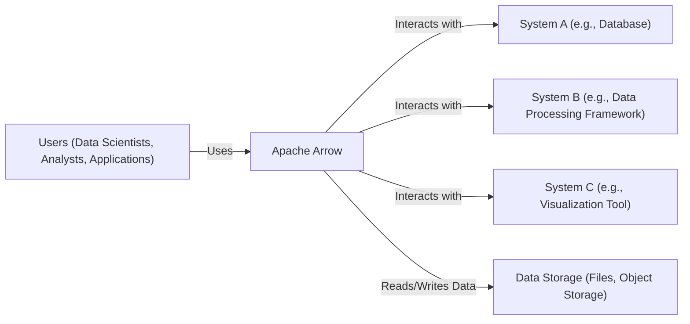
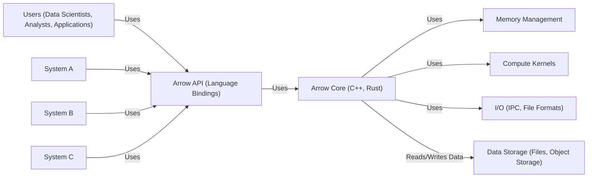
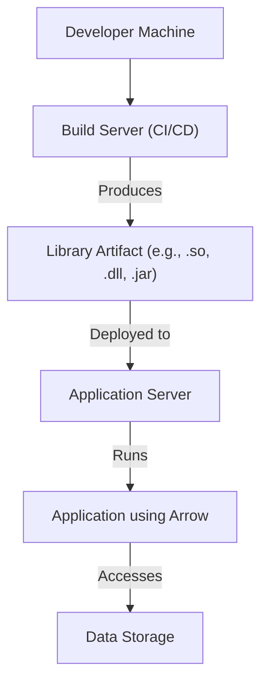
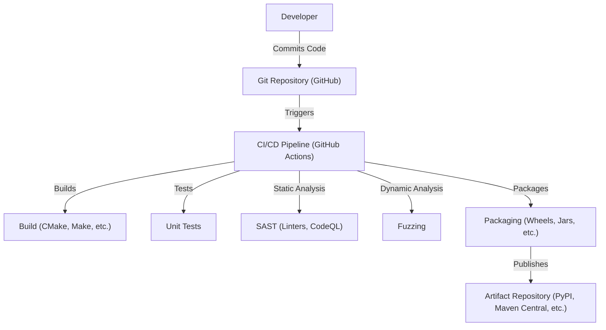

# BUSINESS POSTURE

Business Priorities and Goals:

*   Provide a high-performance, cross-language, and cross-platform data layer for in-memory analytics.
*   Enable efficient data interchange between different systems and programming languages.
*   Minimize data serialization and deserialization overhead.
*   Support a wide range of data types and analytical operations.
*   Foster a collaborative open-source community.
*   Maintain compatibility with various hardware architectures.
*   Provide language bindings for many popular programming languages.

Most Important Business Risks:

*   Data corruption or loss due to software bugs or vulnerabilities.
*   Performance degradation impacting the usability of analytical systems.
*   Incompatibility with key systems or languages, limiting adoption.
*   Security vulnerabilities leading to unauthorized data access or modification.
*   Lack of community engagement hindering long-term development.
*   Failure to keep up with evolving hardware and software landscapes.

# SECURITY POSTURE

Existing Security Controls:

*   security control: Code reviews (mentioned throughout the repository and contribution guidelines).
*   security control: Static analysis (integrated into CI pipelines, as seen in various build scripts).
*   security control: Fuzz testing (mentioned in documentation and test suites).
*   security control: Use of memory-safe languages like Rust for critical components (evident in the codebase).
*   security control: Continuous integration (CI) pipelines (GitHub Actions, Travis CI, etc., are extensively used).
*   security control: Community vulnerability reporting process (implied by the open-source nature and security guidelines).

Accepted Risks:

*   accepted risk: Reliance on third-party libraries (inherent in any large project, mitigated by careful selection and updates).
*   accepted risk: Potential for undiscovered vulnerabilities (inherent in any software, mitigated by ongoing security efforts).
*   accepted risk: Performance trade-offs for certain security features (a common consideration in high-performance systems).

Recommended Security Controls:

*   security control: Implement a comprehensive Software Bill of Materials (SBOM) management system to track all dependencies and their vulnerabilities.
*   security control: Conduct regular penetration testing by independent security experts.
*   security control: Establish a formal security vulnerability disclosure program with clear guidelines and response procedures.
*   security control: Integrate dynamic analysis tools (e.g., sanitizers) into the CI pipeline.
*   security control: Implement regular security training for developers.

Security Requirements:

*   Authentication: Not directly applicable to the core Arrow library, as it primarily deals with data representation and transport. Authentication is typically handled by the systems using Arrow.
*   Authorization: Similar to authentication, authorization is typically handled by the systems using Arrow. However, Arrow could potentially support metadata for carrying authorization tokens or policies.
*   Input Validation: Crucial for preventing data corruption and vulnerabilities. Arrow should rigorously validate data against its schema and reject invalid or malformed data. This is partially addressed by existing fuzzing and testing, but should be a continuous focus.
*   Cryptography: Arrow supports encrypted data transport through integration with libraries like OpenSSL.  It should ensure that cryptographic operations are performed correctly and securely, using well-vetted libraries and algorithms.  Specific areas to consider:
    *   Data at rest encryption: If Arrow data is stored, consider encryption options.
    *   Data in transit encryption: Ensure secure communication channels when Arrow data is transmitted.

# DESIGN

## C4 CONTEXT

Element Descriptions:

*   Element:
    *   Name: Users (Data Scientists, Analysts, Applications)
    *   Type: Person/System
    *   Description: Individuals or applications that utilize Apache Arrow for data processing and analysis.
    *   Responsibilities: Interact with systems that use Arrow to perform data-related tasks.
    *   Security controls: Authentication and authorization are typically handled by the applications interacting with Arrow, not Arrow itself.

*   Element:
    *   Name: Apache Arrow
    *   Type: Software System
    *   Description: A language-independent columnar memory format for flat and hierarchical data, organized for efficient analytic operations on modern hardware.
    *   Responsibilities: Provide a standardized in-memory data representation, facilitate efficient data interchange, and enable high-performance analytical operations.
    *   Security controls: Code reviews, static analysis, fuzz testing, use of memory-safe languages, CI pipelines.

*   Element:
    *   Name: System A (e.g., Database)
    *   Type: Software System
    *   Description: A system that uses Apache Arrow for data input/output or internal processing.
    *   Responsibilities: Varies depending on the specific system (e.g., storing data, querying data).
    *   Security controls: Dependent on the specific system's implementation.

*   Element:
    *   Name: System B (e.g., Data Processing Framework)
    *   Type: Software System
    *   Description: A system that uses Apache Arrow for data input/output or internal processing.
    *   Responsibilities: Varies depending on the specific system (e.g., transforming data, aggregating data).
    *   Security controls: Dependent on the specific system's implementation.

*   Element:
    *   Name: System C (e.g., Visualization Tool)
    *   Type: Software System
    *   Description: A system that uses Apache Arrow for data input.
    *   Responsibilities: Varies depending on the specific system (e.g., displaying data, generating reports).
    *   Security controls: Dependent on the specific system's implementation.

*   Element:
    *   Name: Data Storage (Files, Object Storage)
    *   Type: System
    *   Description: Persistent storage where data used by Arrow may reside.
    *   Responsibilities: Store and retrieve data.
    *   Security controls: Access controls, encryption at rest, data loss prevention mechanisms.

## C4 CONTAINER

Element Descriptions:

*   Element:
    *   Name: Users (Data Scientists, Analysts, Applications)
    *   Type: Person/System
    *   Description: Individuals or applications that utilize Apache Arrow for data processing and analysis.
    *   Responsibilities: Interact with systems that use Arrow to perform data-related tasks.
    *   Security controls: Authentication and authorization are typically handled by the applications interacting with Arrow, not Arrow itself.

*   Element:
    *   Name: Arrow API (Language Bindings)
    *   Type: API
    *   Description: Language-specific interfaces (e.g., Python, Java, R) that provide access to Arrow functionality.
    *   Responsibilities: Expose Arrow functionality to different programming languages, handle data type conversions, and manage memory.
    *   Security controls: Input validation, secure handling of language-specific data types.

*   Element:
    *   Name: Arrow Core (C++, Rust)
    *   Type: Library
    *   Description: The core implementation of the Arrow columnar format and related functionality, primarily in C++ and Rust.
    *   Responsibilities: Implement the Arrow data structures, manage memory allocation and deallocation, provide compute kernels, and handle I/O operations.
    *   Security controls: Code reviews, static analysis, fuzz testing, use of memory-safe languages (Rust), secure coding practices.

*   Element:
    *   Name: Memory Management
    *   Type: Component
    *   Description: Handles allocation, deallocation, and management of memory buffers used by Arrow.
    *   Responsibilities: Efficiently manage memory to minimize overhead and prevent memory leaks.
    *   Security controls: Use of memory-safe techniques, bounds checking, protection against buffer overflows.

*   Element:
    *   Name: Compute Kernels
    *   Type: Component
    *   Description: Provides optimized computational functions for operating on Arrow data.
    *   Responsibilities: Perform operations like filtering, aggregation, sorting, and arithmetic on Arrow arrays.
    *   Security controls: Input validation, protection against arithmetic overflows and other numerical errors.

*   Element:
    *   Name: I/O (IPC, File Formats)
    *   Type: Component
    *   Description: Handles input/output operations, including inter-process communication (IPC) and reading/writing various file formats (e.g., Parquet, Feather).
    *   Responsibilities: Efficiently read and write data to/from different sources and destinations.
    *   Security controls: Input validation, secure handling of file formats, protection against data corruption.

*   Element:
    *   Name: System A
    *   Type: Software System
    *   Description: A system that uses Apache Arrow for data input/output or internal processing.
    *   Responsibilities: Varies depending on the specific system.
    *   Security controls: Dependent on the specific system's implementation.

*   Element:
    *   Name: System B
    *   Type: Software System
    *   Description: A system that uses Apache Arrow for data input/output or internal processing.
    *   Responsibilities: Varies depending on the specific system.
    *   Security controls: Dependent on the specific system's implementation.

*   Element:
    *   Name: System C
    *   Type: Software System
    *   Description: A system that uses Apache Arrow for data input.
    *   Responsibilities: Varies depending on the specific system.
    *   Security controls: Dependent on the specific system's implementation.

*   Element:
    *   Name: Data Storage (Files, Object Storage)
    *   Type: System
    *   Description: Persistent storage where data used by Arrow may reside.
    *   Responsibilities: Store and retrieve data.
    *   Security controls: Access controls, encryption at rest, data loss prevention mechanisms.

## DEPLOYMENT

Possible Deployment Solutions:

1.  **Library Integration:** Arrow is primarily a library, so deployment typically involves linking it into an application or system. This is the most common scenario.
2.  **Standalone Services:** While less common, parts of Arrow could be deployed as standalone services (e.g., a Flight server for data transfer).
3.  **Cloud-Based Services:** Arrow can be used within cloud-based data processing services (e.g., AWS Lambda, Azure Functions, Google Cloud Functions).

Chosen Deployment Solution (Library Integration):

Element Descriptions:

*   Element:
    *   Name: Developer Machine
    *   Type: Infrastructure
    *   Description: The machine where developers write and test code.
    *   Responsibilities: Code development, testing, and local builds.
    *   Security controls: Access controls, secure coding environment, vulnerability scanning.

*   Element:
    *   Name: Build Server (CI/CD)
    *   Type: Infrastructure
    *   Description: A server that automates the build, testing, and packaging of the Arrow library.
    *   Responsibilities: Compile code, run tests, create release artifacts.
    *   Security controls: Access controls, secure build environment, vulnerability scanning of dependencies, code signing.

*   Element:
    *   Name: Library Artifact (e.g., .so, .dll, .jar)
    *   Type: Artifact
    *   Description: The compiled output of the build process, ready to be linked into an application.
    *   Responsibilities: Provide the Arrow functionality to applications.
    *   Security controls: Code signing, integrity checks.

*   Element:
    *   Name: Application Server
    *   Type: Infrastructure
    *   Description: The server where the application that uses Arrow is deployed.
    *   Responsibilities: Run the application.
    *   Security controls: Access controls, operating system hardening, network security.

*   Element:
    *   Name: Application using Arrow
    *   Type: Software System
    *   Description: An application that has integrated the Arrow library.
    *   Responsibilities: Perform data processing tasks using Arrow.
    *   Security controls: Application-specific security controls, input validation, secure use of the Arrow API.

*   Element:
    *   Name: Data Storage
    *   Type: System
    *   Description: Persistent storage where data used by the application resides.
    *   Responsibilities: Store and retrieve data.
    *   Security controls: Access controls, encryption at rest, data loss prevention mechanisms.

## BUILD

Build Process Description:

1.  **Code Commit:** Developers commit code changes to the Git repository (GitHub).
2.  **CI/CD Trigger:** The commit triggers the CI/CD pipeline (GitHub Actions).
3.  **Build:** The build step compiles the code using tools like CMake, Make, and language-specific build systems.
4.  **Unit Tests:** Unit tests are executed to verify the correctness of individual components.
5.  **Static Analysis (SAST):** Static analysis tools (linters, CodeQL) are run to identify potential code quality and security issues.
6.  **Dynamic Analysis (Fuzzing):** Fuzzing is performed to test the robustness of the code against unexpected inputs.
7.  **Packaging:** The build artifacts are packaged into distributable formats (e.g., Python wheels, Java JARs).
8.  **Publish:** The packages are published to artifact repositories (e.g., PyPI, Maven Central).

Security Controls in Build Process:

*   security control: **CI/CD Pipeline:** Automates the build and testing process, ensuring consistency and reducing manual errors.
*   security control: **Unit Tests:** Verify the correctness of individual components, reducing the risk of bugs.
*   security control: **Static Analysis (SAST):** Identifies potential code quality and security vulnerabilities early in the development cycle.
*   security control: **Dynamic Analysis (Fuzzing):** Tests the robustness of the code against unexpected inputs, uncovering potential vulnerabilities.
*   security control: **Dependency Management:** Tools and processes are used to manage dependencies and their vulnerabilities (though specific tools are not explicitly mentioned in all parts of the repository, this is a general practice).
*   security control: **Artifact Repository:** Using well-known and secure artifact repositories helps ensure the integrity of the distributed packages.

# RISK ASSESSMENT

Critical Business Processes to Protect:

*   **Data Processing Pipeline:** Ensuring the integrity and reliability of data processing pipelines that rely on Arrow.
*   **Data Interchange:** Protecting the secure and efficient exchange of data between different systems using Arrow.
*   **Analytical Workloads:** Maintaining the performance and availability of analytical workloads that depend on Arrow.

Data to Protect and Sensitivity:

*   **Arrow Data Buffers:** These buffers contain the actual data being processed. The sensitivity depends on the data itself, which can range from non-sensitive to highly confidential.
*   **Arrow Metadata:** Metadata describes the structure and schema of the data. While generally less sensitive than the data itself, it could potentially reveal information about the data's content or origin.
*   **Configuration Data:** Configuration settings for Arrow and related systems. This may contain sensitive information like access keys or credentials.

# QUESTIONS & ASSUMPTIONS

Questions:

*   What are the specific compliance requirements (e.g., GDPR, HIPAA, PCI DSS) that apply to systems using Arrow in different contexts?
*   What are the specific threat models for the various systems that interact with Arrow?
*   Are there any specific performance requirements or limitations that need to be considered?
*   What are the specific deployment environments for applications using Arrow (e.g., cloud providers, on-premise infrastructure)?
*   What level of access do different users have to the data processed by Arrow?

Assumptions:

*   BUSINESS POSTURE: The primary goal is to provide a high-performance, reliable, and widely adopted data layer for in-memory analytics.
*   SECURITY POSTURE: Security is a high priority, but performance cannot be significantly compromised. A balance between security and performance is assumed.
*   DESIGN: The design is modular and extensible, allowing for future enhancements and integrations. The core components are written in C++ and Rust for performance and memory safety. Language bindings provide access to a wider range of users.