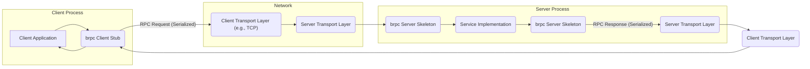
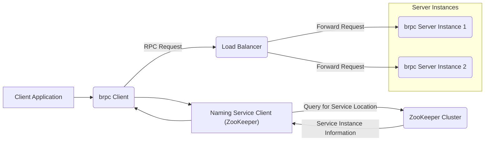

# Project Design Document: Apache brpc

**Version:** 1.1
**Date:** October 26, 2023
**Author:** AI Cloud & Security Architect

## 1. Introduction

This document provides an enhanced and detailed architectural design of the Apache brpc (incubator) framework. It aims to offer a comprehensive understanding of the system's components, interactions, and data flow, specifically tailored for subsequent threat modeling activities. This document focuses on the core architectural elements and their security implications, without delving into specific code implementations or configuration details unless they are crucial for understanding the overall design and potential vulnerabilities.

## 2. Goals and Scope

*   **Goal:** To provide a clear, detailed, and security-focused architectural overview of Apache brpc, optimized for effective threat modeling.
*   **Scope:** This document comprehensively covers the major components of the brpc framework, their interactions, data flow for both standard RPC calls and service discovery, and fundamental deployment considerations. The focus is on the core RPC functionality, related features impacting security, and potential attack surfaces.
*   **Out of Scope:** This document does not cover:
    *   Specific code implementation details within the brpc codebase.
    *   Exhaustive configuration options for every feature of brpc.
    *   Detailed performance benchmarking or optimization strategies.
    *   Specific use cases or application-level designs built utilizing brpc.
    *   Operational procedures for managing a brpc deployment.

## 3. Target Audience

This document is primarily intended for:

*   Security engineers and architects responsible for performing threat modeling, security assessments, and penetration testing of systems utilizing brpc.
*   Software architects and developers who require a deep understanding of the brpc architecture, particularly its security-relevant aspects.

## 4. Architectural Overview

Apache brpc is a high-performance, production-ready Remote Procedure Call (RPC) framework designed for building robust and scalable distributed systems. Its core function is to facilitate efficient and reliable communication between clients and servers across a network. brpc distinguishes itself by supporting a wide array of protocols, serialization methods, and flexible service discovery mechanisms, making it adaptable to diverse architectural needs. Understanding the interplay of these features is crucial for identifying potential security vulnerabilities.

## 5. Key Components and Interactions

The brpc framework is composed of several interconnected components that work together to deliver RPC functionality:

*   **Client:** The initiator of an RPC call. The client application integrates with the brpc client-side library to construct and send requests to a remote server.
*   **Server:** The recipient of RPC calls. The server hosts the implementation of the services and utilizes the brpc server-side library to listen for and process incoming requests.
*   **Stub:** A client-side proxy object. It presents a local interface to the client application that mirrors the remote service's methods, simplifying the process of making RPC calls.
*   **Skeleton:** A server-side component responsible for dispatching incoming RPC requests. It receives requests from the transport layer, deserializes them, and routes them to the appropriate service implementation method.
*   **Protocol Handlers:**  Components responsible for encoding and decoding RPC messages according to a specific protocol. brpc supports multiple protocols, including:
    *   HTTP/1.0:  A widely used text-based protocol.
    *   HTTP/1.1: An enhanced version of HTTP/1.0 with features like persistent connections.
    *   HTTP/2: A binary protocol designed for performance improvements.
    *   gRPC: A high-performance, open-source framework that uses Protocol Buffers by default.
    *   baidu\_std (brpc's proprietary protocol): A high-performance binary protocol.
    *   Hulu-pbrpc: Another protocol option.
    *   Streaming protocols:  For handling continuous data streams.
*   **Transport Layer:** The underlying mechanism for transmitting data packets over the network. Common options include:
    *   TCP (Transmission Control Protocol): Provides reliable, ordered, and error-checked delivery of data.
    *   UDP (User Datagram Protocol): Offers a connectionless datagram service with lower overhead but less reliability.
*   **Naming Service Integration:** Enables clients to dynamically discover the network locations (IP address and port) of available server instances. brpc integrates with various naming services:
    *   Direct connection: The client directly connects to a pre-configured IP address and port.
    *   File-based lists: Server addresses are read from a local file.
    *   ZooKeeper: A centralized service for maintaining configuration information, naming, providing distributed synchronization, and group services.
    *   etcd: A distributed key-value store used for shared configuration and service discovery.
    *   DNS (Domain Name System): Resolves service names to IP addresses.
*   **Load Balancer:** Distributes incoming RPC requests across multiple available server instances. This enhances performance, availability, and fault tolerance. brpc offers several built-in load balancing algorithms.
*   **Serialization/Deserialization Libraries:** Responsible for converting data structures into a byte stream for network transmission (serialization) and converting the byte stream back into data structures (deserialization). Supported formats include:
    *   Protocol Buffers: A language-neutral, platform-neutral extensible mechanism for serializing structured data.
    *   Thrift: Another interface definition language and communication protocol.
    *   JSON (JavaScript Object Notation): A lightweight data-interchange format.
*   **Interceptor/Middleware Framework:** Allows developers to insert custom logic into the RPC processing pipeline, both on the client and server side. This can be used for tasks like:
    *   Authentication and authorization checks.
    *   Logging and monitoring.
    *   Request and response modification.
*   **Connection Management:** Handles the lifecycle of network connections between clients and servers, including establishing, maintaining, and closing connections efficiently.
*   **Monitoring and Logging Framework:** Provides mechanisms for collecting and reporting metrics and logs related to RPC calls. This is crucial for performance analysis, debugging, and security auditing.

## 6. Data Flow

The typical data flow for a standard RPC call in brpc involves the following steps:

**Detailed Steps for a Standard RPC Call:**

1. The **Client Application** initiates an RPC call by invoking a method on the local **brpc Client Stub**.
2. The **brpc Client Stub** serializes the method arguments into a byte stream according to the configured **Protocol**.
3. The serialized request is passed to the **Client Transport Layer** (e.g., TCP socket).
4. The **Client Transport Layer** transmits the request over the network to the target server.
5. On the server side, the **Server Transport Layer** receives the incoming request.
6. The request is passed to the **brpc Server Skeleton**.
7. The **brpc Server Skeleton** deserializes the request message to extract the method and arguments.
8. The **brpc Server Skeleton** dispatches the request to the appropriate **Service Implementation**.
9. The **Service Implementation** executes the requested logic and generates a response.
10. The response is passed back to the **brpc Server Skeleton**.
11. The **brpc Server Skeleton** serializes the response according to the configured **Protocol**.
12. The serialized response is passed to the **Server Transport Layer**.
13. The **Server Transport Layer** transmits the response back to the client.
14. On the client side, the **Client Transport Layer** receives the response.
15. The response is passed back to the **brpc Client Stub**.
16. The **brpc Client Stub** deserializes the response to extract the result.
17. The result is returned to the **Client Application**.

**Data Flow for Service Discovery (Example with ZooKeeper):**

**Detailed Steps for Service Discovery (with ZooKeeper):**

1. The **Client Application**, through the **brpc Client**, needs to locate an available server instance for a specific service.
2. The **brpc Client** interacts with the configured **Naming Service Client** (in this example, a ZooKeeper client).
3. The **Naming Service Client** sends a query to the **ZooKeeper Cluster** requesting the locations of instances for the desired service.
4. The **ZooKeeper Cluster** responds with a list of active server instances and their network addresses.
5. The **Naming Service Client** provides this information back to the **brpc Client**.
6. The **brpc Client** (potentially involving a **Load Balancer**) selects a server instance from the discovered list.
7. The **brpc Client** sends the **RPC Request** to the selected **brpc Server Instance**.

## 7. Security Considerations (Detailed for Threat Modeling)

Based on the architectural components and data flow, here are detailed security considerations relevant for threat modeling:

*   **Authentication and Authorization:**
    *   **Threats:** Unauthorized clients making RPC calls, privilege escalation by authenticated clients accessing restricted services, replay attacks where captured authentication credentials are reused.
    *   **Considerations:** How does brpc facilitate client authentication (e.g., using custom headers, mTLS, tokens)? How is authorization enforced on the server-side to control access to specific services or methods? Are there mechanisms to prevent replay attacks (e.g., nonces, timestamps)? Is mutual authentication supported and enforced?
*   **Data Confidentiality and Integrity:**
    *   **Threats:** Interception of sensitive data during transmission (e.g., credentials, business data), modification of data in transit, eavesdropping on communication channels.
    *   **Considerations:** Is communication between clients and servers encrypted using TLS/SSL? How is the integrity of the data ensured during transmission (e.g., using message authentication codes)? Are there options for end-to-end encryption? How are cryptographic keys managed and rotated?
*   **Denial of Service (DoS):**
    *   **Threats:** Clients overwhelming the server with excessive requests, resource exhaustion on the server (CPU, memory, network), attacks targeting the naming service to disrupt service discovery.
    *   **Considerations:** Does brpc offer built-in rate limiting or throttling mechanisms? How are connection limits and request queue sizes managed on the server? Is the naming service itself resilient to DoS attacks? Are there mechanisms to prevent amplification attacks?
*   **Injection Attacks:**
    *   **Threats:** Exploiting vulnerabilities in serialization/deserialization libraries to inject malicious code or data, manipulating input parameters to cause unintended behavior on the server.
    *   **Considerations:** How are input parameters validated and sanitized on the server side to prevent injection attacks (e.g., SQL injection, command injection)? Are there known vulnerabilities in the supported serialization libraries (e.g., protobuf, Thrift)? Is input validation performed before deserialization?
*   **Man-in-the-Middle (MitM) Attacks:**
    *   **Threats:** Attackers intercepting and potentially modifying communication between clients and servers, especially if encryption is not used or improperly configured.
    *   **Considerations:** Is TLS/SSL properly configured and enforced for all communication? Is the authenticity of the server verified by the client (e.g., using certificate validation)? Is the communication with the naming service secured to prevent malicious redirection of clients?
*   **Dependency Security:**
    *   **Threats:** Vulnerabilities in external libraries and frameworks used by brpc being exploited.
    *   **Considerations:** What are the security implications of the dependencies used by brpc (e.g., protobuf, gRPC, OpenSSL)? Are these dependencies regularly updated to address known vulnerabilities? Is there a process for tracking and mitigating vulnerabilities in dependencies?
*   **Vulnerabilities in Supported Protocols:**
    *   **Threats:** Exploiting known vulnerabilities in the chosen communication protocol (e.g., HTTP/1.x, HTTP/2, gRPC).
    *   **Considerations:** Are the specific protocol implementations used by brpc up-to-date with security patches? Are there any inherent security weaknesses in the chosen protocol that need to be mitigated?
*   **Configuration Security:**
    *   **Threats:** Insecure default configurations or misconfigurations leading to vulnerabilities.
    *   **Considerations:** Are default configurations secure? Are there insecure configuration options that could be easily exploited? Is there guidance provided on secure configuration practices?
*   **Logging and Monitoring Security:**
    *   **Threats:** Sensitive information being logged, logs being tampered with, monitoring systems being compromised.
    *   **Considerations:** What information is logged, and does it include sensitive data? Are log files protected from unauthorized access and modification? Is the communication between brpc components and monitoring systems secured?

## 8. Deployment Considerations

The security profile of a brpc deployment can be significantly influenced by the chosen deployment environment:

*   **Cloud Environments (e.g., AWS, Azure, GCP):**
    *   **Security Advantages:** Potential to leverage cloud-native security services (e.g., firewalls, intrusion detection, managed TLS).
    *   **Security Considerations:** Proper configuration of cloud security groups and network access controls is crucial. Identity and Access Management (IAM) for cloud resources needs careful management.
*   **On-Premise Data Centers:**
    *   **Security Considerations:** Responsibility for all aspects of security (network security, physical security, server hardening) lies with the deploying organization. Proper firewall configuration, intrusion prevention systems, and regular security patching are essential.
*   **Containerized Environments (e.g., Docker, Kubernetes):**
    *   **Security Considerations:** Container image security, secure container orchestration configuration (e.g., network policies, resource quotas), and secrets management are critical.

## 9. Dependencies

brpc relies on several external libraries and frameworks. The security of these dependencies directly impacts the overall security of brpc:

*   Protocol Buffers (protobuf)
*   gRPC (when using the gRPC protocol)
*   Thrift (when using the Thrift protocol)
*   zlib (for compression)
*   OpenSSL or BoringSSL (for TLS/SSL encryption)
*   c-ares (for asynchronous DNS resolution)
*   LevelDB or RocksDB (potentially for internal storage or caching)
*   ZooKeeper client, etcd client, or other naming service clients

Regularly auditing and updating these dependencies is crucial for mitigating potential vulnerabilities.

## 10. Future Considerations (Security-Focused)

Potential future enhancements with security implications include:

*   **Enhanced Authentication and Authorization Frameworks:**  Deeper integration with industry-standard authentication protocols (e.g., OAuth 2.0, OpenID Connect) and fine-grained authorization mechanisms (e.g., attribute-based access control).
*   **Improved Monitoring and Auditing Capabilities:**  More comprehensive logging of security-relevant events, integration with Security Information and Event Management (SIEM) systems, and enhanced tracing capabilities for security analysis.
*   **Built-in Rate Limiting and Throttling Mechanisms:** More sophisticated and configurable mechanisms to prevent DoS attacks at various layers.
*   **Standardized Security Hardening Guides and Best Practices:**  Clear documentation and recommendations for secure configuration and deployment of brpc in different environments.
*   **Formal Security Audits and Penetration Testing:**  Regular independent security assessments to identify and address potential vulnerabilities.

## 11. Glossary

*   **RPC:** Remote Procedure Call. A programming paradigm that allows a program on one machine to execute a procedure on a remote machine.
*   **Serialization:** The process of converting data structures into a format suitable for network transmission or storage.
*   **Deserialization:** The reverse process of serialization, converting serialized data back into its original data structure.
*   **Stub:** A client-side proxy that represents a remote service.
*   **Skeleton:** A server-side component that receives and dispatches incoming RPC requests.
*   **TLS/SSL:** Transport Layer Security/Secure Sockets Layer. Cryptographic protocols that provide communication security over a network.
*   **DoS:** Denial of Service. An attack that aims to make a computer or network resource unavailable to its intended users.
*   **MitM:** Man-in-the-Middle. An attack where the attacker secretly relays and potentially alters the communication between two parties who believe they are directly communicating with each other.
*   **mTLS:** Mutual Transport Layer Security. A process where both the client and the server authenticate each other using digital certificates.
*   **OAuth 2.0:** An authorization framework that enables applications to obtain limited access to user accounts on an HTTP service.
*   **OpenID Connect:** An identity layer on top of OAuth 2.0, which allows clients to verify the identity of the end-user based on the authentication performed by an authorization server.
*   **SIEM:** Security Information and Event Management. A system that provides real-time analysis of security alerts generated by applications and network hardware.
