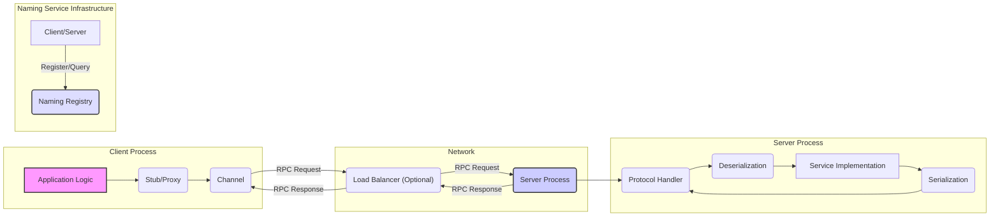
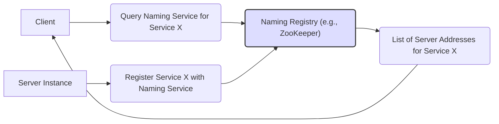

# Project Design Document: Apache brpc

**Version:** 1.1
**Date:** October 26, 2023
**Author:** AI Software Architect

## 1. Introduction

This document provides an enhanced and more detailed architectural design of the Apache brpc (incubator) project. It aims to offer a comprehensive understanding of the system's components, interactions, and data flow, specifically tailored for subsequent threat modeling activities. This detailed view will enable a more granular and effective assessment of potential security vulnerabilities.

## 2. Project Overview

Apache brpc is a high-performance Remote Procedure Call (RPC) framework designed for building robust and scalable distributed systems. It distinguishes itself through its support for a wide array of protocols, serialization methods, and flexible service discovery mechanisms. Key features include:

*   Support for a diverse set of protocols: HTTP/1.0, HTTP/1.1, HTTP/2, TCP (with a custom brpc protocol), UDP, and the Baidu RPC protocol. This variety allows for optimization based on specific use cases.
*   Flexibility in serialization methods: Offers choices like Protocol Buffers, Apache Thrift, and JSON, enabling interoperability and performance tuning.
*   Pluggable load balancing algorithms: Allows customization of request distribution strategies based on application needs and performance goals.
*   Built-in service discovery integration: Simplifies the management of service instances in dynamic environments.
*   Comprehensive monitoring and diagnostics: Provides tools for observing system behavior and troubleshooting issues.

## 3. System Architecture

The brpc framework is structured around several interacting components:

*   **Client:** The initiator of RPC calls. It encapsulates the logic for connecting to and interacting with remote services.
*   **Server:** The recipient of RPC calls. It listens for incoming requests, processes them, and sends back responses.
*   **Naming Service:** A crucial component for service discovery. It maintains a dynamic registry of available service instances and their network locations.
*   **Load Balancer:**  Distributes incoming client requests across multiple available server instances to ensure high availability and performance. This can be a dedicated component or integrated within the client or naming service.
*   **Protocol Handlers:** Responsible for the low-level details of message encoding and decoding according to the selected communication protocol.
*   **Serialization Libraries:** Handle the conversion of structured data into a byte stream for transmission and vice versa.
*   **Monitoring and Logging:** Collect and report system metrics, events, and logs for operational visibility and debugging.

### 3.1. Client Architecture

The client-side architecture is designed for ease of use and efficient communication:

*   **Application Logic:** The core user code that needs to invoke a remote service. It interacts with the brpc client through generated or manually created stubs.
*   **Stub/Proxy:**  Provides a local interface mirroring the remote service. It handles the marshalling (serialization) of arguments into a request message and the unmarshalling (deserialization) of the response.
*   **Channel:**  Manages the underlying network connection to the server or load balancer. It handles connection establishment, pooling, error handling, protocol negotiation, and potentially client-side load balancing.

### 3.2. Server Architecture

The server-side architecture focuses on handling incoming requests efficiently and securely:

*   **Listener:**  Accepts incoming network connections on a specified port. It manages the lifecycle of connections.
*   **Protocol Handler:**  Interprets the incoming byte stream according to the negotiated protocol. This includes framing, parsing headers, and identifying the requested service and method.
*   **Deserialization:** Converts the received message payload from its serialized format back into data structures that the service implementation can understand.
*   **Service Implementation:** Contains the actual business logic that processes the incoming request and generates a response.
*   **Serialization:** Converts the response data from its in-memory representation into a serialized format for transmission back to the client.

### 3.3. Naming Service Interaction

brpc's integration with naming services is crucial for dynamic service discovery:

*   **Direct Connection:** The client is configured with the specific network address of the server. This is the simplest but least flexible approach.
*   **List of Servers:** The client maintains a static list of potential server addresses. This offers some redundancy but requires manual updates.
*   **Naming Registry (e.g., ZooKeeper, Consul, etcd):** Servers register their availability and metadata (e.g., IP address, port, health status) with a central naming registry. Clients query this registry to discover available servers. The brpc client typically includes logic to watch for changes in the registry.

### 3.4. Load Balancing

brpc offers a variety of load balancing algorithms to distribute traffic effectively:

*   **Round Robin:** Distributes requests sequentially to each available server.
*   **Random:** Selects a server instance randomly for each request.
*   **Consistent Hashing:**  Maps requests to specific servers based on a hash of certain request parameters (e.g., user ID), ensuring that requests for the same resource often go to the same server.
*   **Weighted Round Robin/Random:**  Distributes requests based on weights assigned to each server, allowing for uneven distribution based on server capacity or other factors.
*   **Least Load:** Routes requests to the server with the currently lowest load (e.g., fewest active connections, lowest CPU utilization).

### 3.5. Protocol Support

The diverse protocol support in brpc allows for optimization based on network conditions and application requirements:

*   **HTTP/1.0 & HTTP/1.1:** Standard text-based protocols, widely compatible but potentially less efficient for high-performance scenarios.
*   **HTTP/2:** A binary protocol offering features like header compression and multiplexing for improved performance and reduced latency.
*   **TCP (with custom brpc protocol):** A binary protocol specifically designed for high performance and low latency within the brpc framework. It often includes optimizations for RPC scenarios.
*   **UDP:** A connectionless protocol suitable for scenarios where low latency is critical and some packet loss is acceptable.
*   **Baidu RPC Protocol:** A proprietary binary protocol optimized for performance within Baidu's infrastructure.

### 3.6. Serialization Methods

The choice of serialization method impacts performance, interoperability, and message size:

*   **Protocol Buffers (protobuf):** A language-neutral, platform-neutral, extensible mechanism for serializing structured data. Known for its efficiency and schema evolution capabilities.
*   **Apache Thrift:** A software framework for scalable cross-language services development, offering a similar functionality to Protocol Buffers.
*   **JSON:** A lightweight, human-readable data-interchange format. While less efficient than binary formats, it's widely used for interoperability with web-based systems.

### 3.7. Monitoring and Logging

Robust monitoring and logging are essential for operational visibility and security auditing:

*   **Metrics:** brpc exposes various metrics related to request latency, throughput, error rates, connection statistics, and resource utilization. These metrics can be collected by monitoring systems like Prometheus.
*   **Logging:** Generates detailed logs for debugging, auditing, and security analysis. Logs can include information about requests, responses, errors, and internal events. Proper log management and security are crucial.

## 4. Data Flow

A detailed breakdown of a typical RPC call flow within brpc:

1. The client application logic initiates an RPC call by invoking a method on the generated stub/proxy.
2. The stub marshals the method arguments into a request message. The serialization format is determined by the configured protocol and serialization method.
3. The client's channel consults the configured naming service to discover available server instances for the target service.
4. The channel (or a dedicated load balancer) selects a specific server instance based on the configured load balancing algorithm.
5. The channel establishes a network connection (if one doesn't already exist in the connection pool) to the selected server.
6. The channel sends the serialized request message to the server using the chosen protocol. This involves framing the message according to the protocol's specifications.
7. The server's listener accepts the incoming connection.
8. The appropriate protocol handler on the server parses the incoming byte stream to extract the request message.
9. The deserialization component on the server converts the message payload back into data structures.
10. The server's dispatcher routes the deserialized request to the appropriate service implementation.
11. The service implementation processes the request and generates a response.
12. The serialization component on the server converts the response data into a message payload.
13. The protocol handler on the server formats the response message according to the chosen protocol and sends it back to the client.
14. The client's channel receives the response message.
15. The stub unmarshals the response message to extract the result.
16. The stub returns the result to the client application logic.

## 5. Security Considerations

A more detailed look at potential security considerations for threat modeling:

*   **Authentication and Authorization:**
    *   **Threat:** Unauthorized clients accessing services or specific methods.
    *   **Considerations:** How are clients identified and verified? What mechanisms are in place to control access based on client identity or roles? Are mutual TLS, API keys, or other authentication methods used? How is authorization enforced at the service level?
*   **Data Confidentiality and Integrity:**
    *   **Threat:** Sensitive data being intercepted or tampered with during transmission.
    *   **Considerations:** Is TLS/SSL used to encrypt communication channels? Are there options for message-level encryption? How is data integrity ensured (e.g., message signing)?
*   **Denial of Service (DoS) Attacks:**
    *   **Threat:** Malicious actors overwhelming the server with requests, making it unavailable.
    *   **Considerations:** Are there rate limiting mechanisms in place? How are connection limits managed? Are there protections against SYN flood attacks or application-level DoS attacks?
*   **Injection Attacks:**
    *   **Threat:** Exploiting vulnerabilities by injecting malicious code or data.
    *   **Considerations:** How is input data validated and sanitized on both the client and server sides? Are there potential vulnerabilities related to specific protocols or serialization methods (e.g., deserialization vulnerabilities)?
*   **Dependency Vulnerabilities:**
    *   **Threat:** Exploiting known vulnerabilities in the underlying libraries and dependencies.
    *   **Considerations:** What are the dependencies of brpc? Are they regularly scanned for vulnerabilities? What is the process for updating dependencies?
*   **Service Discovery Security:**
    *   **Threat:** Malicious actors registering fake services or manipulating service discovery information.
    *   **Considerations:** How is the naming service secured? Are there authentication and authorization mechanisms for registering and querying services? Is the communication between brpc clients/servers and the naming service secure?
*   **Logging and Monitoring Security:**
    *   **Threat:** Sensitive information being exposed in logs or the monitoring infrastructure being compromised.
    *   **Considerations:** What information is logged? Are sensitive data elements masked or encrypted in logs? How is access to logs and monitoring data controlled? Is the monitoring infrastructure itself secure?
*   **Protocol-Specific Vulnerabilities:**
    *   **Threat:** Exploiting known vulnerabilities in the supported protocols (e.g., HTTP/2 vulnerabilities).
    *   **Considerations:** Are the protocol implementations up-to-date and patched against known vulnerabilities? Are protocol-specific security features (e.g., HTTP Strict Transport Security) utilized?
*   **Serialization Vulnerabilities:**
    *   **Threat:** Exploiting vulnerabilities in the serialization libraries to execute arbitrary code or cause denial of service.
    *   **Considerations:** Are the serialization libraries regularly updated? Are there known deserialization vulnerabilities associated with the chosen serialization methods?

## 6. Technologies Used

*   **Core Language:** Primarily C++.
*   **Networking Libraries:** Likely built upon standard socket APIs and potentially libraries like libevent or similar for asynchronous I/O.
*   **Serialization Libraries:** Protocol Buffers (implementation details depend on the specific protobuf library version), Apache Thrift (version details matter for security patches), JSON libraries (e.g., RapidJSON, jsoncpp).
*   **Naming Service Clients:**  Specific client libraries for interacting with ZooKeeper (e.g., Zookeeper C client), Consul (e.g., libcurl for HTTP API), etcd (e.g., gRPC or HTTP client).
*   **Build System:** CMake is the likely build system.
*   **Operating Systems:** Designed to be cross-platform, supporting Linux, macOS, and potentially Windows.

## 7. Deployment Considerations

Deployment environment significantly impacts security:

*   **Bare Metal Servers:** Requires careful manual configuration of network security, firewalls, and access controls.
*   **Virtual Machines (VMs):**  Leverages the security features of the hypervisor and the underlying infrastructure. Network segmentation and access control lists (ACLs) are important.
*   **Containers (e.g., Docker, Kubernetes):**  Container security best practices are crucial, including image scanning, limiting container privileges, and network policies. Kubernetes Network Policies can enforce network segmentation.
*   **Cloud Environments (AWS, Azure, GCP):**  Utilizes cloud-provided security services like security groups, network firewalls, and identity and access management (IAM). Proper configuration of these services is essential. Service mesh technologies can add another layer of security.

## 8. Future Considerations

Potential future developments that could introduce new security considerations:

*   **Introduction of new protocols or serialization methods:** Requires careful evaluation of their security implications.
*   **Enhanced security features:**  Integration of built-in encryption or authentication mechanisms would need thorough design and testing.
*   **Integration with service mesh technologies:**  Introduces new components and interactions that need to be secured.
*   **Improvements to monitoring and observability:**  Ensuring the security of the monitoring pipeline is critical.

This enhanced document provides a more detailed and security-focused view of the Apache brpc project's architecture, serving as a solid foundation for comprehensive threat modeling activities.