# Project Design Document: Apache brpc (Improved for Threat Modeling)

**Project Name:** Apache brpc (Incubator)

**Version:** 1.1

**Date:** 2023-10-27

**Author:** AI Expert (Based on request)

## 1. Introduction

This document provides an enhanced design overview of the Apache brpc (incubator) project, specifically tailored to facilitate comprehensive threat modeling. Building upon the initial design document, this version offers deeper insights into the architectural components, data flow, and technology stack of brpc, with a strong emphasis on security implications. This document is intended to be a primary input for threat modeling exercises, enabling security analysts to identify, analyze, and mitigate potential security risks within systems leveraging the brpc framework.

## 2. Project Overview

Apache brpc (incubator) is a robust, high-performance C++ RPC framework designed for building scalable and resilient distributed systems. Its key strengths lie in its low latency, high throughput, and support for diverse protocols, including HTTP/2, gRPC, and proprietary protocols like Baidu-RPC-Protocol. brpc offers features crucial for distributed environments, such as service discovery, load balancing, monitoring, and fault tolerance. This document focuses on the core architectural elements relevant to security analysis.

## 3. Architectural Design

brpc employs a classic client-server RPC architecture. Understanding the interactions between client and server components is crucial for identifying potential attack surfaces.

### 3.1. High-Level Architecture Diagram

```mermaid
graph LR
    subgraph "Client Side Environment"
    A["Client Application\n(Business Logic)"] --> B["brpc Client Library\n(RPC Framework Core)"];
    end

    subgraph "Network Infrastructure"
    B --> C["Network (TCP/UDP)\n(Potential Interception Point)"];
    C --> D["Network (TCP/UDP)\n(Potential Interception Point)"];
    end

    subgraph "Server Side Environment"
    D --> E["brpc Server Library\n(RPC Framework Core)"];
    E --> F["Server Application\n(Business Logic, Data Storage)"];
    end

    subgraph "Supporting Infrastructure (Deployment Context)"
    G["Naming Service\n(e.g., ZooKeeper, etcd)\n(Service Discovery, Configuration)"] --> B;
    G --> E;
    H["Load Balancer\n(Optional)\n(Traffic Distribution, Potential Bottleneck)"] --> C;
    M["Monitoring System\n(e.g., Prometheus, Grafana)\n(Observability, Security Auditing)"] --> E;
    N["Logging System\n(e.g., ELK Stack)\n(Auditing, Incident Response)"] --> E;
    end

    style A fill:#f9f,stroke:#333,stroke-width:2px
    style F fill:#f9f,stroke:#333,stroke-width:2px
    style G fill:#ccf,stroke:#333,stroke-width:2px
    style H fill:#ccf,stroke:#333,stroke-width:2px
    style M fill:#ccf,stroke:#333,stroke-width:2px
    style N fill:#ccf,stroke:#333,stroke-width:2px
    linkStyle 2,3,6,7,8,9,10,11,12,13,14 stroke:#ff0,stroke-width:2px;
```

**Diagram Description Enhancements (for Threat Modeling):**

*   **Environment Context:**  Diagram now explicitly separates "Client Side Environment," "Network Infrastructure," and "Server Side Environment" to highlight deployment boundaries and potential trust zones.
*   **Component Annotations:**  Each component node includes a brief description of its primary function and security-relevant aspects in parentheses.
*   **Network Interception Points:** The "Network (TCP/UDP)" nodes are explicitly marked as "Potential Interception Point" to emphasize network security considerations.
*   **Supporting Infrastructure:**  "Supporting Infrastructure" is added to represent common deployment components like Naming Service, Load Balancer, Monitoring, and Logging, which are crucial for overall system security and resilience.
*   **Security Focus:**  Annotations within nodes and link styles (though not directly styled in mermaid due to constraints, conceptually highlighted) are used to draw attention to security-relevant aspects of each component and interaction.

### 3.2. Component Description (Detailed for Threat Modeling)

#### 3.2.1. Client Application (Business Logic)

*   **Functionality:**  Initiates RPC calls to remote services based on business logic. Responsible for data preparation, request construction, and response processing. May handle user authentication and authorization at the application level before making RPC calls.
*   **Security Relevance:**
    *   **Input Validation & Sanitization:**  Crucial to validate and sanitize user inputs *before* they are incorporated into RPC requests to prevent injection attacks (e.g., command injection, SQL injection if data is later used in database queries on the server side).
    *   **Credential Management (Client-Side):** Securely storing and handling credentials (API keys, tokens, certificates) used for authentication with the server.  Vulnerable storage or transmission of credentials can lead to unauthorized access.
    *   **Authorization Logic:**  Implementing client-side authorization checks to prevent unauthorized access to server-side functionalities. However, server-side authorization is paramount and should not be solely relied upon client-side checks.
    *   **Error Handling & Information Disclosure:**  Properly handling errors and exceptions to avoid leaking sensitive information in error messages to potentially malicious clients.
    *   **Dependency Vulnerabilities:**  Vulnerabilities in client application dependencies could be exploited to compromise the client and potentially pivot to the server.

#### 3.2.2. brpc Client Library (RPC Framework Core)

*   **Functionality:**  Provides APIs for client applications to interact with brpc services. Handles service discovery, connection management, request serialization/deserialization, protocol negotiation, load balancing, and error handling.
*   **Security Relevance:**
    *   **RPC Protocol Vulnerabilities:**  Susceptible to vulnerabilities inherent in the supported RPC protocols (e.g., HTTP/2, gRPC).  Protocol parsing flaws, implementation bugs, or known protocol weaknesses could be exploited.
    *   **Serialization/Deserialization Vulnerabilities:**  Deserialization of untrusted data can lead to Remote Code Execution (RCE) if vulnerabilities exist in the deserialization process (e.g., insecure deserialization).  Careful handling of protobuf or other serialization formats is essential.
    *   **Connection Security (TLS/SSL):**  Responsible for establishing secure connections using TLS/SSL to protect data in transit. Misconfiguration or vulnerabilities in TLS implementation can weaken security.  Proper certificate validation is critical.
    *   **Client-Side Load Balancing Vulnerabilities:**  If client-side load balancing is used, vulnerabilities in the load balancing algorithm or configuration could lead to uneven load distribution, denial of service, or routing requests to malicious servers (if server discovery is compromised).
    *   **DNS Spoofing/Hijacking (Service Discovery):** If service discovery relies on DNS, it's vulnerable to DNS spoofing or hijacking attacks, potentially redirecting clients to malicious servers. Using secure service discovery mechanisms is important.
    *   **Request Forgery:**  If not properly implemented, vulnerabilities in request construction within the library could allow for request forgery attacks.
    *   **Denial of Service (DoS):**  Vulnerabilities in connection handling or request processing within the client library could be exploited to cause client-side DoS.

#### 3.2.3. Network (TCP/UDP) (Potential Interception Point)

*   **Functionality:**  Provides the physical or logical communication channel for data transmission between client and server.
*   **Security Relevance:**
    *   **Network Eavesdropping (Confidentiality Breach):**  Unencrypted network traffic is vulnerable to eavesdropping, allowing attackers to intercept sensitive data in transit.  Enforce TLS/SSL encryption.
    *   **Man-in-the-Middle (MITM) Attacks (Integrity & Confidentiality Breach):**  Attackers can intercept and potentially modify network traffic, compromising data integrity and confidentiality.  Strong TLS/SSL with mutual authentication can mitigate MITM attacks.
    *   **Network Segmentation & Firewalling (Access Control):**  Network security measures like firewalls and network segmentation are crucial to control network access and limit the impact of breaches.
    *   **Denial of Service (DoS) Attacks (Availability Impact):**  Network layer is a common target for DoS attacks (e.g., SYN floods, UDP floods).  Implement network-level DoS protection mechanisms.
    *   **IP Spoofing:**  In certain network configurations, IP spoofing attacks might be possible, potentially allowing attackers to impersonate legitimate clients or servers.

#### 3.2.4. brpc Server Library (RPC Framework Core)

*   **Functionality:**  Listens for incoming connections, handles protocol negotiation, deserializes requests, dispatches requests to the server application, serializes responses, and sends responses back to clients.
*   **Security Relevance:**
    *   **RPC Protocol Vulnerabilities (Server-Side):**  Similar to the client library, vulnerable to protocol-level attacks.
    *   **Deserialization Attacks (Critical Vulnerability):**  Server-side deserialization vulnerabilities are often critical as they can lead to RCE.  Robust deserialization processes and input validation are paramount.
    *   **Input Validation (Server-Side):**  Must perform thorough input validation on received requests *before* processing them in the server application.  Prevent injection attacks, buffer overflows, and other input-related vulnerabilities.
    *   **Access Control & Authorization (Server-Side Enforcement):**  Enforce access control policies to ensure only authorized clients can access specific services and operations.  Implement robust authentication and authorization mechanisms.
    *   **Resource Exhaustion (DoS):**  Protect against resource exhaustion attacks (e.g., excessive connection attempts, large requests, slowloris attacks). Implement rate limiting, connection limits, and request size limits.
    *   **Logging & Auditing (Security Monitoring & Incident Response):**  Comprehensive logging of requests, responses, errors, and security-related events is essential for security monitoring, auditing, and incident response.  Ensure logs are securely stored and analyzed.
    *   **Error Handling & Information Disclosure (Server-Side):**  Carefully handle errors and exceptions to avoid leaking sensitive information in server responses or logs.
    *   **Server-Side Load Balancing/Request Routing Vulnerabilities:** If server-side load balancing or request routing is implemented within the library, vulnerabilities in these mechanisms could lead to security issues.

#### 3.2.5. Server Application (Business Logic, Data Storage)

*   **Functionality:**  Implements the core business logic of the service. Processes requests received from the brpc server library and generates responses. May interact with databases, file systems, or other backend systems.
*   **Security Relevance:**
    *   **Application Logic Vulnerabilities (Traditional Application Security):**  Vulnerable to common application security flaws like injection vulnerabilities (SQL, command, etc.), cross-site scripting (if web interfaces are involved), business logic flaws, and insecure data handling.
    *   **Data Security (Confidentiality, Integrity, Availability):**  Responsible for protecting sensitive data processed and stored by the application. Implement data encryption at rest and in transit (within the application if necessary), access control to data, and data integrity checks.
    *   **Authorization Enforcement (Fine-grained):**  Implement fine-grained authorization within the application logic to control access to specific functionalities and data based on user roles or permissions.
    *   **Dependency Vulnerabilities (Application Dependencies):**  Vulnerabilities in third-party libraries and frameworks used by the server application can be exploited to compromise the server.  Maintain up-to-date dependencies and perform vulnerability scanning.
    *   **Secure Configuration Management:**  Securely manage application configurations, especially sensitive settings like database credentials, API keys, and encryption keys. Avoid hardcoding secrets in code.

#### 3.2.6. Naming Service (e.g., ZooKeeper, etcd) (Service Discovery, Configuration)

*   **Functionality:**  Provides service discovery, configuration management, and potentially distributed consensus. Clients and servers use it to locate service instances and retrieve configuration data.
*   **Security Relevance:**
    *   **Access Control (Naming Service Security):**  Securing access to the naming service itself is critical. Unauthorized access can lead to manipulation of service registrations, configuration data, and potentially system-wide compromise. Implement strong authentication and authorization for access to the naming service.
    *   **Data Integrity (Service Registration Data):**  Ensuring the integrity of service registration data is crucial to prevent malicious redirection of traffic. Tampering with service discovery information can lead clients to connect to rogue servers. Use mechanisms to ensure data integrity within the naming service.
    *   **Availability (Naming Service Resilience):**  The naming service is a critical dependency. Its unavailability can disrupt the entire system. Implement redundancy and fault tolerance for the naming service.
    *   **Spoofing/Tampering (Naming Service Data):**  Protect against attacks that could spoof service registrations, tamper with configuration data, or compromise the naming service itself. Secure communication channels to the naming service and validate data retrieved from it.

#### 3.2.7. Load Balancer (Optional) (Traffic Distribution, Potential Bottleneck)

*   **Functionality:**  Distributes incoming client requests across multiple server instances to improve performance, scalability, and availability.
*   **Security Relevance:**
    *   **Load Balancer Vulnerabilities (Software/Hardware):**  Load balancers themselves can have software or hardware vulnerabilities that could be exploited. Keep load balancer software/firmware up-to-date and apply security patches.
    *   **Misconfiguration (Load Balancer Security):**  Incorrect load balancer configuration can lead to security issues (e.g., exposing internal services, weak TLS configuration).  Follow security best practices for load balancer configuration.
    *   **Session Hijacking (Session Persistence):** If session persistence is used, vulnerabilities in session management within the load balancer could lead to session hijacking. Implement secure session management practices.
    *   **DoS Amplification (Load Balancer as a Target):**  A compromised load balancer could be used to amplify DoS attacks against backend servers or become a single point of failure. Implement DoS protection mechanisms for the load balancer itself.
    *   **Access Control (Load Balancer Management):**  Secure access to the load balancer management interface to prevent unauthorized configuration changes.

#### 3.2.8. Monitoring System (e.g., Prometheus, Grafana) (Observability, Security Auditing)

*   **Functionality:** Collects and visualizes metrics from brpc servers and potentially clients, providing observability into system performance and health. Can be used for security monitoring and anomaly detection.
*   **Security Relevance:**
    *   **Data Confidentiality (Metrics Data):** Metrics data might contain sensitive information. Secure access to the monitoring system and protect the confidentiality of collected metrics.
    *   **Data Integrity (Metrics Data Tampering):**  Tampering with metrics data could mask security incidents or provide a false sense of security. Ensure the integrity of metrics data collection and storage.
    *   **Access Control (Monitoring System Access):**  Restrict access to the monitoring system to authorized personnel only. Unauthorized access could lead to information disclosure or manipulation of monitoring configurations.
    *   **Vulnerabilities in Monitoring System:** The monitoring system itself can have vulnerabilities. Keep monitoring system software up-to-date and apply security patches.

#### 3.2.9. Logging System (e.g., ELK Stack) (Auditing, Incident Response)

*   **Functionality:** Collects, aggregates, and analyzes logs from brpc servers and potentially clients. Crucial for security auditing, incident response, and forensic analysis.
*   **Security Relevance:**
    *   **Log Data Integrity (Tampering Prevention):**  Logs are critical for security auditing and incident response. Ensure log data integrity to prevent tampering or deletion by attackers. Use secure log storage and integrity checks.
    *   **Log Data Confidentiality (Sensitive Information in Logs):** Logs might contain sensitive information. Secure access to log data and consider redacting sensitive information before logging if necessary.
    *   **Log Injection Vulnerabilities:**  Improper logging practices can introduce log injection vulnerabilities. Sanitize log messages to prevent attackers from injecting malicious data into logs.
    *   **Access Control (Logging System Access):**  Restrict access to the logging system to authorized personnel only. Unauthorized access could lead to information disclosure or manipulation of logs.
    *   **Availability (Logging System Resilience):**  Ensure the logging system is resilient and available, especially during security incidents.

## 4. Data Flow Diagram (Enhanced for Security Analysis)

```mermaid
graph LR
    subgraph "Client Side"
    A["Client Application\n(Data Preparation, Input)"] --> B["brpc Client Library\n(Serialization, Protocol Handling)"];
    end

    subgraph "Network (Unencrypted Channel - Potential Risk)"
    B --> C["Network: Send Request\n(Potential Eavesdropping/MITM)"];
    C --> D["Network: Receive Request\n(Potential Eavesdropping/MITM)"];
    end

    subgraph "Server Side"
    D --> E["brpc Server Library\n(Protocol Handling, Deserialization, Dispatch)"];
    E --> F["Server Application\n(Business Logic, Data Processing, Output)"];
    end

    subgraph "Server Side"
    F --> G["Server Application\n(Response Generation)"];
    G --> H["brpc Server Library\n(Serialization, Protocol Handling)"];
    end

    subgraph "Network (Unencrypted Channel - Potential Risk)"
    H --> I["Network: Send Response\n(Potential Eavesdropping/MITM)"];
    I --> J["Network: Receive Response\n(Potential Eavesdropping/MITM)"];
    end

    subgraph "Client Side"
    J --> K["brpc Client Library\n(Deserialization, Protocol Handling)"];
    K --> L["Client Application\n(Response Processing, Output)"];
    end

    style A fill:#f9f,stroke:#333,stroke-width:2px
    style F fill:#f9f,stroke:#333,stroke-width:2px
    style L fill:#f9f,stroke:#333,stroke-width:2px
    linkStyle 2,3,6,7,8,9 stroke:#ff0,stroke-width:2px;
```



**Data Flow Diagram Enhancements (for Threat Modeling):**

*   **Component Annotations:**  Nodes are annotated with the primary function and security-relevant actions performed at each stage.
*   **Network Risk Highlighting:**  "Network: Send Request" and "Network: Send Response" steps are explicitly marked as "Potential Eavesdropping/MITM" to emphasize the network as a critical security boundary.
*   **Unencrypted Channel Indication:** The network segments are labeled as "(Unencrypted Channel - Potential Risk)" to highlight the importance of encryption (TLS/SSL) for secure communication.

## 5. Technology Stack (Security Relevant Details)

*   **Programming Language:** C++ (Memory safety, potential for buffer overflows if not carefully coded, dependency management in C++ projects can be complex).
*   **RPC Protocols:**
    *   HTTP/2 (Complex protocol, potential for implementation vulnerabilities, header manipulation attacks, DoS vulnerabilities).
    *   gRPC (Built on HTTP/2, inherits HTTP/2 security considerations, protobuf serialization vulnerabilities).
    *   Baidu-RPC-Protocol (Proprietary, security properties need to be independently assessed, less community scrutiny compared to standard protocols).
    *   Other protocols (Security implications depend on the specific protocol and its implementation).
*   **Serialization:**
    *   Protocol Buffers (protobuf) (Widely used, but deserialization vulnerabilities are possible, especially with complex or nested messages.  Need to be aware of potential vulnerabilities in protobuf libraries).
    *   Other serialization formats (Security implications depend on the format and its implementation).
*   **Networking:**
    *   TCP/UDP (Standard network protocols, inherent network security considerations as discussed in Section 3.2.3).
    *   epoll/kqueue (I/O multiplexing mechanisms, generally not direct security concerns, but efficient handling of connections is important for DoS resilience).
    *   TLS/SSL (Essential for secure communication, proper configuration and certificate management are critical).
*   **Concurrency:** Multi-threading and asynchronous programming (Concurrency issues can introduce vulnerabilities like race conditions if not handled correctly. Thread safety of brpc and application code is important).
*   **Naming Services (Integration):** ZooKeeper, etcd, etc. (Security of the chosen naming service is crucial, as discussed in Section 3.2.6).

## 6. Security Considerations (Detailed and Categorized for Threat Modeling)

This section expands on the initial security considerations, categorizing them for a more structured threat modeling approach.

**6.1. Confidentiality Threats:**

*   **Network Eavesdropping:**  Unencrypted network traffic exposes sensitive data to interception. **Mitigation:** Enforce TLS/SSL encryption for all communication channels.
*   **Information Disclosure in Error Messages/Logs:**  Verbose error messages or overly detailed logs can leak sensitive information. **Mitigation:** Implement secure error handling and logging practices, redact sensitive data from logs and error responses.
*   **Data Breaches in Server Application:**  Vulnerabilities in the server application or underlying data storage can lead to data breaches. **Mitigation:** Implement robust application security practices, data encryption at rest, and strong access control to data.
*   **Metrics Data Exposure:**  Unsecured access to monitoring data can expose sensitive performance or operational information. **Mitigation:** Secure access to monitoring systems and protect the confidentiality of metrics data.
*   **Log Data Exposure:** Unsecured access to logs can expose sensitive information captured in logs. **Mitigation:** Secure access to logging systems and implement log data protection measures.

**6.2. Integrity Threats:**

*   **Man-in-the-Middle (MITM) Attacks:**  Attackers can intercept and modify network traffic, compromising data integrity. **Mitigation:** Enforce TLS/SSL encryption with certificate validation to prevent MITM attacks. Consider mutual TLS for stronger authentication.
*   **Data Tampering in Transit:**  Without integrity checks, data in transit can be modified without detection. **Mitigation:** TLS/SSL provides data integrity. Ensure it is properly configured and used.
*   **Data Tampering in Naming Service:**  Compromising the naming service can allow attackers to manipulate service registration data, redirecting traffic to malicious servers. **Mitigation:** Secure access to the naming service and implement data integrity checks within the naming service.
*   **Log Data Tampering:**  Attackers might attempt to tamper with logs to cover their tracks. **Mitigation:** Implement secure log storage and integrity checks for log data.
*   **Metrics Data Tampering:** Tampering with metrics can mask security incidents. **Mitigation:** Ensure integrity of metrics data collection and storage.

**6.3. Availability Threats:**

*   **Denial of Service (DoS) Attacks (Network Layer):**  Network-level DoS attacks can overwhelm network resources and disrupt service availability. **Mitigation:** Implement network-level DoS protection mechanisms (firewalls, rate limiting, DDoS mitigation services).
*   **Denial of Service (DoS) Attacks (Application Layer):**  Application-level DoS attacks can target server resources and exhaust them. **Mitigation:** Implement application-level DoS protection (rate limiting, request size limits, connection limits), optimize server application performance.
*   **Resource Exhaustion Attacks (Server-Side):**  Attackers can send malicious requests designed to exhaust server resources (CPU, memory, connections). **Mitigation:** Implement resource limits, input validation, and robust error handling in the server application and brpc server library.
*   **Naming Service Unavailability:**  If the naming service becomes unavailable, service discovery will fail, disrupting the entire system. **Mitigation:** Implement redundancy and fault tolerance for the naming service.
*   **Load Balancer Unavailability:**  If a load balancer is used and becomes unavailable, it can become a single point of failure. **Mitigation:** Implement load balancer redundancy and high availability configurations.
*   **Dependency Failures:**  Failures in external dependencies (e.g., databases, third-party services) can impact service availability. **Mitigation:** Implement fault tolerance and resilience mechanisms in the server application to handle dependency failures gracefully.

**6.4. Authentication and Authorization Threats:**

*   **Unauthorized Access (Lack of Authentication):**  Without proper authentication, unauthorized clients can access services. **Mitigation:** Implement strong client authentication mechanisms (e.g., API keys, tokens, certificates, mutual TLS).
*   **Insufficient Authorization (Lack of Authorization):**  Even with authentication, clients might be able to access resources or operations they are not authorized to access. **Mitigation:** Implement robust server-side authorization mechanisms to enforce access control policies.
*   **Credential Compromise (Client-Side):**  If client-side credentials are compromised, attackers can impersonate legitimate clients. **Mitigation:** Securely store and manage client-side credentials. Consider using short-lived credentials and rotating them regularly.
*   **Credential Compromise (Server-Side):** If server-side credentials (e.g., database credentials, API keys for external services) are compromised, attackers can gain unauthorized access to backend systems. **Mitigation:** Securely manage server-side credentials, use secrets management solutions, and avoid hardcoding secrets in code.
*   **Bypass Authentication/Authorization:** Vulnerabilities in authentication or authorization implementations can allow attackers to bypass security controls. **Mitigation:** Thoroughly review and test authentication and authorization logic. Follow secure coding practices.

**6.5. Input Validation and Injection Threats:**

*   **Injection Attacks (SQL, Command, etc.):**  Lack of input validation can lead to injection attacks if user-provided data is directly used in database queries, system commands, or other sensitive operations. **Mitigation:** Implement robust input validation and sanitization on both client and server sides. Use parameterized queries or prepared statements to prevent SQL injection. Avoid executing system commands based on user input.
*   **Deserialization Attacks:**  Deserializing untrusted data without proper validation can lead to RCE. **Mitigation:** Carefully control deserialization processes, validate serialized data before deserialization, and consider using safer serialization methods if possible.
*   **Buffer Overflow Vulnerabilities:**  Improper handling of input data can lead to buffer overflows, potentially causing crashes or RCE. **Mitigation:** Use memory-safe programming practices, perform bounds checking on input data, and use libraries that are resistant to buffer overflows.
*   **Log Injection:**  Improperly sanitized log messages can allow attackers to inject malicious data into logs. **Mitigation:** Sanitize log messages to prevent log injection vulnerabilities.

**6.6. Dependency Management Threats:**

*   **Vulnerabilities in brpc Dependencies:**  brpc relies on various libraries and dependencies. Vulnerabilities in these dependencies can affect brpc security. **Mitigation:** Regularly update brpc dependencies and perform vulnerability scanning on dependencies.
*   **Vulnerabilities in Server Application Dependencies:**  Server applications built on brpc also have dependencies. Vulnerabilities in these dependencies can compromise the server application. **Mitigation:** Regularly update server application dependencies and perform vulnerability scanning.
*   **Supply Chain Attacks:**  Compromised dependencies or build tools can introduce vulnerabilities into brpc or server applications. **Mitigation:** Use trusted dependency sources, verify checksums of downloaded dependencies, and implement secure build processes.

## 7. Threat Modeling Scope

This design document and the subsequent threat modeling exercise will primarily focus on the following aspects of Apache brpc:

*   **Core brpc Client and Server Libraries:**  Analyzing the security of the brpc framework itself, including protocol handling, serialization/deserialization, connection management, and core functionalities.
*   **RPC Protocols Supported by brpc:**  Evaluating the security implications of the supported RPC protocols (HTTP/2, gRPC, Baidu-RPC-Protocol, etc.) within the context of brpc's implementation.
*   **Network Communication:**  Analyzing the security of network communication between brpc clients and servers, including encryption, authentication, and potential network-level attacks.
*   **Integration with Naming Services and Load Balancers:**  Considering the security implications of integrating brpc with external naming services and load balancers.

**Out of Scope:**

*   **Security of specific Server Applications built using brpc:**  While this document provides guidance for securing server applications, the detailed threat modeling of individual server applications is considered out of scope for *this specific document*.  Application-level security is the responsibility of the application developers.
*   **Operating System and Hardware Security:**  The security of the underlying operating systems and hardware infrastructure on which brpc is deployed is outside the scope of this document.
*   **Physical Security:** Physical security of servers and network infrastructure is not covered.
*   **Social Engineering and Insider Threats:** These are considered out of scope for this technical design document focused on software and architectural security.

## 8. Conclusion

This improved design document provides a more detailed and security-focused overview of the Apache brpc project. By elaborating on component functionalities, highlighting security relevance, and categorizing security considerations, this document aims to be a valuable resource for conducting comprehensive threat modeling.  It serves as a foundation for identifying potential vulnerabilities and developing appropriate security mitigations for systems built using the Apache brpc framework. The detailed security considerations and threat modeling scope defined in this document will guide further security analysis and risk assessment activities for brpc-based systems.