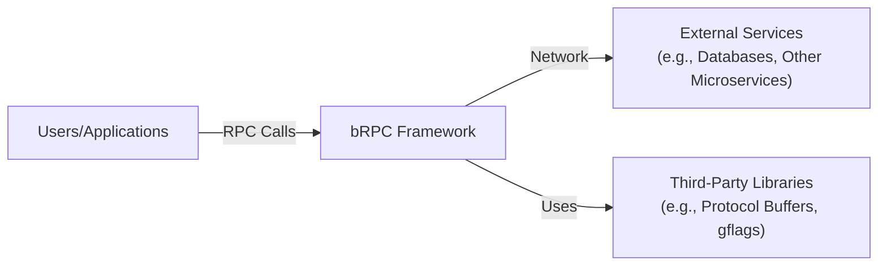
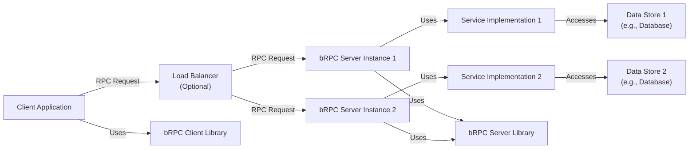
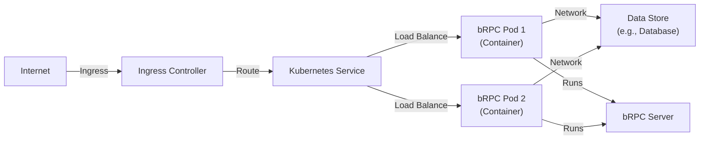
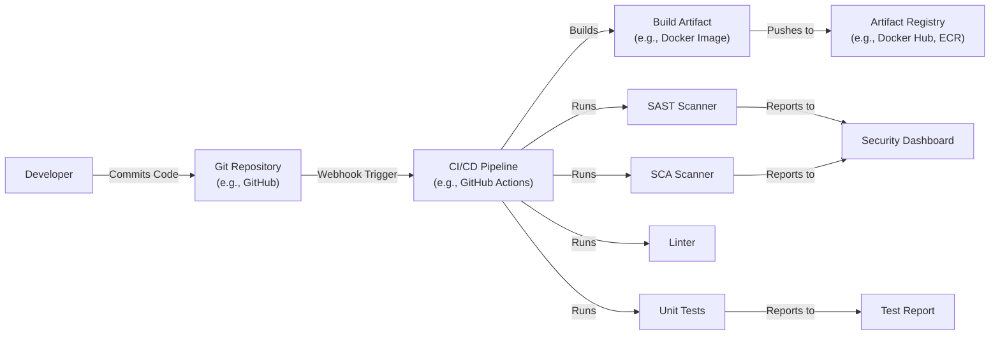

Okay, let's create a design document for the Apache bRPC project.

# BUSINESS POSTURE

Business Priorities and Goals:

*   Provide a high-performance, low-latency RPC framework.
*   Offer a robust and reliable solution for building distributed systems.
*   Support multiple programming languages (primarily C++, with potential for others).
*   Be easy to use and integrate into existing systems.
*   Maintain an active and supportive open-source community.
*   Reduce development time and operational costs for building distributed applications.

Most Important Business Risks:

*   Service disruption or unavailability due to software defects or infrastructure failures.
*   Performance bottlenecks impacting application responsiveness and user experience.
*   Security vulnerabilities leading to data breaches or unauthorized access.
*   Complexity hindering adoption and increasing the learning curve for developers.
*   Lack of community support and contribution, leading to project stagnation.
*   Incompatibility with evolving technologies and standards.

# SECURITY POSTURE

Existing Security Controls:

*   security control: The project uses CMake for build configuration, which can help manage dependencies and build settings securely. (Described in the build system documentation).
*   security control: The project includes unit tests and continuous integration (CI) to identify and prevent regressions, including potential security flaws. (Described in the testing and CI setup).
*   security control: The documentation provides guidance on safe usage and potential security considerations. (Described in various parts of the official documentation).
*   security control: bRPC uses Protocol Buffers for serialization, which, when used correctly, can help prevent some injection vulnerabilities. (Described in serialization related documentation).

Accepted Risks:

*   accepted risk: The project relies on third-party libraries (e.g., Protocol Buffers, gflags), which may have their own vulnerabilities. Mitigation is through timely updates and monitoring of these dependencies.
*   accepted risk: The project is primarily focused on performance, and some security features might be optional or require explicit configuration.
*   accepted risk: The project is under active development, and new vulnerabilities might be discovered. The community relies on prompt reporting and patching.

Recommended Security Controls:

*   security control: Integrate Static Application Security Testing (SAST) tools into the CI pipeline to automatically scan for common vulnerabilities.
*   security control: Conduct regular security audits and penetration testing to identify and address potential weaknesses.
*   security control: Implement a clear vulnerability disclosure and management process.
*   security control: Provide detailed security documentation, including best practices for secure configuration and deployment.
*   security control: Consider adding support for authentication and authorization mechanisms (e.g., TLS, OAuth, SPIFFE/SPIRE).
*   security control: Implement fuzz testing to identify edge cases and potential vulnerabilities related to input handling.
*   security control: Implement Software Composition Analysis (SCA) to identify and manage vulnerabilities in third-party dependencies.

Security Requirements:

*   Authentication:
    *   The framework should provide mechanisms for authenticating clients and servers. This could include TLS mutual authentication, API keys, or integration with existing identity providers.
*   Authorization:
    *   The framework should support authorization mechanisms to control access to specific services and methods. This could involve role-based access control (RBAC) or attribute-based access control (ABAC).
*   Input Validation:
    *   All input received from clients should be strictly validated to prevent injection attacks and other vulnerabilities. This includes validating data types, lengths, and formats. Protocol Buffers help with this, but additional checks might be needed.
*   Cryptography:
    *   Sensitive data transmitted between clients and servers should be encrypted using strong cryptographic algorithms (e.g., TLS 1.3 or higher).
    *   Cryptographic keys should be managed securely, following best practices for key generation, storage, and rotation.
*   Data validation:
    *   All data should be validated before processing.

# DESIGN

## C4 CONTEXT

Element Descriptions:

*   Element:
    *   Name: Users/Applications
    *   Type: External Entity (User or System)
    *   Description: Represents the users or applications that interact with the bRPC framework to make RPC calls.
    *   Responsibilities: Initiates RPC requests, handles responses, and manages application-specific logic.
    *   Security controls: Authentication and authorization mechanisms (if implemented in the application layer), input validation, secure communication channels (e.g., TLS).

*   Element:
    *   Name: bRPC Framework
    *   Type: System
    *   Description: The core bRPC framework, providing the infrastructure for building distributed applications.
    *   Responsibilities: Handles RPC request/response serialization, transport, service discovery, load balancing, and other core RPC functionalities.
    *   Security controls: Input validation, potential support for authentication and authorization (currently limited, but recommended), secure communication (e.g., TLS, if configured).

*   Element:
    *   Name: External Services
    *   Type: External System
    *   Description: Represents external services that the bRPC framework might interact with, such as databases, other microservices, or third-party APIs.
    *   Responsibilities: Provides specific functionalities or data required by the bRPC-based applications.
    *   Security controls: Dependent on the specific external service; should ideally implement secure communication, authentication, and authorization.

*   Element:
    *   Name: Third-Party Libraries
    *   Type: External Dependency
    *   Description: Libraries that bRPC depends on, such as Protocol Buffers and gflags.
    *   Responsibilities: Provide specific functionalities utilized by bRPC (e.g., serialization, command-line flag parsing).
    *   Security controls: Relies on the security of the third-party libraries themselves; regular updates and vulnerability monitoring are crucial.

## C4 CONTAINER

Element Descriptions:

*   Element:
    *   Name: Client Application
    *   Type: Application
    *   Description: The application that initiates RPC calls using the bRPC client library.
    *   Responsibilities: Constructs RPC requests, sends them to the server, and processes responses.
    *   Security controls: Input validation, authentication (if implemented), secure communication (e.g., TLS).

*   Element:
    *   Name: Load Balancer (Optional)
    *   Type: Infrastructure Component
    *   Description: Distributes incoming RPC requests across multiple server instances.
    *   Responsibilities: Forwards requests to available servers, potentially based on load or other factors.
    *   Security controls: May implement TLS termination, DDoS protection, and other security features.

*   Element:
    *   Name: bRPC Server Instance 1 & 2
    *   Type: Server Application
    *   Description: Instances of the server application running the bRPC server library and service implementations.
    *   Responsibilities: Receives RPC requests, dispatches them to the appropriate service implementation, and sends responses back to the client.
    *   Security controls: Input validation, authentication (if implemented), secure communication (e.g., TLS).

*   Element:
    *   Name: Service Implementation 1 & 2
    *   Type: Code Component
    *   Description: The actual implementation of the services provided by the server.
    *   Responsibilities: Executes the business logic associated with the RPC methods.
    *   Security controls: Input validation, data validation, secure access to data stores.

*   Element:
    *   Name: Data Store 1 & 2
    *   Type: Data Store
    *   Description: Databases or other storage systems used by the service implementations.
    *   Responsibilities: Stores and retrieves data required by the services.
    *   Security controls: Access control, encryption at rest, data integrity checks.

*   Element:
    *   Name: bRPC Client Library
    *   Type: Library
    *   Description: Provides the API for client applications to interact with bRPC servers.
    *   Responsibilities: Handles request serialization, transport, and response deserialization.
    *   Security controls: Secure communication (e.g., TLS, if configured).

*   Element:
    *   Name: bRPC Server Library
    *   Type: Library
    *   Description: Provides the API for server applications to handle RPC requests and manage services.
    *   Responsibilities: Handles request deserialization, service dispatch, and response serialization.
    *   Security controls: Secure communication (e.g., TLS, if configured).

## DEPLOYMENT

Possible Deployment Solutions:

1.  Bare Metal: Deploying bRPC server instances directly on physical servers.
2.  Virtual Machines: Deploying bRPC server instances within virtual machines (e.g., using KVM, VMware, or cloud providers like AWS EC2, Google Compute Engine, Azure VMs).
3.  Containers: Deploying bRPC server instances within containers (e.g., using Docker) orchestrated by a container orchestration platform (e.g., Kubernetes, Docker Swarm).
4.  Serverless (Limited Applicability): While bRPC is primarily designed for long-running server processes, certain components or helper functions could potentially be deployed as serverless functions.

Chosen Solution: Containers (Kubernetes)

Element Descriptions:

*   Element:
    *   Name: Internet
    *   Type: External Entity
    *   Description: The public internet.
    *   Responsibilities: Source of incoming traffic.
    *   Security controls: Firewall, DDoS protection (typically provided by the cloud provider or infrastructure).

*   Element:
    *   Name: Ingress Controller
    *   Type: Infrastructure Component
    *   Description: Manages external access to the Kubernetes services.
    *   Responsibilities: Routes incoming traffic to the appropriate Kubernetes service based on rules.
    *   Security controls: TLS termination, potentially web application firewall (WAF) capabilities.

*   Element:
    *   Name: Kubernetes Service
    *   Type: Kubernetes Resource
    *   Description: Provides a stable endpoint for accessing the bRPC pods.
    *   Responsibilities: Load balances traffic across the bRPC pods.
    *   Security controls: Network policies (within Kubernetes).

*   Element:
    *   Name: bRPC Pod 1 & 2
    *   Type: Kubernetes Resource
    *   Description: Instances of the bRPC server application running within containers.
    *   Responsibilities: Handles RPC requests.
    *   Security controls: Container image security (scanning for vulnerabilities), resource limits, network policies.

*   Element:
    *   Name: Data Store
    *   Type: External System/Database
    *   Description: The database or other storage system used by the bRPC service.
    *   Responsibilities: Stores and retrieves data.
    *   Security controls: Access control, encryption at rest, network security.
*   Element:
    *   Name: bRPC Server
    *   Type: Application
    *   Description: bRPC server application.
    *   Responsibilities: Handles RPC requests.
    *   Security controls: Input validation, authentication (if implemented), secure communication (e.g., TLS).

## BUILD

Build Process Description:

1.  Developers commit code to a Git repository (e.g., GitHub, GitLab).
2.  A webhook triggers the CI/CD pipeline (e.g., GitHub Actions, Jenkins, CircleCI).
3.  The CI/CD pipeline checks out the code.
4.  The CI/CD pipeline runs a linter to enforce code style and identify potential issues.
5.  The CI/CD pipeline runs unit tests to verify the functionality of individual components.
6.  The CI/CD pipeline runs a SAST scanner (e.g., SonarQube, FindBugs) to identify potential security vulnerabilities in the code.
7.  The CI/CD pipeline runs an SCA scanner (e.g., Snyk, Dependabot) to identify vulnerabilities in third-party dependencies.
8.  If all checks pass, the CI/CD pipeline builds the application (e.g., compiles the code, creates a Docker image).
9.  The build artifact (e.g., Docker image) is pushed to an artifact registry (e.g., Docker Hub, Amazon ECR, Google Container Registry).
10. SAST and SCA scanners report their findings to a security dashboard for review and remediation.
11. Unit tests report to Test Report dashboard.

Security Controls:

*   security control: Linting: Enforces code style and helps prevent common coding errors that could lead to vulnerabilities.
*   security control: Unit Tests: Verify the functionality of individual components and help prevent regressions.
*   security control: SAST Scanning: Automatically identifies potential security vulnerabilities in the source code.
*   security control: SCA Scanning: Automatically identifies vulnerabilities in third-party dependencies.
*   security control: Build Automation: Ensures a consistent and repeatable build process, reducing the risk of manual errors.
*   security control: Artifact Registry: Provides a secure and controlled environment for storing build artifacts.

# RISK ASSESSMENT

Critical Business Processes:

*   RPC communication between services: The core functionality of bRPC is to enable reliable and efficient communication between different services. Disruption of this process would directly impact the functionality of applications built on bRPC.
*   Service availability: Applications relying on bRPC need the services to be available and responsive. Downtime or performance degradation would negatively affect user experience and potentially business operations.

Data Sensitivity:

*   The sensitivity of the data handled by bRPC depends on the specific applications using it.
*   If bRPC is used to transmit sensitive data (e.g., personally identifiable information (PII), financial data, health information), then protecting the confidentiality, integrity, and availability of that data is critical.
*   Even if the data itself is not inherently sensitive, unauthorized access or modification could still disrupt services or lead to other security issues.

# QUESTIONS & ASSUMPTIONS

Questions:

*   What specific authentication and authorization mechanisms are planned or desired for bRPC?
*   What are the performance requirements and targets for bRPC (e.g., latency, throughput)?
*   What are the expected deployment environments (e.g., cloud providers, on-premises)?
*   What level of logging and monitoring is required for auditing and troubleshooting?
*   Are there any specific compliance requirements (e.g., GDPR, HIPAA) that need to be considered?
*   What is the process for handling security vulnerabilities discovered in bRPC or its dependencies?

Assumptions:

*   BUSINESS POSTURE: The primary goal is to provide a high-performance RPC framework, with security being a critical but potentially secondary consideration in some design choices.
*   SECURITY POSTURE: Basic security practices are followed (e.g., input validation, use of Protocol Buffers), but advanced security features (e.g., authentication, authorization) might not be fully implemented or require explicit configuration.
*   DESIGN: The deployment environment will be containerized (Kubernetes), and the build process will be automated using a CI/CD pipeline. The system will interact with external services and use third-party libraries.