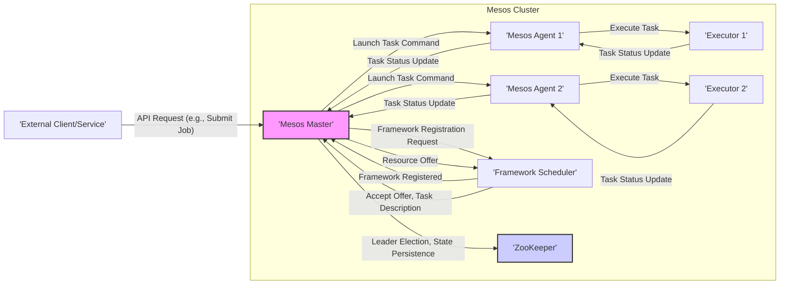

# Project Design Document: Apache Mesos for Threat Modeling

**Version:** 1.1
**Date:** October 26, 2023
**Author:** Gemini (Large Language Model)

## 1. Introduction

This document provides a detailed design overview of the Apache Mesos project, specifically tailored for use in subsequent threat modeling activities. It outlines the key components, their interactions, and data flows within the Mesos architecture, with a strong emphasis on security-relevant aspects. This document aims to provide a clear and comprehensive understanding of the system's structure and functionality from a security perspective, enabling effective threat identification and mitigation planning.

### 1.1. Purpose

The primary purpose of this document is to serve as a foundational resource for identifying potential security vulnerabilities and threats within the Apache Mesos ecosystem. It will be used as a key input for threat modeling exercises, enabling a thorough analysis of the attack surface, potential attack vectors, and the impact of potential security breaches.

### 1.2. Scope

This document covers the core components of the Apache Mesos project, including the Master, Agents, Frameworks, Executors, and the role of ZooKeeper. It focuses on the logical architecture, key interactions, and data flows between these components. While external integrations are mentioned where relevant to the core Mesos operation, detailed analysis of specific framework implementations or external systems is generally considered out of scope.

### 1.3. Target Audience

This document is intended for security engineers, security architects, software developers, and DevOps personnel involved in threat modeling, security assessments, penetration testing, and the overall security posture management of systems utilizing Apache Mesos.

## 2. Overview of Apache Mesos

Apache Mesos is a distributed systems kernel that abstracts compute resources (CPU, memory, etc.) from a cluster of machines, making them available to various application frameworks. It enables the efficient sharing and dynamic allocation of resources, allowing for the development and operation of fault-tolerant and scalable distributed applications. Mesos acts as an intermediary between the cluster's resources and the applications running on it.

## 3. Architectural Design

The Mesos architecture is characterized by a central master process that coordinates agent processes running on individual nodes. Application frameworks register with the master to request resources, which the master offers based on availability. Frameworks then launch tasks on the agents using these allocated resources.

### 3.1. Key Components

*   **Mesos Master:** The central control plane of the Mesos cluster. Its responsibilities include:
    *   **Resource Management and Allocation:**  Tracking available resources across all agent nodes and making decisions on how to allocate them to frameworks.
    *   **State Management:** Maintaining the current state of the cluster, including registered agents, active frameworks, and running tasks.
    *   **Resource Offerings:** Periodically offering available resources to registered frameworks based on predefined policies (e.g., Dominant Resource Fairness).
    *   **Task Management:** Receiving task launch requests from frameworks and instructing agents to execute them.
    *   **Agent Management:** Monitoring the health and status of registered agents.
    *   **Leader Election:**  Utilizing ZooKeeper to elect a single active master in a high-availability setup. This is critical for maintaining consistency and preventing split-brain scenarios.
*   **Mesos Agent:** Runs on each worker node in the cluster and is responsible for:
    *   **Registration:** Registering with the Mesos Master upon startup, providing information about its available resources.
    *   **Resource Reporting:** Continuously reporting its available resources and their status to the Master.
    *   **Task Execution:** Launching and managing tasks assigned by the Master, often using executors.
    *   **Resource Isolation:** Providing isolation between tasks running on the same agent node to prevent interference and ensure resource limits are respected (typically using technologies like Linux containers and cgroups).
    *   **Status Updates:** Reporting the status of running tasks back to the Master.
*   **Framework Scheduler:** An external component that interacts with the Mesos Master to manage the lifecycle of applications. Examples include Apache Spark, Apache Flink, and Marathon. The scheduler is responsible for:
    *   **Registration:** Registering with the Mesos Master to indicate its interest in receiving resource offers.
    *   **Resource Offer Evaluation:** Receiving resource offers from the Master and deciding which offers to accept based on its application's requirements.
    *   **Task Definition:** Defining the tasks to be launched, including resource requirements, command to execute, and environment variables.
    *   **Task Launch Requests:** Sending task launch requests to the Master for execution on specific agents.
    *   **Task Monitoring:** Tracking the status of its launched tasks and handling failures or restarts.
*   **Executor:** A process running on an agent node that is responsible for actually launching and managing the execution of individual tasks. Executors are typically provided by the framework and are specific to the type of workload being run (e.g., a Docker container executor, a JVM executor).
*   **ZooKeeper:** A distributed coordination service crucial for the operation of a fault-tolerant Mesos cluster. It is used for:
    *   **Leader Election:** Ensuring that only one Mesos Master is active at any given time.
    *   **State Storage:** Persisting the cluster state, including information about agents, frameworks, and tasks, allowing the system to recover from Master failures.
    *   **Configuration Management:** Storing configuration information that can be accessed by Mesos components.
*   **External Services/Clients:** Entities that interact with the Mesos cluster through its APIs. This includes:
    *   **Command-Line Interface (CLI):** Tools for interacting with the Mesos Master to manage the cluster and inspect its state.
    *   **Web UI:** A graphical interface for monitoring the cluster, viewing resource utilization, and inspecting task status.
    *   **REST APIs:** Programmatic interfaces for interacting with the Mesos Master, allowing external systems to submit jobs, monitor resources, and manage the cluster.

### 3.2. Component Interactions (Mermaid Flowchart)

### 3.3. Data Flow

The primary data flows within a Mesos cluster involve:

*   **Framework Registration Data:** Framework schedulers send registration requests to the Mesos Master, including details about their name, user, and potentially authentication credentials.
*   **Resource Offer Data:** The Mesos Master sends resource offers to registered frameworks, detailing the available resources (CPU, memory, ports, etc.) on specific agent nodes.
*   **Task Description Data:** Framework schedulers send task launch requests to the Master, specifying the task's command, resource requirements, environment variables, and potentially container images or other execution parameters.
*   **Task Execution Data:** The Master sends commands to agents instructing them to launch specific tasks, including the task description and executor information.
*   **Task Status Update Data:** Agents and executors send status updates about running tasks back to the Master and the originating framework, including information about the task's state (e.g., running, finished, failed), resource usage, and any error messages.
*   **Cluster State Data:** The Mesos Master persists the cluster state (including agent availability, resource allocation, framework registrations, and task status) in ZooKeeper. This data includes sensitive information about the cluster's configuration and running applications.
*   **External API Request/Response Data:** External clients and services interact with the Mesos Master through its APIs, exchanging data related to cluster monitoring, job submission, and resource management. This data can include authentication tokens, job configurations, and sensitive application data.

## 4. Security Considerations

This section outlines key security considerations relevant to the Mesos architecture, providing a basis for identifying potential threats and vulnerabilities.

*   **Authentication and Authorization:**
    *   **Framework Authentication:** How are frameworks authenticated when registering with the Master? Are strong authentication mechanisms enforced to prevent unauthorized frameworks from joining the cluster?
    *   **API Access Control:** How is access to the Mesos APIs controlled for external clients? Are appropriate authentication and authorization mechanisms in place to prevent unauthorized access and manipulation of the cluster?
    *   **Task Authorization:** How are tasks authorized to access resources on agent nodes? Are there mechanisms to prevent tasks from accessing resources they are not authorized to use?
*   **Inter-Component Communication Security:**
    *   **Master-Agent Communication:** Is communication between the Master and Agents encrypted (e.g., using TLS/SSL)? Is mutual authentication enforced to prevent man-in-the-middle attacks and ensure only authorized components are communicating?
    *   **Data Integrity:** How is the integrity of data exchanged between components ensured? Are message signing or other mechanisms used to prevent tampering?
*   **Task Isolation:**
    *   **Containerization Security:** How are tasks isolated from each other on the same agent node? Are robust containerization technologies (e.g., Docker with appropriate security configurations) used to prevent container escape and cross-container interference?
    *   **Resource Limits:** Are resource limits (CPU, memory, etc.) enforced effectively to prevent resource exhaustion attacks by malicious or poorly behaving tasks?
    *   **Security Context:** Are appropriate security contexts (e.g., user namespaces, seccomp profiles) applied to tasks to limit their privileges and access to system resources?
*   **Master Election Security:**
    *   **ZooKeeper Security:** How is the security of the ZooKeeper quorum ensured? Is access to ZooKeeper restricted to authorized Mesos components? Is authentication and authorization enforced for ZooKeeper clients?
    *   **Preventing Malicious Leader Election:** Are there mechanisms to prevent a malicious actor from gaining control of the Master role through manipulation of the leader election process?
*   **Data Security:**
    *   **Sensitive Data Handling:** How is sensitive data (e.g., task configurations, secrets, application data) handled and protected within the Mesos cluster? Is data encrypted at rest and in transit?
    *   **Secret Management:** How are secrets (e.g., API keys, passwords) securely managed and provisioned to tasks? Are secure secret management solutions integrated with Mesos?
*   **Network Security:**
    *   **Network Segmentation:** Is the Mesos cluster segmented from other networks to limit the impact of potential breaches?
    *   **Firewall Rules:** Are appropriate firewall rules in place to restrict network access to the Mesos Master and Agents to only necessary ports and protocols?
    *   **Service Exposure:** Are Mesos services exposed to the public internet unnecessarily?
*   **Supply Chain Security:**
    *   **Binary Verification:** How is the integrity and authenticity of Mesos binaries and dependencies verified? Are checksums or digital signatures used to ensure that components have not been tampered with?
*   **API Security:**
    *   **Input Validation:** Are the Mesos APIs robust against common web application attacks, such as injection vulnerabilities (e.g., SQL injection, command injection)? Is input data properly validated and sanitized?
    *   **Rate Limiting:** Are there rate limiting mechanisms in place to prevent abuse of the APIs and denial-of-service attacks?
    *   **Authentication and Authorization (Revisited):**  Ensuring strong authentication and authorization for all API endpoints is critical.

## 5. Assumptions and Constraints

*   This design document focuses on the core Mesos architecture and assumes a typical deployment model.
*   Specific security configurations and policies are assumed to be implemented and maintained by the operators of the Mesos cluster.
*   The document assumes the use of a currently supported and patched version of Apache Mesos.
*   Details of specific framework implementations are generally excluded, as their security characteristics are largely independent of the core Mesos project.

## 6. Out of Scope

The following are considered out of scope for this design document:

*   Detailed security analysis of specific Mesos frameworks (e.g., Spark, Flink).
*   Implementation-level details of individual Mesos modules or code.
*   Specific deployment configurations, infrastructure setup, and networking topologies.
*   Security policies and operational procedures implemented by users of the Mesos cluster.
*   Performance considerations, scalability analysis, and high-availability configurations (beyond the basic role of ZooKeeper).

## 7. Conclusion

This document provides an enhanced and more detailed overview of the Apache Mesos architecture, with a specific focus on security considerations relevant for threat modeling. By outlining the key components, their interactions, and data flows, and by highlighting potential security concerns, this document serves as a valuable resource for identifying and mitigating security risks associated with deploying and operating Apache Mesos. The information presented here will enable more effective threat modeling exercises and contribute to a stronger security posture for Mesos-based systems.