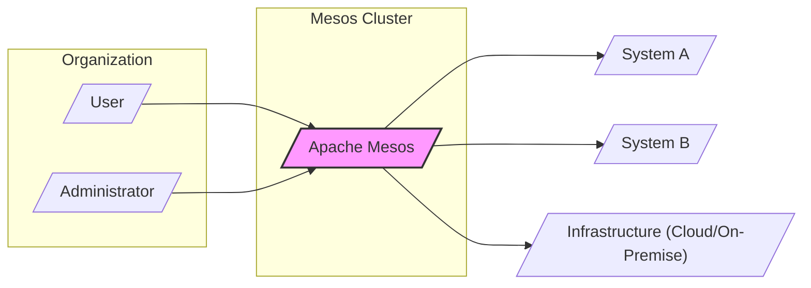
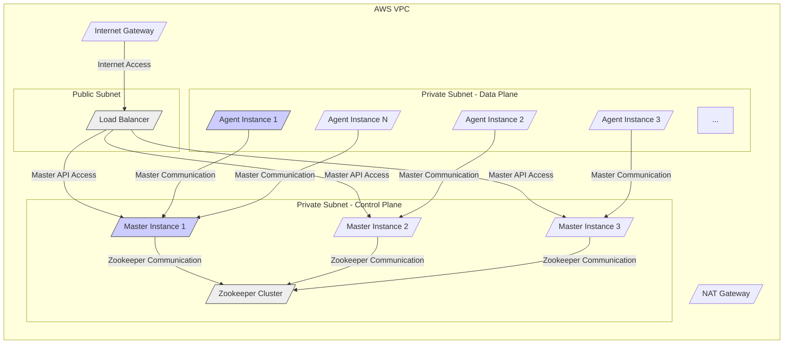
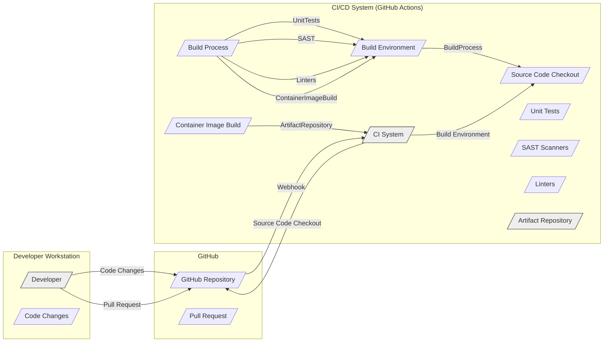

# BUSINESS POSTURE

The Apache Mesos project aims to provide a distributed systems kernel. It abstracts CPU, memory, storage, and other compute resources away from machines, enabling fault-tolerant and elastic distributed systems to be easily built and run. The primary business priority is to offer a robust and scalable platform for running diverse workloads efficiently across a cluster of machines. Goals include maximizing resource utilization, enabling application isolation, and simplifying the management of distributed applications.

Most important business risks that need to be addressed:
- Risk of system instability or failure due to software bugs or design flaws, leading to service disruptions for applications running on Mesos.
- Risk of resource contention or starvation, where one application negatively impacts the performance or availability of others.
- Risk of security vulnerabilities in Mesos itself or in the applications it manages, potentially leading to data breaches or unauthorized access.
- Risk of operational complexity in managing and maintaining a Mesos cluster, requiring specialized expertise and potentially leading to misconfigurations or downtime.
- Risk of vendor lock-in if Mesos becomes tightly integrated with specific infrastructure or application stacks.

# SECURITY POSTURE

Existing security controls:
- security control Access control lists (ACLs) for authorization of operations within Mesos. (Location: Mesos documentation and code)
- security control Authentication mechanisms for Mesos components to verify identities. (Location: Mesos documentation and code)
- security control Resource isolation mechanisms (e.g., Linux containers, namespaces) to prevent applications from interfering with each other. (Location: Mesos documentation and code)
- security control Security audits and vulnerability scanning as part of the development process. (Location: Assumed best practice for open-source projects like Apache Mesos)

Accepted risks:
- accepted risk Complexity of security configuration and management in a distributed environment.
- accepted risk Potential for misconfigurations leading to security vulnerabilities.
- accepted risk Reliance on underlying infrastructure security (e.g., operating system, network).

Recommended security controls:
- security control Implement comprehensive logging and monitoring of security-relevant events for auditing and incident response.
- security control Regularly perform penetration testing and security assessments to identify and address vulnerabilities.
- security control Enhance input validation and sanitization across all Mesos components to prevent injection attacks.
- security control Implement encryption for sensitive data in transit and at rest within the Mesos cluster.
- security control Strengthen supply chain security for dependencies and build processes to mitigate risks of compromised components.

Security requirements:
- Authentication:
    - Requirement: Mesos components (masters, agents, frameworks) must mutually authenticate each other to establish secure communication channels.
    - Requirement: Users and administrators interacting with Mesos should be authenticated to verify their identity.
    - Requirement: Support for industry-standard authentication protocols (e.g., Kerberos, OAuth 2.0, TLS client certificates).
- Authorization:
    - Requirement: Fine-grained authorization mechanisms to control access to Mesos resources and operations based on user roles and permissions.
    - Requirement: Policy enforcement to ensure that only authorized frameworks and users can perform actions like launching tasks, allocating resources, or accessing sensitive data.
    - Requirement: Role-Based Access Control (RBAC) to simplify management of user permissions.
- Input validation:
    - Requirement: Rigorous input validation and sanitization for all data received by Mesos components to prevent injection attacks (e.g., command injection, SQL injection, cross-site scripting).
    - Requirement: Input validation should be applied at multiple layers, including API endpoints, configuration files, and internal component communication.
    - Requirement: Use of secure coding practices to minimize vulnerabilities related to input handling.
- Cryptography:
    - Requirement: Encryption of sensitive data in transit using TLS/SSL for communication between Mesos components and with external systems.
    - Requirement: Encryption of sensitive data at rest, such as secrets, credentials, and application data stored within Mesos.
    - Requirement: Secure key management practices for cryptographic keys used for encryption and authentication.
    - Requirement: Use of strong and up-to-date cryptographic algorithms and libraries.

# DESIGN

## C4 CONTEXT



Context Diagram Elements:

- Element:
    - Name: User
    - Type: Person
    - Description: End-users who interact with applications running on the Mesos cluster.
    - Responsibilities: Accessing and using applications deployed on Mesos.
    - Security controls: Authentication to applications, application-level authorization.
- Element:
    - Name: Administrator
    - Type: Person
    - Description: Operators responsible for managing and maintaining the Mesos cluster.
    - Responsibilities: Cluster setup, configuration, monitoring, troubleshooting, security management.
    - Security controls: Strong authentication and authorization to Mesos management interfaces, audit logging of administrative actions.
- Element:
    - Name: Apache Mesos
    - Type: Software System
    - Description: The Apache Mesos cluster manager, providing resource abstraction and scheduling for distributed applications.
    - Responsibilities: Resource management, task scheduling, fault tolerance, application isolation.
    - Security controls: Authentication, authorization, resource isolation, input validation, secure communication, audit logging.
- Element:
    - Name: System A, System B
    - Type: Software System
    - Description: Example distributed applications or frameworks running on top of Mesos (e.g., Hadoop, Spark, Kubernetes, custom applications).
    - Responsibilities: Performing specific business functions, utilizing resources provided by Mesos.
    - Security controls: Application-level authentication, authorization, input validation, data encryption, secure configuration.
- Element:
    - Name: Infrastructure (Cloud/On-Premise)
    - Type: Infrastructure
    - Description: Underlying infrastructure (physical servers, virtual machines, cloud instances, network) where the Mesos cluster is deployed.
    - Responsibilities: Providing compute, storage, and network resources for Mesos.
    - Security controls: Physical security, network security, operating system security, infrastructure access controls, monitoring.

## C4 CONTAINER

```mermaid
flowchart LR
    subgraph "Mesos Cluster"
        subgraph "Mesos Master"
            MasterProcess[/"Master Process"/]
            Scheduler[/"Scheduler (Pluggable)"/]
            Allocator[/"Allocator"/]
            Registry[/"Registry (State Store)"/]
            API[/"Master API"/]
        end
        subgraph "Mesos Agent"
            AgentProcess[/"Agent Process"/]
            Executor[/"Executor (Containerizer)"/]
            ResourceProviders[/"Resource Providers"/]
            AgentAPI[/"Agent API"/]
        end
        Framework[/"Framework (e.g., Spark, Hadoop)"/]
        Zookeeper[/"Zookeeper (Coordination)"/]
    end
    MasterProcess -- "API Calls" --> AgentProcess
    MasterProcess -- "State Updates" --> Registry
    MasterProcess -- "Coordination" --> Zookeeper
    Framework -- "Resource Offers, Task Launch" --> MasterProcess
    AgentProcess -- "Task Status Updates" --> MasterProcess
    AgentProcess -- "Resource Reporting" --> MasterProcess
    API -- User
    AgentAPI -- AgentProcess

    style MasterProcess fill:#ccf,stroke:#333,stroke-width:1px
    style AgentProcess fill:#ccf,stroke:#333,stroke-width:1px
    style Framework fill:#eee,stroke:#333,stroke-width:1px
    style Zookeeper fill:#eee,stroke:#333,stroke-width:1px
```

Container Diagram Elements:

- Element:
    - Name: Master Process
    - Type: Container/Process
    - Description: The central control plane of Mesos, responsible for resource management, scheduling, and cluster state management.
    - Responsibilities: Resource offer generation, task scheduling, framework management, agent management, cluster state persistence.
    - Security controls: Authentication of agents and frameworks, authorization of framework operations, secure communication with agents and Zookeeper, access control to Master API, audit logging.
- Element:
    - Name: Agent Process
    - Type: Container/Process
    - Description: Runs on each node in the Mesos cluster, responsible for resource provisioning and task execution.
    - Responsibilities: Resource reporting to the master, task execution (using executors), resource isolation, containerization.
    - Security controls: Authentication to the master, authorization of master commands, resource isolation (using containerization), input validation for task parameters, secure communication with master, access control to Agent API.
- Element:
    - Name: Scheduler (Pluggable)
    - Type: Component within Master Process
    - Description: Determines how resources are allocated to frameworks based on various scheduling policies.
    - Responsibilities: Implementing scheduling algorithms, resource allocation decisions.
    - Security controls: Secure configuration of scheduling policies, protection against denial-of-service through resource exhaustion.
- Element:
    - Name: Allocator
    - Type: Component within Master Process
    - Description: Component within the Master responsible for resource allocation strategy.
    - Responsibilities: Resource allocation strategy implementation.
    - Security controls: Secure configuration of allocation strategies, protection against unfair resource distribution.
- Element:
    - Name: Registry (State Store)
    - Type: Data Store
    - Description: Persistent storage for Mesos cluster state, including framework information, agent status, and task metadata. Typically implemented using replicated logs or distributed databases.
    - Responsibilities: Persistent storage of cluster state, ensuring data consistency and fault tolerance.
    - Security controls: Access control to the state store, encryption of sensitive data at rest, data integrity checks, backup and recovery mechanisms.
- Element:
    - Name: API (Master API, Agent API)
    - Type: Interface
    - Description: RESTful APIs exposed by Mesos Master and Agent for management and interaction.
    - Responsibilities: Providing interfaces for users, administrators, and frameworks to interact with Mesos.
    - Security controls: Authentication and authorization for API access, input validation for API requests, rate limiting, API security best practices (e.g., TLS encryption).
- Element:
    - Name: Executor (Containerizer)
    - Type: Component within Agent Process
    - Description: Responsible for launching and managing tasks within containers on Mesos agents. Containerizers like Docker or Mesos containers are used.
    - Responsibilities: Task lifecycle management, container creation and management, resource isolation enforcement.
    - Security controls: Secure container runtime configuration, container image security scanning, resource limits enforcement, isolation between containers.
- Element:
    - Name: Resource Providers
    - Type: Component within Agent Process
    - Description: Modules within the Agent that provide access to various types of resources (CPU, memory, GPU, custom resources).
    - Responsibilities: Resource discovery, resource provisioning to executors.
    - Security controls: Access control to resources, resource quota enforcement.
- Element:
    - Name: Framework (e.g., Spark, Hadoop)
    - Type: Software System
    - Description: Distributed application frameworks that run on top of Mesos, utilizing its resource management capabilities.
    - Responsibilities: Application logic execution, task management within the framework, interaction with Mesos for resource allocation.
    - Security controls: Framework-level authentication and authorization, secure application configuration, input validation, data encryption.
- Element:
    - Name: Zookeeper (Coordination)
    - Type: Software System
    - Description: Distributed coordination service used by Mesos for leader election, configuration management, and distributed synchronization.
    - Responsibilities: Leader election for Mesos masters, distributed consensus, configuration storage.
    - Security controls: Access control to Zookeeper, authentication of Mesos components, secure communication with Mesos masters, audit logging.

## DEPLOYMENT

Deployment Solution: Cloud-based Mesos Cluster on AWS



Deployment Diagram Elements:

- Element:
    - Name: AWS VPC
    - Type: Infrastructure Component
    - Description: Amazon Virtual Private Cloud, providing a logically isolated network in the cloud.
    - Responsibilities: Network isolation, security group enforcement, routing.
    - Security controls: Network Access Control Lists (NACLs), Security Groups, VPC Flow Logs.
- Element:
    - Name: Public Subnet
    - Type: Network Subnet
    - Description: Subnet within the VPC with internet access via Internet Gateway.
    - Responsibilities: Hosting public-facing components like Load Balancer.
    - Security controls: Security Groups, NACLs, limited exposure to the internet.
- Element:
    - Name: Load Balancer
    - Type: Infrastructure Component
    - Description: AWS Elastic Load Balancer, distributing traffic to Mesos Master instances.
    - Responsibilities: Load balancing, high availability for Master API access, TLS termination.
    - Security controls: HTTPS listener, security groups, access logs.
- Element:
    - Name: Private Subnet - Control Plane
    - Type: Network Subnet
    - Description: Private subnet for Mesos Master and Zookeeper instances, isolated from direct internet access.
    - Responsibilities: Hosting control plane components, providing secure communication within the control plane.
    - Security controls: Security Groups, NACLs, no direct internet access, network segmentation.
- Element:
    - Name: Master Instance 1, 2, 3
    - Type: Compute Instance (EC2)
    - Description: EC2 instances running Mesos Master processes for high availability.
    - Responsibilities: Master process functionalities (scheduling, resource management), cluster control plane.
    - Security controls: Instance-level firewall, OS hardening, access control, security monitoring, encryption at rest (EBS).
- Element:
    - Name: Zookeeper Cluster
    - Type: Clustered Application
    - Description: Cluster of Zookeeper instances for coordination and state management of Mesos Masters.
    - Responsibilities: Leader election, distributed consensus, configuration storage.
    - Security controls: Access control lists (ACLs), authentication, secure communication between Zookeeper nodes, data encryption at rest (EBS).
- Element:
    - Name: Private Subnet - Data Plane
    - Type: Network Subnet
    - Description: Private subnet for Mesos Agent instances, isolated from direct internet access.
    - Responsibilities: Hosting data plane components (Agents), providing secure communication within the data plane and with control plane.
    - Security controls: Security Groups, NACLs, no direct internet access, network segmentation.
- Element:
    - Name: Agent Instance 1...N
    - Type: Compute Instance (EC2)
    - Description: EC2 instances running Mesos Agent processes, providing compute resources for applications.
    - Responsibilities: Agent process functionalities (resource reporting, task execution), data plane operations.
    - Security controls: Instance-level firewall, OS hardening, access control, security monitoring, encryption at rest (EBS), resource isolation mechanisms.
- Element:
    - Name: Internet Gateway
    - Type: Infrastructure Component
    - Description: AWS Internet Gateway, enabling internet access for the VPC.
    - Responsibilities: Providing internet connectivity for public subnets.
    - Security controls: Limited direct exposure, managed by AWS.
- Element:
    - Name: NAT Gateway
    - Type: Infrastructure Component
    - Description: AWS NAT Gateway, enabling instances in private subnets to initiate outbound internet traffic.
    - Responsibilities: Allowing private instances to access the internet for updates and dependencies without direct public IP addresses.
    - Security controls: Managed by AWS, restricts inbound internet access to private subnets.

## BUILD



Build Process Elements:

- Element:
    - Name: Developer
    - Type: Person
    - Description: Software developers contributing to the Mesos project.
    - Responsibilities: Writing code, committing changes, creating pull requests.
    - Security controls: Secure development practices, code reviews, access control to development environment.
- Element:
    - Name: Code Changes
    - Type: Data
    - Description: Source code modifications made by developers.
    - Responsibilities: Implementing new features, fixing bugs, improving code quality.
    - Security controls: Version control (Git), code reviews, static analysis.
- Element:
    - Name: GitHub Repository
    - Type: Code Repository
    - Description: GitHub repository hosting the Mesos source code.
    - Responsibilities: Version control, code storage, collaboration platform.
    - Security controls: Access control, branch protection, audit logs, vulnerability scanning (GitHub Security Features).
- Element:
    - Name: Pull Request
    - Type: Process
    - Description: Mechanism for proposing code changes and initiating code review.
    - Responsibilities: Code review, collaboration, quality assurance.
    - Security controls: Code review process, branch protection, required approvals.
- Element:
    - Name: CI System (GitHub Actions)
    - Type: Automation System
    - Description: Continuous Integration system (e.g., GitHub Actions) automating the build, test, and security checks.
    - Responsibilities: Automated build, testing, security scanning, artifact publishing.
    - Security controls: Secure CI/CD pipeline configuration, access control to CI/CD system, secrets management, audit logs.
- Element:
    - Name: Build Environment
    - Type: Infrastructure
    - Description: Isolated environment where the build process is executed.
    - Responsibilities: Providing necessary tools and dependencies for building Mesos.
    - Security controls: Secure build environment configuration, access control, vulnerability scanning of build tools and dependencies.
- Element:
    - Name: Source Code Checkout
    - Type: Process
    - Description: Retrieving the latest source code from the GitHub repository.
    - Responsibilities: Obtaining the code to be built.
    - Security controls: Secure connection to the code repository, integrity checks.
- Element:
    - Name: Build Process
    - Type: Process
    - Description: Compilation, linking, and packaging of the Mesos software.
    - Responsibilities: Creating executable binaries and libraries.
    - Security controls: Secure build scripts, dependency management, build reproducibility.
- Element:
    - Name: Unit Tests
    - Type: Process
    - Description: Automated execution of unit tests to verify code functionality.
    - Responsibilities: Ensuring code quality and detecting regressions.
    - Security controls: Secure test environment, test coverage analysis.
- Element:
    - Name: SAST Scanners
    - Type: Security Tool
    - Description: Static Application Security Testing tools to identify potential vulnerabilities in the source code.
    - Responsibilities: Vulnerability detection, code security analysis.
    - Security controls: Regularly updated vulnerability rules, integration into CI/CD pipeline.
- Element:
    - Name: Linters
    - Type: Code Quality Tool
    - Description: Code linters to enforce coding standards and identify potential code quality issues.
    - Responsibilities: Code style enforcement, code quality improvement.
    - Security controls: Secure linter configurations, integration into CI/CD pipeline.
- Element:
    - Name: Container Image Build
    - Type: Process
    - Description: Building container images for Mesos components (e.g., Master, Agent).
    - Responsibilities: Creating deployable container images.
    - Security controls: Base image security scanning, minimal image construction, vulnerability scanning of final images, image signing.
- Element:
    - Name: Artifact Repository
    - Type: Data Store
    - Description: Repository for storing build artifacts, including binaries and container images (e.g., Docker Hub, GitHub Packages).
    - Responsibilities: Artifact storage, versioning, distribution.
    - Security controls: Access control to the repository, artifact integrity checks, vulnerability scanning of stored artifacts, secure artifact distribution.

# RISK ASSESSMENT

Critical business processes we are trying to protect:
- Availability and reliability of the Mesos cluster itself, as it underpins all applications running on it.
- Integrity and confidentiality of data processed by applications running on Mesos.
- Performance and efficiency of resource utilization within the cluster.
- Secure and authorized access to Mesos management interfaces and APIs.
- Secure execution of tasks and isolation between applications.

Data we are trying to protect and their sensitivity:
- Application data processed by frameworks running on Mesos: Sensitivity depends on the application, can range from public data to highly confidential data (e.g., financial transactions, personal information).
- Mesos cluster state data: Includes metadata about frameworks, tasks, agents, and resource allocations. Sensitivity is moderate, as unauthorized access could lead to cluster disruption or information disclosure about running applications.
- Mesos configuration data: Includes sensitive information like authentication credentials, API keys, and security policies. Sensitivity is high, as compromise could lead to full cluster control.
- Audit logs: Contain records of security-relevant events and user activities. Sensitivity is moderate to high, important for security monitoring and incident response.

# QUESTIONS & ASSUMPTIONS

Questions:
- What are the specific compliance requirements for the Mesos deployment environment (e.g., PCI DSS, HIPAA, GDPR)?
- What is the expected scale and performance requirements for the Mesos cluster?
- What are the specific types of applications and frameworks that will be running on Mesos?
- What is the organization's risk tolerance and security maturity level?
- Are there any existing security policies or standards that need to be adhered to?
- What is the process for incident response and security monitoring for the Mesos cluster?

Assumptions:
- The organization prioritizes security and availability for the Mesos platform.
- The Mesos cluster will be deployed in a cloud environment (AWS).
- Standard security best practices will be followed for infrastructure and application security.
- The organization has personnel with expertise in cloud infrastructure, distributed systems, and security.
- The project aims for a reasonably secure configuration out-of-the-box, but further hardening and customization might be required based on specific needs and risk assessment.