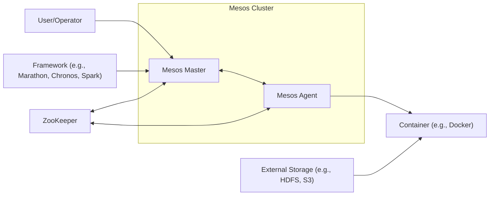
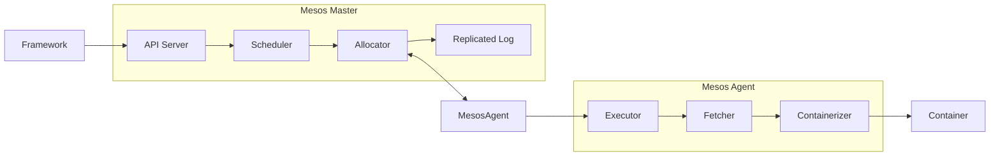
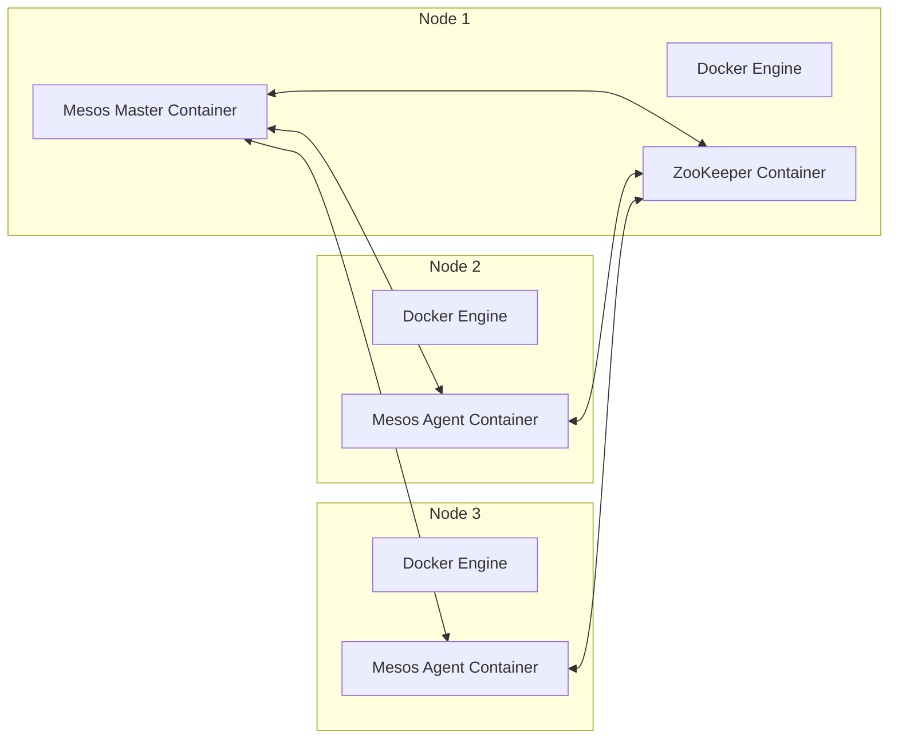

# BUSINESS POSTURE

Business Priorities and Goals:

*   Provide a highly available, scalable, and fault-tolerant platform for running distributed applications.
*   Efficiently utilize cluster resources, maximizing resource utilization and minimizing waste.
*   Support a wide variety of workloads, including long-running services, batch jobs, and real-time applications.
*   Enable resource sharing and isolation between different frameworks and applications.
*   Provide a stable and reliable API for application developers and framework authors.
*   Maintain backward compatibility and minimize disruptions during upgrades.
*   Foster an active open-source community and encourage contributions.

Business Risks:

*   System instability or failure leading to application downtime and data loss.
*   Inefficient resource allocation leading to wasted resources and increased costs.
*   Security vulnerabilities that could be exploited by malicious actors.
*   Lack of support for new workloads or technologies, limiting the platform's usefulness.
*   Complexity of the system, making it difficult to deploy, manage, and troubleshoot.
*   Competition from other cluster management solutions.

# SECURITY POSTURE

Existing Security Controls:

*   security control: Authentication: Mesos supports authentication of frameworks and operators using SASL (Simple Authentication and Security Layer). Kerberos and CRAM-MD5 mechanisms are supported. (See `docs/authentication.md`)
*   security control: Authorization: Mesos provides authorization mechanisms to control which frameworks can access which resources. Access control lists (ACLs) can be used to define fine-grained permissions. (See `docs/authorization.md`)
*   security control: Networking: Mesos supports CNI (Container Network Interface) for container networking, allowing for network isolation and security policies.
*   security control: Secrets Management: Mesos supports fetching secrets from various secret stores (e.g., environment variables, files, and external secret management systems) to securely provide sensitive information to tasks. (See `docs/secrets.md`)
*   security control: Containerization: Mesos leverages containerization technologies like Docker and Mesos containerizer to provide isolation between tasks.
*   security control: Resource quotas: Mesos allows setting resource quotas to limit the resources consumed by frameworks.
*   security control: Auditing: Mesos logs various events, which can be used for auditing and security analysis.

Accepted Risks:

*   accepted risk: The complexity of distributed systems introduces inherent security challenges.
*   accepted risk: Reliance on external components (e.g., ZooKeeper, Docker) introduces dependencies and potential vulnerabilities.
*   accepted risk: The open-source nature of the project means that vulnerabilities may be discovered and exploited before patches are available.

Recommended Security Controls:

*   security control: Implement regular security audits and penetration testing.
*   security control: Integrate with a centralized logging and monitoring system for improved security visibility.
*   security control: Enforce the principle of least privilege for all users and components.
*   security control: Enable TLS encryption for all communication channels.
*   security control: Implement robust input validation to prevent injection attacks.
*   security control: Regularly update all dependencies to address known vulnerabilities.
*   security control: Implement a vulnerability management program to track and remediate security issues.

Security Requirements:

*   Authentication:
    *   All users and components must be authenticated before accessing the system.
    *   Support for strong authentication mechanisms (e.g., multi-factor authentication).
    *   Secure storage and management of credentials.

*   Authorization:
    *   Fine-grained access control based on roles and permissions.
    *   The principle of least privilege must be enforced.
    *   Regular review and auditing of access control policies.

*   Input Validation:
    *   All input from external sources must be validated to prevent injection attacks.
    *   Use of whitelisting rather than blacklisting for input validation.

*   Cryptography:
    *   Use of strong cryptographic algorithms and protocols.
    *   Secure key management practices.
    *   Encryption of data in transit and at rest.

# DESIGN

## C4 CONTEXT

Element Descriptions:

*   Element:
    *   Name: User/Operator
    *   Type: Person
    *   Description: A person who interacts with the Mesos cluster to deploy and manage applications.
    *   Responsibilities: Deploying applications, monitoring cluster health, managing resources.
    *   Security controls: Authentication, Authorization.

*   Element:
    *   Name: Framework (e.g., Marathon, Chronos, Spark)
    *   Type: Software System
    *   Description: A distributed application or framework that runs on top of Mesos.
    *   Responsibilities: Scheduling tasks, managing application lifecycle, interacting with Mesos Master.
    *   Security controls: Authentication, Authorization, Secrets Management.

*   Element:
    *   Name: Mesos Master
    *   Type: Software System
    *   Description: The core component of Mesos that manages cluster resources and schedules tasks.
    *   Responsibilities: Resource allocation, task scheduling, fault tolerance, communication with agents.
    *   Security controls: Authentication, Authorization, Auditing, Resource Quotas.

*   Element:
    *   Name: Mesos Agent
    *   Type: Software System
    *   Description: A component of Mesos that runs on each node in the cluster and manages the execution of tasks.
    *   Responsibilities: Running tasks, monitoring resource usage, reporting to Mesos Master.
    *   Security controls: Authentication, Authorization, Containerization.

*   Element:
    *   Name: Container (e.g., Docker)
    *   Type: Software System
    *   Description: A containerized environment for running applications.
    *   Responsibilities: Isolating applications, providing a consistent runtime environment.
    *   Security controls: Containerization, Networking (CNI).

*   Element:
    *   Name: External Storage (e.g., HDFS, S3)
    *   Type: Software System
    *   Description: An external storage system used by applications running on Mesos.
    *   Responsibilities: Storing data, providing access to data.
    *   Security controls: Depends on the specific storage system.

*   Element:
    *   Name: ZooKeeper
    *   Type: Software System
    *   Description: A distributed coordination service used by Mesos for leader election and service discovery.
    *   Responsibilities: Maintaining cluster state, electing the leading Mesos Master.
    *   Security controls: Authentication, Authorization (if configured).

## C4 CONTAINER

Element Descriptions:

*   Element:
    *   Name: API Server
    *   Type: Container
    *   Description: Provides an HTTP API for interacting with the Mesos Master.
    *   Responsibilities: Handling requests from frameworks and operators, validating input, authenticating users.
    *   Security controls: Authentication, Authorization, Input Validation.

*   Element:
    *   Name: Scheduler
    *   Type: Container
    *   Description: Responsible for scheduling tasks based on resource offers from the Allocator.
    *   Responsibilities: Matching tasks to resources, optimizing resource utilization.
    *   Security controls: None specific, relies on Allocator and API Server.

*   Element:
    *   Name: Allocator
    *   Type: Container
    *   Description: Manages resource offers and allocates resources to frameworks.
    *   Responsibilities: Tracking available resources, enforcing resource quotas, communicating with agents.
    *   Security controls: Resource Quotas.

*   Element:
    *   Name: Replicated Log
    *   Type: Container
    *   Description: Provides a distributed, fault-tolerant log for storing cluster state.
    *   Responsibilities: Ensuring data consistency and durability.
    *   Security controls: Data encryption (if configured).

*   Element:
    *   Name: Executor
    *   Type: Container
    *   Description: Runs tasks on the Mesos Agent.
    *   Responsibilities: Launching and managing tasks, monitoring resource usage, reporting task status.
    *   Security controls: None specific, relies on Containerizer.

*   Element:
    *   Name: Fetcher
    *   Type: Container
    *   Description: Downloads artifacts and resources required for tasks.
    *   Responsibilities: Fetching container images, data files, and other dependencies.
    *   Security controls: Potentially TLS for secure downloads.

*   Element:
    *   Name: Containerizer
    *   Type: Container
    *   Description: Creates and manages containers for running tasks.
    *   Responsibilities: Isolating tasks, providing a consistent runtime environment.
    *   Security controls: Containerization (e.g., Docker, Mesos containerizer).

## DEPLOYMENT

Possible Deployment Solutions:

1.  Manual Deployment: Manually installing and configuring Mesos Master and Agent on each node.
2.  Configuration Management Tools: Using tools like Ansible, Chef, or Puppet to automate the deployment process.
3.  Containerized Deployment: Deploying Mesos Master and Agent as containers using Docker or other container runtimes.
4.  Cloud-based Deployment: Using cloud provider services (e.g., AWS CloudFormation, Azure Resource Manager, Google Cloud Deployment Manager) to deploy Mesos.

Chosen Solution (Detailed Description): Containerized Deployment using Docker and Docker Compose (Simplified Example)

This approach leverages Docker containers for easy deployment and management of Mesos components. Docker Compose simplifies the orchestration of multi-container applications.

Element Descriptions:

*   Element:
    *   Name: Node 1, Node 2, Node 3
    *   Type: Physical or Virtual Machine
    *   Description: Servers that host the Mesos cluster components.
    *   Responsibilities: Providing compute resources.
    *   Security controls: Operating system security, network security.

*   Element:
    *   Name: Docker Engine
    *   Type: Software System
    *   Description: The runtime environment for Docker containers.
    *   Responsibilities: Running and managing containers.
    *   Security controls: Docker security features (e.g., namespaces, cgroups, seccomp).

*   Element:
    *   Name: Mesos Master Container
    *   Type: Container
    *   Description: A Docker container running the Mesos Master process.
    *   Responsibilities: Managing cluster resources, scheduling tasks.
    *   Security controls: Authentication, Authorization, Auditing, Resource Quotas (inherited from Mesos Master).

*   Element:
    *   Name: ZooKeeper Container
    *   Type: Container
    *   Description: A Docker container running the ZooKeeper process.
    *   Responsibilities: Maintaining cluster state, leader election.
    *   Security controls: Authentication, Authorization (if configured).

*   Element:
    *   Name: Mesos Agent Container
    *   Type: Container
    *   Description: A Docker container running the Mesos Agent process.
    *   Responsibilities: Running tasks, monitoring resource usage.
    *   Security controls: Authentication, Authorization, Containerization (inherited from Mesos Agent).

## BUILD

The Apache Mesos build process involves several steps, from compiling the source code to creating distributable packages. The process is automated using a combination of build tools and scripts. Security is a key consideration throughout the build process.

```mermaid
graph LR
    Developer["Developer"] --> GitRepository["Git Repository (GitHub)"]
    GitRepository --> BuildServer["Build Server (e.g., Jenkins)"]
    BuildServer --> Compiler["Compiler (e.g., g++)"]
    Compiler --> Linker["Linker"]
    Linker --> StaticAnalysis["Static Analysis Tools (e.g., Coverity, FindBugs)"]
    StaticAnalysis --> TestSuite["Test Suite"]
    TestSuite --> Packager["Packager (e.g., make package)"]
    Packager --> ArtifactRepository["Artifact Repository (e.g., Apache Artifactory)"]

```

Build Process Description:

1.  Developer commits code to the Git repository (GitHub).
2.  A build server (e.g., Jenkins) detects the changes and triggers a build.
3.  The build server checks out the source code from the repository.
4.  The compiler (e.g., g++) compiles the source code into object files.
5.  The linker links the object files together to create executables and libraries.
6.  Static analysis tools (e.g., Coverity, FindBugs) are run to identify potential security vulnerabilities and code quality issues.
7.  A comprehensive test suite is executed to ensure the functionality and stability of the software.
8.  The packager (e.g., `make package`) creates distributable packages (e.g., tarballs, DEB, RPM).
9.  The build artifacts are published to an artifact repository (e.g., Apache Artifactory).

Security Controls in Build Process:

*   security control: Code Review: All code changes are reviewed by other developers before being merged into the main branch.
*   security control: Static Analysis: Static analysis tools are used to identify potential security vulnerabilities.
*   security control: Automated Testing: A comprehensive test suite is run to ensure the software is functioning correctly and securely.
*   security control: Dependency Management: Dependencies are carefully managed and tracked to minimize the risk of introducing vulnerabilities.
*   security control: Build Automation: The build process is automated to ensure consistency and repeatability.
*   security control: Signed Packages: (Potentially) Build artifacts can be digitally signed to ensure their integrity and authenticity.

# RISK ASSESSMENT

Critical Business Processes:

*   Application Deployment and Management: Mesos is critical for deploying and managing applications in a distributed environment.
*   Resource Management: Mesos efficiently manages cluster resources, ensuring optimal utilization.
*   Fault Tolerance: Mesos provides fault tolerance, ensuring applications continue to run even if nodes fail.

Data Sensitivity:

*   Mesos itself does not directly handle sensitive application data. However, it manages the execution of applications that may process sensitive data. The sensitivity of the data depends on the specific applications running on Mesos.
*   Mesos stores configuration data, including secrets (if configured), which should be considered sensitive.
*   Mesos logs may contain sensitive information, depending on the logging level and the applications running on the cluster.

# QUESTIONS & ASSUMPTIONS

Questions:

*   What specific compliance requirements (e.g., PCI DSS, HIPAA) must Mesos adhere to?
*   What is the expected scale of the Mesos cluster (number of nodes, tasks, frameworks)?
*   What are the specific security requirements for the applications that will be running on Mesos?
*   What is the threat model for the Mesos cluster? What are the potential attackers and their capabilities?
*   What are the existing security policies and procedures for the organization?
*   Are there any specific performance requirements for the Mesos cluster?

Assumptions:

*   BUSINESS POSTURE: The organization prioritizes high availability, scalability, and fault tolerance.
*   BUSINESS POSTURE: The organization has a moderate risk appetite.
*   SECURITY POSTURE: The organization has a basic understanding of security best practices.
*   SECURITY POSTURE: The organization is willing to invest in security controls to protect the Mesos cluster.
*   DESIGN: The Mesos cluster will be deployed in a secure network environment.
*   DESIGN: The Mesos cluster will be managed by trained administrators.
*   DESIGN: The applications running on Mesos will be developed with security in mind.
*   DESIGN: ZooKeeper is properly secured.