## Project Design Document: Apache MXNet

**1. Introduction**

This document provides a detailed design overview of the Apache MXNet deep learning framework. It outlines the core architectural components, data flow, and key functionalities relevant for threat modeling and security analysis. This document serves as a foundation for understanding the system's structure and identifying potential security vulnerabilities.

**2. Goals**

*   Provide a comprehensive architectural overview of Apache MXNet.
*   Identify key components and their interactions.
*   Describe the data flow within the system.
*   Highlight aspects relevant for security threat modeling.
*   Serve as a reference point for security assessments and mitigation strategies.

**3. Scope**

This document covers the core architecture of Apache MXNet, including:

*   The high-level architecture and its main components.
*   Key APIs and their functionalities (e.g., Gluon, NDArray).
*   The execution engine and its components.
*   Data handling and storage mechanisms.
*   Integration points with external systems.

This document does not cover:

*   Specific model implementations or training algorithms.
*   Detailed code-level implementation specifics.
*   Third-party libraries integrated with MXNet unless they are core to its operation.

**4. Architectural Overview**

Apache MXNet features a hybrid programming model that combines symbolic and imperative programming. It's designed for scalability and efficiency across diverse hardware platforms. The core architecture can be visualized as layers interacting with each other.

```mermaid
graph LR
    subgraph "User Interface"
        A["'User Scripts (Python, Scala, etc.)'"]
    end
    B["'Frontend APIs (Gluon, NDArray, Symbolic)'"] --> C["'Operator Registry'"]
    C --> D["'Scheduler'"]
    D --> E["'Executor'"]
    E --> F["'Storage Manager'"]
    F --> G["'NDArray Engine'"]
    G --> H["'Operator Implementations (C++)'"]
    H --> I["'Hardware Abstraction Layer (HAL)'"]
    I --> J["'Compute Resources (CPU, GPU, etc.)'"]
    A --> B
    style A fill:#ccf,stroke:#333,stroke-width:2px
    style B fill:#ccf,stroke:#333,stroke-width:2px
    style C fill:#ccf,stroke:#333,stroke-width:2px
    style D fill:#ccf,stroke:#333,stroke-width:2px
    style E fill:#ccf,stroke:#333,stroke-width:2px
    style F fill:#ccf,stroke:#333,stroke-width:2px
    style G fill:#ccf,stroke:#333,stroke-width:2px
    style H fill:#ccf,stroke:#333,stroke-width:2px
    style I fill:#ccf,stroke:#333,stroke-width:2px
    style J fill:#ccf,stroke:#333,stroke-width:2px
```

**5. Component Details**

*   **User Interface:**
    *   Provides interfaces for users to interact with MXNet.
    *   Primarily through Python, but also supports other languages like Scala, C++, and Julia.
    *   Users define neural network models, training loops, and inference tasks through these interfaces.

*   **Frontend APIs (Gluon, NDArray, Symbolic):**
    *   **Gluon API:** A high-level, imperative interface that simplifies model building and training. It offers features like automatic differentiation and pre-built neural network layers.
    *   **NDArray API:** Provides a tensor (n-dimensional array) manipulation interface, similar to NumPy. It forms the foundation for numerical computation in MXNet.
    *   **Symbolic API:** A lower-level, symbolic interface where computation graphs are defined explicitly. This allows for optimizations and deployment to various platforms.

*   **Operator Registry:**
    *   A central repository of all available operators (e.g., convolution, activation functions, matrix operations).
    *   The frontend APIs use the operator registry to access and utilize these operations.

*   **Scheduler:**
    *   Responsible for managing the execution order of operations within a computation graph.
    *   Optimizes the execution schedule for parallelism and efficiency.

*   **Executor:**
    *   Takes the scheduled operations and executes them on the target hardware.
    *   Manages the allocation of resources and data movement.

*   **Storage Manager:**
    *   Handles the allocation and management of memory for storing tensors (NDArrays).
    *   Optimizes memory usage to prevent out-of-memory errors.

*   **NDArray Engine:**
    *   The core computational engine for performing operations on NDArrays.
    *   Provides functionalities for various mathematical and linear algebra operations.

*   **Operator Implementations (C++):**
    *   The actual implementations of the operators registered in the Operator Registry.
    *   Written in C++ for performance and efficiency.
    *   Often leverage optimized libraries like BLAS and cuDNN.

*   **Hardware Abstraction Layer (HAL):**
    *   Provides an abstraction layer over different hardware backends (CPU, GPU, specialized accelerators).
    *   Allows MXNet to run on various hardware without significant code changes.

*   **Compute Resources (CPU, GPU, etc.):**
    *   The actual hardware where the computations are performed.
    *   MXNet can leverage CPUs, GPUs (via CUDA or other APIs), and other specialized hardware.

**6. Data Flow**

The typical data flow within MXNet during training or inference involves the following steps:

1. **Data Input:** User scripts load and preprocess data.
2. **Model Definition:** Users define the neural network model using either the Gluon or Symbolic API. This creates a computation graph.
3. **Compilation/Interpretation:** The frontend API translates the model definition into a series of operations.
4. **Scheduling:** The Scheduler determines the optimal order of execution for these operations.
5. **Execution:** The Executor executes the operations on the specified hardware, utilizing the NDArray Engine and Operator Implementations.
6. **Data Storage and Retrieval:** The Storage Manager handles the allocation and retrieval of tensors during computation.
7. **Output:** The results of the computation (e.g., predictions, gradients) are returned to the user.

```mermaid
graph LR
    A["'Data Input'"] --> B["'Model Definition (Gluon/Symbolic)'"]
    B --> C["'Compilation/Interpretation'"]
    C --> D["'Scheduling'"]
    D --> E["'Execution'"]
    E --> F["'Data Storage & Retrieval'"]
    F --> G["'Output'"]
    style A fill:#efe,stroke:#333,stroke-width:2px
    style B fill:#efe,stroke:#333,stroke-width:2px
    style C fill:#efe,stroke:#333,stroke-width:2px
    style D fill:#efe,stroke:#333,stroke-width:2px
    style E fill:#efe,stroke:#333,stroke-width:2px
    style F fill:#efe,stroke:#333,stroke-width:2px
    style G fill:#efe,stroke:#333,stroke-width:2px
```

**7. Security Considerations for Threat Modeling**

When considering security threats for MXNet, several areas are crucial:

*   **Input Data Validation:**
    *   Malicious or malformed input data could potentially crash the system or lead to unexpected behavior.
    *   Need to ensure proper validation and sanitization of input data at the user interface level.

*   **Model Security:**
    *   Trained models can be valuable intellectual property and could be targeted for theft or manipulation.
    *   Consider mechanisms for model encryption and access control.

*   **Dependency Management:**
    *   MXNet relies on various external libraries. Vulnerabilities in these dependencies could be exploited.
    *   Regularly audit and update dependencies.

*   **Code Injection:**
    *   If user-provided code or model definitions are not properly sanitized, it could lead to code injection vulnerabilities.
    *   Careful parsing and validation of user inputs are essential.

*   **Resource Exhaustion:**
    *   Malicious actors could attempt to exhaust system resources (CPU, memory, GPU) by submitting computationally expensive tasks.
    *   Implement resource limits and monitoring.

*   **Communication Security:**
    *   If MXNet is used in a distributed setting, communication between nodes needs to be secured.
    *   Consider using secure communication protocols (e.g., TLS).

*   **Access Control:**
    *   Control who can access and modify models, data, and the MXNet environment.
    *   Implement appropriate authentication and authorization mechanisms.

*   **Supply Chain Security:**
    *   Ensure the integrity of the MXNet distribution and its components.
    *   Verify signatures and use trusted sources.

**8. Deployment Considerations**

MXNet can be deployed in various environments:

*   **Local Machines:** For development and experimentation.
*   **Cloud Environments:** Utilizing cloud services for scalability and resource management.
*   **Edge Devices:** For deploying models on resource-constrained devices.
*   **Distributed Systems:** For training large models across multiple machines.

Each deployment scenario introduces its own set of security considerations. For example, cloud deployments require careful configuration of access controls and network security, while edge deployments might have constraints on computational resources and require optimized security measures.

**9. Future Considerations**

*   **Enhanced Security Features:**  Exploring the integration of more robust security features like homomorphic encryption or federated learning for privacy-preserving machine learning.
*   **Formal Security Audits:** Conducting regular security audits and penetration testing to identify and address potential vulnerabilities.
*   **Improved Documentation on Security Best Practices:** Providing clearer guidance to users on how to securely use and deploy MXNet.

This document provides a foundational understanding of the Apache MXNet architecture for threat modeling. Further detailed analysis of specific components and their interactions will be necessary for a comprehensive security assessment.
