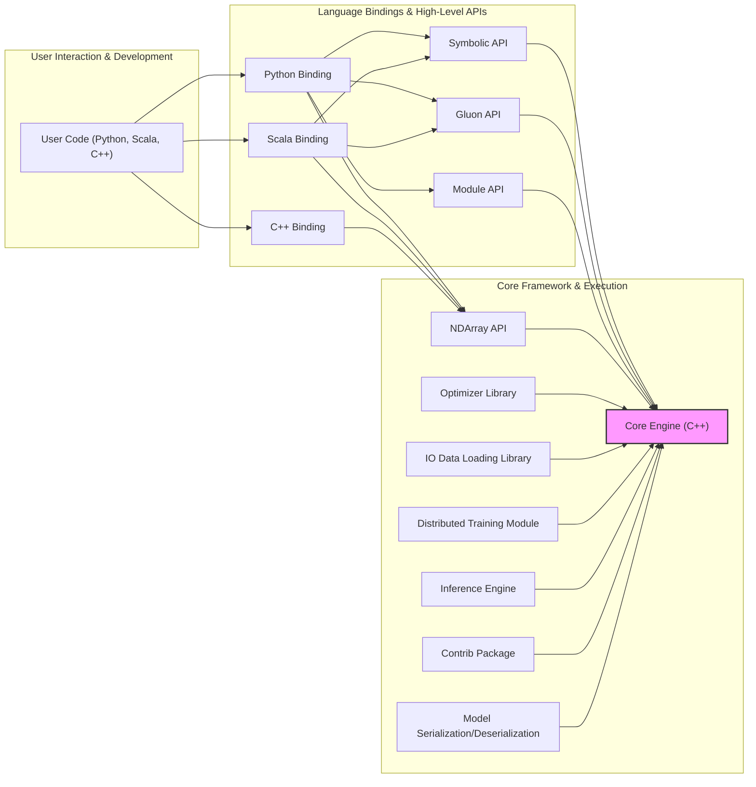

## Project Design Document: Apache MXNet for Threat Modeling (Improved)

**1. Introduction**

This document provides a detailed architectural overview of the Apache MXNet project, specifically tailored for use in subsequent threat modeling activities. It outlines the key components, interactions, data flows, and technologies involved in MXNet. The goal is to provide a clear and comprehensive understanding of the system's structure and functionality from a security perspective, enabling effective identification of potential threats and vulnerabilities.

**1.1. Purpose**

This document serves as a foundational resource for identifying potential security vulnerabilities and threats within the Apache MXNet ecosystem. It aims to provide the necessary context for security engineers, developers, and architects to conduct thorough and targeted threat modeling exercises.

**1.2. Scope**

This document covers the core software components of the Apache MXNet framework, including its architecture, key functionalities, and interactions between different modules. It focuses on the logical architecture and data flows within MXNet and does not delve into the underlying hardware, operating system specifics, or network infrastructure unless directly relevant to the framework's operation and security.

**1.3. Target Audience**

This document is intended for:

* Security engineers responsible for threat modeling, security assessments, and penetration testing.
* Developers working on the Apache MXNet project, particularly those involved in designing and implementing new features or maintaining existing ones.
* Software and cloud architects involved in designing and deploying systems that utilize MXNet as a component.

**2. Overview of Apache MXNet**

Apache MXNet is a versatile open-source deep learning framework designed for both research and production. It supports a wide array of programming languages (Python, Scala, C++, etc.) and offers flexibility in deployment across diverse environments, from cloud platforms to edge devices. MXNet is engineered for efficiency and scalability, enabling the development and deployment of sophisticated machine learning models. It handles various types of data, including numerical data, images, text, and time-series data.

**3. Architectural Design**

The architecture of MXNet is modular, comprising several key components that collaborate to deliver the framework's capabilities. Understanding these components and their interactions is crucial for identifying potential attack surfaces.

**3.1. Key Components**

* **`Core Engine (C++)`:** The bedrock of MXNet, implemented in C++. It manages core computations, memory allocation, and the scheduling of operations on various hardware backends (CPU, GPU). This component is critical for performance and security, as vulnerabilities here could have widespread impact.
* **`NDArray API`:** Provides a fundamental abstraction for multi-dimensional arrays (tensors), the building blocks of numerical computation in MXNet. This API is exposed through language bindings and handles the storage and manipulation of numerical data, including sensitive training data and model parameters.
* **`Symbolic API`:** Enables the definition of neural network architectures as symbolic graphs. This allows for optimizations and automatic differentiation. The graph representation itself could be a target for manipulation or injection attacks if not handled securely.
* **`Gluon API`:** A high-level, imperative API that simplifies building and training neural networks. It offers features like automatic differentiation and pre-built layers. While user-friendly, improper use or vulnerabilities in Gluon could lead to insecure model construction or training processes.
* **`Module API`:** Offers a mid-level interface for training and inference, providing more control than Gluon but less than the Symbolic API. This API handles the lifecycle of models and data, making it a key area for security considerations.
* **`Optimizer Library`:** Contains various optimization algorithms (e.g., SGD, Adam) used to update neural network weights during training. Flaws in optimizers or their configuration could lead to model poisoning or other security issues.
* **`IO Data Loading Library`:** Responsible for efficiently loading and preprocessing data for training and inference from various sources (local files, cloud storage, etc.). This component handles potentially sensitive data, making secure data handling practices essential.
* **`Model Serialization/Deserialization`:** Provides mechanisms to save and load trained models. This process is critical for model persistence and deployment, and vulnerabilities here could allow for model tampering or unauthorized access.
* **`Language Bindings (Python, Scala, C++, etc.)`:** Allow users to interact with the core engine and APIs using their preferred programming languages. The Python binding is the most prevalent and introduces potential security risks related to Python dependencies and execution environments.
* **`Distributed Training Module`:** Facilitates the training of models across multiple devices (GPUs, machines) for large-scale workloads. This involves network communication and data sharing, introducing security challenges related to inter-node communication and data integrity.
* **`Inference Engine`:** Optimized for deploying trained models for prediction tasks. Security considerations include protecting the model from unauthorized access and ensuring the integrity of the inference process.
* **`Contrib Package`:** Contains experimental and community-contributed features. While offering new functionalities, these components may have undergone less rigorous security review and could introduce vulnerabilities.

**3.2. Component Interactions and Data Flow**

The following diagram illustrates the high-level interactions between the key components, highlighting potential data flow paths:

**Data Flow during Training (Illustrative):**

* **Data Ingestion:** User code via language bindings interacts with the `"IO Data Loading Library"` to load training data from sources like local files or cloud storage. This data can contain sensitive information requiring secure handling.
* **Model Definition:** The user defines the model architecture using the `"Symbolic API"` or `"Gluon API"`. The model definition itself can be a target for manipulation.
* **Computation:** The defined model and training data are passed to the `"Core Engine (C++)"` via the `"NDArray API"`. The core engine performs forward and backward passes, manipulating numerical data representing activations, gradients, and model parameters.
* **Optimization:** The `"Optimizer Library"` updates model parameters based on calculated gradients. Maliciously crafted gradients could lead to model poisoning.
* **Distributed Coordination:** If using distributed training, the `"Distributed Training Module"` manages communication and synchronization between training nodes, exchanging model updates and gradients over the network. This communication channel needs to be secured.
* **Model Persistence:** The trained model is serialized and saved using the `"Model Serialization/Deserialization"` component. The saved model file needs to be protected from unauthorized access and modification.

**Data Flow during Inference (Illustrative):**

* **Model Loading:** The `"Inference Engine"` loads a serialized model using the `"Model Serialization/Deserialization"` component. Ensuring the integrity and authenticity of the loaded model is crucial.
* **Input Processing:** Input data for inference is processed, potentially using the `"IO Data Loading Library"`. This input data could be a source of adversarial attacks.
* **Prediction:** The `"Inference Engine"` performs a forward pass on the input data using the loaded model.
* **Output:** The inference results are returned to the user. The security of this output channel is important to prevent information leakage.

**3.3. External Interfaces**

* **Language Bindings (APIs):** These provide the primary interface for users to interact with MXNet. Security considerations include authentication, authorization, and input validation to prevent malicious code execution or unauthorized access.
* **File System:** Used for loading data, saving models, and potentially storing intermediate results. Access control and secure file handling practices are essential.
* **Network (for Distributed Training, Data Loading, and potentially serving models):** Enables communication between nodes in a distributed training setup, accessing data from remote sources, and potentially serving models over a network. Secure communication protocols (e.g., TLS) and authentication mechanisms are necessary.
* **Hardware Accelerators (GPUs, TPUs):** MXNet interacts with hardware accelerators through libraries like CUDA and cuDNN. Security considerations extend to the drivers and libraries used for hardware acceleration.
* **Containerization and Orchestration Platforms (Docker, Kubernetes):** When deployed in containers, the security of the container images and orchestration platform becomes relevant.

**4. Key Technologies**

* **Primary Programming Languages:** C++, Python, Scala
* **Deep Learning Framework Core:** Apache MXNet
* **Numerical Computation Libraries:** BLAS, LAPACK, potentially vendor-specific libraries for hardware acceleration.
* **GPU Acceleration Libraries:** CUDA, cuDNN, oneDNN, ROCm.
* **Distributed Computing Frameworks:** MPI, Horovod, Parameter Server implementations.
* **Operating Systems:** Linux, macOS, Windows (with varying levels of support for specific features).
* **Build System:** CMake.
* **Package Management:** `pip` (for Python), Maven (for Scala).

**5. Deployment Considerations**

MXNet can be deployed in a variety of environments, each with its own security implications:

* **Cloud Platforms (AWS, Azure, GCP):** Leveraging cloud-managed services can provide security benefits, but also introduces dependencies on the cloud provider's security posture. Considerations include IAM roles, network security groups, and data encryption.
* **On-Premise Servers:** Requires careful configuration and maintenance of the underlying infrastructure, including operating system security, network security, and physical security.
* **Edge Devices:** Resource constraints on edge devices can make implementing robust security measures challenging. Considerations include secure boot, firmware updates, and physical security of the device.
* **Containers (Docker, Kubernetes):** Container security is paramount, including vulnerability scanning of images, secure container configurations, and network policies within the orchestration platform.

**6. Security Considerations (Detailed)**

This section expands on the initial security considerations, providing more specific areas of concern for threat modeling:

* **Dependency Vulnerabilities:** MXNet relies on numerous external libraries. Regularly scanning and updating dependencies is crucial to mitigate known vulnerabilities.
* **Model Security:**
    * **Model Tampering:** Protecting trained models from unauthorized modification or corruption.
    * **Model Extraction:** Preventing unauthorized copying or reverse engineering of trained models.
    * **Adversarial Inputs:**  Designing defenses against inputs crafted to cause the model to make incorrect predictions.
* **Data Security:**
    * **Data Confidentiality:** Protecting sensitive training and inference data from unauthorized access. Encryption at rest and in transit is essential.
    * **Data Integrity:** Ensuring the accuracy and completeness of training and inference data. Data poisoning attacks are a significant concern.
* **Code Injection Vulnerabilities:**  Care must be taken when loading user-provided code (e.g., custom layers, loss functions) or model definitions, as this could lead to arbitrary code execution.
* **Distributed Training Security:**
    * **Authentication and Authorization:** Securely authenticating and authorizing nodes participating in distributed training.
    * **Secure Communication:** Encrypting communication channels between training nodes to prevent eavesdropping and tampering.
* **API Security:**
    * **Authentication and Authorization:** Implementing robust mechanisms to control access to MXNet APIs.
    * **Input Validation:** Thoroughly validating all inputs to prevent injection attacks and other vulnerabilities.
* **Supply Chain Security:** Ensuring the integrity and authenticity of the MXNet distribution and its components, including build processes and release artifacts.
* **Resource Exhaustion:** Implementing mechanisms to prevent malicious actors from exhausting system resources (CPU, memory, GPU) through computationally intensive tasks.
* **Logging and Auditing:** Maintaining comprehensive logs of security-relevant events for monitoring and incident response.

**7. Out of Scope**

This document specifically excludes the following from its scope:

* **Physical security of the infrastructure** where MXNet is deployed.
* **Detailed security configurations of specific operating systems or hardware.**
* **Organizational security policies and procedures** of entities using MXNet.
* **Performance benchmarking and optimization strategies** that do not directly relate to security.
* **The internal implementation details of every single function and class within MXNet's codebase,** focusing instead on the major architectural components and their interactions.
* **Security assessments of specific applications built on top of MXNet**, unless those applications are integral to understanding MXNet's core functionality.

This improved design document provides a more detailed and security-focused overview of Apache MXNet, serving as a valuable resource for conducting comprehensive threat modeling activities. The enhanced descriptions of components, interactions, and security considerations will facilitate the identification of potential vulnerabilities and the development of effective mitigation strategies.