# Project Design Document: Apache MXNet for Threat Modeling (Improved)

## 1. Introduction

This document provides an enhanced design overview of Apache MXNet, an open-source deep learning framework, specifically tailored for threat modeling. Building upon the initial design, this version offers more granular detail and emphasizes security-relevant aspects of the system's architecture, key components, data flow, and technology stack. The goal is to create a robust foundation for identifying, analyzing, and mitigating potential security threats within MXNet deployments. This document is intended to be a comprehensive resource for subsequent threat modeling activities, security audits, and the development of security best practices.

## 2. System Overview

Apache MXNet is a versatile and high-performance deep learning framework designed for both research and production environments. Its key strengths lie in its scalability, flexibility, and efficiency, supporting a wide array of deep learning models, programming languages, and hardware platforms. MXNet's architecture is built to handle complex deep learning workloads, from model training to deployment and inference.

**Key Features (Security Relevant Highlights):**

*   **Scalability & Distributed Training:** Supports distributed training across clusters, introducing network security considerations.
*   **Multi-language Support & APIs:** Multiple API entry points (Python, C++, etc.) require careful input validation and secure API design.
*   **Operator Library & Custom Operators:** Extensibility through custom operators necessitates secure operator development and validation to prevent vulnerabilities.
*   **Model Serialization & Deserialization:** Model persistence and loading processes are critical points for integrity and confidentiality.
*   **Hardware Acceleration (GPU, Specialized Hardware):** Interaction with hardware and drivers can introduce platform-specific security concerns.
*   **Interoperability (ONNX):** Integration with other frameworks via ONNX requires consideration of ONNX format security and potential vulnerabilities in interoperability layers.

## 3. Architecture (Detailed)

MXNet's architecture is designed with modularity and performance in mind.  This section expands on the previous architecture description, providing more detail relevant to security.

```mermaid
graph LR
    subgraph "Frontend APIs"
    A["'Python API'"]
    B["'C++ API'"]
    C["'Scala API'"]
    D["'R API'"]
    E["'Julia API'"]
    F["'Perl API'"]
    G["'Go API'"]
    style A fill:#e0f7fa,stroke:#333,stroke-width:1px
    style B fill:#e0f7fa,stroke:#333,stroke-width:1px
    style C fill:#e0f7fa,stroke:#333,stroke-width:1px
    style D fill:#e0f7fa,stroke:#333,stroke-width:1px
    style E fill:#e0f7fa,stroke:#333,stroke-width:1px
    style F fill:#e0f7fa,stroke:#333,stroke-width:1px
    style G fill:#e0f7fa,stroke:#333,stroke-width:1px
    end

    subgraph "Backend Engine (C++) - Core"
    H["'Scheduler'"]
    I["'Executor'"]
    J["'Memory Manager'"]
    K["'Operator Dispatcher'"]
    L["'KVStore (Key-Value Store for Distributed Training)'"]
    M["'Resource Manager (GPU, CPU, Memory)'"]
    style H fill:#f9f,stroke:#333,stroke-width:1px
    style I fill:#f9f,stroke:#333,stroke-width:1px
    style J fill:#f9f,stroke:#333,stroke-width:1px
    style K fill:#f9f,stroke:#333,stroke-width:1px
    style L fill:#f9f,stroke:#333,stroke-width:1px
    style M fill:#f9f,stroke:#333,stroke-width:1px
    end

    subgraph "Operator Library"
    N["'Neural Network Operators' (e.g., Convolution, Pooling, Activation)"]
    O["'Math Operators' (e.g., Matrix Operations, Linear Algebra)"]
    P["'Data Manipulation Operators' (e.g., Data Loading, Augmentation)"]
    Q["'Custom Operators' (User-defined)"]
    style N fill:#ccffcc,stroke:#333,stroke-width:1px
    style O fill:#ccffcc,stroke:#333,stroke-width:1px
    style P fill:#ccffcc,stroke:#333,stroke-width:1px
    style Q fill:#ffcccc,stroke:#333,stroke-width:1px
    end

    subgraph "Storage & Model Management"
    R["'Parameter Storage'"]
    S["'Data Storage'"]
    T["'Model Storage' (Serialization/Deserialization)"]
    U["'Model Zoo' (Pre-trained Models - External Source Risk)"]
    style R fill:#ffe0b2,stroke:#333,stroke-width:1px
    style S fill:#ffe0b2,stroke:#333,stroke-width:1px
    style T fill:#ffe0b2,stroke:#333,stroke-width:1px
    style U fill:#ffcccc,stroke:#333,stroke-width:1px
    end

    A --> H
    B --> H
    C --> H
    D --> H
    E --> H
    F --> H
    G --> H

    H --> I
    I --> J
    I --> K
    I --> L
    I --> M
    K --> N
    K --> O
    K --> P
    K --> Q

    N --> T
    O --> T
    P --> S
    Q --> T
    U --> T

    L --> M

    linkStyle 15,16,17,18,19,20,21,22,23,24,25,26,27,28,29,30,31 stroke:#333,stroke-width:1px;
```

**Detailed Component Descriptions (Security Focus):**

*   **Frontend APIs:**  These APIs are the primary interface for users. Security considerations include:
    *   **Input Validation:** APIs must rigorously validate user inputs to prevent injection attacks (e.g., command injection, code injection if custom code is allowed via APIs).
    *   **Authentication & Authorization:** For APIs exposed over a network, proper authentication and authorization mechanisms are crucial.
    *   **API Security Best Practices:** Adherence to secure API design principles (e.g., least privilege, secure defaults).
*   **Backend Engine (C++ Core):** The core engine is critical for performance and security. Key security aspects:
    *   **Memory Safety:** C++ vulnerabilities like buffer overflows and memory leaks can be exploited. Memory management and safe coding practices are paramount.
    *   **Resource Management:**  Improper resource management can lead to Denial of Service (DoS). The Resource Manager component needs to be robust against resource exhaustion attacks.
    *   **Operator Dispatcher Security:** The dispatcher must securely route operations and prevent malicious operators from being executed or bypassing security checks.
    *   **KVStore Security (Distributed Training):** In distributed training, the KVStore handles parameter synchronization. Secure communication and data integrity within the KVStore are vital.
*   **Operator Library:** Operators perform the core computations. Security concerns:
    *   **Operator Vulnerabilities:**  Bugs in operator implementations (especially complex numerical algorithms) can lead to crashes, unexpected behavior, or even exploitable conditions.
    *   **Custom Operator Risks:** User-defined custom operators (Q) are a significant security risk if not properly vetted. They can contain arbitrary code and bypass framework security measures.  Sandboxing and rigorous review are essential.
    *   **Input Validation within Operators:** Operators should validate their inputs to prevent unexpected behavior or crashes due to malformed data.
*   **Storage & Model Management:**  Managing models and data securely is crucial:
    *   **Model Storage Security:** Model files (T) contain sensitive intellectual property and potentially trained biases. Access control, encryption at rest, and integrity checks are needed.
    *   **Model Serialization/Deserialization Vulnerabilities:**  Vulnerabilities in model serialization/deserialization processes can lead to code execution during model loading. Secure serialization formats and validation are important.
    *   **Data Storage Security:** Training and inference data (S) may contain sensitive information. Secure storage and access control are necessary.
    *   **Model Zoo/External Model Sources (U):**  Downloading pre-trained models from external sources introduces supply chain risks. Models could be backdoored or contain vulnerabilities. Model validation and provenance checks are important.

## 4. Data Flow (Security Enhanced)

This section refines the data flow diagrams to highlight security considerations at each stage.

**4.1 Training Data Flow (Security Focused):**

```mermaid
graph LR
    subgraph "Data Ingestion - Security Checkpoint 1: Data Source Integrity"
    DA["'Data Source' (e.g., Files, Databases, Streams)"]
    DB["'Data Loader' (MXNet Data API)"]
    style DA fill:#ffcccc,stroke:#333,stroke-width:1px
    end

    subgraph "Data Preprocessing - Security Checkpoint 2: Data Sanitization & Validation"
    DC["'Data Augmentation'"]
    DD["'Data Normalization'"]
    DE["'Batching'"]
    style DC fill:#ffcc99,stroke:#333,stroke-width:1px
    style DD fill:#ffcc99,stroke:#333,stroke-width:1px
    style DE fill:#ffcc99,stroke:#333,stroke-width:1px
    end

    subgraph "Model Training - Security Checkpoint 3: Training Process Integrity"
    DF["'Model Definition' (Frontend API)"]
    DG["'Optimizer'"]
    DH["'Loss Function'"]
    DI["'Backend Engine' (Execution)"]
    DJ["'Parameter Update'"]
    style DF fill:#ccffcc,stroke:#333,stroke-width:1px
    style DG fill:#ccffcc,stroke:#333,stroke-width:1px
    style DH fill:#ccffcc,stroke:#333,stroke-width:1px
    style DI fill:#ccffcc,stroke:#333,stroke-width:1px
    style DJ fill:#ccffcc,stroke:#333,stroke-width:1px
    end

    subgraph "Model Storage - Security Checkpoint 4: Model Confidentiality & Integrity"
    DK["'Trained Model' (Saved Parameters)"]
    style DK fill:#ffcccc,stroke:#333,stroke-width:1px
    end

    DA --> DB --> DC --> DD --> DE --> DF
    DF --> DG --> DH --> DI --> DJ --> DF
    DJ --> DK
    DI --> DE

    linkStyle 5,6,7,8,9,10 stroke:#333,stroke-width:1px;
```



**Security Checkpoints in Training:**

1.  **Data Source Integrity:** Verify the integrity and trustworthiness of data sources (DA). Data poisoning attacks can occur at this stage. Implement data provenance tracking and validation.
2.  **Data Sanitization & Validation:** Preprocessing (DC, DD, DE) should include data sanitization and validation to prevent injection attacks or unexpected behavior due to malformed data.
3.  **Training Process Integrity:** Ensure the training process itself (DF-DJ) is secure. Monitor for anomalies, prevent unauthorized modification of training parameters, and protect against adversarial training techniques.
4.  **Model Confidentiality & Integrity:** Securely store the trained model (DK) to protect its confidentiality and integrity. Implement access controls and encryption.

**4.2 Inference Data Flow (Security Focused):**

```mermaid
graph LR
    subgraph "Input Data - Security Checkpoint 1: Input Validation"
    EA["'Input Data' (e.g., Image, Text, Sensor Data)"]
    EB["'Data Preprocessing' (Inference Specific)"]
    style EA fill:#ffcc99,stroke:#333,stroke-width:1px
    style EB fill:#ffcc99,stroke:#333,stroke-width:1px
    end

    subgraph "Model Loading - Security Checkpoint 2: Model Integrity & Authenticity"
    EC["'Load Trained Model' (Parameters)"]
    style EC fill:#ffcccc,stroke:#333,stroke-width:1px
    end

    subgraph "Inference Execution - Security Checkpoint 3: Secure Inference Environment"
    ED["'Backend Engine' (Inference Mode)"]
    EE["'Model Forward Pass'"]
    EF["'Output Prediction'"]
    style ED fill:#ccffcc,stroke:#333,stroke-width:1px
    style EE fill:#ccffcc,stroke:#333,stroke-width:1px
    style EF fill:#ccffcc,stroke:#333,stroke-width:1px
    end


    EA --> EB --> EC --> ED --> EE --> EF
    EC --> EE

    linkStyle 3,4,5,6 stroke:#333,stroke-width:1px;
```

**Security Checkpoints in Inference:**

1.  **Input Validation:**  Thoroughly validate input data (EA, EB) to prevent adversarial examples, injection attacks, and unexpected behavior. Input sanitization is crucial.
2.  **Model Integrity & Authenticity:** Verify the integrity and authenticity of the loaded model (EC) to prevent loading of malicious or tampered models. Use digital signatures or checksums.
3.  **Secure Inference Environment:** Ensure the inference environment (ED-EF) is secure. Protect against unauthorized access, resource exhaustion, and side-channel attacks during inference.

## 5. Key Components and Threat Scenarios

This section maps key components to potential threat scenarios to facilitate threat modeling.

| Component                     | Potential Threats                                                                 | Security Considerations/Mitigations                                                                                                                               |
| ----------------------------- | --------------------------------------------------------------------------------- | ----------------------------------------------------------------------------------------------------------------------------------------------------------------- |
| **Frontend APIs**             | Injection attacks (command, code), API abuse, unauthorized access, DoS             | Input validation, API security best practices, authentication, authorization, rate limiting, secure coding practices.                                         |
| **Backend Engine (C++)**      | Memory corruption (buffer overflows), resource exhaustion, DoS, privilege escalation | Memory-safe coding, robust error handling, resource management, security audits, fuzzing, static analysis.                                                     |
| **Operator Library**          | Operator vulnerabilities (crashes, unexpected behavior), custom operator risks (code execution) | Input validation within operators, secure implementation of algorithms, code review for operators, sandboxing for custom operators, operator whitelisting. |
| **Data Loaders & Preprocessing** | Data poisoning, injection attacks via data, data exfiltration, DoS                 | Input validation of data sources, data sanitization, secure data handling, access control to data sources, monitoring data pipelines.                         |
| **Model Storage & Loading**   | Model theft, model manipulation, loading malicious models, code execution during deserialization | Access control for model storage, encryption at rest, integrity checks (checksums, signatures), secure serialization/deserialization, model provenance. |
| **Distributed Training (KVStore)** | Eavesdropping, man-in-the-middle attacks, data breaches, unauthorized access to training cluster | Encryption of communication channels (TLS/SSL), authentication and authorization within the cluster, secure cluster configuration, network segmentation.       |
| **Dependencies**              | Vulnerabilities in third-party libraries                                          | Regular dependency scanning, vulnerability management, keeping dependencies up-to-date, using secure dependency repositories.                                     |
| **Deployment Environment**    | Environment-specific vulnerabilities (cloud misconfiguration, edge device compromise) | Secure deployment configurations, hardening of deployment environment, regular security assessments of deployment infrastructure.                               |

## 6. Technology Stack (Security Implications)

Expanding on the technology stack and its security implications:

*   **Programming Languages:**
    *   **C++ (Backend):**  While performant, C++ requires careful memory management to avoid vulnerabilities. Security expertise in C++ is crucial for development and audits.
    *   **Python/Other Frontend Languages:**  Vulnerabilities in language interpreters or libraries used in APIs can be exploited. Secure coding practices in these languages are important.
*   **Dependencies:**
    *   **BLAS/LAPACK:**  These are mature libraries, but vulnerabilities can still be found. Regular updates are necessary.  Exploits in these libraries could have significant impact on MXNet.
    *   **CUDA/cuDNN:**  Proprietary NVIDIA libraries. Security depends on NVIDIA's security practices. Driver vulnerabilities can impact MXNet's security.
    *   **Operating System Libraries:**  MXNet relies on OS-level libraries. OS security patches are essential for MXNet's overall security.
*   **Operating Systems:**
    *   **Linux:** Generally considered more secure than Windows for server deployments, but still requires hardening and security configurations.
    *   **Windows:** Requires careful security configuration and patching to mitigate known Windows vulnerabilities.
*   **Hardware Platforms:**
    *   **GPUs:**  GPU vulnerabilities (firmware, drivers) can potentially be exploited. Secure GPU driver management is important.
    *   **Specialized Accelerators:** Security of specialized hardware depends on the vendor's security practices.

## 7. Deployment Model (Security Considerations per Model)

Security considerations vary significantly based on the deployment model:

*   **Local Deployment (Single Machine):**
    *   **Threats:** Primarily local attacks, malware on the machine, insider threats.
    *   **Security Focus:** Host-based security (OS hardening, antivirus, firewalls), user access control, physical security of the machine.
*   **Cloud Deployment (VMs, Containers, Managed Services):**
    *   **Threats:** Cloud-specific vulnerabilities (misconfigurations, insecure APIs), network attacks, data breaches, shared tenancy risks.
    *   **Security Focus:** Cloud security best practices (IAM, security groups, network segmentation), container security, managed service security configurations, data encryption in transit and at rest.
*   **Edge Deployment (Devices):**
    *   **Threats:** Physical attacks, device tampering, supply chain attacks, limited resources for security measures, insecure communication channels.
    *   **Security Focus:** Device hardening, secure boot, physical security measures, secure communication protocols, minimal footprint security solutions, secure over-the-air updates.
*   **Distributed Training Environments (Clusters):**
    *   **Threats:** Network attacks within the cluster, eavesdropping, man-in-the-middle attacks, compromised nodes, data breaches, insider threats.
    *   **Security Focus:** Network security (segmentation, firewalls, intrusion detection), secure communication within the cluster (TLS/SSL, VPNs), node hardening, access control, monitoring and logging.

## 8. Security Best Practices and Recommendations

Based on the analysis, recommended security best practices for MXNet deployments include:

*   **Secure Development Lifecycle (SDL):** Implement SDL for MXNet development, including secure coding practices, code reviews, security testing (static/dynamic analysis, fuzzing), and vulnerability management.
*   **Input Validation Everywhere:**  Enforce rigorous input validation at all API boundaries, data loading stages, and within operators.
*   **Least Privilege Access Control:** Implement least privilege access control for all resources (data, models, infrastructure, APIs).
*   **Regular Security Audits and Penetration Testing:** Conduct regular security audits and penetration testing to identify and address vulnerabilities.
*   **Dependency Management and Vulnerability Scanning:**  Implement a robust dependency management process and regularly scan for vulnerabilities in dependencies.
*   **Secure Configuration Management:**  Use secure configuration management practices for all MXNet components and deployment environments.
*   **Incident Response Plan:** Develop and maintain an incident response plan for security incidents related to MXNet deployments.
*   **Security Awareness Training:** Provide security awareness training to developers, operators, and users of MXNet.
*   **Community Engagement:** Actively participate in the MXNet security community and stay informed about security updates and best practices.

## 9. Conclusion

This improved design document provides a more detailed and security-focused overview of Apache MXNet. By elaborating on the architecture, data flow, key components, technology stack, and deployment models, and by highlighting potential threat scenarios and security checkpoints, this document aims to be a more effective resource for threat modeling and security hardening of MXNet-based systems.  The outlined security considerations and best practices should guide security efforts and contribute to building more resilient and trustworthy deep learning applications with Apache MXNet.