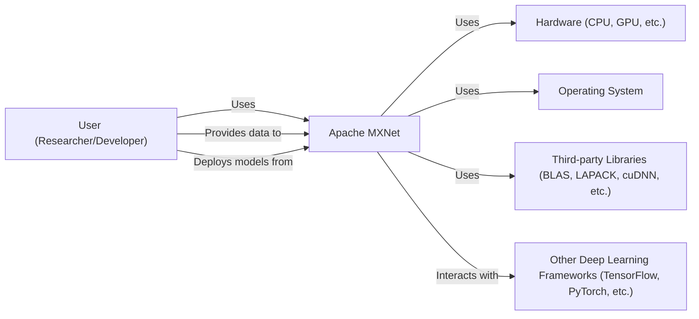
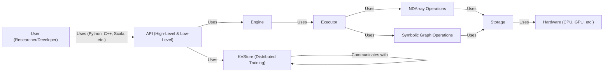
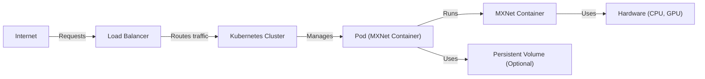
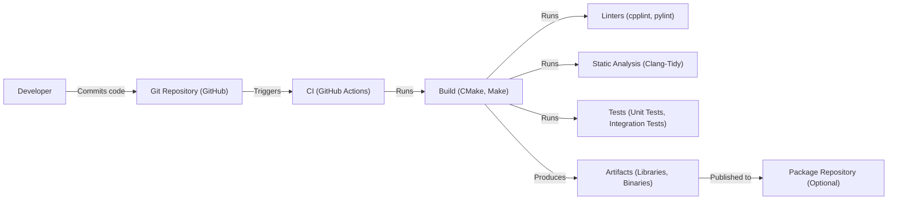

# BUSINESS POSTURE

Business Priorities and Goals:

*   Provide a flexible and efficient deep learning framework for researchers and developers.
*   Enable fast training and deployment of deep learning models.
*   Support a wide range of hardware platforms and programming languages.
*   Foster a vibrant open-source community and ecosystem.
*   Maintain a competitive edge in the rapidly evolving deep learning landscape.

Business Risks:

*   Inability to keep pace with the latest advancements in deep learning research and technology.
*   Loss of community engagement and contributions.
*   Competition from other deep learning frameworks (e.g., TensorFlow, PyTorch).
*   Security vulnerabilities that could compromise user data or models.
*   Difficulty in attracting and retaining top talent.
*   Lack of adoption by industry users.

# SECURITY POSTURE

Existing Security Controls:

*   security control: Code reviews: The project uses a pull request-based development model, which includes code reviews by maintainers and contributors. (Described in CONTRIBUTING.md)
*   security control: Static analysis: The project uses static analysis tools like linters and formatters to enforce code quality and identify potential issues. (Described in CONTRIBUTING.md and visible in CI workflows)
*   security control: Continuous integration (CI): The project uses CI pipelines (GitHub Actions) to automatically build and test code changes. (Visible in .github/workflows)
*   security control: Issue tracking: The project uses GitHub Issues to track bugs, feature requests, and security vulnerabilities. (Visible on GitHub repository)
*   security control: Community engagement: The project has an active community of users and contributors who can help identify and report security issues. (Visible on GitHub repository and forums)

Accepted Risks:

*   accepted risk: The project relies on third-party libraries and dependencies, which may have their own security vulnerabilities.
*   accepted risk: The project is primarily focused on research and development, and may not have the same level of security hardening as commercial software.
*   accepted risk: The project is open-source, which means that the code is publicly available and can be scrutinized by anyone, including potential attackers.

Recommended Security Controls:

*   security control: Implement regular dynamic application security testing (DAST) to identify runtime vulnerabilities.
*   security control: Conduct regular penetration testing to simulate real-world attacks and identify weaknesses.
*   security control: Establish a formal vulnerability disclosure program to encourage responsible reporting of security issues.
*   security control: Implement Software Composition Analysis (SCA) to track and manage third-party dependencies and their vulnerabilities.
*   security control: Integrate fuzzing into the CI/CD pipeline to test for unexpected inputs and edge cases.
*   security control: Implement a Content Security Policy (CSP) for web-based components (if any).

Security Requirements:

*   Authentication:
    *   Not directly applicable to the core MXNet library, as it primarily deals with model training and execution. Authentication would be relevant for related services like model serving platforms or user interfaces built on top of MXNet.

*   Authorization:
    *   Not directly applicable to the core MXNet library. Authorization would be relevant for related services, controlling access to models, data, or resources.

*   Input Validation:
    *   Crucial for preventing various attacks, including buffer overflows and code injection. MXNet should validate input data shapes, types, and ranges to ensure they are within expected bounds. This is particularly important when loading data from external sources or user-provided inputs.

*   Cryptography:
    *   MXNet should use secure cryptographic libraries for any operations involving sensitive data, such as encryption of models or data at rest or in transit.
    *   If MXNet supports distributed training, secure communication protocols (e.g., TLS/SSL) should be used to protect data exchanged between nodes.

# DESIGN

## C4 CONTEXT

Element Descriptions:

*   Element:
    *   Name: User (Researcher/Developer)
    *   Type: Person
    *   Description: A person who uses MXNet to build, train, and deploy deep learning models.
    *   Responsibilities: Provides data, writes code, configures training, deploys models.
    *   Security controls: Uses strong passwords, follows secure coding practices, keeps software up to date.

*   Element:
    *   Name: Apache MXNet
    *   Type: Software System
    *   Description: A flexible and efficient deep learning framework.
    *   Responsibilities: Provides APIs for model building, training, and inference; manages resources; executes computations.
    *   Security controls: Input validation, code reviews, static analysis, CI/CD.

*   Element:
    *   Name: Hardware (CPU, GPU, etc.)
    *   Type: External System
    *   Description: The physical hardware on which MXNet runs.
    *   Responsibilities: Executes computations.
    *   Security controls: Hardware security features, secure boot, firmware updates.

*   Element:
    *   Name: Operating System
    *   Type: External System
    *   Description: The operating system on which MXNet runs.
    *   Responsibilities: Manages system resources, provides a platform for MXNet to run.
    *   Security controls: OS hardening, regular security updates, access controls.

*   Element:
    *   Name: Third-party Libraries (BLAS, LAPACK, cuDNN, etc.)
    *   Type: External System
    *   Description: Libraries that MXNet depends on for various functionalities.
    *   Responsibilities: Provides optimized routines for linear algebra, deep learning operations, etc.
    *   Security controls: Rely on library maintainers for security updates, use trusted sources for libraries.

*   Element:
    *   Name: Other Deep Learning Frameworks (TensorFlow, PyTorch, etc.)
    *   Type: External System
    *   Description: Other deep learning frameworks that may interact with MXNet (e.g., for model conversion or comparison).
    *   Responsibilities: Provide alternative deep learning functionalities.
    *   Security controls: N/A (external system)

## C4 CONTAINER

Element Descriptions:

*   Element:
    *   Name: User (Researcher/Developer)
    *   Type: Person
    *   Description: A person who uses MXNet to build, train, and deploy deep learning models.
    *   Responsibilities: Provides data, writes code, configures training, deploys models.
    *   Security controls: Uses strong passwords, follows secure coding practices, keeps software up to date.

*   Element:
    *   Name: API (High-Level & Low-Level)
    *   Type: Container
    *   Description: Provides interfaces for interacting with MXNet in various programming languages.
    *   Responsibilities: Exposes MXNet functionalities to users, handles user input.
    *   Security controls: Input validation, API security best practices.

*   Element:
    *   Name: Engine
    *   Type: Container
    *   Description: Manages the execution of operations and dependencies.
    *   Responsibilities: Schedules operations, manages memory, handles dependencies.
    *   Security controls: Internal consistency checks.

*   Element:
    *   Name: Executor
    *   Type: Container
    *   Description: Executes operations on NDArrays and Symbols.
    *   Responsibilities: Performs computations, manages data flow.
    *   Security controls: Internal consistency checks.

*   Element:
    *   Name: NDArray Operations
    *   Type: Container
    *   Description: Provides operations for manipulating multi-dimensional arrays.
    *   Responsibilities: Performs numerical computations.
    *   Security controls: Input validation, bounds checking.

*   Element:
    *   Name: Symbolic Graph Operations
    *   Type: Container
    *   Description: Provides operations for building and manipulating symbolic computation graphs.
    *   Responsibilities: Defines the structure of the model, optimizes computations.
    *   Security controls: Graph validation, optimization checks.

*   Element:
    *   Name: Storage
    *   Type: Container
    *   Description: Manages memory allocation and data storage.
    *   Responsibilities: Allocates and deallocates memory, stores data.
    *   Security controls: Memory safety checks, secure memory management.

*   Element:
    *   Name: Hardware (CPU, GPU, etc.)
    *   Type: External System
    *   Description: The physical hardware on which MXNet runs.
    *   Responsibilities: Executes computations.
    *   Security controls: Hardware security features, secure boot, firmware updates.

*   Element:
    *   Name: KVStore (Distributed Training)
    *   Type: Container
    *   Description: Provides a key-value store for distributed training.
    *   Responsibilities: Synchronizes model parameters across multiple devices or machines.
    *   Security controls: Secure communication protocols (e.g., TLS/SSL), data integrity checks.

## DEPLOYMENT

Possible Deployment Solutions:

1.  Local Machine: For development, testing, and small-scale deployments.
2.  Cloud Virtual Machines (e.g., AWS EC2, Google Compute Engine, Azure VMs): For scalable deployments.
3.  Containerized Environments (e.g., Docker, Kubernetes): For portable and reproducible deployments.
4.  Serverless Functions (e.g., AWS Lambda, Google Cloud Functions, Azure Functions): For event-driven and scalable inference.
5.  Specialized Hardware (e.g., AWS Inferentia, Google TPUs): For high-performance inference.

Chosen Solution (Containerized Environment with Kubernetes):

Element Descriptions:

*   Element:
    *   Name: Internet
    *   Type: External System
    *   Description: The public internet.
    *   Responsibilities: Sends requests to the deployment.
    *   Security controls: N/A (external system)

*   Element:
    *   Name: Load Balancer
    *   Type: Infrastructure Node
    *   Description: Distributes incoming traffic across multiple instances of the application.
    *   Responsibilities: Handles incoming requests, routes traffic to healthy pods.
    *   Security controls: TLS/SSL termination, DDoS protection, firewall rules.

*   Element:
    *   Name: Kubernetes Cluster
    *   Type: Infrastructure Node
    *   Description: A cluster of machines managed by Kubernetes.
    *   Responsibilities: Orchestrates container deployment, scaling, and management.
    *   Security controls: Kubernetes security best practices, network policies, role-based access control (RBAC).

*   Element:
    *   Name: Pod (MXNet Container)
    *   Type: Infrastructure Node
    *   Description: A Kubernetes pod running the MXNet container.
    *   Responsibilities: Executes the MXNet application.
    *   Security controls: Container security best practices, resource limits, security context.

*   Element:
    *   Name: MXNet Container
    *   Type: Container
    *   Description: A Docker container containing the MXNet application and its dependencies.
    *   Responsibilities: Runs the MXNet application.
    *   Security controls: Minimal base image, vulnerability scanning, non-root user.

*   Element:
    *   Name: Hardware (CPU, GPU)
    *   Type: Infrastructure Node
    *   Description: The physical hardware on which the pods run.
    *   Responsibilities: Executes computations.
    *   Security controls: Hardware security features, secure boot, firmware updates.

*   Element:
    *   Name: Persistent Volume (Optional)
    *   Type: Infrastructure Node
    *   Description: A persistent storage volume for storing data (e.g., models, datasets).
    *   Responsibilities: Provides persistent storage.
    *   Security controls: Data encryption at rest, access controls.

## BUILD

Build Process Description:

1.  Developer commits code to the Git repository (GitHub).
2.  The commit triggers the CI pipeline (GitHub Actions).
3.  The CI pipeline runs the build process, which includes:
    *   Building the code using CMake and Make.
    *   Running linters (cpplint, pylint) to enforce code style and identify potential issues.
    *   Performing static analysis (Clang-Tidy) to detect potential bugs and vulnerabilities.
    *   Running unit tests and integration tests to verify the correctness of the code.
4.  If all steps are successful, the build process produces artifacts (libraries, binaries).
5.  Optionally, the artifacts can be published to a package repository (e.g., PyPI, Maven Central).

Security Controls:

*   security control: Code reviews: All code changes are reviewed by maintainers and contributors before being merged.
*   security control: Static analysis: Linters and static analysis tools are used to identify potential issues.
*   security control: CI/CD: The build process is automated and runs on every commit, ensuring that all code changes are tested.
*   security control: Tests: Unit tests and integration tests are used to verify the correctness of the code.
*   security control: Dependency management: Dependencies are managed through package managers and are regularly checked for updates and vulnerabilities (although this could be improved with SCA).

# RISK ASSESSMENT

Critical Business Processes:

*   Model training: The ability to train deep learning models efficiently and accurately.
*   Model inference: The ability to deploy and serve trained models for predictions.
*   Community engagement: Maintaining an active and engaged open-source community.
*   Research and development: Keeping pace with the latest advancements in deep learning.

Data Sensitivity:

*   Model weights: Can be considered sensitive, especially for proprietary models or models trained on sensitive data.  Sensitivity: Medium to High.
*   Training data: Can range from publicly available datasets to highly sensitive proprietary data. Sensitivity: Variable, from Low to High.
*   User data (if collected by related services): Potentially sensitive, depending on the nature of the data. Sensitivity: Variable, from Low to High.
*   Inference data: Data used as input for model predictions. Sensitivity depends on the application. Sensitivity: Variable, from Low to High.

# QUESTIONS & ASSUMPTIONS

Questions:

*   Are there any specific compliance requirements (e.g., GDPR, HIPAA) that need to be considered?
*   What is the expected scale of deployment (number of users, data volume, etc.)?
*   Are there any existing security policies or guidelines that should be followed?
*   What is the threat model for the project (who are the potential attackers, what are their motivations, etc.)?
*   What level of security testing (penetration testing, vulnerability scanning) is currently performed or planned?
*   Is there a dedicated security team or individual responsible for the security of the project?
*   What mechanisms are in place for handling and responding to security incidents?
*   Are there plans to integrate with any specific security tools or services (e.g., SIEM, vulnerability scanners)?
*   What are the specific data retention policies for training data, models, and inference data?
*   How is access to the build system and package repositories controlled and secured?

Assumptions:

*   BUSINESS POSTURE: The primary goal is to provide a research-oriented deep learning framework, with a secondary focus on production deployment.
*   SECURITY POSTURE: The project relies primarily on community contributions and open-source best practices for security.
*   DESIGN: The deployment environment will be containerized using Kubernetes. The build system is based on CMake and Make, integrated with GitHub Actions for CI/CD.