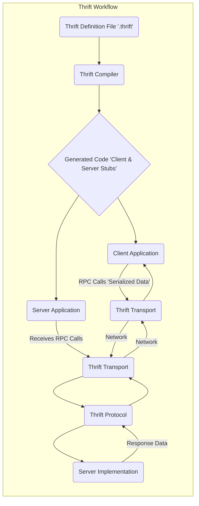
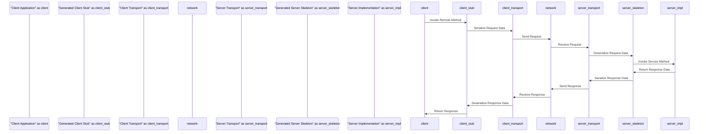

# Project Design Document: Apache Thrift

**Version:** 1.1
**Date:** October 26, 2023
**Prepared By:** AI Software Architect

## 1. Introduction

This document provides an enhanced architectural design of the Apache Thrift project. It aims to clearly articulate the components, their interactions, and the flow of data within the Thrift framework. This detailed design serves as a crucial foundation for subsequent threat modeling activities, enabling a thorough understanding of potential security vulnerabilities.

## 2. Goals and Objectives

*   Deliver a refined and more detailed architectural overview of Apache Thrift.
*   Precisely identify key components and their specific responsibilities.
*   Clearly describe the data flow within the Thrift framework, highlighting critical stages.
*   Emphasize potential areas of security concern to guide future threat modeling efforts.
*   Serve as an improved and more comprehensive reference for developers and security analysts.

## 3. Architectural Overview

Apache Thrift is an interface definition language (IDL) and a powerful framework for remote procedure calls (RPC). It allows developers to define data types and service interfaces in a language-agnostic `.thrift` file. The Thrift compiler then generates efficient code for clients and servers in various programming languages, facilitating seamless cross-language communication.

Here's a high-level representation of the Thrift workflow:

## 4. Detailed Component Description

The Apache Thrift framework is built upon these core components:

*   **Thrift Definition Language (IDL):**
    *   A neutral language for defining data structures and service interfaces.
    *   Specifies the format of data exchanged between client and server.
    *   Defines service methods, including parameters and return types.
    *   Uses a declarative syntax for ease of understanding and maintenance.

*   **Thrift Compiler:**
    *   The central tool that processes the `.thrift` definition file.
    *   Generates source code for client and server components in the target language.
    *   Includes code for data serialization and deserialization based on the chosen protocol.
    *   Enforces the structure and types defined in the IDL.
    *   Supports various programming languages through different code generation backends.

*   **Generated Code:**
    *   Consists of client stubs (proxies) that simplify making remote calls.
    *   Includes server skeletons (interfaces) that developers implement to provide service logic.
    *   Contains data structures representing the defined types.
    *   Provides serialization and deserialization logic for efficient data transfer.
    *   Tailored to the specific programming language.

*   **Thrift Transport:**
    *   Handles the actual transmission of serialized data.
    *   Provides an abstraction layer over different communication mechanisms.
    *   Key transport implementations include:
        *   `TServerSocket`:  Standard blocking socket-based server.
        *   `TNonblockingServerSocket`:  Server using non-blocking sockets for higher concurrency.
        *   `THttpClient`:  Utilizes HTTP for communication, enabling firewall traversal.
        *   `TMemoryBuffer`:  Employs an in-memory buffer, useful for testing or local communication.
        *   `TZlibTransport`:  Wraps another transport and compresses data using Zlib.
        *   `TFDTransport`:  Leverages file descriptors for communication.

*   **Thrift Protocol:**
    *   Defines the format used to encode data for transmission.
    *   Impacts efficiency (size and speed) and interoperability.
    *   Common protocol implementations:
        *   `TBinaryProtocol`:  A straightforward and efficient binary format.
        *   `TCompactProtocol`:  A more space-efficient binary format, often preferred for network-constrained environments.
        *   `TJSONProtocol`:  Serializes data as JSON, making it human-readable and compatible with web technologies.
        *   `TSimpleJSONProtocol`:  A less strict variant of the JSON protocol.
        *   `TMultiplexedProtocol`:  Allows multiple services to share a single transport connection.

*   **Client Application:**
    *   The application that initiates remote procedure calls.
    *   Uses the generated client stubs to interact with the remote service.
    *   Serializes request data using the selected Thrift protocol and transport.
    *   Receives and deserializes responses from the server.

*   **Server Application:**
    *   The application that implements the service logic.
    *   Listens for incoming requests on a specified transport.
    *   Deserializes incoming data using the configured Thrift protocol.
    *   Invokes the appropriate service method based on the request.
    *   Serializes the response data and sends it back to the client.

## 5. Data Flow

The typical sequence of events during a Thrift RPC call is as follows:

1. The **Client Application** intends to call a method on a remote service.
2. It invokes the corresponding method on the **Generated Client Stub**, passing the necessary parameters.
3. The client stub utilizes the configured **Thrift Protocol** to serialize the method name and parameters into a transmittable format.
4. The serialized data is then handed to the configured **Thrift Transport**.
5. The **Thrift Transport** transmits the serialized data across the network (or other chosen transport mechanism) to the server.
6. The **Server Application**'s **Thrift Transport** receives the incoming data stream.
7. The server's **Thrift Protocol** deserializes the received data, reconstructing the method name and parameters.
8. The server then invokes the appropriate method within the **Server Implementation**.
9. The **Server Implementation** executes the business logic and generates the response data.
10. The server's **Thrift Protocol** serializes the response data.
11. The server's **Thrift Transport** sends the serialized response back to the client.
12. The client's **Thrift Transport** receives the response data.
13. The client's **Thrift Protocol** deserializes the response data.
14. Finally, the client stub returns the deserialized response to the **Client Application**.

## 6. Security Considerations (For Threat Modeling)

Based on the architectural components and data flow, the following areas present potential security concerns that should be thoroughly investigated during threat modeling:

*   **Serialization/Deserialization Vulnerabilities:**
    *   **Risk:** Maliciously crafted serialized data could exploit vulnerabilities in the deserialization process, potentially leading to remote code execution (RCE) or denial-of-service (DoS).
    *   **Examples:**  Exploiting vulnerabilities specific to the chosen protocol (e.g., JSON injection with `TJSONProtocol`), buffer overflows due to missing size limits, or type confusion issues.
    *   **Affected Components:** Thrift Protocol implementations, Generated Code (serialization/deserialization logic).

*   **Transport Security:**
    *   **Risk:** Data transmitted over the network without proper encryption is susceptible to eavesdropping and tampering (Man-in-the-Middle attacks).
    *   **Examples:**  Sensitive data being intercepted if using unencrypted TCP sockets.
    *   **Affected Components:** Thrift Transport implementations, Network infrastructure.

*   **Authentication and Authorization:**
    *   **Risk:** Lack of proper authentication allows unauthorized clients to access services. Insufficient authorization can lead to clients accessing resources they are not permitted to use.
    *   **Examples:**  An unauthenticated client invoking sensitive service methods.
    *   **Affected Components:** Server Implementation (where authentication and authorization logic is typically implemented), potentially custom Transport implementations.

*   **Denial of Service (DoS):**
    *   **Risk:** Malicious clients could overwhelm the server with a large number of requests, consuming resources and making the service unavailable.
    *   **Examples:**  Sending a flood of connection requests or large, resource-intensive payloads.
    *   **Affected Components:** Server Transport implementations, Server Application.

*   **Code Generation Vulnerabilities:**
    *   **Risk:** Although less frequent, vulnerabilities in the Thrift Compiler itself could lead to the generation of insecure code.
    *   **Examples:**  Compiler bugs that introduce vulnerabilities in the generated serialization or deserialization logic.
    *   **Affected Components:** Thrift Compiler, Generated Code.

*   **Dependency Vulnerabilities:**
    *   **Risk:** The generated code and the Thrift libraries themselves may rely on third-party libraries with known security vulnerabilities.
    *   **Examples:**  Using an outdated version of a dependency with a publicly known exploit.
    *   **Affected Components:** Thrift Libraries, Generated Code, Build process dependencies.

*   **Protocol Downgrade Attacks:**
    *   **Risk:** An attacker might attempt to force the client and server to communicate using a less secure protocol if multiple protocols are supported.
    *   **Examples:**  Manipulating protocol negotiation to use a protocol without encryption.
    *   **Affected Components:** Client and Server Protocol negotiation logic.

## 7. Deployment Considerations

The way Thrift applications are deployed can influence security:

*   **Standalone Servers:**  Requires careful consideration of network security and firewall rules.
*   **Microservices Architectures:**  Security considerations include inter-service authentication and authorization, potentially using mutual TLS.
*   **Cloud Environments:**  Leveraging cloud provider security features like network segmentation, IAM roles, and encryption services.
*   **Containerized Environments:**  Securing container images and the container orchestration platform.

## 8. Technologies Used

*   **Core Framework:** Apache Thrift (version specific)
*   **Programming Languages:**  (e.g., Java, Python, C++, Go, depending on the application)
*   **Transport Protocols:** TCP, HTTP, TLS/SSL
*   **Serialization Protocols:** Binary, Compact, JSON
*   **Operating Systems:** (Platform-independent at the framework level, but deployment environment specific)
*   **Build Tools:** Maven, Gradle, CMake, Go modules (depending on the language)

## 9. Conclusion

This improved design document provides a more detailed and refined architectural overview of Apache Thrift, emphasizing key components, data flow, and potential security considerations. This enhanced understanding is crucial for conducting effective threat modeling, enabling the identification and mitigation of potential vulnerabilities in Thrift-based systems. This document serves as a valuable resource for developers and security analysts involved in building and securing applications using Apache Thrift.