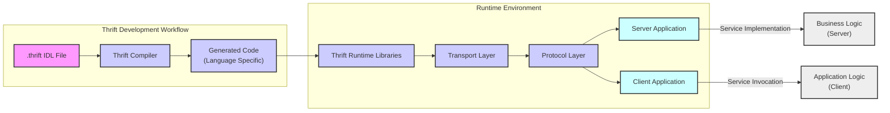

# Project Design Document: Apache Thrift (Improved)

## 1. Introduction

### 1.1. Project Overview

Apache Thrift is a robust interface definition language (IDL) and cross-language remote procedure call (RPC) framework. It empowers developers to define data types and service interfaces in a platform-neutral `.thrift` file. This definition file is then processed by the Thrift compiler to generate efficient code for building RPC clients and servers in a multitude of programming languages.  Thrift's language support is extensive, encompassing C++, Java, Python, PHP, Ruby, Erlang, Go, Node.js, Perl, Haskell, C#, Cocoa, JavaScript, Smalltalk, and OCaml.  Its core strength lies in enabling seamless and performant cross-language service communication, making it an ideal choice for constructing microservices, distributed systems, and applications requiring polyglot interoperability.

### 1.2. Purpose of this Document

This document provides a comprehensive design specification for Apache Thrift, specifically tailored to facilitate subsequent threat modeling activities. It serves as a blueprint of the system's architecture, data flow pathways, underlying technology stack, and critical security considerations. The objective is to create a clear and detailed foundation for identifying, analyzing, and mitigating potential security threats inherent in systems built upon the Apache Thrift framework. This document will be the primary input for security assessments and the design of robust security controls.

## 2. System Architecture

### 2.1. High-Level Architecture Diagram



### 2.2. Component Description

#### 2.2.1. Thrift IDL (Interface Definition Language)

*   **Description:** The Thrift IDL is the cornerstone of Thrift-based systems. It's a declarative language used to define services, data structures, and interfaces in a language-agnostic manner. It acts as the contract defining the communication between clients and servers.
*   **Functionality:** Defines:
    *   **Services:**  Collections of methods that can be invoked remotely.
    *   **Data Structures:** `struct` (complex data objects), `enum` (enumerated types), `union` (discriminated unions), `exception` (custom error types).
    *   **Data Types:**  Primitive types (bool, byte, i16, i32, i64, double, string, binary) and container types (list, set, map).
*   **Security Relevance:** The IDL defines the attack surface of the service.  Poorly designed interfaces, overly permissive data structures, or exposure of sensitive data within the IDL can introduce vulnerabilities.  Careful consideration of data types and service operations is crucial from a security perspective.

#### 2.2.2. Thrift Compiler (`thrift`)

*   **Description:** The Thrift compiler is a command-line tool that takes a `.thrift` IDL file as input and generates source code in the target programming language.
*   **Functionality:**
    *   **IDL Parsing and Validation:** Parses the IDL file, checks for syntax errors and semantic correctness.
    *   **Code Generation:** Generates client and server stubs, data serialization/deserialization code, and supporting infrastructure code based on the IDL definition and the chosen target language.
    *   **Language Support:** Supports a wide range of target languages, specified via command-line options.
*   **Security Relevance:** The compiler is a critical component in the security chain.
    *   **Compiler Vulnerabilities:**  Bugs or vulnerabilities in the compiler itself could lead to the generation of insecure code. It's important to use trusted and updated versions of the compiler.
    *   **Code Generation Templates:** The compiler uses templates to generate code. Security flaws in these templates could propagate to all generated code.
    *   **Dependency Management:** The compiler might rely on external libraries. Vulnerabilities in these dependencies could indirectly affect the security of generated code.

#### 2.2.3. Generated Code (Client & Server Stubs)

*   **Description:** This is the language-specific code automatically generated by the Thrift compiler. It provides the API for client and server applications to interact with the Thrift framework.
*   **Functionality:**
    *   **Server Stub (Processor):**  Abstract base class or interface that server applications implement to provide the service logic. Handles request reception, deserialization, dispatching to the service implementation, serialization of responses, and sending responses back to the client.
    *   **Client Stub (Client):**  Provides a client-side API that application code uses to invoke remote service methods. Handles serialization of requests, sending requests to the server, receiving responses, deserialization, and returning results to the client application.
    *   **Data Structures:** Language-specific classes representing the data structures defined in the IDL, with serialization and deserialization methods.
*   **Security Relevance:**  Generated code is the first layer of interaction with external inputs.
    *   **Serialization/Deserialization Logic:**  Vulnerabilities in the generated serialization/deserialization code (e.g., buffer overflows, format string bugs, deserialization flaws) can be critical.
    *   **Input Handling:**  Generated code often handles input validation and data conversion. Errors in this code can lead to vulnerabilities.
    *   **Language-Specific Security Issues:**  Security best practices for the target language must be followed in the generated code.

#### 2.2.4. Thrift Runtime Libraries

*   **Description:** Language-specific runtime libraries provide the core functionalities needed for Thrift communication, including transport handling, protocol implementation, and utility functions.
*   **Functionality:**
    *   **Transport Implementations:** Provide concrete implementations of transport layers (e.g., `TSocket`, `THttpClient`).
    *   **Protocol Implementations:** Provide concrete implementations of protocol layers (e.g., `TBinaryProtocol`, `TJSONProtocol`).
    *   **Core Utilities:**  Provide helper functions and classes for data handling, error management, and other common tasks.
*   **Security Relevance:** Runtime libraries are fundamental to the security of Thrift applications.
    *   **Transport Layer Vulnerabilities:**  Vulnerabilities in transport implementations (e.g., connection handling, buffer management, TLS/SSL implementation) can directly compromise security.
    *   **Protocol Layer Vulnerabilities:** Vulnerabilities in protocol implementations (e.g., deserialization flaws, protocol confusion, injection vulnerabilities) can be exploited.
    *   **Library Dependencies:** Runtime libraries may depend on other external libraries. Security vulnerabilities in these dependencies can also impact Thrift applications.

#### 2.2.5. Transport Layer (Transports)

*   **Description:** The transport layer is responsible for the physical transmission of serialized data between client and server. It defines *how* data is transferred.
*   **Functionality:**
    *   **Connection Management:** Establishes, maintains, and closes connections between client and server.
    *   **Data Framing:**  Handles message framing to delineate message boundaries within the byte stream (e.g., `TFramedTransport`).
    *   **Buffering:**  Provides buffering mechanisms for efficient data transfer (e.g., `TBufferedTransport`).
    *   **Encryption:**  Can provide encryption for data in transit (e.g., using TLS/SSL with `TSocket`).
    *   **Compression:** Can provide data compression to reduce bandwidth usage (e.g., `TZlibTransport`).
*   **Examples:**
    *   `TSocket`: Plain TCP sockets (insecure by default).
    *   `TServerSocket`: TCP server socket listener.
    *   `TSSLSocket`: TCP sockets with TLS/SSL encryption (secure transport).
    *   `THttpClient`: HTTP client transport (can be used with HTTPS for security).
    *   `TMemoryBuffer`: In-memory transport (for local communication or testing).
    *   `TFramedTransport`: Adds framing to the transport stream.
    *   `TBufferedTransport`: Buffers data before sending.
*   **Security Relevance:** Transport security is paramount for protecting data in transit.
    *   **Confidentiality:**  Using secure transports like `TSSLSocket` or HTTPS is essential to ensure data confidentiality and prevent eavesdropping.
    *   **Integrity:** Secure transports also provide data integrity, protecting against tampering during transmission.
    *   **Authentication:** TLS/SSL can be configured for mutual authentication, verifying the identity of both client and server.
    *   **Denial of Service (DoS):**  Transport layer implementations must be robust against DoS attacks, such as connection flooding or resource exhaustion.

#### 2.2.6. Protocol Layer (Protocols)

*   **Description:** The protocol layer defines the format and structure of the serialized data. It dictates *how* data structures are encoded into a byte stream and decoded back.
*   **Functionality:**
    *   **Serialization:** Converts data structures into a byte stream according to a specific encoding scheme.
    *   **Deserialization:** Converts a byte stream back into data structures.
    *   **Data Type Encoding:** Defines how each data type (primitive and complex) is represented in the byte stream.
    *   **Message Framing (within protocol):** Some protocols might include their own framing mechanisms.
*   **Examples:**
    *   `TBinaryProtocol`: Efficient binary encoding, widely used for performance.
    *   `TCompactProtocol`: More compact binary encoding, further reducing data size.
    *   `TJSONProtocol`: Human-readable JSON encoding, useful for debugging and interoperability with web-based systems, but less efficient.
    *   `TSimpleJSONProtocol`: Simplified, read-only JSON protocol, primarily for debugging.
    *   `TDebugProtocol`: Human-readable protocol for debugging purposes.
*   **Security Relevance:** Protocol choice impacts performance and security.
    *   **Deserialization Vulnerabilities:**  Protocols, especially complex ones, can be susceptible to deserialization vulnerabilities if not implemented carefully.  Maliciously crafted payloads could exploit these vulnerabilities.
    *   **Protocol Complexity:** More complex protocols might have a larger attack surface and be harder to secure.
    *   **Performance Overhead:**  Protocols like JSON have higher overhead than binary protocols, which can impact performance and potentially contribute to DoS vulnerabilities.
    *   **Data Integrity (Protocol Level):** Some protocols might include basic checksums or integrity checks, but these are often not sufficient for robust security.

#### 2.2.7. Server Application

*   **Description:** The server application is responsible for implementing the service logic defined in the IDL and handling client requests.
*   **Functionality:**
    *   **Service Implementation:** Implements the methods defined in the IDL service interface.
    *   **Server Setup:** Initializes server transport, protocol factory, and processor.
    *   **Request Handling:** Receives client requests, dispatches them to the service implementation, and sends back responses.
    *   **Resource Management:** Manages server resources (e.g., threads, connections, memory).
*   **Security Relevance:** The server application is the primary target for attacks.
    *   **Service Logic Vulnerabilities:**  Vulnerabilities in the service implementation code (e.g., business logic flaws, injection vulnerabilities, access control issues) are common.
    *   **Input Validation (Server-Side):**  Server-side input validation is crucial to prevent malicious inputs from reaching the service logic.
    *   **Authorization and Access Control:**  The server must enforce proper authorization to ensure that only authorized clients can access specific services and data.
    *   **Error Handling and Logging:** Secure error handling and comprehensive logging are essential for security monitoring and incident response.
    *   **Server Configuration:**  Secure server configuration (e.g., network settings, resource limits, TLS/SSL configuration) is critical.

#### 2.2.8. Client Application

*   **Description:** The client application initiates requests to the server to consume the services defined in the IDL.
*   **Functionality:**
    *   **Client Setup:** Initializes client transport, protocol, and client stub.
    *   **Service Invocation:** Calls methods on the client stub to invoke remote service operations.
    *   **Request Sending and Response Handling:** Sends requests to the server and processes responses.
    *   **Error Handling (Client-Side):** Handles errors returned by the server or network issues.
*   **Security Relevance:** While often less critical than server-side security, client-side security is still important.
    *   **Client-Side Input Validation:**  While server-side validation is primary, client-side validation can improve user experience and catch some errors early.
    *   **Handling Server Responses Securely:** Clients must handle server responses securely and avoid vulnerabilities like injection attacks if they process server-provided data in insecure ways (e.g., displaying data in web pages without proper sanitization).
    *   **Credential Management (if applicable):** If the client needs to authenticate to the server, secure credential management is essential.
    *   **Data Confidentiality (Client-Side):**  Clients might need to protect sensitive data stored or processed locally.

## 3. Data Flow

### 3.1. Data Serialization and Deserialization Process

*   **Serialization (Client-Side & Server-Side for Response):**
    1.  Client application calls a method on the client stub.
    2.  Client stub marshals the method arguments into data structures defined in the IDL.
    3.  Protocol layer serializes these data structures into a byte stream according to the chosen protocol.
    4.  Transport layer transmits the byte stream to the server.
*   **Deserialization (Server-Side & Client-Side for Response):**
    1.  Transport layer on the server receives the byte stream.
    2.  Protocol layer deserializes the byte stream back into data structures.
    3.  Server stub unmarshals the data structures and invokes the corresponding service implementation method.
    4.  The reverse process occurs for the server's response back to the client.

### 3.2. Request-Response Flow Diagram (Detailed)

```mermaid
graph LR
    A["Client Application"] --> B["Client Stub\n(Generated Code)"];
    B --> C["Serialization\n(Protocol Layer)"];
    C --> D["Transport Layer\n(Client)"];
    D --> E["Network"];
    E --> F["Transport Layer\n(Server)"];
    F --> G["Deserialization\n(Protocol Layer)"];
    G --> H["Server Stub\n(Generated Code)"];
    H --> I["Service Implementation\n(Server Application)"];
    I --> J["Business Logic\nProcessing"];
    J --> I;
    I --> H;
    H --> G;
    G --> F;
    F --> E;
    E --> D;
    D --> C;
    C --> B;
    B --> A;

    style A fill:#cff,stroke:#333,stroke-width:2px
    style B fill:#ccf,stroke:#333,stroke-width:2px
    style C fill:#ccf,stroke:#333,stroke-width:2px
    style D fill:#ccf,stroke:#333,stroke-width:2px
    style E fill:#eee,stroke:#333,stroke-width:2px
    style F fill:#ccf,stroke:#333,stroke-width:2px
    style G fill:#ccf,stroke:#333,stroke-width:2px
    style H fill:#ccf,stroke:#333,stroke-width:2px
    style I fill:#cff,stroke:#333,stroke-width:2px
    style J fill:#eee,stroke:#333,stroke-width:2px

    linkStyle 0,1,2,3,4,5,6,7,8,9,10,11,12,13,14,15,16,17,18,19 stroke-width:2px;
```

## 4. Technology Stack (Expanded)

### 4.1. Languages Supported (Client & Server)

*   **Primary Languages:** C++, Java, Python, PHP, Ruby, Erlang, Go, Node.js, Perl, Haskell, C#, Cocoa, JavaScript, Smalltalk, OCaml.
*   **Language-Specific Libraries:** Each language has its own Thrift runtime library implementation. The security posture and features might vary slightly between language implementations. It's important to consult the documentation for the specific language being used.

### 4.2. Transports Supported (Detailed)

*   **TCP Transports:**
    *   `TSocket`: Basic TCP socket transport. Insecure unless used with TLS/SSL.
    *   `TServerSocket`: TCP server socket for listening for connections.
    *   `TSSLSocket`: Secure TCP socket transport using TLS/SSL for encryption and authentication. Requires proper configuration of certificates and key stores.
    *   `TSSLServerSocket`: Secure TCP server socket using TLS/SSL.
*   **HTTP Transports:**
    *   `THttpClient`: HTTP client transport. Can be used with HTTPS for secure communication.
    *   `THttpServer`: HTTP server transport (less common for typical Thrift RPC, more for web service integration).
*   **Memory/Buffer Transports:**
    *   `TMemoryBuffer`: In-memory buffer transport. Useful for testing, in-process communication, or scenarios where network transport is not needed. Not for production inter-process communication across security boundaries.
*   **Framed and Buffered Transports:**
    *   `TFramedTransport`: Adds framing to the underlying transport. Essential for non-blocking servers and certain protocols. Can improve performance and reliability.
    *   `TBufferedTransport`: Buffers data in memory before sending. Can improve efficiency for smaller messages.
*   **Compression Transports:**
    *   `TZlibTransport`: Wraps another transport and compresses data using Zlib. Reduces bandwidth usage but adds CPU overhead.
*   **File/Pipe Transports:**
    *   `TFileTransport`: Transport for reading/writing to files.
    *   `TPipe`: Named pipes (Unix domain sockets) for local inter-process communication.

### 4.3. Protocols Supported (Detailed)

*   **Binary Protocols:**
    *   `TBinaryProtocol`: Standard binary protocol. Efficient and widely supported.
    *   `TCompactProtocol`: More compact binary protocol, optimized for bandwidth efficiency. Can be slightly more CPU-intensive than `TBinaryProtocol`.
*   **JSON Protocols:**
    *   `TJSONProtocol`: JSON-based protocol. Human-readable, interoperable with web technologies. Less efficient than binary protocols in terms of size and parsing speed.
    *   `TSimpleJSONProtocol`: Simplified, read-only JSON protocol. Primarily for debugging and simple data exchange. Limited functionality.
*   **Debug Protocol:**
    *   `TDebugProtocol`: Human-readable protocol for debugging. Outputs protocol data in a verbose, easily understandable format. Not intended for production use due to performance overhead.

## 5. Security Considerations (Detailed)

### 5.1. Data Serialization Security

*   **Deserialization Attacks (Protocol-Specific):**
    *   **JSON Protocols:**  JSON deserialization, especially in languages like Java or Python, can be vulnerable to deserialization attacks if not handled carefully. Ensure libraries used for JSON parsing are up-to-date and secure. Avoid deserializing untrusted JSON data without proper validation.
    *   **Binary Protocols:** While generally less prone to deserialization attacks than text-based formats, vulnerabilities can still exist in binary protocol implementations. Thoroughly review and test serialization/deserialization logic, especially for complex data structures.
*   **Data Integrity during Serialization/Deserialization:**
    *   **Checksums/HMACs:** For critical data, consider adding application-level checksums or HMACs to Thrift messages to verify data integrity end-to-end, beyond transport-level integrity provided by TLS.
    *   **Protocol-Level Integrity:**  While Thrift protocols themselves don't inherently provide strong integrity guarantees, using secure transports like TLS/SSL addresses this at the transport layer.
*   **Data Validation and Sanitization:**
    *   **IDL Definitions:** Define data types in the IDL as restrictively as possible to limit the range of acceptable inputs. Use enums, bounded integers/strings, and specific data structures to enforce data constraints.
    *   **Generated Code Validation:** Review generated code for input validation logic. Enhance validation in the service implementation to handle edge cases and potentially malicious inputs that might bypass generated code checks.

### 5.2. Transport Security

*   **Confidentiality and Integrity in Transit (Mandatory for Sensitive Data):**
    *   **TLS/SSL (TSSLSocket, HTTPS):**  Always use TLS/SSL encryption for sensitive data transmitted over networks. Configure `TSSLSocket` or use `THttpClient` with HTTPS.
    *   **Mutual Authentication (TLS Client Certificates):** For enhanced security, configure TLS for mutual authentication using client certificates to verify the identity of both client and server.
*   **Authentication and Authorization (Application-Level):**
    *   **Thrift is Transport and Protocol Only:** Thrift itself does not provide built-in authentication or authorization mechanisms. These must be implemented at the application level within the service implementation.
    *   **Token-Based Authentication:** Implement token-based authentication (e.g., OAuth 2.0, JWT) and pass authentication tokens within Thrift message headers or payloads.
    *   **Transport-Level Authentication (TLS Client Certificates):** TLS client certificates can provide transport-level authentication, but application-level authorization is still needed to control access to specific services and data.
*   **Transport Layer Attacks Mitigation:**
    *   **Denial of Service (DoS) Prevention:**
        *   **Connection Limits:** Implement connection limits on the server to prevent connection flooding attacks.
        *   **Rate Limiting:** Implement rate limiting at the application or transport layer to restrict the number of requests from a single client or source.
        *   **Resource Limits:** Configure resource limits (e.g., memory, CPU) for the server process to prevent resource exhaustion.
    *   **Connection Hijacking Prevention:** Using secure transports like TLS/SSL effectively mitigates connection hijacking attacks.
    *   **Eavesdropping Prevention:** TLS/SSL encryption prevents eavesdropping on network traffic.

### 5.3. Code Generation Security

*   **Compiler Security Best Practices:**
    *   **Use Trusted Compiler Source:** Obtain the Thrift compiler from official Apache sources or trusted repositories.
    *   **Keep Compiler Up-to-Date:** Regularly update the Thrift compiler to the latest stable version to benefit from security patches and bug fixes.
    *   **Compiler Vulnerability Monitoring:** Monitor security advisories and vulnerability databases for any reported vulnerabilities in the Thrift compiler.
*   **Generated Code Review and Auditing:**
    *   **Manual Code Review:** For critical applications, perform manual code reviews of the generated code, especially serialization/deserialization routines, transport handling, and input processing logic.
    *   **Static Analysis Security Testing (SAST):** Use SAST tools to automatically scan the generated code for potential security vulnerabilities.
*   **Secure Code Generation Templates:**
    *   **Template Auditing (If Modifying Templates):** If you are modifying or extending Thrift code generation templates, ensure these templates are secure and do not introduce new vulnerabilities.

### 5.4. Service Implementation Security

*   **Robust Input Validation (Server-Side - Critical):**
    *   **Validate All Inputs:**  Thoroughly validate all inputs received from clients within the service implementation. Do not rely solely on generated code validation.
    *   **Input Sanitization:** Sanitize inputs to prevent injection attacks (e.g., SQL injection, command injection, cross-site scripting if applicable).
    *   **Data Type and Range Validation:** Enforce data type and range constraints beyond what is defined in the IDL if necessary.
*   **Authorization and Access Control (Fine-Grained):**
    *   **Principle of Least Privilege:** Implement authorization based on the principle of least privilege. Grant clients only the necessary permissions to access specific services and data.
    *   **Role-Based Access Control (RBAC) or Attribute-Based Access Control (ABAC):** Implement RBAC or ABAC mechanisms to manage user permissions and access control policies.
    *   **Authorization Checks at Service Level:** Perform authorization checks within the service implementation before executing any sensitive operations.
*   **Secure Error Handling and Logging:**
    *   **Prevent Information Leaks in Error Messages:** Avoid exposing sensitive information (e.g., internal paths, database connection strings, stack traces) in error messages returned to clients.
    *   **Comprehensive Logging:** Implement comprehensive logging of security-relevant events, including authentication attempts, authorization failures, input validation errors, and exceptions.
    *   **Secure Logging Practices:** Securely store and manage logs to prevent unauthorized access or tampering.
*   **Dependency Management (Server-Side Libraries):**
    *   **Vulnerability Scanning:** Regularly scan server-side dependencies for known vulnerabilities.
    *   **Dependency Updates:** Keep server-side dependencies up-to-date with the latest security patches.

## 6. Deployment Model and Security Implications

*   **Client-Server Applications (Traditional):**
    *   **Security Perimeter:** Define a clear security perimeter around the server.
    *   **Network Segmentation:** Segment the network to isolate the server from untrusted networks.
    *   **Firewall Configuration:** Configure firewalls to restrict access to the server to only authorized clients and ports.
*   **Microservices Architectures:**
    *   **Service Mesh (Optional but Recommended):** Consider using a service mesh (e.g., Istio, Linkerd) to provide features like mutual TLS, traffic management, and observability for microservices communication.
    *   **Internal vs. External Services:** Differentiate between internal microservices communication (within a trusted zone) and external access. Apply stricter security controls for external-facing services.
    *   **API Gateways:** Use API gateways to manage external access to microservices, enforce authentication, authorization, and rate limiting.
*   **Cloud Deployments (AWS, Azure, GCP):**
    *   **Cloud Security Services:** Leverage cloud provider security services (e.g., AWS Security Groups, Azure Network Security Groups, GCP Firewall Rules) to control network access.
    *   **IAM Roles and Policies:** Use IAM roles and policies to manage access control to cloud resources and services.
    *   **Secrets Management:** Use secure secrets management services (e.g., AWS Secrets Manager, Azure Key Vault, GCP Secret Manager) to store and manage sensitive credentials.
*   **Containerized Deployments (Docker, Kubernetes):**
    *   **Container Security:** Secure container images and runtime environments. Follow container security best practices.
    *   **Network Policies (Kubernetes):** Use Kubernetes network policies to control network traffic between containers and namespaces.
    *   **Service Accounts and RBAC (Kubernetes):** Use Kubernetes service accounts and RBAC to manage access control within the cluster.

## 7. Conclusion

This improved design document provides a more detailed and security-focused overview of Apache Thrift. It expands on the initial version by elaborating on security considerations for each component, detailing transport and protocol options, and discussing deployment model implications. This document is now better equipped to serve as a solid foundation for conducting a comprehensive threat model. The next step is to utilize this document in a structured threat modeling exercise (e.g., STRIDE, PASTA) to systematically identify potential threats, assess risks, and design effective security mitigations for systems built using Apache Thrift. This proactive approach to security will help ensure the development of robust and resilient applications.