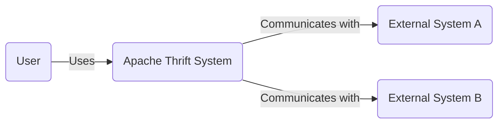
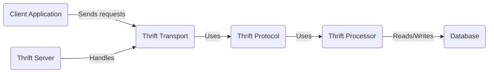
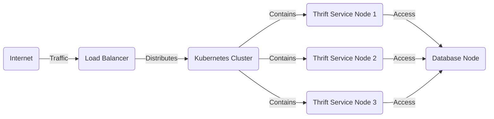
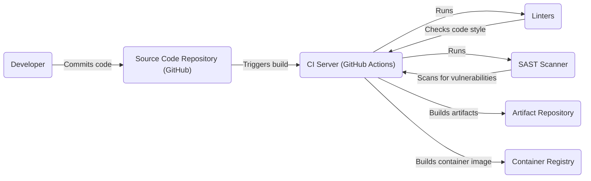

# BUSINESS POSTURE

Business Priorities and Goals:

*   Provide a robust and efficient framework for cross-language communication between services.
*   Enable seamless interoperability between different programming languages and platforms.
*   Minimize the overhead associated with serialization and deserialization of data.
*   Support a wide range of data types and communication protocols.
*   Facilitate the development of scalable and maintainable distributed systems.
*   Offer a stable and well-documented API for developers.
*   Maintain backward compatibility to ensure smooth upgrades.
*   Foster a vibrant open-source community around the project.

Business Risks:

*   Inconsistent or incorrect data serialization/deserialization leading to application errors or crashes.
*   Security vulnerabilities in the framework that could be exploited by attackers to gain unauthorized access or control.
*   Performance bottlenecks that could impact the responsiveness and scalability of applications.
*   Lack of support for new programming languages or protocols, limiting the framework's applicability.
*   Complexity in configuration and usage, hindering developer adoption.
*   Inadequate documentation or support, making it difficult for developers to use the framework effectively.
*   Compatibility issues between different versions of the framework, causing integration problems.

# SECURITY POSTURE

Existing Security Controls:

*   security control: Input validation: The Thrift IDL (Interface Definition Language) enforces type checking, which implicitly provides some level of input validation. (Described in Thrift IDL documentation).
*   security control: Authentication: Some transport layers (e.g., TLS) support authentication mechanisms. (Described in transport layer documentation).
*   security control: Authorization: Thrift does not natively implement authorization, but it can be integrated with external authorization systems. (Needs to be implemented at the application level).
*   security control: Secure Communication: Supports encrypted communication via TLS. (Described in transport layer documentation).

Accepted Risks:

*   accepted risk: Lack of built-in authorization mechanisms: Authorization is left to the application layer, increasing the risk of implementation errors.
*   accepted risk: Potential for vulnerabilities in custom transport or protocol implementations: If custom transports or protocols are used, they may introduce security vulnerabilities if not carefully designed and implemented.
*   accepted risk: Limited input sanitization beyond type checking: While the IDL provides type checking, it doesn't handle more complex validation scenarios, potentially leading to vulnerabilities.

Recommended Security Controls:

*   security control: Implement robust input validation and sanitization beyond basic type checking in the generated code. This should include checks for data length, format, and allowed values.
*   security control: Integrate with a standardized authorization framework (e.g., OAuth 2.0, SPIFFE/SPIRE) to enforce access control policies consistently.
*   security control: Conduct regular security audits and penetration testing of the Thrift framework and its implementations.
*   security control: Provide clear security guidelines and best practices for developers using Thrift.
*   security control: Implement a secure-by-default configuration, minimizing the attack surface.
*   security control: Use memory-safe languages or techniques to minimize the risk of buffer overflows and other memory-related vulnerabilities.
*   security control: Implement robust error handling and logging to aid in debugging and security incident response.

Security Requirements:

*   Authentication:
    *   Support for strong authentication mechanisms (e.g., mutual TLS, Kerberos, JWT).
    *   Integration with existing identity providers (e.g., LDAP, Active Directory, OAuth 2.0 providers).
    *   Protection against common authentication attacks (e.g., brute-force, credential stuffing).

*   Authorization:
    *   Fine-grained access control based on roles, attributes, or policies.
    *   Integration with a centralized authorization service or framework.
    *   Support for dynamic authorization decisions based on context.

*   Input Validation:
    *   Strict validation of all input data based on a predefined schema or rules.
    *   Protection against common injection attacks (e.g., SQL injection, cross-site scripting).
    *   Sanitization of input data to remove potentially harmful characters or sequences.

*   Cryptography:
    *   Use of strong, industry-standard cryptographic algorithms and protocols.
    *   Secure key management practices.
    *   Protection of data in transit and at rest (where applicable).
    *   Support for cryptographic agility (ability to easily switch to new algorithms if needed).

# DESIGN

## C4 CONTEXT

Element Descriptions:

*   Element:
    *   Name: User
    *   Type: Person
    *   Description: Represents a user or system that interacts with the Apache Thrift System.
    *   Responsibilities: Initiates requests and receives responses from the Thrift System.
    *   Security controls: Authentication and authorization are typically handled by the client application interacting with the Thrift service.

*   Element:
    *   Name: Apache Thrift System
    *   Type: Software System
    *   Description: The core system built using Apache Thrift, providing cross-language service communication.
    *   Responsibilities: Handles serialization, deserialization, transport, and protocol processing for inter-service communication.
    *   Security controls: Input validation (via IDL), transport-level security (TLS), application-level authentication and authorization (implementation-dependent).

*   Element:
    *   Name: External System A
    *   Type: Software System
    *   Description: An external system that communicates with the Apache Thrift System. This could be a service written in a different language.
    *   Responsibilities: Provides services or data consumed by the Thrift System, or consumes services provided by the Thrift System.
    *   Security controls: Depends on the specific external system; should implement appropriate security measures for its functionality.

*   Element:
    *   Name: External System B
    *   Type: Software System
    *   Description: Another external system that communicates with the Apache Thrift System.
    *   Responsibilities: Similar to External System A.
    *   Security controls: Depends on the specific external system.

## C4 CONTAINER

Element Descriptions:

*   Element:
    *   Name: Client Application
    *   Type: Container
    *   Description: The application that initiates communication with the Thrift server.
    *   Responsibilities: Generates requests, sends them to the server, and processes responses.
    *   Security controls: Authentication, authorization (client-side), secure communication (TLS).

*   Element:
    *   Name: Thrift Server
    *   Type: Container
    *   Description: The server application that hosts the Thrift service.
    *   Responsibilities: Listens for incoming connections, handles requests, and sends responses.
    *   Security controls: Server-side authentication, authorization, transport-level security (TLS).

*   Element:
    *   Name: Thrift Processor
    *   Type: Container
    *   Description: Handles the business logic of the Thrift service.
    *   Responsibilities: Executes the service methods defined in the Thrift IDL.
    *   Security controls: Input validation, application-level security logic.

*   Element:
    *   Name: Thrift Protocol
    *   Type: Container
    *   Description: Handles the serialization and deserialization of data.
    *   Responsibilities: Converts data between the application-specific format and the Thrift wire format.
    *   Security controls: Data integrity checks (depending on the protocol).

*   Element:
    *   Name: Thrift Transport
    *   Type: Container
    *   Description: Handles the communication channel between the client and server.
    *   Responsibilities: Sends and receives data over the network.
    *   Security controls: Transport-level security (TLS).

*   Element:
    *   Name: Database
    *   Type: Container
    *   Description: A database used by the Thrift service (optional).
    *   Responsibilities: Stores and retrieves data used by the service.
    *   Security controls: Database security measures (authentication, authorization, encryption).

## DEPLOYMENT

Possible Deployment Solutions:

1.  Standalone Servers: Thrift servers deployed directly on physical or virtual machines.
2.  Containerized Deployment (Docker, Kubernetes): Thrift servers packaged as containers and deployed using container orchestration platforms.
3.  Serverless Deployment (AWS Lambda, Azure Functions, Google Cloud Functions): Thrift services implemented as serverless functions.

Chosen Solution: Containerized Deployment (Kubernetes)

Element Descriptions:

*   Element:
    *   Name: Internet
    *   Type: Infrastructure Node
    *   Description: The public internet.
    *   Responsibilities: Source of external traffic.
    *   Security controls: Firewall, intrusion detection/prevention systems.

*   Element:
    *   Name: Load Balancer
    *   Type: Infrastructure Node
    *   Description: Distributes incoming traffic across multiple Thrift service instances.
    *   Responsibilities: Load balancing, health checks.
    *   Security controls: TLS termination, DDoS protection.

*   Element:
    *   Name: Kubernetes Cluster
    *   Type: Infrastructure Node
    *   Description: The container orchestration platform.
    *   Responsibilities: Manages the deployment, scaling, and networking of containers.
    *   Security controls: Kubernetes RBAC, network policies, pod security policies.

*   Element:
    *   Name: Thrift Service Node 1, 2, 3
    *   Type: Container Instance
    *   Description: Instances of the Thrift service running within Kubernetes pods.
    *   Responsibilities: Handling Thrift requests.
    *   Security controls: Container security best practices, resource limits.

*   Element:
    *   Name: Database Node
    *   Type: Infrastructure Node/Container Instance
    *   Description: The database server.
    *   Responsibilities: Data storage and retrieval.
    *   Security controls: Database security measures (authentication, authorization, encryption).

## BUILD

Build Process Description:

1.  Developer commits code to the source code repository (GitHub).
2.  The commit triggers a build on the CI server (GitHub Actions).
3.  The CI server runs linters to check code style and quality.
4.  The CI server runs a SAST (Static Application Security Testing) scanner to identify potential security vulnerabilities in the code.
5.  If the linters and SAST scanner pass, the CI server builds the Thrift service artifacts (e.g., libraries, executables).
6.  The CI server builds a container image containing the Thrift service.
7.  The artifacts are stored in an artifact repository.
8.  The container image is pushed to a container registry.

Security Controls:

*   security control: Code review: All code changes are reviewed by another developer before being merged.
*   security control: Linting: Linters enforce coding standards and identify potential errors.
*   security control: SAST: Static analysis tools scan the code for security vulnerabilities.
*   security control: Dependency scanning: Dependencies are checked for known vulnerabilities.
*   security control: Container image scanning: The container image is scanned for vulnerabilities before being deployed.
*   security control: Signed commits: Developers sign their commits to ensure authenticity.
*   security control: Build automation: The build process is fully automated to ensure consistency and repeatability.

# RISK ASSESSMENT

Critical Business Processes:

*   Cross-language service communication: The core functionality of Thrift is to enable communication between services written in different languages. Any disruption to this process would have a significant impact.
*   Data serialization and deserialization: Correct and efficient data handling is crucial for the integrity and performance of applications using Thrift.

Data Sensitivity:

*   The sensitivity of the data handled by Thrift depends on the specific application. Thrift itself does not inherently handle sensitive data, but it can be used to transport it. Therefore, the data sensitivity is determined by the application using Thrift.  If the application handles PII, financial data, or other sensitive information, then Thrift will be transporting that data, and appropriate security measures (e.g., encryption) must be in place.

# QUESTIONS & ASSUMPTIONS

Questions:

*   What specific programming languages and platforms need to be supported?
*   What are the expected performance requirements (throughput, latency)?
*   What are the specific security requirements of the applications using Thrift?
*   Are there any existing security infrastructure or services that Thrift needs to integrate with?
*   What is the expected scale of deployment (number of services, traffic volume)?
*   What transport protocols are required (TCP, HTTP, etc.)?
*   What are the specific data types that will be used?
*   Are there any regulatory compliance requirements (e.g., GDPR, HIPAA)?

Assumptions:

*   BUSINESS POSTURE: The primary goal is to provide a reliable and efficient cross-language communication framework.
*   BUSINESS POSTURE: The organization has a moderate risk appetite, prioritizing functionality and ease of use, but also recognizing the importance of security.
*   SECURITY POSTURE: Basic security measures (input validation, transport-level security) are in place, but more advanced controls (authorization, comprehensive input sanitization) may be lacking.
*   SECURITY POSTURE: Developers using Thrift have some security awareness, but may not be security experts.
*   DESIGN: The system will be deployed in a containerized environment (Kubernetes).
*   DESIGN: The system will use a CI/CD pipeline for building and deploying the service.
*   DESIGN: The system will use standard Thrift protocols and transports.
*   DESIGN: The system will likely interact with other services, potentially written in different languages.