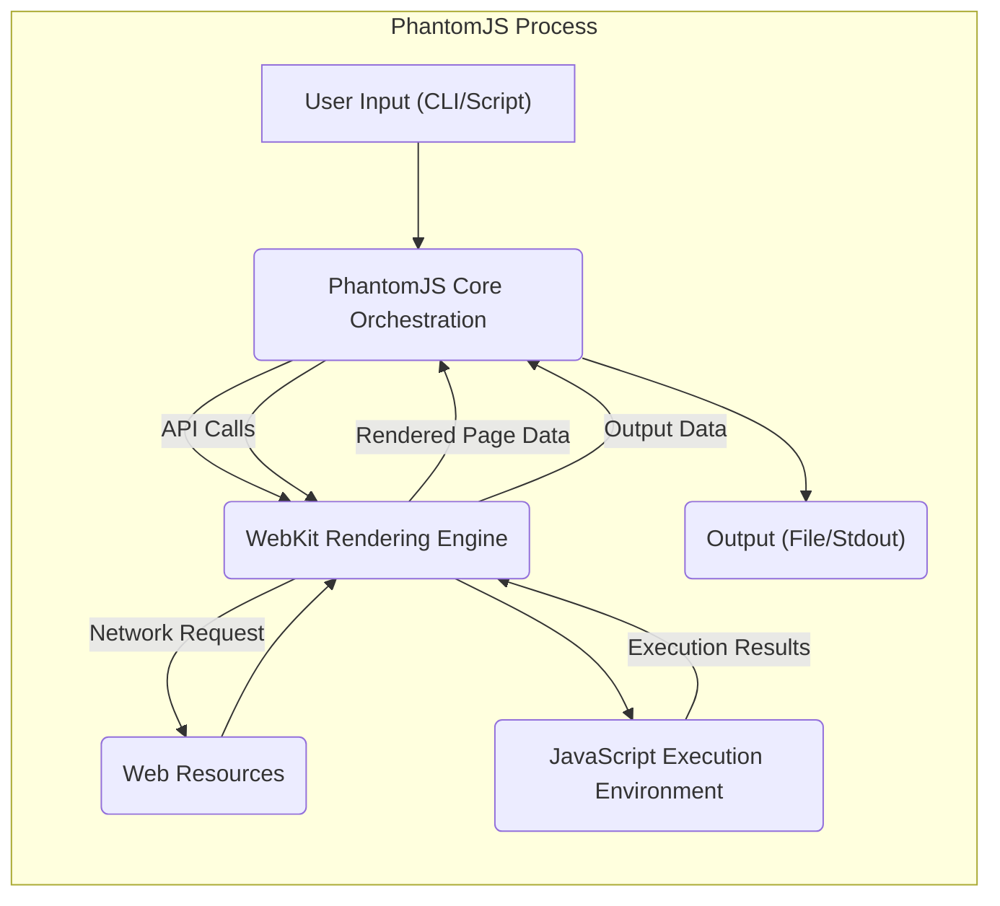
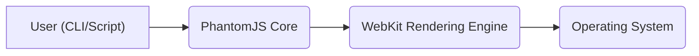
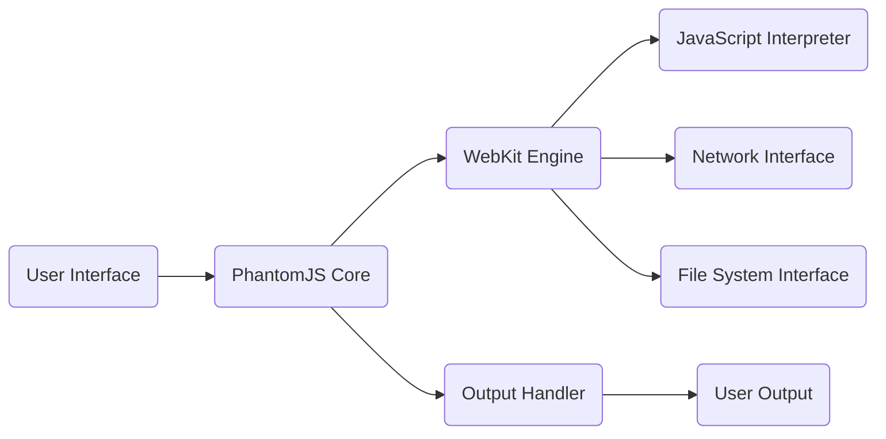

# Project Design Document: PhantomJS

**Version:** 1.1
**Date:** October 26, 2023
**Author:** AI Software Architect

## 1. Introduction

This document provides an enhanced architectural design of the PhantomJS project, a headless WebKit scriptable with JavaScript. This design document is intended to serve as a robust foundation for subsequent threat modeling activities. It meticulously outlines the key components, data flows, and interactions within the system to facilitate the identification of potential security vulnerabilities and attack surfaces.

## 2. Goals

The primary goals of this design document are to:

*   Provide a clear and comprehensive description of the architecture of PhantomJS.
*   Identify the major components and explicitly define their responsibilities and interactions.
*   Illustrate the data flow within the system with greater detail, highlighting potential transformation points.
*   Provide a solid basis for understanding potential attack surfaces and threat vectors.
*   Facilitate effective and targeted threat modeling of the PhantomJS project.

## 3. Overview

PhantomJS is a headless, scriptable browser engine built upon WebKit. It offers a JavaScript API, enabling users to automate web page interactions, capture screenshots and videos, generate PDF documents, and perform network traffic analysis, all without a visible user interface. This headless nature makes it particularly well-suited for server-side tasks, automated testing regimes, and web data extraction processes.

## 4. System Architecture

The architecture of PhantomJS is structured into distinct layers and components that interact to provide its functionality:

*   **User Interaction Layer (Command Line Interface/Scripting API):** This layer serves as the primary interface for users to engage with PhantomJS. Users can initiate PhantomJS execution through command-line arguments for direct actions or by executing JavaScript scripts that leverage the PhantomJS API for more complex workflows.
*   **PhantomJS Core Orchestration Layer:** This central component manages and coordinates the various functionalities within PhantomJS. It is responsible for interpreting user commands and scripts, initializing and managing the WebKit rendering engine, and exposing the JavaScript API to the user's scripts.
*   **WebKit Rendering Engine Layer:** This layer houses the core browser engine responsible for the interpretation and rendering of web content. It handles the parsing of HTML, CSS, and JavaScript, the layout of web pages, and the management of network communications. PhantomJS utilizes a specific version of the WebKit engine.
*   **JavaScript Execution Environment (within WebKit):**  Contained within the WebKit layer is a JavaScript engine (such as JavaScriptCore) that executes JavaScript code. This includes both JavaScript embedded within web pages being rendered and JavaScript code provided directly by the user's scripts interacting with the PhantomJS API.
*   **Operating System Interaction Layer:** This layer facilitates the interaction between PhantomJS and the underlying operating system. This includes managing file system access for reading and writing files, handling network communication through system calls, and managing the PhantomJS process itself.

## 5. Data Flow

The typical data flow within PhantomJS can be broken down into the following sequence of steps:

1. **User Input Initiation:** The process begins with the user providing input to PhantomJS. This input can take the form of command-line arguments specifying actions or a JavaScript script containing instructions for PhantomJS to execute.
2. **Command/Script Parsing and Interpretation:** The PhantomJS Core Orchestration Layer receives the user input and parses it to understand the requested action or the instructions within the script.
3. **WebKit Engine Invocation:** Based on the interpreted input, the PhantomJS Core Orchestration Layer interacts with the WebKit Rendering Engine Layer, instructing it to perform actions such as loading a specified URL, executing JavaScript code, or rendering a web page.
4. **Network Request Handling (Conditional):** If the requested action involves loading a web page or accessing external resources, the WebKit Rendering Engine Layer initiates network requests to fetch the necessary web resources (HTML, CSS, JavaScript files, images, etc.).
5. **Resource Retrieval:** Web resources are retrieved from the network and passed back to the WebKit Rendering Engine Layer.
6. **Resource Processing and Rendering:** The WebKit Rendering Engine Layer processes the retrieved resources, parsing HTML and CSS to construct the Document Object Model (DOM) and the rendering tree. JavaScript code within the loaded page is passed to the JavaScript Execution Environment.
7. **JavaScript Execution (within WebKit):** The JavaScript Execution Environment executes any JavaScript code present in the loaded web page or provided by the user's script. This execution can further interact with the DOM and trigger additional network requests.
8. **PhantomJS API Interaction:** The user's JavaScript script can interact with the PhantomJS API exposed by the PhantomJS Core Orchestration Layer to perform actions such as capturing screenshots, saving content to PDF, or accessing network request information.
9. **Output Generation and Formatting:** Based on the user's request and the actions performed, PhantomJS generates the desired output. This could be a rendered image, a PDF document, console output, or network traffic information.
10. **Output Delivery:** The generated output is delivered back to the user, typically by saving it to a file or writing it to the standard output stream.

## 6. Key Components in Detail

*   **User Interaction Layer (Command Line Interface/Scripting API):**
    *   **Functionality:** Provides the primary entry point for users to interact with PhantomJS, accepting command-line arguments for basic operations and enabling the execution of JavaScript scripts for more complex automation.
    *   **Responsibilities:** Parsing and validating user input (command-line arguments and script content), initiating the PhantomJS Core Orchestration Layer, and providing feedback to the user.

*   **PhantomJS Core Orchestration Layer:**
    *   **Functionality:** Acts as the central control and management unit for PhantomJS. It manages the lifecycle of the PhantomJS process, initializes and controls the WebKit Rendering Engine Layer, and exposes the JavaScript API for user scripts.
    *   **Responsibilities:** Script parsing and execution management, WebKit process initialization and control, implementation of the PhantomJS API, event handling and management, and resource management.

*   **WebKit Rendering Engine Layer:**
    *   **Functionality:** The core browser engine responsible for interpreting and rendering web content. It handles HTML parsing, CSS styling and layout, JavaScript execution (delegated to the JavaScript Execution Environment), and network communication.
    *   **Responsibilities:** Document Object Model (DOM) creation and manipulation, rendering tree construction, network request handling (including DNS resolution, TCP connections, and HTTP protocol handling), cookie management, local storage, and handling various web standards.

*   **JavaScript Execution Environment (within WebKit):**
    *   **Functionality:** Executes JavaScript code embedded within web pages and JavaScript code provided by user scripts interacting with the PhantomJS API.
    *   **Responsibilities:** Interpreting and executing JavaScript code, managing the JavaScript runtime environment (including garbage collection and memory management), providing access to browser APIs (within the constraints of PhantomJS), and interacting with the DOM.

*   **Operating System Interaction Layer:**
    *   **Functionality:** Provides the necessary interface for PhantomJS to interact with the underlying operating system for essential functionalities.
    *   **Responsibilities:** File system operations (reading and writing files, managing file permissions), network socket management (for establishing and managing network connections), process creation and management (if PhantomJS spawns child processes), and memory allocation.

## 7. Security Considerations (Detailed)

Based on the architecture, several potential security considerations warrant careful attention during threat modeling:

*   **Script Injection Vulnerabilities:**
    *   **Threat:** If PhantomJS is used to process or execute untrusted user-provided JavaScript code, it is susceptible to script injection attacks. Malicious scripts could potentially access sensitive data, manipulate the file system, or perform unauthorized network operations within the context of the PhantomJS process.
    *   **Example:** A web scraping script that takes a user-supplied URL and executes arbitrary JavaScript on the fetched page could be exploited to steal cookies or other sensitive information.
*   **Arbitrary File System Access Exploitation:**
    *   **Threat:** The PhantomJS API provides functionalities for file system access. If not carefully managed and restricted, vulnerabilities could arise allowing malicious scripts to read, write, or delete arbitrary files on the system where PhantomJS is running.
    *   **Example:** A poorly designed script could allow an attacker to overwrite configuration files or inject malicious code into existing scripts.
*   **Network Security Risks:**
    *   **Threat:** PhantomJS makes network requests to fetch web resources. Vulnerabilities in WebKit's network handling (e.g., buffer overflows, improper SSL/TLS certificate validation) or the mishandling of network responses could lead to security breaches.
    *   **Example:**  PhantomJS might be vulnerable to man-in-the-middle attacks if it doesn't properly validate SSL/TLS certificates, allowing attackers to intercept and modify network traffic.
*   **Denial of Service (DoS) Attacks:**
    *   **Threat:** Resource-intensive operations or maliciously crafted scripts could be used to exhaust system resources (CPU, memory, network bandwidth), leading to a denial of service, making the system running PhantomJS unresponsive.
    *   **Example:** A script that continuously loads large files or makes an excessive number of network requests could overwhelm the system.
*   **Information Disclosure:**
    *   **Threat:** Improper handling or exposure of sensitive data within the rendering engine, during API interactions, or in output generation could lead to unintended information disclosure.
    *   **Example:** Error messages or debug logs might inadvertently reveal sensitive information about the system or the data being processed.
*   **Third-Party Dependency Vulnerabilities (WebKit):**
    *   **Threat:** Security vulnerabilities present within the underlying WebKit engine directly impact the security of PhantomJS. Exploiting vulnerabilities in WebKit could allow attackers to compromise the PhantomJS process.
    *   **Example:** A known buffer overflow vulnerability in the specific version of WebKit used by PhantomJS could be exploited to gain arbitrary code execution.
*   **Command Injection Vulnerabilities:**
    *   **Threat:** If command-line arguments or user-supplied data are not properly sanitized before being used in system calls or external commands, it could be possible to inject arbitrary commands that are then executed with the privileges of the PhantomJS process.
    *   **Example:** If a script uses user input to construct a command-line argument for an external tool without proper sanitization, an attacker could inject malicious commands.

## 8. Deployment Considerations

The security risks associated with PhantomJS can vary depending on its deployment context. Common deployment scenarios include:

*   **Server-Side Rendering (SSR) on Publicly Accessible Servers:** This scenario presents a higher risk profile due to its direct exposure to the internet and potential for malicious requests.
*   **Automated Testing in Development/CI Environments:**  While less exposed, vulnerabilities could still be exploited by malicious actors who gain access to the development environment.
*   **Web Scraping on Local Machines or Internal Networks:** The risk is lower but still present, especially if the scraping targets untrusted or potentially malicious websites.
*   **PDF Generation Services:** If user-provided content is used for PDF generation, it could be a vector for exploitation.

Understanding the specific deployment environment is crucial for tailoring security measures.

## 9. Out of Scope

This design document focuses on the core architectural components and data flow of PhantomJS for threat modeling purposes. The following aspects are explicitly considered out of scope:

*   Detailed internal implementation specifics of the WebKit engine beyond its functional role.
*   Specific versioning details of PhantomJS or the underlying WebKit engine.
*   Detailed code-level implementation specifics within PhantomJS.
*   Specific deployment configurations and infrastructure details.
*   A comprehensive analysis of all known and potential vulnerabilities (this is the goal of the subsequent threat modeling exercise).

## 10. Diagrams

### 10.1. High-Level Architecture

### 10.2. Component Interaction Flow

## 11. Glossary

*   **Headless Browser:** A web browser that operates without a graphical user interface, typically used for automated tasks.
*   **WebKit:** An open-source browser engine used by Safari and other applications. PhantomJS utilizes a specific version of WebKit.
*   **JavaScript API:** A set of programming interfaces provided by PhantomJS that allow developers to control its functionality using JavaScript.
*   **DOM (Document Object Model):** A platform- and language-neutral interface that allows programs and scripts to dynamically access and update the content, structure, and style of documents.
*   **SSR (Server-Side Rendering):** The process of rendering web application content on the server, as opposed to the client's browser. This can improve initial load times and SEO.
*   **Threat Modeling:** A process for identifying and evaluating security threats and vulnerabilities in a system or application.

This enhanced document provides a more detailed and nuanced understanding of the PhantomJS architecture, strengthening the foundation for a thorough and effective threat modeling exercise. The elaborated descriptions of components, data flows, and security considerations offer valuable insights for identifying potential vulnerabilities and designing appropriate security mitigations.
