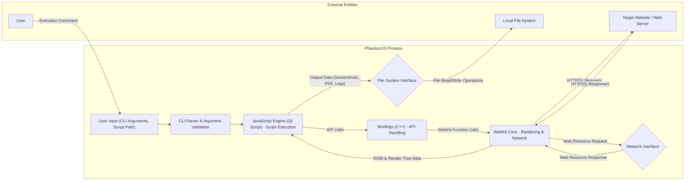

# Project Design Document: PhantomJS

**Version:** 1.1
**Date:** October 26, 2023
**Prepared By:** Gemini (AI Language Model)

## 1. Introduction

This document provides an enhanced and more detailed design overview of the PhantomJS project, specifically tailored for threat modeling. It meticulously outlines the architectural components, data flows, and interactions within the system to facilitate a comprehensive assessment of potential security vulnerabilities and attack surfaces. This document builds upon the previous version by providing greater depth and clarity in key areas.

## 2. Project Overview

PhantomJS is a headless, scriptable browser engine based on WebKit, controlled via a JavaScript API. It operates without a graphical user interface, making it suitable for automated tasks such as web scraping, website testing, capturing screenshots, and generating PDF documents from web pages. While no longer under active development, understanding its internal workings remains critical for security analysis, particularly when dealing with legacy systems or forks derived from it. Its architecture and functionalities present unique security considerations.

## 3. Goals

*   Provide a highly detailed and unambiguous description of the PhantomJS architecture, emphasizing security-relevant aspects.
*   Clearly identify the responsibilities and potential vulnerabilities associated with each major component.
*   Precisely outline the flow of data within the system, highlighting potential interception and manipulation points.
*   Thoroughly document all external interactions and dependencies, analyzing their security implications.
*   Serve as a robust and actionable foundation for identifying and analyzing potential threat vectors during the threat modeling process.

## 4. Target Audience

This document is intended for:

*   Security architects and engineers responsible for conducting threat modeling and security assessments.
*   Developers who are currently working with or maintaining systems that integrate or depend on PhantomJS.
*   Security researchers seeking a deep understanding of the PhantomJS architecture for vulnerability analysis.
*   Anyone requiring a detailed technical understanding of PhantomJS from a security perspective.

## 5. System Architecture

PhantomJS comprises several interconnected components, each with specific functionalities and potential security implications:

*   **WebKit Core:**
    *   **Description:** The fundamental rendering engine responsible for parsing and interpreting HTML, CSS, SVG, and JavaScript. It constructs the Document Object Model (DOM) and renders the visual layout of web pages. It also handles network requests and responses for various web resources.
    *   **Security Relevance:**  Vulnerabilities within WebKit itself (e.g., memory corruption bugs, rendering flaws) can be exploited by malicious web content. Its network handling capabilities are a key attack surface.
*   **JavaScript Engine (Qt Script):**
    *   **Description:** The JavaScript runtime environment that executes both user-provided scripts and JavaScript embedded within web pages. It provides APIs to interact with the WebKit core and the underlying operating system.
    *   **Security Relevance:**  Vulnerabilities in the JavaScript engine can lead to arbitrary code execution. The exposed APIs represent a significant attack surface if not carefully designed and used.
*   **Bindings (C++):**
    *   **Description:** The crucial intermediary layer, implemented in C++, that bridges the gap between the WebKit core and the JavaScript engine. It exposes WebKit functionalities to the JavaScript environment through a defined set of APIs and manages data exchange between the two.
    *   **Security Relevance:**  Bugs in the bindings can lead to privilege escalation or allow JavaScript code to bypass security restrictions. Improperly secured data exchange can also introduce vulnerabilities.
*   **Command-Line Interface (CLI):**
    *   **Description:** The primary interface through which users interact with PhantomJS. It accepts command-line arguments to specify the JavaScript script to execute, various configuration options, and output settings. It manages the lifecycle of the PhantomJS process.
    *   **Security Relevance:**  The CLI is a direct entry point for user input. Improper parsing or validation of command-line arguments can lead to command injection vulnerabilities.
*   **File System Access:**
    *   **Description:** PhantomJS scripts have the capability to interact with the local file system, allowing them to read and write files. This functionality is used for input, output, configuration, and potentially other purposes.
    *   **Security Relevance:**  Unrestricted file system access can be exploited to read sensitive data, overwrite critical files, or execute malicious code. Path traversal vulnerabilities are a significant concern.
*   **Network Access:**
    *   **Description:** Essential for fetching web resources and communicating with remote servers. PhantomJS supports various network protocols, including HTTP, HTTPS, and potentially others. It handles DNS resolution and manages network connections.
    *   **Security Relevance:**  Network interactions expose PhantomJS to various network-based attacks, such as man-in-the-middle attacks, server-side vulnerabilities, and DNS spoofing.
*   **Configuration:**
    *   **Description:** PhantomJS behavior can be customized through various configuration options, which can be set via command-line arguments or through the JavaScript API. These settings control aspects like proxy server usage, user agent strings, and other browser-related behaviors.
    *   **Security Relevance:**  Improperly configured settings can weaken security. For example, disabling security features or using insecure proxy configurations can increase vulnerability.

## 6. Data Flow

The following diagram illustrates the typical flow of data within a PhantomJS execution:

**Detailed Data Flow Description:**

*   **User Input:** The process begins with the user providing input via the command line, including arguments and the path to the JavaScript script to be executed.
*   **CLI Parsing & Argument Validation:** The CLI parser interprets the command-line arguments. Crucially, this stage should include robust validation to prevent injection attacks.
*   **JavaScript Engine (Script Execution):** The JavaScript engine loads and executes the provided script. This script utilizes PhantomJS APIs to interact with the underlying browser engine.
*   **Bindings (API Handling):** When the JavaScript script calls a PhantomJS API, these calls are handled by the C++ bindings. This layer translates the JavaScript requests into actions for the WebKit core.
*   **WebKit Core (Rendering & Network):** The WebKit core performs the core browser functionalities, including fetching web resources from the network, parsing HTML, CSS, and JavaScript, and rendering the web page.
*   **Network Interface:** PhantomJS interacts with external web servers through the network interface to retrieve web resources. This involves sending requests and receiving responses.
*   **DOM & Render Tree Data:** The rendered web page data, including the DOM and render tree, is passed back to the JavaScript engine, allowing the script to interact with and manipulate the page.
*   **File System Interface:** The JavaScript script can instruct PhantomJS to interact with the local file system for reading input data or writing output, such as screenshots, PDF documents, or log files.

## 7. Interactions with External Entities

PhantomJS interacts with several external entities, each presenting potential security considerations:

*   **User:**
    *   **Interaction:** Initiates PhantomJS execution via the command line, provides JavaScript scripts, and receives output.
    *   **Security Implications:**  Malicious users could provide crafted scripts or command-line arguments to exploit vulnerabilities. User permissions and access control are important.
*   **Target Websites / Web Servers:**
    *   **Interaction:** PhantomJS fetches web resources, sends HTTP(S) requests, and processes responses from target websites.
    *   **Security Implications:**  PhantomJS is vulnerable to attacks originating from malicious websites, such as XSS, CSRF (if applicable), and other web-based exploits. The security posture of the target website directly impacts PhantomJS.
*   **Local File System:**
    *   **Interaction:** PhantomJS reads input data from files and writes output data to files.
    *   **Security Implications:**  Improper file permissions can allow unauthorized access. Malicious scripts could read sensitive data or overwrite critical system files. Path traversal vulnerabilities could allow access to unintended locations.
*   **Network:**
    *   **Interaction:** PhantomJS communicates with remote servers to fetch web resources, potentially using DNS.
    *   **Security Implications:**  Susceptible to man-in-the-middle attacks if HTTPS is not enforced or properly validated. DNS spoofing could redirect PhantomJS to malicious servers.

## 8. Security Considerations (Detailed)

This section expands on the initial security considerations, providing more specific examples and potential attack scenarios:

*   **Input Validation Vulnerabilities:**
    *   **Command Injection:**  If command-line arguments are not properly sanitized, attackers could inject arbitrary commands that are executed by the underlying operating system. Example: Passing a malicious filename that includes shell commands.
    *   **Script Injection:**  Malicious JavaScript code provided as input could exploit vulnerabilities in the JavaScript engine or the PhantomJS APIs to gain unauthorized access or execute arbitrary code.
*   **Network Security Weaknesses:**
    *   **Man-in-the-Middle (MITM) Attacks:** When communicating with websites over HTTP, attackers can intercept and potentially modify the communication. Even with HTTPS, improper certificate validation can leave PhantomJS vulnerable.
    *   **Exposure to Server-Side Vulnerabilities:** PhantomJS might interact with vulnerable web applications, potentially triggering exploits like SQL injection or remote code execution on the server-side.
    *   **DNS Spoofing:** If the DNS resolution process is compromised, PhantomJS could be redirected to malicious websites.
*   **File System Security Flaws:**
    *   **Arbitrary File Read/Write:** Malicious scripts could read sensitive configuration files, user data, or system files. They could also overwrite critical files, leading to denial of service or system compromise.
    *   **Path Traversal:**  Improper handling of file paths in scripts could allow attackers to access files outside of the intended directories. Example: Using "../" in file paths to access parent directories.
*   **JavaScript Engine and API Vulnerabilities:**
    *   **Sandbox Escapes:**  Vulnerabilities in the JavaScript engine could allow malicious scripts to break out of the intended security sandbox and execute arbitrary code with the privileges of the PhantomJS process.
    *   **API Exploitation:**  Flaws in the PhantomJS APIs could be exploited to perform actions that should not be allowed, such as bypassing security checks or accessing restricted resources.
*   **Dependency Vulnerabilities:**
    *   **Outdated WebKit:**  The underlying WebKit engine might contain known vulnerabilities that have been patched in newer versions. Since PhantomJS is no longer maintained, these vulnerabilities remain unaddressed.
    *   **Outdated Qt Libraries:** Similarly, outdated Qt libraries could contain security flaws.
*   **Lack of Active Maintenance:**
    *   **Zero-Day Vulnerabilities:**  New vulnerabilities discovered in PhantomJS will likely remain unpatched, making systems using it increasingly vulnerable over time.

## 9. Future Considerations (Hypothetical)

While PhantomJS is not actively developed, considering potential extensions can be useful for understanding the attack surface of similar projects or forks:

*   **Browser Extension Support:**  Adding support for browser extensions could introduce new attack vectors through malicious or vulnerable extensions.
*   **Integration with Native Libraries:**  Allowing JavaScript to interact with native libraries could introduce vulnerabilities if these interactions are not carefully controlled.
*   **Enhanced Networking Capabilities:**  Adding support for more complex network protocols or features could introduce new attack surfaces.

## 10. Conclusion

This enhanced design document provides a detailed and security-focused overview of the PhantomJS project. By meticulously outlining its architecture, data flow, and interactions, it serves as a robust foundation for conducting thorough threat modeling. The detailed security considerations highlight the critical areas that require careful analysis to identify and mitigate potential risks associated with using PhantomJS, especially given its lack of active maintenance. This document aims to empower security professionals and developers to understand and address the security challenges posed by this legacy technology.