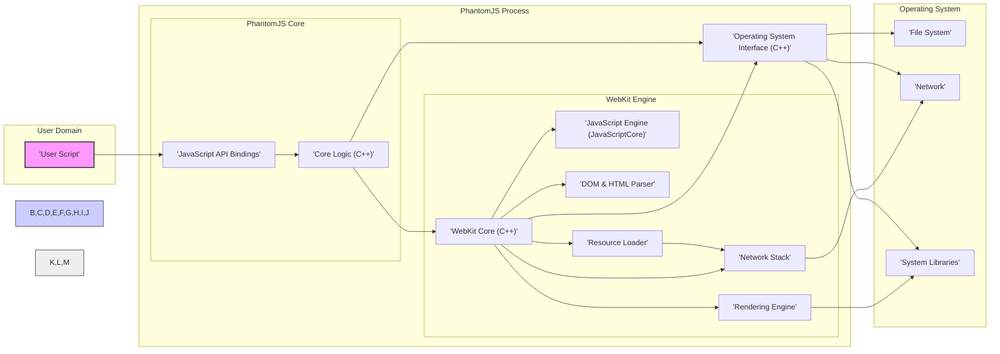

# Project Design Document: PhantomJS for Threat Modeling (Improved)

**Project Name:** PhantomJS

**Project Repository:** [https://github.com/ariya/phantomjs](https://github.com/ariya/phantomjs) (Archived)

**Document Version:** 1.1

**Date:** 2023-10-27

**Author:** AI Software Architect

**Changes from Version 1.0:**

*   Enhanced component descriptions with more detail.
*   Improved data flow diagram with data type annotations.
*   Expanded security considerations with more specific threat examples and potential mitigations (briefly).
*   Clarified external interface details and security implications.
*   Reinforced the archived status of PhantomJS and its context for historical analysis.

## 1. Project Overview

PhantomJS was a headless WebKit browser with a JavaScript API, designed for automating web page interactions without a GUI.  Although archived and no longer maintained, analyzing its architecture remains valuable for understanding headless browser technologies and their security implications. This document provides a detailed design of PhantomJS to facilitate threat modeling, focusing on aspects relevant to cybersecurity.

**Primary Use Cases (Historically):**

*   **Automated Web Testing:** Functional and UI testing of web applications in a headless environment.
*   **Web Scraping and Data Extraction:** Programmatic retrieval of data from websites for analysis or aggregation.
*   **Website Performance Monitoring:** Automated checks for website availability, load times, and functional correctness.
*   **Web Page Rendering (PDF/Image):** Server-side generation of PDF reports or website screenshots.
*   **Network Traffic Interception and Analysis:** Capturing and inspecting network requests and responses for debugging or security analysis.

**Security Focus:**

This document emphasizes security aspects of PhantomJS, specifically for threat modeling. Key areas of focus include:

*   **Data Flow Security:** Analyzing how data is processed and transformed within PhantomJS to identify potential vulnerabilities in data handling.
*   **Inter-Component Security:** Examining interactions between PhantomJS modules to uncover vulnerabilities arising from trust boundaries and communication channels.
*   **External Attack Surface:** Identifying and analyzing external interfaces (user scripts, network, file system, CLI) as potential entry points for attacks.
*   **Legacy Vulnerabilities:** Recognizing that as an archived project, PhantomJS is likely to contain unpatched vulnerabilities that would be critical in a live system.

## 2. System Architecture

PhantomJS's architecture is layered, encompassing user interaction, core logic, the WebKit engine, and operating system interactions.

*   **User Script Layer:**  User-provided JavaScript code controlling PhantomJS behavior.
*   **PhantomJS Core (JavaScript API & C++ Logic):**  Provides the JavaScript API and core C++ implementation bridging user scripts and WebKit.
*   **WebKit Engine:** The browser engine responsible for web content processing, rendering, and network operations.
*   **Operating System Interface:**  Abstraction layer for OS interactions (file system, network, system calls).

### 2.1. High-Level Architecture Diagram



**Diagram Explanation (Enhanced):**

*   **'User Script'**: JavaScript code provided by the user, the primary control interface.
*   **'JavaScript API Bindings'**: C++ layer exposing PhantomJS and WebKit functionalities to JavaScript user scripts (e.g., `webpage.open()`, `phantom.exit()`).
*   **'Core Logic (C++)'**: C++ code managing PhantomJS lifecycle, API request handling, process management, and interaction with WebKit and OS.
*   **'WebKit Core (C++)'**: Orchestrates WebKit modules, manages page state, and handles events.
*   **'JavaScript Engine (JavaScriptCore)'**: WebKit's JavaScript virtual machine, executing JavaScript code from web pages and user scripts. Critical for handling dynamic web content and user script logic.
*   **'Network Stack'**: Handles network protocols (HTTP, HTTPS, FTP, etc.), SSL/TLS, cookie management, request routing, and response processing. Includes components for DNS resolution, connection management, and data transfer.
*   **'Rendering Engine'**:  Layout and rendering engine converting DOM and CSS into visual output. Includes HTML layout, CSS styling, and graphics rendering.
*   **'DOM & HTML Parser'**: Parses HTML and XML documents, constructs the Document Object Model (DOM) tree, and handles HTML5 features.
*   **'Resource Loader'**: Responsible for fetching resources (HTML, CSS, JavaScript, images, etc.) from network or local file system, interacting with the Network Stack and File System.
*   **'Operating System Interface (C++)'**:  Abstraction layer for OS interactions: file I/O, network socket operations, process management, memory allocation, and system calls.
*   **'File System'**: OS file system, used for loading local files, saving output, and potentially configuration.
*   **'Network'**: OS network stack, providing network connectivity for PhantomJS.
*   **'System Libraries'**: OS-provided libraries used by PhantomJS and WebKit (e.g., graphics libraries, system utilities).

## 3. Component Description (Enhanced)

### 3.1. User Script Layer

*   **Functionality:**  Provides user control over PhantomJS via JavaScript. Scripts can automate browser actions, manipulate web pages, and extract data.
*   **Security Relevance:**  Direct user input point. Malicious scripts can exploit vulnerabilities in PhantomJS, WebKit, or the OS. Unvalidated script input can lead to injection attacks or unexpected behavior.
*   **Example Threats:**
    *   **Malicious Script Injection:** User provides a script designed to exploit a known PhantomJS vulnerability.
    *   **Data Exfiltration:** Script designed to scrape sensitive data and send it to an external server.
    *   **Denial of Service:** Script causing excessive resource consumption or crashes in PhantomJS.

### 3.2. PhantomJS Core (JavaScript API & Core Logic)

*   **Functionality:** Bridges user scripts and WebKit. Manages API calls, process lifecycle, and configuration.
*   **Components:**
    *   **'JavaScript API Bindings'**:  Translates JavaScript API calls into C++ function calls.
    *   **'Core Logic (C++)'**:  Handles API requests, manages WebKit instance, interacts with OS interface, and manages PhantomJS settings.
*   **Security Relevance:**  Vulnerabilities in API bindings or core logic can lead to privilege escalation, arbitrary code execution, or bypass of security mechanisms. Improper input validation in API handlers is a key concern.
*   **Example Threats:**
    *   **API Function Abuse:**  Exploiting an API function with insufficient security checks to perform unauthorized actions.
    *   **Buffer Overflow in API Binding:**  Sending overly long strings through the API causing a buffer overflow in the C++ binding code.
    *   **Logic Flaws in Core Logic:**  Exploiting logical errors in core C++ code to bypass security checks or cause crashes.

### 3.3. WebKit Engine (Enhanced Breakdown)

*   **Functionality:** Core browser engine. Parses HTML, CSS, executes JavaScript, renders web pages, and handles network communication.
*   **Components (More Granular):**
    *   **'WebKit Core (C++)'**:  Central orchestration and management of WebKit modules.
    *   **'JavaScript Engine (JavaScriptCore)'**: Executes JavaScript. Vulnerabilities here are often critical (e.g., type confusion, JIT bugs).
    *   **'Network Stack'**:
        *   **'HTTP/HTTPS Handling'**: Request/response processing, header parsing, protocol implementation.
        *   **'SSL/TLS Implementation'**: Secure communication, certificate validation.
        *   **'Cookie Management'**: Handling and storage of cookies.
        *   **'DNS Resolver'**: Domain name resolution.
    *   **'Rendering Engine'**:
        *   **'HTML Layout Engine'**:  Calculates page layout based on HTML and CSS.
        *   **'CSS Parser & Style Engine'**: Parses CSS and applies styles to DOM elements.
        *   **'Graphics Engine'**:  Rasterization and drawing of rendered content.
    *   **'DOM & HTML Parser'**: Parses HTML and XML, constructs DOM. Vulnerabilities can arise from parsing complex or malformed HTML.
    *   **'Resource Loader'**: Fetches resources, handles caching, and interacts with the network stack and file system.
*   **Security Relevance:** WebKit is a complex and historically vulnerable component. Vulnerabilities in any of its sub-components can be exploited via malicious web pages or user scripts interacting with web content.
*   **Example Threats:**
    *   **JavaScript Engine Vulnerabilities:** Type confusion, heap overflows in JavaScriptCore leading to arbitrary code execution.
    *   **Rendering Engine Vulnerabilities:**  Heap overflows or use-after-free vulnerabilities in layout or graphics rendering code triggered by crafted HTML/CSS.
    *   **Network Stack Vulnerabilities:**  SSL/TLS vulnerabilities (e.g., Heartbleed, BEAST - historically relevant), HTTP header injection, DNS poisoning.
    *   **DOM Parser Vulnerabilities:**  Cross-site scripting (XSS) vulnerabilities due to improper handling of HTML input, DOM clobbering.

### 3.4. Operating System Interface

*   **Functionality:** Provides access to OS functionalities.
*   **Components:** C++ code wrapping OS system calls and libraries.
*   **Security Relevance:**  Improperly secured OS interfaces can allow attackers to escape PhantomJS's intended sandbox (if any) and interact directly with the OS. File system and network access are high-risk areas.
*   **Example Threats:**
    *   **Path Traversal:** Exploiting file system API to access files outside of intended directories.
    *   **Arbitrary File Write:**  Using file system API to write malicious files to arbitrary locations.
    *   **Unrestricted Network Access:**  Bypassing intended network restrictions to connect to unauthorized servers or ports.
    *   **System Call Abuse:**  Exploiting vulnerabilities in the OS interface to make unauthorized system calls.

## 4. Data Flow Diagram (Enhanced)

This diagram illustrates data flow with data type annotations for better threat analysis.

```mermaid
graph LR
    subgraph "User Domain"
        US["'User Script (JavaScript)'"]
    end
    subgraph "PhantomJS Process"
        API["'JavaScript API Bindings'"]
        CL["'Core Logic (C++)'"]
        JS["'JavaScript Engine'"]
        NET["'Network Stack'"]
        REN["'Rendering Engine'"]
        DOM["'DOM & HTML Parser'"]
        OSI["'OS Interface'"]
    end
    subgraph "External World"
        WEB["'Web Server (HTTP/HTTPS)'"]
        FS["'File System'"]
        OUTPUT["'Output (Image/PDF/Console)'"]
    end

    US --> API: "'API Commands, Data'"
    API --> CL: "'API Requests, Data'"
    CL --> JS: "'JavaScript Code, Execution Context'"
    CL --> NET: "'Network Requests (URLs, Headers)'"
    CL --> REN: "'Rendering Instructions, DOM Tree'"
    CL --> DOM: "'HTML/XML Data'"
    CL --> OSI: "'OS Operations (File Paths, Network Sockets)'"

    JS --> DOM: "'DOM Manipulation Commands, DOM Nodes'"
    JS --> NET: "'XMLHttpRequest/fetch Requests, URLs'"
    JS --> REN: "'Rendering Updates, Style Changes'"

    NET --> WEB: "'HTTP/HTTPS Requests'"
    WEB --> NET: "'Web Content (HTML, CSS, JavaScript, Images)'"
    NET --> JS: "'JavaScript Code from Web Content'"
    NET --> DOM: "'HTML Data from Web Content'"

    DOM --> REN: "'DOM Tree (Renderable Structure)'"
    REN --> OUTPUT: "'Rendered Output (Pixel Data, PDF Commands)'"
    OSI --> FS: "'File Read/Write Requests, File Paths, Data'"
    OSI --> OUTPUT: "'Console Output (Text Data)'"
    US --> OUTPUT: "'Console Output (console.log Text)'"


    style US fill:#f9f,stroke:#333,stroke-width:2px
    style API,CL,JS,NET,REN,DOM,OSI fill:#ccf,stroke:#333,stroke-width:1px
    style WEB,FS,OUTPUT fill:#eee,stroke:#333,stroke-width:1px

    linkStyle 0,1,2,3,4,5,6,7,8,9,10,11,12,13,14,15,16,17,18,19,20 stroke:#333,stroke-width:1px;
```

**Data Flow Explanation (Enhanced):**

*   **'API Commands, Data'**: User scripts send commands and data to the API (e.g., "open URL", "evaluate JavaScript").
*   **'API Requests, Data'**: API bindings pass requests and data to the core logic for processing.
*   **'JavaScript Code, Execution Context'**: Core logic provides JavaScript code and execution context to the JavaScript engine.
*   **'Network Requests (URLs, Headers)'**: Core logic instructs the network stack to make requests with specific URLs and headers.
*   **'Rendering Instructions, DOM Tree'**: Core logic sends rendering instructions and the DOM tree to the rendering engine.
*   **'HTML/XML Data'**: Core logic provides HTML/XML data to the DOM parser.
*   **'OS Operations (File Paths, Network Sockets)'**: Core logic requests OS operations via the OS interface, specifying file paths, network sockets, etc.
*   **'DOM Manipulation Commands, DOM Nodes'**: JavaScript engine manipulates the DOM based on script execution.
*   **'XMLHttpRequest/fetch Requests, URLs'**: JavaScript code can initiate network requests.
*   **'Rendering Updates, Style Changes'**: JavaScript can trigger rendering updates and style changes.
*   **'HTTP/HTTPS Requests'**: Network stack sends HTTP/HTTPS requests to web servers.
*   **'Web Content (HTML, CSS, JavaScript, Images)'**: Web servers respond with web content.
*   **'JavaScript Code from Web Content'**: Network stack delivers JavaScript code to the JavaScript engine.
*   **'HTML Data from Web Content'**: Network stack delivers HTML data to the DOM parser.
*   **'DOM Tree (Renderable Structure)'**: DOM parser provides the DOM tree to the rendering engine.
*   **'Rendered Output (Pixel Data, PDF Commands)'**: Rendering engine generates rendered output (pixel data for images, PDF commands for PDFs).
*   **'File Read/Write Requests, File Paths, Data'**: OS interface handles file read/write requests.
*   **'Console Output (Text Data)'**: OS interface provides console output.
*   **'Console Output (console.log Text)'**: User scripts can send console output.

## 5. External Interfaces (Detailed)

*   **Command-Line Interface (CLI):**
    *   **Input:**
        *   **Script Path:** Path to the user JavaScript script to execute.
        *   **Settings:** Command-line flags for configuring PhantomJS behavior (e.g., `--ssl-protocol`, `--disk-cache`).
        *   **Arguments to Script:** Arguments passed to the user script.
    *   **Output:**
        *   **Console Output (stdout/stderr):** Logs, errors, script output (e.g., `console.log`).
        *   **Exit Code:** Indicates success or failure of PhantomJS execution.
    *   **Security Relevance:**
        *   **Script Path Injection:**  Maliciously crafted script path could potentially execute unintended scripts.
        *   **Setting Manipulation:**  Command-line settings could be manipulated to disable security features or alter behavior in a harmful way.
        *   **Argument Injection:** Arguments passed to the script could be crafted to exploit vulnerabilities in the script itself.

*   **File System:**
    *   **Input:**
        *   **User Scripts:** Loading JavaScript scripts from file system.
        *   **Local Web Pages:** Loading HTML files directly from the file system (`file:///` URLs).
        *   **Configuration Files (if any):** Loading configuration settings from files.
        *   **Resources (Images, CSS, etc.):** Loading resources referenced by web pages.
    *   **Output:**
        *   **Screenshots/Images:** Saving rendered web page screenshots to files.
        *   **PDF Documents:** Saving rendered web pages as PDF files.
        *   **Data Files:** User scripts might write data to files.
        *   **Cache Files (Disk Cache):** WebKit disk cache (if enabled).
    *   **Security Relevance:**
        *   **Path Traversal (Input):**  Loading files from unintended locations due to path traversal vulnerabilities.
        *   **Malicious File Overwrite (Output):**  User scripts or vulnerabilities could be used to overwrite critical system files.
        *   **Data Leakage (Output):**  Sensitive data might be inadvertently written to files in insecure locations.

*   **Network:**
    *   **Input:**
        *   **Web Content (HTTP/HTTPS):** Receiving HTML, CSS, JavaScript, images, etc., from web servers.
        *   **Network Responses:** Receiving responses from HTTP requests.
    *   **Output:**
        *   **HTTP/HTTPS Requests:** Sending requests to web servers.
    *   **Security Relevance:**
        *   **Web-Based Attacks (Input):**  Vulnerable to XSS, CSRF, and other web application vulnerabilities through loaded web content.
        *   **Man-in-the-Middle Attacks (Input/Output):**  If HTTPS is not properly implemented or configured, susceptible to MITM attacks.
        *   **Server-Side Request Forgery (SSRF) (Output):**  User scripts or vulnerabilities could be used to make unintended requests to internal or external servers.

*   **User Scripts (JavaScript API):**
    *   **Input:** JavaScript code provided by the user.
    *   **Output:** Control over PhantomJS functionalities via the API:
        *   **Page Loading & Navigation:** `webpage.open()`, `webpage.goBack()`, etc.
        *   **DOM Manipulation:** `webpage.evaluate()`, `webpage.injectJs()`.
        *   **Resource Handling:** `webpage.onResourceRequested`, `webpage.onResourceReceived`.
        *   **Output Generation:** `webpage.render()`, `webpage.setContent()`.
        *   **Process Control:** `phantom.exit()`.
    *   **Security Relevance:**
        *   **Unrestricted API Access:**  If API functions are not properly secured, user scripts could gain excessive control.
        *   **API Vulnerabilities:**  Vulnerabilities in API implementations could be exploited by user scripts.
        *   **Logic Errors in Scripts:**  Poorly written scripts can introduce vulnerabilities or unintended behavior.

## 6. Security Considerations for Threat Modeling (Enhanced)

*   **User Script Security:**
    *   **Threats:**
        *   Malicious script injection leading to arbitrary code execution within PhantomJS process.
        *   Data exfiltration by malicious scripts.
        *   Denial of service attacks caused by resource-intensive scripts.
    *   **Considerations:** Input validation for API calls, lack of sandboxing for user scripts (historically), permissions granted to user scripts (effectively full access to PhantomJS API).
    *   **Potential Mitigations (Historical Context):** Input sanitization in API handlers (limited effectiveness), process isolation (not a feature of PhantomJS itself).

*   **WebKit Engine Vulnerabilities:**
    *   **Threats:**
        *   Exploitation of JavaScript engine vulnerabilities (e.g., type confusion, JIT bugs) leading to arbitrary code execution.
        *   Rendering engine vulnerabilities (e.g., heap overflows, use-after-free) triggered by crafted web content.
        *   Network stack vulnerabilities (e.g., SSL/TLS flaws, HTTP parsing issues).
    *   **Considerations:**  Outdated WebKit version (major concern for archived project), exposure to untrusted web content, complexity of WebKit codebase.
    *   **Potential Mitigations (Historical Context):** Regular WebKit updates (not applicable to archived project), content security policies (CSP - limited support in older WebKit versions), input validation in WebKit components (complex and engine-level).

*   **Network Security:**
    *   **Threats:**
        *   Man-in-the-middle attacks due to weak or misconfigured SSL/TLS.
        *   Injection of malicious content via network responses.
        *   Server-Side Request Forgery (SSRF) attacks.
        *   Exploitation of vulnerabilities in the network stack itself.
    *   **Considerations:**  SSL/TLS implementation quality in WebKit version, handling of untrusted certificates, vulnerability to network-based attacks, lack of network isolation.
    *   **Potential Mitigations (Historical Context):** Enforce HTTPS, certificate pinning (complex to implement in user scripts), network policy restrictions (OS-level firewalls).

*   **File System Security:**
    *   **Threats:**
        *   Path traversal vulnerabilities allowing access to unauthorized files.
        *   Arbitrary file write vulnerabilities leading to system compromise.
        *   Denial of service through file system manipulation (e.g., filling disk space).
    *   **Considerations:**  File path validation in API and OS interface, permissions for file access, handling of temporary files, lack of file system sandboxing.
    *   **Potential Mitigations (Historical Context):**  Strict file path validation, least privilege file system access, temporary directory usage.

*   **JavaScript API Security:**
    *   **Threats:**
        *   Vulnerabilities in API functions allowing bypass of security checks or unauthorized actions.
        *   API design flaws leading to unintended consequences or security loopholes.
    *   **Considerations:**  API complexity, input validation in API handlers, access control within the API (effectively none).
    *   **Potential Mitigations (Historical Context):**  Careful API design, input sanitization in API handlers, principle of least privilege in API functionality (not really applied in PhantomJS).

*   **Operating System Interface Security:**
    *   **Threats:**
        *   Escaping the PhantomJS process sandbox (if any) to gain access to the underlying OS.
        *   Exploiting vulnerabilities in the OS interface to execute arbitrary code on the host system.
    *   **Considerations:**  Lack of strong sandboxing in PhantomJS, permissions granted to the PhantomJS process, security of system calls used by PhantomJS.
    *   **Potential Mitigations (Historical Context):**  Running PhantomJS in a restricted environment (e.g., containers, VMs), using OS-level security features (SELinux, AppArmor - external to PhantomJS).

*   **Dependency Security:**
    *   **Threats:**
        *   Vulnerabilities in third-party libraries used by WebKit or PhantomJS.
    *   **Considerations:**  Outdated dependencies (major concern for archived project), lack of dependency vulnerability scanning (historically).
    *   **Potential Mitigations (Historical Context):** Regular dependency updates and vulnerability scanning (not applicable to archived project).

This improved design document provides a more detailed and nuanced foundation for threat modeling PhantomJS. It emphasizes specific threats, considers potential (historical) mitigations, and highlights the critical security implications of using an archived and potentially vulnerable technology. Remember that PhantomJS should not be used in production environments due to its archived status and lack of security updates. This analysis is primarily for educational and historical purposes, and for understanding the security challenges inherent in headless browser technologies.