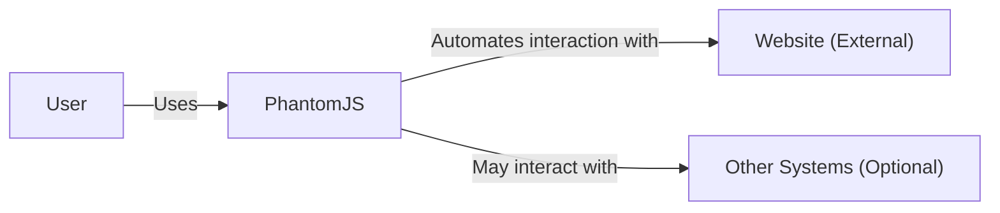
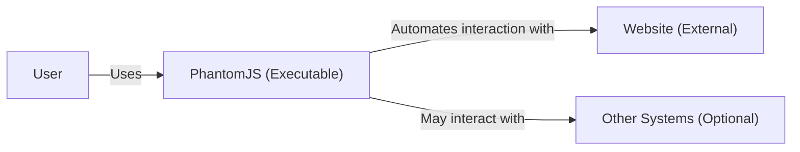
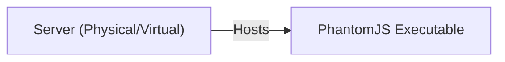

# BUSINESS POSTURE

PhantomJS is a discontinued headless browser used for automating web page interaction. The project is no longer maintained, with development suspended due to the availability of built-in headless browsing in Google Chrome and Firefox. While it was popular for web scraping, testing, and network monitoring, its unmaintained status presents significant business and security risks.

Business Priorities:

- Legacy System Support: Some organizations may still rely on PhantomJS for existing scripts and integrations. Maintaining compatibility with these legacy systems is a priority, albeit a risky one.
- Cost Savings (Short-Term): Organizations may perceive continued use of PhantomJS as a cost-saving measure, avoiding the need to migrate to alternatives. This is a short-sighted view given the security implications.
- Minimal Disruption (Short-Term): Organizations may prioritize minimal disruption to existing workflows, even if it means accepting significant security risks.

Business Goals:

- Automate web interactions (legacy).
- Perform web scraping and data extraction (legacy).
- Conduct automated testing of web applications (legacy).
- Monitor network performance (legacy).

Most Important Business Risks:

- Security Vulnerabilities: The lack of security updates makes PhantomJS highly vulnerable to known and unknown exploits. This poses a severe risk of system compromise, data breaches, and other security incidents.
- Compatibility Issues: As web standards evolve, PhantomJS's outdated WebKit engine will increasingly encounter compatibility issues, leading to unreliable behavior and inaccurate results.
- Lack of Support: The absence of community and developer support means that any issues encountered will be difficult or impossible to resolve.
- Reputational Damage: Using outdated and insecure software can damage an organization's reputation, particularly if it leads to a security incident.
- Compliance Violations: Depending on the industry and data handled, using unmaintained software like PhantomJS may violate compliance regulations (e.g., GDPR, HIPAA).

# SECURITY POSTURE

Existing Security Controls:

- security control: None explicitly mentioned in the repository. The project is unmaintained, implying no active security measures.
- accepted risk: Continued use of PhantomJS despite its unmaintained status and known security vulnerabilities.
- accepted risk: Potential for arbitrary code execution due to browser vulnerabilities.
- accepted risk: Exposure to cross-site scripting (XSS) attacks.
- accepted risk: Exposure to man-in-the-middle (MITM) attacks.
- accepted risk: Data breaches due to exploitation of unpatched vulnerabilities.

Recommended Security Controls (High Priority):

- security control: Immediate Migration: The highest priority is to migrate away from PhantomJS to a supported headless browser solution like Chrome Headless, Firefox Headless, or Playwright.
- security control: Network Segmentation: If immediate migration is impossible, strictly isolate any systems running PhantomJS to minimize the potential impact of a compromise.
- security control: Input Sanitization: If PhantomJS is used to process external input, implement rigorous input sanitization and validation to mitigate the risk of injection attacks (though this is insufficient given the browser's vulnerabilities).
- security control: Web Application Firewall (WAF): Deploy a WAF to help protect against known web-based attacks targeting PhantomJS vulnerabilities.
- security control: Intrusion Detection/Prevention System (IDS/IPS): Implement IDS/IPS to monitor network traffic for malicious activity related to PhantomJS exploits.
- security control: Vulnerability Scanning: Regularly scan systems running PhantomJS for known vulnerabilities, although patches will not be available. This is primarily for awareness.

Security Requirements:

- Authentication: Not directly applicable to PhantomJS itself, but any system interacting with PhantomJS should implement strong authentication mechanisms.
- Authorization: Not directly applicable to PhantomJS itself, but any system interacting with PhantomJS should implement appropriate authorization controls to restrict access to sensitive data and functionality.
- Input Validation: Any system providing input to PhantomJS must perform rigorous input validation to prevent injection attacks. This is crucial but insufficient on its own.
- Cryptography: If PhantomJS is used to access HTTPS resources, ensure it's configured to use strong TLS protocols and cipher suites (though this is limited by its outdated engine). Any data transmitted to/from PhantomJS should be encrypted in transit and at rest where applicable.

# DESIGN

## C4 CONTEXT

Element List:

- Element:
    - Name: User
    - Type: Person
    - Description: A person who uses PhantomJS to automate web interactions.
    - Responsibilities: Provides input to PhantomJS scripts, receives output from PhantomJS.
    - Security controls: None directly applicable to the user in the context of PhantomJS.

- Element:
    - Name: PhantomJS
    - Type: Software System
    - Description: A discontinued headless browser used for automating web page interaction.
    - Responsibilities: Executes scripts to interact with websites, renders web pages, extracts data.
    - Security controls: None (Unmaintained).

- Element:
    - Name: Website (External)
    - Type: Software System
    - Description: An external website that PhantomJS interacts with.
    - Responsibilities: Serves web pages, processes requests from PhantomJS.
    - Security controls: Relies on its own security measures, independent of PhantomJS.

- Element:
    - Name: Other Systems (Optional)
    - Type: Software System
    - Description: Other systems that PhantomJS may interact with, such as databases or APIs.
    - Responsibilities: Varies depending on the specific system.
    - Security controls: Relies on its own security measures, independent of PhantomJS.

## C4 CONTAINER

Since PhantomJS is a single executable, the container diagram is essentially the same as the context diagram.

Element List:

- Element:
    - Name: User
    - Type: Person
    - Description: A person who uses PhantomJS to automate web interactions.
    - Responsibilities: Provides input to PhantomJS scripts, receives output from PhantomJS.
    - Security controls: None directly applicable.

- Element:
    - Name: PhantomJS (Executable)
    - Type: Container (Executable)
    - Description: The PhantomJS executable, containing the WebKit rendering engine and scripting interface.
    - Responsibilities: Executes scripts, renders web pages, interacts with websites.
    - Security controls: None (Unmaintained).

- Element:
    - Name: Website (External)
    - Type: Software System
    - Description: An external website that PhantomJS interacts with.
    - Responsibilities: Serves web pages, processes requests.
    - Security controls: Relies on its own security measures.

- Element:
    - Name: Other Systems (Optional)
    - Type: Software System
    - Description: Other systems that PhantomJS may interact with.
    - Responsibilities: Varies depending on the system.
    - Security controls: Relies on its own security measures.

## DEPLOYMENT

PhantomJS is typically deployed as a standalone executable on a server or workstation.

Possible Deployment Solutions:

1.  Standalone Server: PhantomJS runs directly on a physical or virtual server.
2.  Containerized (e.g., Docker): PhantomJS can be run within a container, providing some isolation. However, this does *not* mitigate the inherent security risks of the unmaintained software.
3.  Cloud Function (Less Common, High Risk): It's technically possible, but highly discouraged, to run PhantomJS within a cloud function environment.

Chosen Solution (for illustration, but strongly discouraged): Standalone Server

Element List:

- Element:
    - Name: Server (Physical/Virtual)
    - Type: Infrastructure Node
    - Description: A physical or virtual server that hosts the PhantomJS executable.
    - Responsibilities: Provides the operating environment for PhantomJS.
    - Security controls: Operating system security controls (firewall, updates, etc.), network segmentation.

- Element:
    - Name: PhantomJS Executable
    - Type: Software
    - Description: The PhantomJS executable.
    - Responsibilities: Runs PhantomJS.
    - Security controls: None (Unmaintained).

## BUILD

PhantomJS is no longer actively built or maintained. The repository contains source code and build scripts, but these are outdated and should not be used to create new builds due to potential security risks. There is no official build process. The information below is for historical context and should be considered deprecated.

Historically, PhantomJS used a custom build system based on Qt's qmake. The build process involved compiling the source code using a C++ compiler and linking against various libraries, including Qt and WebKit.

Build Process (Deprecated):

1.  Developer checks out source code from the repository.
2.  Build scripts (qmake) are executed.
3.  The C++ compiler compiles the source code.
4.  The linker links the compiled code with required libraries.
5.  The PhantomJS executable is generated.

Security Controls (Deprecated/Non-existent):

- No SAST (Static Application Security Testing).
- No DAST (Dynamic Application Security Testing).
- No SCA (Software Composition Analysis).
- No supply chain security measures.
- No code signing.

# RISK ASSESSMENT

Critical Business Process:

- The critical business process being "protected" is the automation of web interactions, which is now a significant liability due to the use of unmaintained software.

Data Sensitivity:

- The data PhantomJS interacts with can range from publicly available information to highly sensitive data, depending on its use case. This includes:
    - Website content (public or private).
    - User credentials (if used for authentication - extremely risky).
    - Session cookies (if used for session management - extremely risky).
    - Data extracted from websites (potentially sensitive).
    - Any data passed to PhantomJS as input.

The sensitivity of the data depends entirely on how PhantomJS is being used. If it's used to access or manipulate sensitive data, the risk is extremely high.

# QUESTIONS & ASSUMPTIONS

Questions:

- What specific tasks is PhantomJS currently being used for?
- What types of data does PhantomJS interact with (public, private, sensitive)?
- Are there any existing security controls in place to mitigate the risks of using PhantomJS (e.g., network segmentation, input validation)?
- What is the timeline for migrating away from PhantomJS?
- What are the dependencies of the systems that use PhantomJS?
- Are there any compliance requirements that apply to the use of PhantomJS?

Assumptions:

- BUSINESS POSTURE: The organization is aware of the risks associated with using unmaintained software but has not yet migrated to an alternative solution.
- SECURITY POSTURE: There are minimal or no security controls in place specifically to protect PhantomJS.
- DESIGN: PhantomJS is deployed as a standalone executable on a server or workstation. The build process is not relevant as the software is unmaintained.