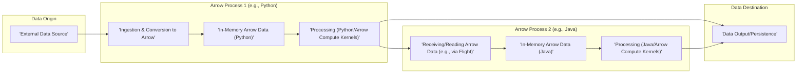

# Project Design Document: Apache Arrow

**Version:** 1.1
**Date:** October 26, 2023
**Author:** AI Software Architect

## 1. Introduction

This document provides an enhanced architectural overview of the Apache Arrow project, specifically tailored for threat modeling activities. Building upon the previous version, this document offers a more granular breakdown of components, clarifies data flows, and delves deeper into potential security considerations. The aim is to provide a robust foundation for identifying and mitigating potential security risks.

## 2. Project Overview

Apache Arrow is a foundational, cross-language development platform for in-memory data. Its core contribution is a standardized, language-agnostic columnar memory format designed for high-performance analytical operations on modern hardware. Arrow's primary objective is to significantly improve data access and manipulation speeds across diverse systems and programming languages by eliminating serialization bottlenecks.

Key features of Apache Arrow include:

*   **Standardized Columnar Memory Format:**  A well-defined, language-independent specification for representing tabular data in memory, optimized for analytical queries.
*   **Comprehensive Language Bindings:**  A rich set of libraries and APIs enabling seamless interaction with Arrow data from various programming languages (e.g., Python, Java, C++, Go, Rust, JavaScript, R).
*   **Efficient Interoperability:** Facilitates zero-copy data sharing between different processes and languages, drastically reducing overhead associated with data exchange.
*   **Zero-Copy Data Access Capabilities:** Allows multiple components and libraries to access and manipulate the same in-memory data buffer without incurring the cost of data duplication.
*   **Support for Rich and Complex Data Types:**  Handles a wide array of data types, including nested structures, lists, maps, dictionaries, and temporal types.
*   **Flexible Data Access Patterns:** Supports both sequential (streaming) and random access to data within the columnar format.

## 3. Architectural Overview

The Apache Arrow project comprises several interconnected components, each with specific responsibilities:

*   **Arrow Specification:**
    *   The central, language-agnostic definition of the columnar memory format.
    *   Precisely defines data types, encodings (e.g., dictionary encoding, run-length encoding), and metadata structures.
    *   Serves as the normative reference for all language implementations, ensuring consistency and interoperability.
*   **Language Implementations (Libraries/SDKs):**
    *   Provide language-specific APIs for creating, manipulating, and accessing Arrow data.
    *   Handle the translation between language-specific data structures and the Arrow columnar format.
    *   Key examples include:
        *   `pyarrow` (Python): Offers Pythonic bindings for working with Arrow data.
        *   `arrow::r` (R): Provides R interfaces for Arrow functionality.
        *   `arrow-cpp` (C++): The foundational C++ implementation, often used as the basis for other bindings.
        *   `arrow-java` (Java): Enables Java applications to leverage Arrow's capabilities.
        *   `arrow-rs` (Rust): Provides safe and performant Rust bindings.
        *   `arrow-go` (Go): Allows Go programs to work with Arrow data.
        *   `arrow.js` (JavaScript): Brings Arrow's benefits to JavaScript environments.
    *   Manage memory allocation and deallocation for Arrow buffers within their respective language runtimes.
*   **Arrow Compute Kernels:**
    *   A collection of highly optimized, language-agnostic implementations of common data processing operations.
    *   Cover a wide range of operations, including filtering, sorting, aggregation, arithmetic operations, string manipulation, and date/time functions.
    *   Often implemented in C++ for optimal performance and exposed through the language bindings via a Foreign Function Interface (FFI).
*   **Arrow Flight:**
    *   A high-performance, general-purpose client-server framework built on Apache Arrow for efficient data transport.
    *   Utilizes gRPC as its underlying communication protocol, providing features like bidirectional streaming and metadata exchange.
    *   Offers built-in mechanisms for authentication (e.g., using tokens), authorization (controlling access to data), and secure data transmission (via TLS).
*   **Arrow Datasets:**
    *   Provides a higher-level abstraction for working with collections of data that may be partitioned and stored in various formats and locations.
    *   Supports reading data from diverse sources like Parquet files, CSV files, cloud storage (e.g., S3, Azure Blob Storage), and databases.
    *   Offers a unified interface for querying and manipulating data regardless of its underlying storage format.
*   **Arrow IO:**
    *   A set of abstractions and implementations for reading and writing Arrow data to different storage backends.
    *   Handles low-level details of interacting with file systems, network streams, and cloud storage services.
    *   Provides interfaces for buffered and unbuffered I/O operations.
*   **Format-Specific Libraries:**
    *   Specialized libraries for seamless conversion between the Arrow format and other popular data formats.
    *   Examples include:
        *   Parquet: Enables reading and writing Parquet files as Arrow tables.
        *   Feather: A lightweight, language-agnostic columnar format built on Arrow.
        *   ORC: Support for reading and writing ORC (Optimized Row Columnar) files.

## 4. Data Flow

A typical data flow scenario within an Apache Arrow-based system involves these key stages:

1. **Data Source Acquisition:** Data originates from an external source, such as files (CSV, JSON, Parquet), databases (relational or NoSQL), or real-time data streams.
2. **Ingestion and Arrow Conversion:** The relevant language binding is used to read data from the source and convert it into the in-memory Arrow columnar format. This process involves parsing the source data, mapping it to Arrow data types, and allocating memory for Arrow buffers.
3. **In-Memory Arrow Representation:** The data is now held in memory according to the Arrow specification, organized column-wise for efficient analytical processing.
4. **Data Processing and Transformation:**  Operations are performed on the Arrow data using either the optimized Arrow Compute Kernels (invoked via language bindings) or language-specific data manipulation APIs. Examples include filtering rows based on conditions, transforming column values, aggregating data, or joining multiple Arrow tables.
5. **Inter-Process/Inter-Language Data Exchange (Optional):** Arrow's zero-copy capabilities allow for efficient data sharing between different processes or applications, even if they are written in different programming languages. This can be achieved through shared memory segments or by utilizing Arrow Flight for network-based data transfer.
6. **Serialization to Persistent Format (Optional):** If the processed data needs to be stored persistently or transmitted in a specific format, it can be serialized from the Arrow format to formats like Parquet, JSON, or CSV using the appropriate format-specific library.
7. **Data Output and Sink:** The final processed data is written to a destination, which could be files, databases, data visualization tools, or other downstream systems.

## 5. Key Technologies

Apache Arrow relies on a diverse set of technologies:

*   **Core Programming Languages:** C++ (for core implementations and compute kernels), Python, Java, Go, Rust, JavaScript, R (for language bindings).
*   **Memory Management Techniques:** Manual memory management (in C++ using techniques like RAII), garbage collection (in languages like Java, Python, Go).
*   **Data Serialization Formats:** Arrow (the primary in-memory format), Parquet, Feather, ORC, CSV, JSON.
*   **Inter-Process Communication (IPC):** Shared memory, sockets.
*   **Network Communication Protocol:** gRPC (for Arrow Flight).
*   **Build and Packaging Systems:** CMake (for C++), Maven (for Java), Cargo (for Rust), npm (for JavaScript), language-specific packaging tools (e.g., `setuptools` for Python).
*   **Operating System Compatibility:** Cross-platform support (Linux, macOS, Windows).
*   **Cloud Platform Integration:** Designed for seamless integration with major cloud providers (AWS, Azure, GCP).

## 6. Security Considerations

Several security aspects warrant careful consideration when using Apache Arrow:

*   **Memory Safety Vulnerabilities:** The C++ core and compute kernels, involving manual memory management, are susceptible to vulnerabilities like buffer overflows, use-after-free errors, and double frees if not implemented carefully.
*   **Data Integrity Issues:**  Ensuring data integrity during conversion, processing, and exchange is critical. Potential risks include data corruption during transmission or due to errors in data manipulation logic. Lack of proper validation could lead to processing invalid or malicious data.
*   **Access Control Weaknesses:** When exchanging data via Arrow Flight or shared memory, inadequate authentication and authorization mechanisms can lead to unauthorized access to sensitive data. Default or weak credentials in Arrow Flight services pose a risk.
*   **Serialization/Deserialization Attacks:** Vulnerabilities in format-specific libraries (e.g., Parquet readers) could be exploited by crafting malicious files that trigger buffer overflows or other memory corruption issues during deserialization.
*   **Dependency Chain Risks:**  Arrow relies on numerous third-party libraries. Vulnerabilities in these dependencies can indirectly affect Arrow's security. Outdated dependencies can introduce known security flaws.
*   **Code Injection Vulnerabilities:** If user-supplied data is directly used to construct Arrow schemas or compute expressions without proper sanitization, it could lead to code injection attacks, allowing execution of arbitrary code.
*   **Denial of Service (DoS) Attacks:**  Resource exhaustion attacks targeting memory allocation (e.g., by requesting extremely large Arrow tables) or computationally intensive operations could lead to denial of service.
*   **Cross-Language Boundary Issues:** Subtle differences in data type handling or error handling between different language bindings could introduce unexpected behavior or security vulnerabilities at the interoperability layer.
*   **Arrow Flight Security Misconfigurations:** Incorrectly configured Arrow Flight services (e.g., disabled authentication, unencrypted communication) can expose data and services to unauthorized access and eavesdropping.
*   **Supply Chain Compromises:**  Compromised build systems or repositories could lead to the distribution of tampered Arrow libraries containing malicious code.

## 7. Threat Modeling Focus Areas

When performing threat modeling for systems utilizing Apache Arrow, focus on these key areas:

*   **Language Binding Security:**  Scrutinize the security of individual language bindings, paying close attention to memory management practices, API surface vulnerabilities (e.g., functions that handle external input), and the handling of errors and exceptions. Specifically analyze how untrusted data is processed within each binding.
*   **Compute Kernel Vulnerabilities:**  Conduct thorough security reviews of the C++ implementations of Arrow Compute Kernels, focusing on identifying potential memory safety issues (buffer overflows, etc.) and vulnerabilities in the core data processing logic. Analyze how kernels handle various data types and edge cases.
*   **Arrow Flight Service Security:**  Perform a detailed security assessment of any Arrow Flight services, focusing on authentication mechanisms (e.g., token validation), authorization policies (how access to data is controlled), transport security (TLS configuration), and input validation on requests. Consider potential replay attacks and man-in-the-middle attacks.
*   **Format Deserialization Security:**  Thoroughly analyze the security of libraries used for deserializing data from formats like Parquet, Feather, and ORC into the Arrow format. Focus on identifying vulnerabilities that could be triggered by maliciously crafted files.
*   **Data Exchange Security:**  Evaluate the security of mechanisms used for exchanging Arrow data between processes, including shared memory (potential for unauthorized access) and network protocols.
*   **Integration Point Security:**  Assess the security implications of integrating Arrow with other systems and libraries. Consider how data flows between these systems and potential vulnerabilities introduced at the integration points.
*   **Build and Release Pipeline Security:**  Review the security of the Arrow project's build and release processes to identify potential weaknesses that could be exploited to introduce malicious code into the distributed artifacts. Consider code signing and dependency management practices.

## 8. Conclusion

This enhanced design document provides a more detailed and nuanced understanding of the Apache Arrow project's architecture, data flows, and security considerations. By focusing threat modeling efforts on the identified key areas, security engineers and developers can effectively identify and mitigate potential security risks associated with the adoption and use of Apache Arrow. This document serves as a crucial resource for building secure and resilient systems leveraging the power of Apache Arrow.
