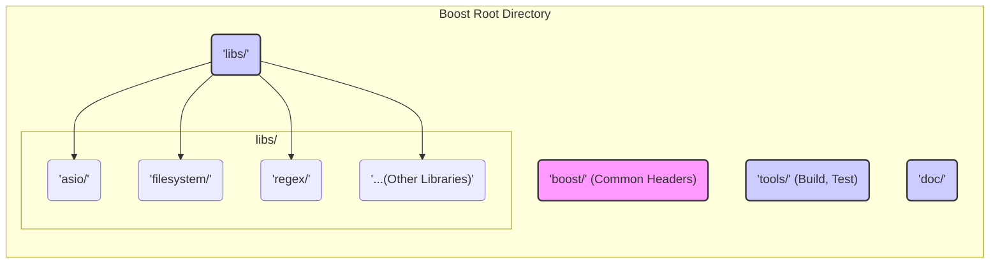
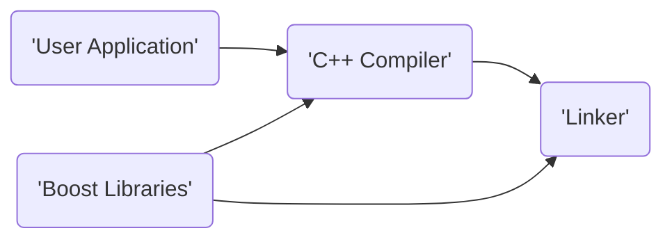
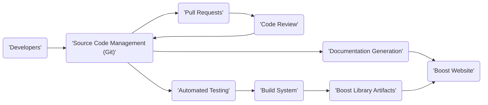
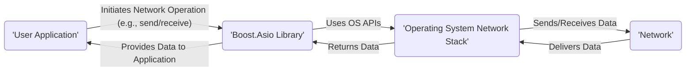

# Project Design Document: Boost C++ Libraries

**Version:** 1.1
**Date:** October 26, 2023
**Author:** AI Software Architect

## 1. Introduction

This document provides a high-level design overview of the Boost C++ Libraries project. It outlines the project's goals, scope, architecture, key components, data flow, and security considerations. This document is intended to serve as a foundation for subsequent threat modeling activities.

## 2. Goals and Objectives

* **Primary Goal:** Provide a comprehensive collection of high-quality, peer-reviewed, portable C++ source libraries.
* **Objectives:**
    * Extend the functionality of the C++ Standard Library.
    * Offer reusable components for a wide range of programming tasks.
    * Promote best practices in C++ software development.
    * Serve as a testing ground for potential additions to the C++ Standard.
    * Maintain high standards of code quality, performance, and portability.

## 3. Project Scope

The Boost project encompasses a vast collection of individual C++ libraries. This design document considers the overall architecture and common characteristics of these libraries rather than delving into the specifics of each individual library. The scope includes:

* The source code of all Boost libraries.
* The build and testing infrastructure.
* The documentation and website.
* The community contribution and review process.

This document does *not* cover the internal design details of specific Boost libraries unless they are relevant to the overall project architecture or security considerations.

## 4. High-Level Architecture

Boost is not a single monolithic application but rather a collection of independent libraries. The architecture can be viewed from two perspectives: the organization of the source code and the integration of Boost libraries into user applications.

### 4.1. Source Code Organization

The Boost source code is organized into a directory structure with individual libraries residing in their own subdirectories. Key aspects of the source code organization include:

* Individual Library Directories: Each library (e.g., `asio`, `filesystem`, `regex`) has its own directory containing header files, source files (if any), and build scripts.
* Header-Only Libraries: Many Boost libraries are header-only, meaning their functionality is implemented entirely within header files and does not require separate compilation and linking.
* Separately Compiled Libraries: Some libraries require compilation into object files or shared libraries.
* Common Infrastructure:  A set of common header files and build scripts are used across multiple libraries.

### 4.2. Integration into User Applications

Boost libraries are integrated into user applications by including the relevant header files and, for separately compiled libraries, linking against the compiled library files.

## 5. Component Details

The Boost project can be broadly categorized into the following components:

* **Boost Libraries:** The core components, providing a wide range of functionalities. Examples include:
    * Asio: For network and low-level I/O programming.
    * Filesystem: For portable file system operations.
    * Regex: For regular expression matching.
    * Smart Pointers: For managing object lifetimes.
    * Containers:  Extensions to the standard library containers.
    * Algorithms:  A collection of useful algorithms.
    * Math:  Mathematical functions and tools.
    * Date_Time:  For date and time manipulation.
* **Build System (Boost.Build/b2):**  A sophisticated build system used to compile and test Boost libraries across various platforms and compilers.
* **Testing Framework (Boost.Test):**  A framework for writing and running unit tests for Boost libraries.
* **Documentation:**  Comprehensive documentation for each library, typically in HTML format.
* **Website (www.boost.org):**  The central hub for information about Boost, including downloads, documentation, and community resources.
* **Community and Development Infrastructure:**  Includes mailing lists, issue trackers (GitHub), and the peer review process.

## 6. Data Flow

The data flow within the Boost project primarily concerns the development and distribution of the libraries. When a user application utilizes a Boost library, the data flow is within the context of that application.

### 6.1. Development Data Flow

### 6.2. User Application Data Flow (Example using Boost.Asio)

When a user application uses a Boost library like Asio for network communication, the data flow involves the application interacting with the operating system's networking stack through the Boost library.

## 7. Security Considerations

Security considerations for the Boost project are multifaceted, focusing on the integrity of the libraries themselves and the potential for vulnerabilities when used in applications.

Here's a breakdown of key security considerations:

* **Code Quality and Review:** The peer review process is a crucial aspect of ensuring code quality and identifying potential security flaws.
* **Input Validation:** Individual libraries are responsible for validating input data to prevent vulnerabilities like buffer overflows or injection attacks.
* **Memory Safety:** Given that Boost is primarily C++, memory safety is a significant concern. Libraries should be designed to minimize the risk of memory leaks, dangling pointers, and other memory-related errors.
* **Dependency Management:** Boost libraries may depend on other libraries (internal or external). The security of these dependencies needs to be considered.
* **Build System Security:** The build system itself should be secure to prevent the introduction of malicious code during the build process.
* **Supply Chain Security:** The process of distributing Boost libraries should be secure to prevent tampering.
* **Vulnerability Reporting and Response:** A clear process for reporting and addressing security vulnerabilities is essential.
* **Cryptographic Libraries:** Libraries providing cryptographic functionality (if any) must be implemented correctly and adhere to security best practices.
* **Denial of Service (DoS):** Libraries should be designed to be resilient against DoS attacks, especially those dealing with network operations or resource management.
* **Example Code Security:** Example code provided with the libraries should also adhere to security best practices to avoid misleading users.

## 8. Deployment Considerations

Boost libraries are typically deployed by including the header files and linking against the compiled libraries (if necessary) within a user application's build process.

* **Header-Only Libraries:** Deployment is straightforward, requiring only the inclusion of header files.
* **Separately Compiled Libraries:** Require the distribution of compiled library files (e.g., `.so`, `.dll`, `.lib`).
* **Package Managers:** Boost libraries are often available through system package managers (e.g., `apt`, `yum`, `vcpkg`, `conan`), simplifying deployment for users.
* **Static vs. Dynamic Linking:** Users can choose to link against Boost libraries statically or dynamically, each with its own security implications (e.g., static linking increases application size but reduces external dependencies at runtime).

## 9. Future Considerations

* Adoption of Modern C++ Standards: Continuously updating libraries to leverage new features and security enhancements in newer C++ standards.
* Improved Security Audits: Regular security audits of key Boost libraries.
* Formal Security Guidelines: Developing and promoting formal security guidelines for Boost library developers.
* Integration with Static Analysis Tools: Encouraging the use of static analysis tools to identify potential vulnerabilities.

This document provides a foundational understanding of the Boost C++ Libraries project architecture for threat modeling purposes. Further analysis will involve examining specific libraries and their interactions in more detail to identify potential attack vectors and vulnerabilities.
