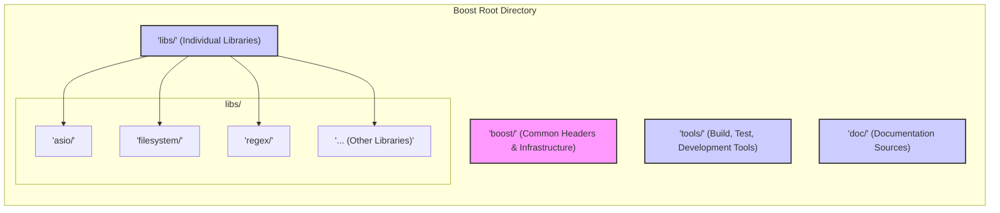
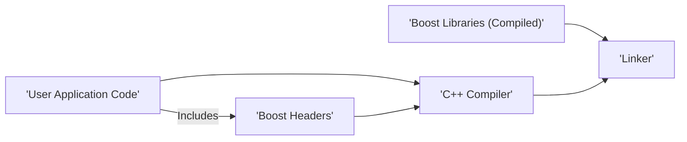
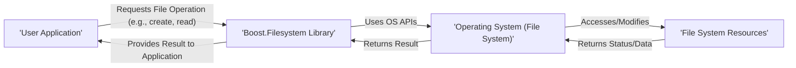

# Project Design Document: Boost C++ Libraries

**Version:** 1.1
**Date:** October 26, 2023
**Author:** AI Software Architect

## 1. Introduction

This document provides a refined high-level design overview of the Boost C++ Libraries project, specifically tailored for threat modeling activities. It outlines the project's goals, scope, architecture, key components, data flow, and security considerations with a focus on identifying potential attack surfaces and vulnerabilities.

## 2. Goals and Objectives

* **Primary Goal:** Provide a comprehensive collection of high-quality, peer-reviewed, portable C++ source libraries, with an emphasis on secure and robust design.
* **Objectives:**
    * Extend the functionality of the C++ Standard Library in a secure manner.
    * Offer reusable components that minimize the risk of introducing vulnerabilities in user applications.
    * Promote secure coding practices within the C++ community.
    * Serve as a testing ground for secure and robust design patterns for potential additions to the C++ Standard.
    * Maintain high standards of code quality, performance, portability, and security.

## 3. Project Scope

The Boost project encompasses a vast collection of individual C++ libraries. This design document focuses on the overall architecture, common characteristics, and security implications relevant to these libraries. The scope includes:

* The source code of all Boost libraries and their potential vulnerabilities.
* The build and testing infrastructure, including potential security weaknesses.
* The documentation and website, considering the risk of misleading or outdated information.
* The community contribution and review process, and its role in identifying and mitigating security issues.

This document does *not* cover the internal design details of specific Boost libraries unless they are crucial for understanding the overall project's security posture or represent common vulnerability patterns.

## 4. High-Level Architecture

Boost's architecture is characterized by its decentralized nature, being a collection of independent libraries. Understanding how these libraries are organized and integrated is key for threat modeling.

### 4.1. Source Code Organization

The source code structure presents potential areas for supply chain attacks or accidental inclusion of vulnerabilities.

* **Individual Library Directories:** Each library (e.g., `asio`, `filesystem`, `regex`) is a self-contained unit, potentially with its own unique security considerations.
* **Header-Only Libraries:** While simplifying integration, header-only libraries mean all code is directly included in user applications, increasing the attack surface if vulnerabilities exist.
* **Separately Compiled Libraries:** These introduce dependencies on the build process and the distribution of compiled artifacts, which can be targets for tampering.
* **Common Infrastructure:** Shared headers and build scripts, if compromised, could affect multiple libraries.

### 4.2. Integration into User Applications

The way Boost libraries are integrated determines how potential vulnerabilities can be exploited.

* **Direct Inclusion:** Header-only libraries are directly compiled into the user application.
* **Linking:** Separately compiled libraries require linking, introducing dependencies on the availability and integrity of the linked libraries.
* **Dependency Management:** Users rely on various methods (manual download, package managers) to obtain Boost, each with its own security implications regarding authenticity and integrity.

## 5. Component Details

Understanding the different types of Boost libraries helps in identifying potential categories of vulnerabilities.

* **Core Libraries (e.g., Smart Pointers, Utility):**  Vulnerabilities here could have widespread impact due to their common usage. Memory safety issues are a primary concern.
* **System Libraries (e.g., Asio, Filesystem):** These interact directly with the operating system, making them susceptible to vulnerabilities related to OS APIs, file system permissions, and network protocols.
* **Data Structures and Algorithms (e.g., Containers, Algorithm):**  Potential vulnerabilities include buffer overflows, out-of-bounds access, and algorithmic complexity issues leading to denial of service.
* **Text Processing Libraries (e.g., Regex, StringAlgo):**  Susceptible to injection attacks (e.g., regex denial of service), buffer overflows, and format string bugs.
* **Math and Numerics Libraries (e.g., Math, Multiprecision):**  Potential for numerical errors, precision issues, and vulnerabilities related to handling large or unusual inputs.
* **Concurrency and Multithreading Libraries (e.g., Thread, Atomic):**  Risk of race conditions, deadlocks, and other concurrency-related vulnerabilities.
* **Build and Test System (Boost.Build/b2, Boost.Test):**  Vulnerabilities in the build system could lead to the injection of malicious code. Weaknesses in the test framework could hinder the detection of vulnerabilities.
* **Documentation:** Outdated or incorrect documentation can lead to insecure usage of the libraries.
* **Website:**  A compromised website could distribute malicious versions of Boost or provide misleading information.

## 6. Data Flow

Analyzing data flow helps identify where data is processed and potential points of interception or manipulation.

### 6.1. Development and Distribution Data Flow (Focus on Security)

This flow highlights potential points for supply chain attacks.

### 6.2. User Application Data Flow with Boost Library (Example using Boost.Filesystem)

This illustrates how data flows through a Boost library within a user application, highlighting potential interaction points with the OS.

## 7. Security Considerations

This section expands on potential security weaknesses and threats.

* **Input Validation Vulnerabilities:** Many Boost libraries process external input. Lack of proper validation can lead to buffer overflows, format string bugs, and other injection vulnerabilities.
* **Memory Safety Issues:** As a C++ library, Boost is susceptible to memory management errors like dangling pointers, memory leaks, and use-after-free vulnerabilities.
* **Concurrency Vulnerabilities:** Libraries dealing with multithreading can suffer from race conditions, deadlocks, and other concurrency-related bugs that can lead to unexpected behavior or security breaches.
* **Cryptographic Vulnerabilities:** If cryptographic libraries are included, weaknesses in their implementation or usage can lead to data breaches.
* **Denial of Service (DoS) Attacks:**  Libraries might be vulnerable to DoS attacks through excessive resource consumption, algorithmic complexity issues (e.g., in regex matching), or improper handling of network connections.
* **Supply Chain Attacks:**  Compromise of the build system, development infrastructure, or distribution channels could lead to the distribution of backdoored or vulnerable versions of Boost.
* **Dependency Vulnerabilities:** Boost libraries may depend on other external libraries, which could introduce vulnerabilities.
* **Build System Security:**  A compromised build system could inject malicious code into the libraries.
* **Documentation Security:**  Inaccurate or incomplete documentation can lead developers to use the libraries insecurely.
* **Website Security:**  A compromised website could distribute malware or misleading information.
* **Permissions and Access Control:** Libraries interacting with the operating system (e.g., Filesystem, Asio) need to handle permissions and access control correctly to prevent unauthorized access.
* **Integer Overflows:**  Careless handling of integer arithmetic can lead to overflows, potentially causing unexpected behavior or security vulnerabilities.
* **Format String Bugs:**  Improper use of format strings in logging or output functions can allow attackers to execute arbitrary code.
* **Side-Channel Attacks:**  While less common for general-purpose libraries, certain algorithms might be susceptible to side-channel attacks that leak information.

## 8. Deployment Considerations (Security Implications)

How Boost is deployed impacts the overall security of applications using it.

* **Header-Only Libraries:**  The entire codebase is compiled into the user application, increasing the attack surface if vulnerabilities exist. Updates require recompiling the application.
* **Separately Compiled Libraries:**  Requires careful management of library dependencies and ensuring the integrity of the linked libraries. Dynamic linking can introduce runtime dependencies and potential for DLL hijacking.
* **Package Managers:** While convenient, relying on package managers introduces trust in the package maintainers and the security of the package repository.
* **Static vs. Dynamic Linking:** Static linking can increase the application's size but reduces runtime dependencies. Dynamic linking reduces application size but introduces dependencies on the availability and integrity of shared libraries.

## 9. Future Considerations (Security Enhancements)

* **Formal Security Audits:**  Regular, independent security audits of key Boost libraries.
* **Static Analysis Integration:**  Mandating or encouraging the use of static analysis tools in the development process.
* **Fuzzing:**  Systematic fuzzing of Boost libraries to uncover potential vulnerabilities.
* **Security-Focused Development Training:**  Providing security training for Boost developers.
* **Vulnerability Disclosure Program:**  A clear and responsive process for reporting and addressing security vulnerabilities.
* **Software Bill of Materials (SBOM):**  Providing SBOMs for Boost releases to improve transparency and facilitate vulnerability tracking.
* **Memory-Safe Language Interoperability:** Exploring options for safer interoperability with languages that offer better memory safety guarantees.

This refined design document provides a more detailed and security-focused overview of the Boost C++ Libraries project, intended to be a valuable resource for subsequent threat modeling activities. It highlights potential attack surfaces and vulnerabilities across various aspects of the project, from its source code organization to its deployment and usage.