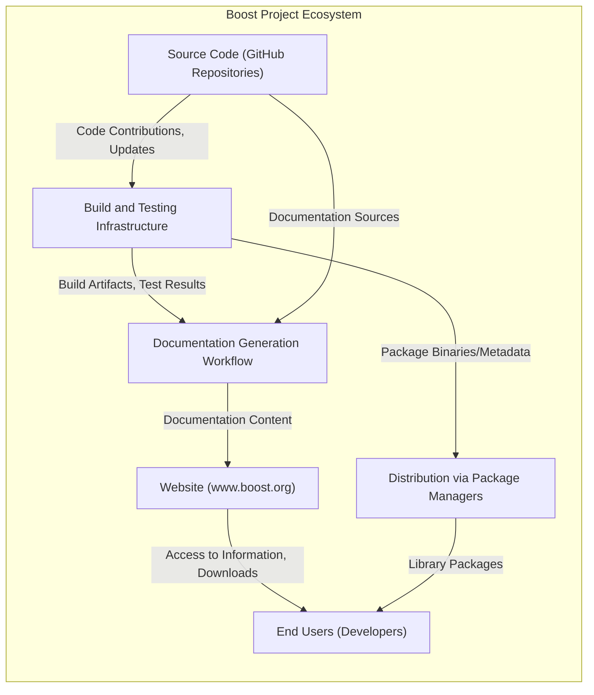
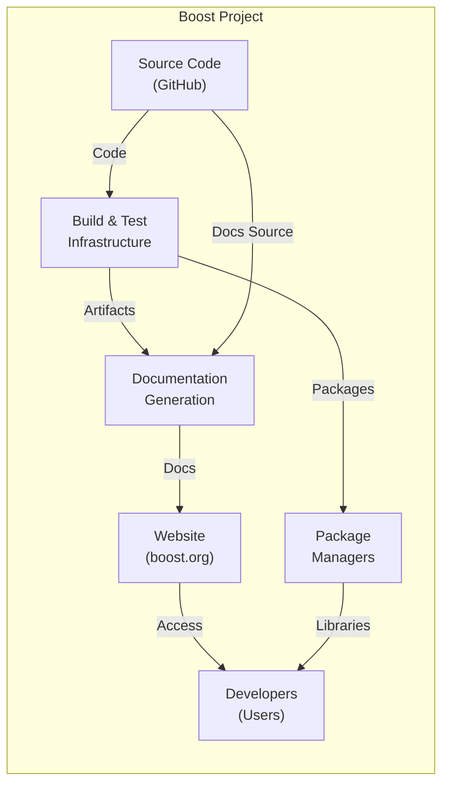
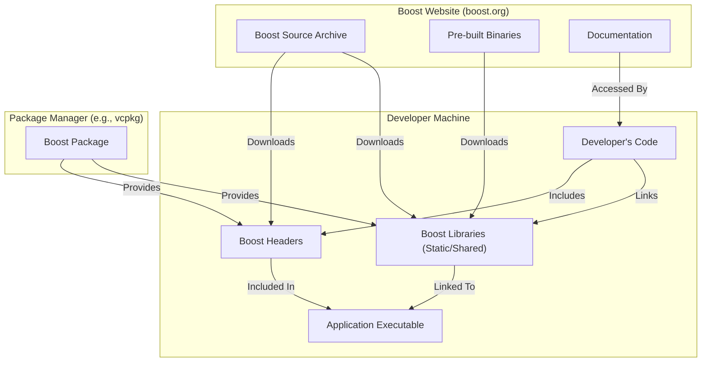

# Project Design Document: Boost C++ Libraries

**Version:** 1.1
**Date:** October 26, 2023
**Prepared By:** AI Software Architect

## 1. Introduction

This document provides a comprehensive architectural design of the Boost C++ Libraries project. It details the key components, their interactions, data flows, and security considerations. This document is intended to serve as a robust foundation for subsequent threat modeling activities, enabling a thorough analysis of potential security risks.

## 2. Project Goals and Scope

* **Project Goal:** To provide free, peer-reviewed, portable C++ source libraries, fostering innovation and standardization within the C++ ecosystem.
* **Scope:** This document encompasses the holistic architecture of the Boost project. This includes its source code management practices, build and testing infrastructure, documentation processes, website functionality, and distribution mechanisms. The focus is on the supporting infrastructure and processes that facilitate the development and delivery of the Boost libraries, rather than delving into the intricate internal design of individual libraries.

## 3. High-Level Architecture

## 4. Component Descriptions

* **Source Code (GitHub Repositories):**
    * **Description:** The central repository for all Boost library source code, hosted on GitHub under the `boostorg` organization. Each individual library and certain infrastructure tools are managed within their own dedicated repository.
    * **Functionality:** Provides version control using Git, enabling collaborative development through branching, merging, and pull requests. Serves as the single source of truth for the library code.
    * **Technology/Implementation:** Git version control system, GitHub platform.
    * **Data Flow:** Developers commit and push code changes to remote repositories. The build system pulls the latest code for compilation and testing. Documentation generation tools access the source code for extracting comments and generating documentation.
    * **Security Considerations:**
        * **Access Control:** Strict management of write access to repositories to prevent unauthorized modifications.
        * **Code Review Process:** Implementation of thorough code review processes to identify potential vulnerabilities before code is merged.
        * **Branch Protection Rules:** Utilizing GitHub's branch protection features to enforce code reviews and prevent direct pushes to critical branches.
        * **Dependency Scanning:** Automated scanning of library dependencies for known vulnerabilities.

* **Build and Testing Infrastructure:**
    * **Description:** A distributed and automated system responsible for the compilation and testing of Boost libraries across a wide range of operating systems, compilers, and configurations. This includes Continuous Integration (CI) pipelines.
    * **Functionality:** Automatically builds and executes unit tests for the libraries upon code changes. Generates platform-specific build artifacts for distribution. Reports build and test status and failures.
    * **Technology/Implementation:** A combination of custom scripts (likely utilizing Python and Bash), build tools such as B2 (the Boost Build system) and potentially CMake for some libraries, and CI platforms like GitHub Actions and potentially dedicated build farm infrastructure.
    * **Data Flow:** Pulls source code from the Git repositories. Receives build configuration parameters. Produces compiled libraries, executables for tests, and detailed test reports. These artifacts may be stored for distribution or further analysis.
    * **Security Considerations:**
        * **Build Environment Security:** Securing the build servers and agents against unauthorized access and malware.
        * **Protection Against Malicious Build Scripts:**  Careful review and control of build scripts to prevent the introduction of malicious commands.
        * **Integrity of Build Artifacts:** Ensuring the integrity of the compiled libraries and preventing tampering during the build and distribution process. This could involve signing artifacts.
        * **Access Control to Build System:** Limiting access to the build infrastructure to authorized personnel.

* **Documentation Generation Workflow:**
    * **Description:** An automated process that extracts documentation from the source code and dedicated documentation files to generate the official Boost library documentation in various formats, primarily HTML.
    * **Functionality:** Parses source code for documentation comments (e.g., using Doxygen syntax). Renders documentation using tools like Doxygen or Sphinx. Creates a comprehensive, searchable, and interlinked documentation set.
    * **Technology/Implementation:** Doxygen, Sphinx, potentially custom scripts for pre-processing or post-processing documentation.
    * **Data Flow:** Reads source code and documentation files from the Git repositories or potentially from build artifacts. Generates HTML files, PDF documents, and other documentation formats. The generated documentation is then deployed to the website.
    * **Security Considerations:**
        * **Protection Against Malicious Content Injection:** Preventing the injection of malicious scripts or content into the documentation that could compromise users viewing it.
        * **Accuracy and Integrity of Documentation:** Ensuring the documentation accurately reflects the functionality and security considerations of the libraries.
        * **Secure Handling of Documentation Sources:** Protecting the source documentation files from unauthorized modification.

* **Website (www.boost.org):**
    * **Description:** The official web presence for the Boost C++ Libraries.
    * **Functionality:** Serves as the primary source of information about Boost, providing access to downloads, comprehensive documentation, getting started guides, community resources, news, and release information.
    * **Technology/Implementation:** Typically a static site generator (potentially based on tools like Jekyll or Hugo) for the main content, a web server (e.g., Apache, Nginx), and a Content Delivery Network (CDN) for efficient distribution of content. Potentially some dynamic elements for search or user interaction.
    * **Data Flow:** Serves static HTML, CSS, JavaScript, images, and documentation files to users' web browsers. May interact with download servers for distributing library binaries or source archives.
    * **Security Considerations:**
        * **Protection Against Website Defacement:** Implementing security measures to prevent unauthorized modification of the website content.
        * **Cross-Site Scripting (XSS) Prevention:** Ensuring the website is protected against XSS vulnerabilities that could allow attackers to inject malicious scripts into the site.
        * **Denial-of-Service (DoS) Protection:** Implementing measures to mitigate DoS and DDoS attacks that could render the website unavailable.
        * **Secure Handling of User Data:** If any user data is collected (e.g., through contact forms or newsletter subscriptions), ensuring it is handled securely and in compliance with privacy regulations.
        * **Regular Security Audits and Penetration Testing:** Conducting periodic security assessments to identify and address potential vulnerabilities.

* **Distribution via Package Managers:**
    * **Description:**  The mechanism through which third-party package managers (such as vcpkg, Conan, and system package managers like apt or yum) provide a convenient way for developers to integrate Boost libraries into their projects.
    * **Functionality:** Allows users to easily download and install pre-built Boost libraries or build them from source using the package manager's infrastructure. Simplifies dependency management for projects using Boost.
    * **Technology/Implementation:** Relies on the infrastructure and processes of the individual package managers. Boost provides build scripts or metadata that package managers utilize.
    * **Data Flow:** Package managers download build artifacts (binaries, headers) or source code from Boost's distribution points (e.g., GitHub releases, CDN, dedicated repositories). Users then download these packages through the package manager client.
    * **Security Considerations:**
        * **Integrity of Packages:** Ensuring the integrity and authenticity of the Boost packages offered by package managers to prevent the distribution of tampered or malicious libraries. This often involves cryptographic signing of packages.
        * **Verification of Package Sources:** Users should be aware of the trustworthiness of the package managers they are using.
        * **Dependency Confusion Risks:** Mitigating the risk of users accidentally downloading malicious packages with similar names to legitimate Boost packages.

* **End Users (Developers):**
    * **Description:** The developers who utilize the Boost C++ Libraries in their software projects.
    * **Functionality:** Download, build, and link Boost libraries into their applications. Contribute to the Boost project through bug reports, feature requests, and code contributions.
    * **Technology/Implementation:** Utilize various development environments, compilers, integrated development environments (IDEs), and operating systems.
    * **Data Flow:** Download source code or pre-built libraries from the website or package managers. Integrate Boost headers and libraries into their projects during the compilation and linking process. May submit bug reports or contribute code via GitHub.
    * **Security Considerations:**
        * **Securely Obtaining Boost Libraries:** Users should ensure they are downloading Boost libraries from official and trusted sources to avoid downloading compromised versions.
        * **Understanding Security Implications of Libraries:** Developers should be aware of any known security vulnerabilities in the specific Boost libraries they are using and take appropriate precautions.
        * **Following Secure Coding Practices:** Developers are responsible for using Boost libraries securely within their own applications.

## 5. Key Data Flows

* **Source Code Contribution and Management:** Developers -> "Source Code (GitHub Repositories)"
* **Automated Build and Test Execution:** "Source Code (GitHub Repositories)" -> "Build and Testing Infrastructure"
* **Documentation Generation and Publication:** "Source Code (GitHub Repositories)" / "Build and Testing Infrastructure" -> "Documentation Generation Workflow" -> "Website (www.boost.org)"
* **Library Distribution to Package Managers:** "Build and Testing Infrastructure" -> "Distribution via Package Managers"
* **Direct Library Download:** "Build and Testing Infrastructure" -> "Website (www.boost.org)" -> "End Users (Developers)"
* **Library Acquisition via Package Managers:** "Distribution via Package Managers" -> "End Users (Developers)"
* **Feedback and Contributions:** "End Users (Developers)" -> "Source Code (GitHub Repositories)" / "Website (www.boost.org)"

## 6. User Interactions

* **Developers:**
    * Browse and clone source code repositories on GitHub.
    * Submit pull requests to propose code changes.
    * Report and track issues on the GitHub issue tracker.
    * Download source code archives or pre-built libraries from the official website.
    * Install Boost libraries using various package managers.
    * Read and search the online documentation.
    * Participate in community discussions (e.g., mailing lists).
* **End Users (of applications using Boost):**
    * Indirectly interact with Boost through the applications they use, benefiting from the functionality provided by the libraries.

## 7. Security Considerations (Detailed)

This section provides a more granular breakdown of security considerations across the Boost project:

* **Supply Chain Security:**
    * **Code Signing:** Implementing code signing for official releases and build artifacts to ensure authenticity and integrity.
    * **Secure Build Pipeline:** Hardening the build infrastructure to prevent tampering and unauthorized code injection.
    * **Dependency Management:** Rigorous review and management of third-party dependencies used in the build process and within the libraries themselves.
    * **Vulnerability Scanning of Dependencies:** Regularly scanning dependencies for known vulnerabilities and updating them promptly.

* **Vulnerability Management:**
    * **Security Audits:** Conducting regular security audits of the Boost libraries to identify potential vulnerabilities.
    * **Penetration Testing:** Performing penetration testing on the website and build infrastructure to assess security posture.
    * **Bug Bounty Program:** Considering a bug bounty program to incentivize security researchers to report vulnerabilities.
    * **Responsible Disclosure Policy:** Having a clear policy for reporting and handling security vulnerabilities.

* **Infrastructure Security:**
    * **Access Control:** Implementing strong access control mechanisms for all infrastructure components (servers, repositories, build systems, website administration).
    * **Regular Security Updates:** Keeping all servers and software components up-to-date with the latest security patches.
    * **Intrusion Detection and Prevention Systems:** Utilizing security tools to monitor for and prevent malicious activity.
    * **Secure Configuration Management:** Ensuring secure configurations for all infrastructure components.

* **Website Security:**
    * **HTTPS Enforcement:** Enforcing HTTPS for all website traffic to protect user data in transit.
    * **Content Security Policy (CSP):** Implementing a strong CSP to mitigate XSS attacks.
    * **Subresource Integrity (SRI):** Using SRI for externally hosted resources to prevent tampering.
    * **Regular Security Scanning:** Regularly scanning the website for vulnerabilities.

* **Code Security:**
    * **Secure Coding Guidelines:** Establishing and promoting secure coding guidelines for Boost library developers.
    * **Static Analysis:** Utilizing static analysis tools to identify potential security flaws in the code.
    * **Fuzzing:** Employing fuzzing techniques to discover vulnerabilities in library code.
    * **Memory Safety:** Emphasizing memory safety in library design and implementation to prevent buffer overflows and other memory-related vulnerabilities.

## 8. Deployment Model

Boost libraries are typically deployed using the following models:

* **Header-Only Inclusion:** Many Boost libraries are designed as header-only libraries, requiring no separate compilation or linking. Developers simply include the necessary header files in their projects.
* **Static Linking:** For libraries that require compilation, developers can statically link the compiled Boost libraries into their applications.
* **Dynamic Linking:** Alternatively, developers can dynamically link against shared Boost libraries, reducing the size of their executables and allowing for potential updates to the libraries without recompiling the application.
* **Package Manager Integration:** Utilizing package managers like vcpkg or Conan simplifies the deployment process by handling the download, build, and linking of Boost libraries automatically.

## 9. Diagrams

### 9.1. High-Level Architecture Diagram (Revised)

### 9.2. Deployment Diagram

## 10. Future Considerations

* **Enhanced Security Tooling Integration:** Further integration of automated security scanning tools into the CI/CD pipeline.
* **Formal Security Review Process:** Establishing a more formalized security review process for new library submissions and major updates.
* **Improved Transparency of Security Practices:**  Making information about Boost's security practices more readily available to users.
* **Standardized Build System:**  Transitioning more libraries to a common build system (like CMake) to improve consistency and potentially simplify security tooling integration.

This improved design document provides a more detailed and security-focused overview of the Boost C++ Libraries project architecture. It serves as a more comprehensive foundation for subsequent threat modeling activities, enabling a deeper understanding of potential security risks and informing the development of appropriate mitigation strategies.