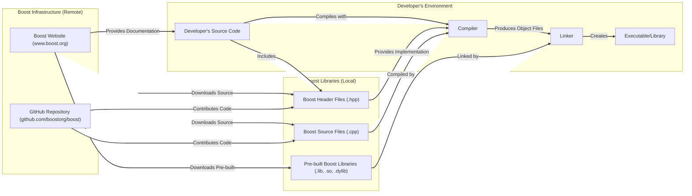

# Project Design Document: Boost C++ Libraries

**Version:** 1.1
**Date:** October 26, 2023
**Author:** AI Software Architect

## 1. Introduction

This document provides an enhanced architectural design of the Boost C++ Libraries project, specifically tailored for threat modeling purposes. It details the key components, their interactions, and relevant security considerations to facilitate the identification and mitigation of potential threats. This document builds upon the previous version, providing more granular detail and clarity.

## 2. Project Overview

The Boost C++ Libraries represent a comprehensive collection of peer-reviewed, open-source C++ libraries designed for a wide range of applications. Adhering to the Boost Software License, a permissive free software license, Boost encourages broad adoption and contribution. The project thrives on a community-driven model, benefiting from the expertise of numerous developers globally.

The core objective of Boost is to deliver high-quality, portable, and meticulously documented C++ libraries that extend the capabilities of the standard library. These libraries span diverse domains, including:

*   Smart Pointers (e.g., `shared_ptr`, `unique_ptr`)
*   Containers and Data Structures (e.g., `Boost.Container`, `Boost.Unordered`)
*   Text Processing (e.g., `Boost.Regex`, `Boost.StringAlgo`)
*   Metaprogramming (e.g., `Boost.MPL`, `Boost.Fusion`)
*   Concurrency and Multithreading (e.g., `Boost.Thread`, `Boost.Asio`)
*   Networking (e.g., `Boost.Asio`)
*   Math and Numerics (e.g., `Boost.Math`)
*   Date and Time (e.g., `Boost.DateTime`)
*   Filesystem Operations (e.g., `Boost.Filesystem`)

## 3. Goals

*   To offer a broad spectrum of highly reusable, general-purpose C++ libraries.
*   To uphold rigorous standards for code quality, performance, and robustness.
*   To ensure seamless portability across diverse operating systems (Windows, Linux, macOS, etc.) and compilers (GCC, Clang, MSVC).
*   To cultivate a vibrant and collaborative development ecosystem.
*   To serve as an incubator and proving ground for potential enhancements to the C++ Standard Library.

## 4. Architectural Design

Boost's architecture is characterized by its modularity, comprising numerous independent libraries. Understanding the different facets of this architecture is crucial for effective threat modeling.

### 4.1. Library Structure

*   **Individual Libraries:** Boost is organized as a set of distinct libraries, each focused on a specific area of functionality and residing in its own directory within the source tree (e.g., `boost/asio`, `boost/algorithm`).
*   **Header-Only Libraries:** A significant portion of Boost libraries are header-only. Their entire implementation resides within header files (`.hpp`), eliminating the need for separate compilation and linking for these libraries (e.g., `Boost.MPL`).
*   **Separately Compiled Libraries:** Certain libraries necessitate separate compilation due to platform-specific implementations, complex logic, or the need for pre-compiled binaries (e.g., `Boost.Thread`, `Boost.Filesystem`). These produce compiled library artifacts (e.g., `.lib`, `.so`, `.dylib`).
*   **Inter-Library Dependencies:** Libraries may depend on other Boost libraries or external dependencies. These dependencies are managed through the build system.

### 4.2. Build System

*   **B2 (Boost.Build):** The primary build system for Boost is B2, a portable and extensible build system specifically designed for C++ projects. It uses a domain-specific language based on `Jam`.
*   **Configuration Files (Jamfiles):** Each library and the overall Boost project utilizes `Jamfiles` to define build rules, dependencies between libraries, compiler settings, and configuration options. These files guide the B2 build process.
*   **Build Process:** The build process involves:
    *   **Configuration:** Setting up the build environment, specifying target platforms and compilers.
    *   **Dependency Resolution:** B2 analyzes `Jamfiles` to determine the order of compilation and linking based on dependencies.
    *   **Compilation:** Compiling source files (`.cpp`) for separately compiled libraries using the specified compiler.
    *   **Linking:** Linking the compiled object files to create shared or static libraries.
    *   **Installation:** Copying header files and compiled libraries to the designated installation directory.

### 4.3. Website and Infrastructure

*   **www.boost.org:** The central web portal for Boost, providing access to:
    *   Comprehensive documentation for all libraries.
    *   Downloadable archives of source code and pre-built binaries.
    *   News, announcements, and release information.
    *   Community resources, including mailing lists and forums.
*   **GitHub Repository (github.com/boostorg/boost):** The official source code repository hosted on GitHub, facilitating:
    *   Version control using Git.
    *   Collaborative development through pull requests.
    *   Issue tracking for bug reports and feature requests.
*   **Issue Tracking:**  GitHub Issues are used to manage bug reports, feature requests, and track progress on identified issues.
*   **Mailing Lists:** Various mailing lists serve as communication channels for developers and users, covering topics like development, announcements, and specific library discussions.
*   **Continuous Integration (CI):** Boost employs CI systems (e.g., GitHub Actions) to automatically:
    *   Build the libraries on various platforms and with different compilers.
    *   Run unit tests to ensure code quality and detect regressions.
    *   Perform static analysis to identify potential code defects.

### 4.4. Data Flow (Detailed)

**Detailed Data Flow Description:**

*   Developers integrate Boost libraries into their projects by including relevant header files (`.hpp`) from the Boost distribution within their source code.
*   For header-only libraries, the compiler directly incorporates the implementation from the included header files during compilation.
*   For separately compiled libraries:
    *   The developer's build system (e.g., using CMake, Make, or directly invoking the compiler) compiles their own source code (`.cpp`).
    *   The compiler also compiles the Boost source files (`.cpp`) for the required separately compiled Boost libraries.
    *   The linker then combines the compiled object files from the developer's code and the pre-built or compiled Boost libraries to create the final executable or library.
*   Developers can obtain Boost libraries in several ways:
    *   Downloading source code archives from the Boost website or GitHub.
    *   Downloading pre-built binary packages from the Boost website or through package managers (e.g., `apt`, `brew`, `vcpkg`).
*   The Boost website serves as the primary source for documentation, guiding developers on how to use the libraries.
*   Contributions to Boost involve developers submitting code changes (pull requests) to the GitHub repository.

## 5. Security Considerations

Security considerations for Boost are multifaceted, stemming from the nature of C++ and the project's distribution model.

*   **Code Vulnerabilities within Libraries:**
    *   **Memory Safety Issues:** As Boost is primarily written in C++, vulnerabilities like buffer overflows, use-after-free errors, and dangling pointers are potential risks. Libraries dealing with memory management or external data are particularly susceptible.
    *   **Input Validation Failures:** Improper or insufficient validation of external input within Boost library functions could lead to vulnerabilities like injection attacks or unexpected behavior.
    *   **Algorithmic Complexity Exploits:** Certain algorithms within Boost might have worst-case time or space complexity that could be exploited for denial-of-service (DoS) attacks if not handled carefully by the user.
    *   **Concurrency Issues:** Libraries dealing with multithreading and concurrency might contain race conditions, deadlocks, or other concurrency bugs that could lead to unpredictable or insecure behavior.
*   **Supply Chain Security Risks:**
    *   **Compromised Source Code Repository:** If the GitHub repository were compromised, malicious code could be injected into the libraries, affecting all users who download the compromised version.
    *   **Maliciously Crafted Contributions:**  While Boost has a review process, there's a risk of malicious code being introduced through seemingly benign contributions.
    *   **Compromised Download Infrastructure:** If the Boost website or its download mirrors are compromised, users could unknowingly download malicious versions of the libraries.
    *   **Vulnerabilities in Dependencies:** Boost libraries might depend on other external libraries, and vulnerabilities in those dependencies could indirectly affect projects using Boost.
*   **Build System Security:**
    *   **Build Script Vulnerabilities:** Security flaws in the B2 build system or the `Jamfiles` could be exploited to inject malicious code during the build process.
    *   **Compromised Build Environment:** If the environment used to build official Boost releases is compromised, the resulting binaries could be malicious.
*   **Website and Infrastructure Security:**
    *   **Website Compromise:** A compromised website could serve malicious downloads, spread misinformation, or be used for phishing attacks targeting Boost users and developers.
    *   **Cross-Site Scripting (XSS) and other web vulnerabilities:** Vulnerabilities in the website could allow attackers to inject malicious scripts or compromise user accounts.
*   **Developer Responsibility:** It's crucial to emphasize that developers using Boost also bear responsibility for secure usage. This includes:
    *   Properly validating data passed to Boost library functions.
    *   Understanding the security implications of using specific Boost features.
    *   Keeping their Boost installations up-to-date to patch known vulnerabilities.

## 6. Deployment

Boost libraries are integrated into other C++ projects during the development and build process. The deployment method depends on whether the library is header-only or requires separate compilation.

*   **Header-Only Libraries:**
    *   Deployment is straightforward. Developers simply include the necessary header files from the Boost distribution within their project's source code.
    *   No separate linking or distribution of compiled libraries is required. The implementation is directly included during compilation.
*   **Separately Compiled Libraries:**
    *   **Compilation:** Developers need to compile the required separately compiled Boost libraries for their target platform using the Boost.Build system or a compatible build system.
    *   **Linking:** The developer's project's build system must be configured to link against the compiled Boost library files (e.g., `.lib` on Windows, `.so` on Linux, `.dylib` on macOS). This involves specifying the library paths and names to the linker.
    *   **Distribution:** The compiled Boost libraries need to be distributed alongside the application executable or be available on the target system where the application will run. This might involve including the library files in the application's installer or relying on system-wide installations.

## 7. Assumptions and Constraints

*   **Open Source and Community-Driven:** Boost's security relies heavily on the open-source nature, allowing for community scrutiny and contributions to identify and fix vulnerabilities.
*   **C++ Language Characteristics:** The inherent complexities and potential pitfalls of C++, such as manual memory management, influence the types of security vulnerabilities that might arise.
*   **Cross-Platform Nature:** Maintaining compatibility across diverse platforms and compilers adds complexity to development, testing, and ensuring consistent security behavior.
*   **Decentralized Development Model:** The distributed nature of the development process necessitates robust code review and testing procedures to maintain security.
*   **Reliance on External Infrastructure:** The security of Boost is also dependent on the security of the external infrastructure it relies on, such as GitHub, the website hosting provider, and CI systems.

## 8. Future Considerations

*   **Formal Security Audits:** Conducting regular, independent security audits of critical and widely used Boost libraries can proactively identify and address potential vulnerabilities.
*   **Enhanced Static Analysis Integration:** Integrating more advanced static analysis tools into the development and CI pipelines can help detect a wider range of potential security flaws early in the development lifecycle.
*   **Fuzzing and Dynamic Analysis:** Increased use of fuzzing techniques and other dynamic analysis methods can help uncover unexpected behavior and potential vulnerabilities in Boost libraries under various input conditions.
*   **Improved Dependency Management and Security Scanning:** Implementing more robust mechanisms for managing and scanning dependencies can enhance supply chain security and identify potential vulnerabilities in external libraries.
*   **Security-Focused Development Guidelines:**  Further emphasizing and refining security-focused development guidelines for Boost contributors can help prevent the introduction of new vulnerabilities.
*   **Vulnerability Disclosure Program:** Establishing a clear and efficient vulnerability disclosure program can encourage security researchers to report potential issues responsibly.

This enhanced design document provides a more detailed and nuanced understanding of the Boost C++ Libraries project architecture, specifically tailored for threat modeling. The outlined components, data flows, and security considerations serve as a comprehensive foundation for identifying and mitigating potential threats associated with the use of Boost libraries.