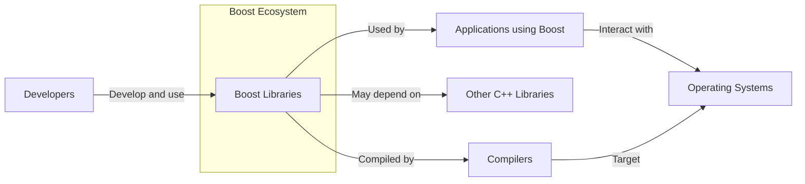
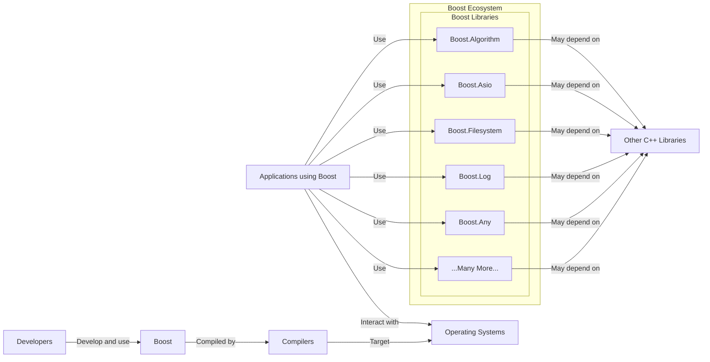
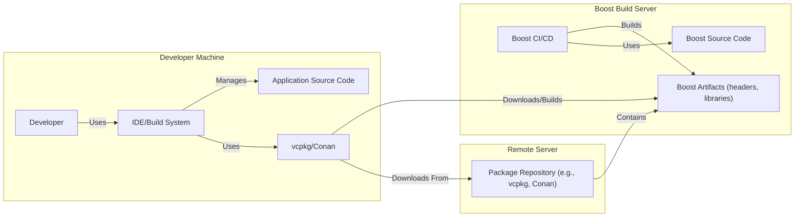
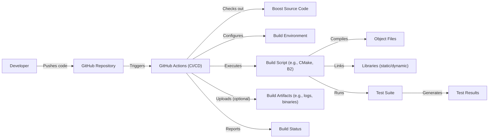

Okay, let's create a design document for the Boost C++ Libraries, focusing on aspects relevant for threat modeling.

# BUSINESS POSTURE

Boost is a collection of peer-reviewed, open-source C++ libraries. It's not a single "project" in the traditional sense, but rather a large, evolving ecosystem.  It serves as a proving ground for potential additions to the C++ standard library.

Priorities:

*   Provide high-quality, well-tested, and portable C++ libraries.
*   Serve as a reference implementation and incubator for future C++ standards.
*   Maintain a high degree of backward compatibility where feasible.
*   Foster a vibrant and collaborative open-source community.
*   Ensure the libraries are usable in a wide variety of contexts, from embedded systems to high-performance computing.

Goals:

*   Expand the capabilities of the C++ language.
*   Improve developer productivity.
*   Promote best practices in C++ software development.
*   Reduce the need for developers to "reinvent the wheel."

Business Risks:

*   Vulnerabilities in Boost libraries could be exploited in a wide range of applications, leading to significant security breaches.  The widespread use of Boost makes it a high-value target.
*   Compromised contributions (e.g., malicious pull requests) could introduce vulnerabilities or backdoors.
*   Lack of ongoing maintenance for specific libraries could lead to security issues over time as compilers and platforms evolve.
*   Inconsistent coding standards or testing practices across the diverse set of libraries could lead to varying levels of security.
*   Licensing issues or ambiguities could create legal risks for users.
*   Reputational damage from security incidents could erode trust in the Boost libraries.

# SECURITY POSTURE

Boost, as a collection of libraries, doesn't have a single, unified security posture in the way a deployed application would.  Security controls are largely the responsibility of the individual library authors and the developers who integrate Boost into their applications. However, there are some overarching principles and community practices.

Existing Security Controls:

*   security control: Peer Review: All Boost libraries undergo a formal peer review process before acceptance. This review includes (but is not explicitly mandated to be focused on) security considerations. (Described in Boost's review process documentation).
*   security control: Extensive Testing: Boost libraries are generally accompanied by comprehensive test suites, including unit tests and regression tests.  This helps to identify and prevent bugs that could lead to vulnerabilities. (Visible in the repository structure and CI configurations).
*   security control: Community Scrutiny:  The open-source nature of Boost allows for broad community scrutiny, increasing the likelihood that vulnerabilities will be discovered and reported. (Evident in the issue trackers and mailing lists).
*   security control: Use of Static Analysis Tools: Some Boost libraries, and the overall build process, may incorporate static analysis tools (e.g., Coverity, clang-tidy) to identify potential vulnerabilities. (May be visible in CI configurations or specific library documentation, but not universally mandated).
*   security control: Address Sanitizer/Undefined Behavior Sanitizer: Boost's continuous integration (CI) setup, particularly on platforms like GitHub Actions, often includes builds with sanitizers enabled. These tools help detect memory errors and undefined behavior at runtime. (Visible in CI configurations).
*   security control: Fuzzing: Some Boost libraries, particularly those dealing with complex data parsing or input validation, may be subjected to fuzzing. (May be visible in specific library documentation or dedicated fuzzing repositories).

Accepted Risks:

*   accepted risk: Heterogeneous Security:  The level of security focus and expertise varies among library authors.  Some libraries may have more robust security practices than others.
*   accepted risk: Dependence on External Libraries: Some Boost libraries depend on external libraries, which may have their own security vulnerabilities.
*   accepted risk: Legacy Code:  Maintaining backward compatibility may require retaining older code that might not meet modern security standards.
*   accepted risk: Limited Resources:  As a volunteer-driven project, Boost may have limited resources for dedicated security audits and penetration testing.
*   accepted risk: Complexity: The sheer size and complexity of some Boost libraries make it challenging to fully assess their security posture.

Recommended Security Controls:

*   Formalize Security Guidelines: Develop a clear set of security guidelines and best practices for Boost library authors, including requirements for input validation, error handling, and secure coding practices.
*   Mandate Static Analysis: Integrate static analysis tools into the CI pipeline for all Boost libraries, with consistent configuration and reporting.
*   Expand Fuzzing:  Increase the use of fuzzing, particularly for libraries that handle untrusted input.
*   Security Training: Provide security training and resources for Boost library authors and reviewers.
*   Vulnerability Disclosure Program: Establish a formal vulnerability disclosure program to encourage responsible reporting of security issues.
*   Dependency Management: Implement a system for tracking and managing dependencies on external libraries, including monitoring for known vulnerabilities.
*   Supply Chain Security: Improve the security of the build and distribution process to prevent tampering.

Security Requirements:

*   Authentication: Not directly applicable to Boost itself, as it's a library, not an application. Authentication is the responsibility of the applications using Boost.
*   Authorization: Similarly, authorization is the responsibility of the applications using Boost. However, some Boost libraries (e.g., those related to inter-process communication) might provide mechanisms to support authorization schemes.
*   Input Validation: *Crucially important*. All Boost libraries that accept external input (e.g., data from files, network connections, user input) *must* perform rigorous input validation to prevent vulnerabilities such as buffer overflows, injection attacks, and denial-of-service attacks. This should be a primary focus of library authors and reviewers.
*   Cryptography: Boost provides cryptographic libraries (e.g., Boost.Asio for SSL/TLS, and potentially dedicated crypto libraries). These libraries *must* use strong, up-to-date cryptographic algorithms and protocols. They should be carefully reviewed and tested to ensure correct implementation and resistance to known attacks. Key management is the responsibility of the application using these libraries.

# DESIGN

## C4 CONTEXT

Context Diagram Element List:

*   Element:
    *   Name: Developers
    *   Type: Person
    *   Description: Software developers who create, maintain, and use the Boost libraries.
    *   Responsibilities: Writing code, submitting pull requests, participating in reviews, reporting issues, using Boost libraries in their applications.
    *   Security controls: Adhering to secure coding practices (where applicable), participating in code reviews, reporting potential security issues.

*   Element:
    *   Name: Boost Libraries
    *   Type: Software System
    *   Description: The collection of peer-reviewed C++ libraries.
    *   Responsibilities: Providing reusable components for various programming tasks, serving as a testbed for potential C++ standard library additions.
    *   Security controls: Peer review, extensive testing, community scrutiny, static analysis (in some cases), sanitizers (in CI), fuzzing (in some cases).

*   Element:
    *   Name: Applications using Boost
    *   Type: Software System
    *   Description: Applications built by developers that incorporate Boost libraries.
    *   Responsibilities: Utilizing Boost libraries to implement functionality, handling user input, interacting with the operating system and other systems.
    *   Security controls: Implementing appropriate security measures for their specific application domain, including input validation, authentication, authorization, and secure communication.

*   Element:
    *   Name: Other C++ Libraries
    *   Type: Software System
    *   Description: Libraries that Boost may depend on.
    *   Responsibilities: Providing specific functionality required by some Boost libraries.
    *   Security controls: Dependent on the specific library; Boost should ideally track and assess the security of its dependencies.

*   Element:
    *   Name: Operating Systems
    *   Type: Software System
    *   Description: The operating systems on which Boost libraries and applications using them are run.
    *   Responsibilities: Providing the underlying platform and resources for execution.
    *   Security controls: OS-level security features (e.g., ASLR, DEP, sandboxing).

*   Element:
    *   Name: Compilers
    *   Type: Software System
    *   Description: C++ compilers used to build Boost and applications that use it.
    *   Responsibilities: Translating C++ code into executable machine code.
    *   Security controls: Compiler-level security features (e.g., stack protection, warnings).

## C4 CONTAINER

Since Boost is a collection of libraries, not a deployed application with distinct containers, the Container diagram is essentially an expansion of the Context diagram, showing the internal structure of the Boost "system."

Container Diagram Element List (Selected Examples):

*   Element:
    *   Name: Boost.Asio
    *   Type: Library
    *   Description: A cross-platform C++ library for network and low-level I/O programming.
    *   Responsibilities: Providing asynchronous I/O operations, networking support (sockets, timers, etc.), and potentially SSL/TLS.
    *   Security controls: Input validation (for network data), secure use of cryptographic protocols (when SSL/TLS is used), protection against common network attacks.

*   Element:
    *   Name: Boost.Filesystem
    *   Type: Library
    *   Description: A library for portable file system operations.
    *   Responsibilities: Providing functions for creating, deleting, and manipulating files and directories.
    *   Security controls: Careful handling of file paths to prevent directory traversal attacks, appropriate permissions management.

*   Element:
    *   Name: Boost.Algorithm
    *   Type: Library
    *   Description: collection of generic algorithms
    *   Responsibilities: Providing implementations of searching, sorting and other algorithms.
    *   Security controls: Input validation, protection against integer overflows.

*   Element:
    *   Name: Boost.Log
    *   Type: Library
    *   Description: logging library
    *   Responsibilities: Providing logging functionality.
    *   Security controls: Input validation, protection against log injection.

*   Element:
    *   Name: Boost.Any
    *   Type: Library
    *   Description: safe, generic container for single values of different value types
    *   Responsibilities: Providing safe container.
    *   Security controls: Type safety.

*   Element:
    *   Name: ...Many More...
    *   Type: Library
    *   Description: Represents the numerous other Boost libraries.
    *   Responsibilities: Varies widely depending on the specific library.
    *   Security controls: Varies widely; each library should be assessed individually.

## DEPLOYMENT

Boost libraries are typically not "deployed" in the traditional sense of a server-based application. They are *integrated* into other applications.  However, we can consider the different ways Boost is made available to developers and the environments where it's used.

Deployment Solutions:

1.  **Source Code Integration:** Developers download the Boost source code and include it directly in their project's build process.
2.  **Package Managers:** Developers use package managers (e.g., vcpkg, Conan, apt, yum) to install pre-built Boost binaries or to manage the build process from source.
3.  **System-Wide Installation:**  Boost libraries may be installed system-wide by a system administrator.
4.  **Precompiled Headers:** Some projects may use precompiled headers to speed up compilation, which can include Boost headers.

Chosen Solution (for detailed description): Package Managers (vcpkg/Conan)

This is a common and recommended approach, as it simplifies dependency management and updates.

Deployment Diagram Element List:

*   Element:
    *   Name: Developer
    *   Type: Person
    *   Description: The developer building an application that uses Boost.
    *   Responsibilities: Writing code, managing dependencies, configuring the build system.
    *   Security controls: Using secure coding practices, keeping development tools up-to-date.

*   Element:
    *   Name: IDE/Build System
    *   Type: Software System
    *   Description: The developer's integrated development environment and build system (e.g., Visual Studio, CMake, Make).
    *   Responsibilities: Managing the project, compiling code, linking libraries.
    *   Security controls: Using secure configurations, keeping the IDE and build tools up-to-date.

*   Element:
    *   Name: vcpkg/Conan
    *   Type: Software System
    *   Description: A C++ package manager.
    *   Responsibilities: Downloading, building, and managing Boost libraries and their dependencies.
    *   Security controls: Verifying the integrity of downloaded packages (e.g., using checksums), using secure connections to package repositories.

*   Element:
    *   Name: Application Source Code
    *   Type: Software Component
    *   Description: The source code of the application being developed.
    *   Responsibilities: Implementing the application's functionality, using Boost libraries.
    *   Security controls: Secure coding practices, input validation, etc. (specific to the application).

*   Element:
    *   Name: Package Repository (e.g., vcpkg, Conan)
    *   Type: Software System
    *   Description: A remote repository that hosts pre-built Boost binaries or build recipes.
    *   Responsibilities: Providing a reliable source for Boost packages.
    *   Security controls: Protecting the repository from unauthorized access and tampering, ensuring the integrity of packages.

*   Element:
    *   Name: Boost Build Server
    *   Type: Infrastructure
    *   Description: Servers that build Boost libraries.
    *   Responsibilities: Building Boost libraries.
    *   Security controls: Hardened OS, restricted access.

*   Element:
    *   Name: Boost Source Code
    *   Type: Software Component
    *   Description: Source code of Boost libraries.
    *   Responsibilities: Providing Boost functionality.
    *   Security controls: Secure code, peer review.

*   Element:
    *   Name: Boost CI/CD
    *   Type: Software System
    *   Description: Continuous Integration and Continuous Delivery system.
    *   Responsibilities: Building and testing Boost libraries.
    *   Security controls: Restricted access, security checks during build.

*   Element:
    *   Name: Boost Artifacts (headers, libraries)
    *   Type: Software Component
    *   Description: Build artifacts of Boost libraries.
    *   Responsibilities: Providing compiled Boost libraries.
    *   Security controls: Code signing.

## BUILD

The Boost build process is complex and varies depending on the specific library and build system used. However, there are some common elements and best practices.

Build Process Overview:

1.  **Source Code Acquisition:** Developers obtain the Boost source code, either by downloading a release, cloning the Git repository, or using a package manager.
2.  **Configuration:** The build system is configured (e.g., using CMake, B2, or autotools). This involves specifying build options, compiler flags, and dependencies.
3.  **Compilation:** The source code is compiled into object files.
4.  **Linking:** The object files are linked together to create libraries (static or dynamic).
5.  **Testing:** The built libraries are tested using the included test suites.
6.  **Installation (Optional):** The libraries and headers may be installed to a system-wide location or a user-specified directory.
7.  **Distribution (for package maintainers):**  Pre-built binaries or build recipes are packaged and made available through package repositories.

Build System Diagram (Conceptual, using GitHub Actions as an example):

Security Controls in the Build Process:

*   security control: Version Control (Git):  The use of Git for version control allows for tracking changes, identifying who made them, and reverting to previous versions if necessary.
*   security control: Continuous Integration (CI):  Boost uses CI systems (e.g., GitHub Actions, Travis CI, AppVeyor) to automatically build and test the libraries on various platforms and with different configurations whenever changes are pushed to the repository.
*   security control: Static Analysis (as mentioned previously):  Integration of static analysis tools into the CI pipeline.
*   security control: Sanitizers (as mentioned previously):  Use of Address Sanitizer, Undefined Behavior Sanitizer, and other sanitizers in CI builds.
*   security control: Compiler Warnings:  Enabling and treating compiler warnings as errors to catch potential issues early.
*   security control: Secure Build Environment:  CI runners should be configured securely, with limited access and up-to-date software.
*   security control: Dependency Management (as mentioned previously):  Tracking and managing dependencies on external libraries.
*   security control: Code Signing (for distributed binaries):  If pre-built binaries are distributed, they should be code-signed to ensure authenticity and prevent tampering.

# RISK ASSESSMENT

Critical Business Processes:

*   Providing reliable and well-tested C++ libraries: The core function of Boost is to provide high-quality, reusable components. Failures in this area directly impact the reliability and security of applications that depend on Boost.
*   Maintaining a trusted open-source community: The collaborative development model relies on trust and transparency. Security breaches or malicious contributions could severely damage this trust.
*   Serving as an incubator for C++ standards: Boost's role in shaping the future of C++ requires maintaining a high level of quality and security.

Data to Protect:

*   Source Code (Sensitivity: Medium): While the source code is publicly available, ensuring its integrity is crucial. Unauthorized modifications could introduce vulnerabilities.
*   Test Data (Sensitivity: Low to Medium): Test data used in Boost's test suites may contain sensitive information in some cases (e.g., if it mimics real-world data).
*   Contributor Information (Sensitivity: Low): Information about contributors (e.g., email addresses) is generally public, but should be handled responsibly.
*   Build Artifacts (Sensitivity: Medium): Pre-built binaries, if distributed, need to be protected from tampering.
*   Vulnerability Reports (Sensitivity: High): Reports of security vulnerabilities should be handled confidentially until they are addressed and disclosed responsibly.

# QUESTIONS & ASSUMPTIONS

Questions:

*   What is the specific process for handling reported security vulnerabilities in Boost libraries? Is there a dedicated security team or a formal vulnerability disclosure program?
*   What are the specific static analysis tools and configurations used in the Boost build process, and how consistently are they applied across all libraries?
*   What is the process for reviewing and approving changes to the Boost build system and CI configurations?
*   Are there any plans to implement more robust supply chain security measures, such as code signing for distributed binaries or Software Bill of Materials (SBOM) generation?
*   How are dependencies on external libraries managed and tracked, and how are known vulnerabilities in those dependencies addressed?
*   What level of fuzzing is currently performed, and for which libraries? Are there plans to expand fuzzing efforts?

Assumptions:

*   BUSINESS POSTURE: It is assumed that maintaining the reputation and trustworthiness of the Boost libraries is a high priority.
*   SECURITY POSTURE: It is assumed that individual library authors have a reasonable level of security awareness, but there is no formal requirement or enforcement.
*   DESIGN: It is assumed that the Boost build process is generally well-defined and automated, but there may be variations across different libraries and build systems.
*   SECURITY POSTURE: It is assumed that there is no dedicated budget for security audits or penetration testing.
*   SECURITY POSTURE: It is assumed that the Boost community relies heavily on peer review and community scrutiny to identify security vulnerabilities.
*   DESIGN: It is assumed that package managers like vcpkg and Conan are commonly used by developers to integrate Boost into their projects.
*   DESIGN: It is assumed that Boost libraries are used in a wide variety of environments, including security-sensitive applications.