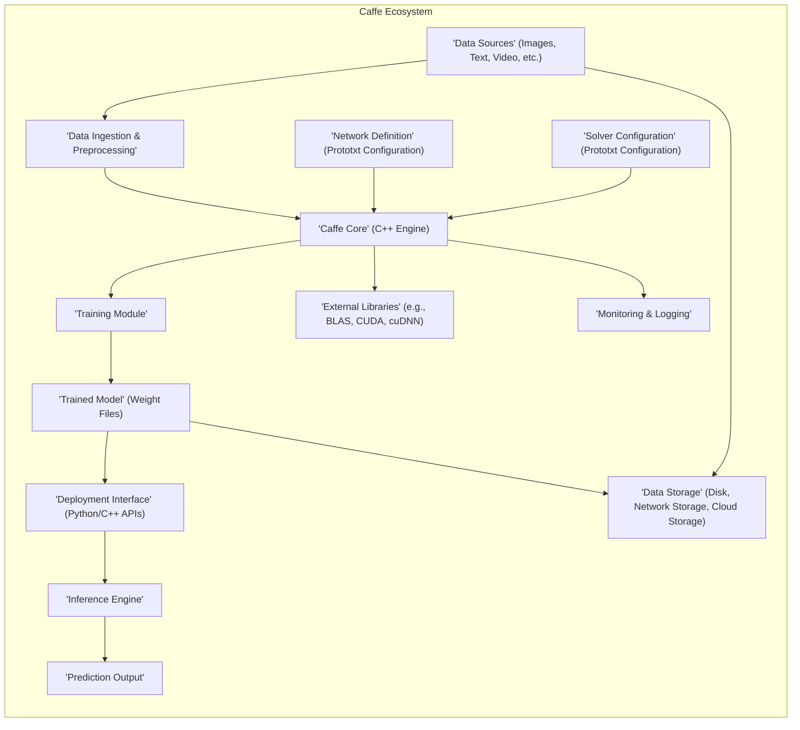

# Project Design Document: Caffe Deep Learning Framework

**Document Version:** 1.1
**Date:** October 26, 2023
**Prepared By:** Gemini (AI Architecture Expert)

## 1. Introduction

This document provides an enhanced architectural design overview of the Caffe deep learning framework (as represented by the GitHub repository: https://github.com/bvlc/caffe). This document is intended to serve as a robust foundation for subsequent threat modeling activities. It outlines the key components, data flows, and interactions within the Caffe ecosystem with a stronger focus on security implications.

### 1.1. Purpose

The primary purpose of this document is to provide a detailed and clear description of the Caffe architecture specifically tailored to facilitate effective threat modeling. It aims to identify the major components and their relationships, explicitly highlighting potential areas of security concern and attack surfaces.

### 1.2. Scope

This document covers the core architectural elements of the Caffe framework as understood from its public repository, with a focus on aspects relevant to security. It delves into the software components, their interactions, and the data they handle. While it doesn't detail the intricacies of every algorithm, it provides sufficient context for security analysis.

### 1.3. Target Audience

This document is primarily intended for security engineers, threat modelers, security architects, and developers who need a comprehensive understanding of the Caffe architecture for security analysis, risk assessment, and the development of security controls.

## 2. System Overview

Caffe is a deep learning framework facilitating the development, training, and deployment of neural network models. It's primarily implemented in C++ with a Python interface for ease of use and integration. The core functionality encompasses defining network architectures, managing data pipelines, training models using various optimization techniques, and deploying these trained models for making predictions (inference).

**Key Interactions and Data Flows:**

*   Diverse data sources provide input, which is then ingested and preprocessed.
*   Network architecture and training parameters are defined in separate configuration files (prototxt).
*   The Caffe Core utilizes these configurations and the preprocessed data to train models.
*   Training involves iterative adjustments of model weights, resulting in a trained model.
*   The trained model is stored and can be loaded for deployment via provided interfaces.
*   The deployment interface enables the inference engine to make predictions on new data.
*   Caffe relies on external, often performance-critical, libraries.
*   Data and models are persisted in various storage mechanisms.
*   Monitoring and logging are crucial for tracking training progress and identifying issues.

## 3. Key Components

This section provides a more detailed description of the major components within the Caffe framework, highlighting their functionalities and potential security implications.

*   **'Data Sources' (Images, Text, Video, etc.):**  The origin of the data used for training and inference. Security concerns include unauthorized access to sensitive data and the potential for malicious data injection.
*   **'Data Ingestion & Preprocessing':** Responsible for reading data from various sources, cleaning, transforming, and preparing it for the network. Vulnerabilities here can lead to data poisoning or bypasses of input validation.
*   **'Network Definition' (Prototxt Configuration):** A text file defining the neural network's architecture (layers, connections, parameters). Security risks involve unauthorized modification leading to model behavior changes or information disclosure.
*   **'Solver Configuration' (Prototxt Configuration):** A text file specifying training parameters (learning rate, optimization algorithm, etc.). Tampering with this can lead to ineffective training or denial-of-service during training.
*   **'Caffe Core' (C++ Engine):** The heart of the framework, handling computations, memory management, and inter-component communication. Vulnerabilities in the core C++ code can have significant security impact.
*   **'Training Module':**  Implements the training algorithms, iteratively updating model weights. Security concerns include resource exhaustion and potential manipulation of the training process.
*   **'Trained Model' (Weight Files):** The output of the training process, containing the learned weights. These files are sensitive and their compromise can lead to unauthorized use or reverse engineering of the model.
*   **'Deployment Interface' (Python/C++ APIs):** Provides programmatic access to load models and perform inference. Security risks include unauthorized access to model functionality and potential for injection attacks through the API.
*   **'Inference Engine':** Executes the trained model on new input data to generate predictions. Vulnerabilities here can lead to incorrect predictions or denial-of-service.
*   **'External Libraries' (e.g., BLAS, CUDA, cuDNN):**  Caffe relies on external libraries for performance. Vulnerabilities in these libraries can be inherited by Caffe.
*   **'Data Storage' (Disk, Network Storage, Cloud Storage):**  Used to store training data and trained models. Requires robust access control and encryption to protect sensitive information.
*   **'Monitoring & Logging':** Tracks training progress, resource usage, and errors. Security logs are crucial for detecting and responding to security incidents.

## 4. Data Flow

This section details the typical flow of data through the Caffe system during both the training and inference phases, highlighting potential security checkpoints.

### 4.1. Training Data Flow and Security Considerations

1. **'Data Acquisition':** Raw data is collected from various 'Data Sources'. *Security Consideration:* Ensure secure access and integrity of data sources to prevent unauthorized access or data manipulation.
2. **'Data Ingestion':** Data is read into the Caffe environment. *Security Consideration:* Implement input validation and sanitization to prevent malicious data from entering the system.
3. **'Preprocessing':** Data is transformed and prepared. *Security Consideration:* Ensure preprocessing steps do not introduce vulnerabilities or leak sensitive information.
4. **'Network and Solver Configuration Loading':** Prototxt files are parsed. *Security Consideration:* Protect these files from unauthorized modification as they dictate the training process.
5. **'Forward Propagation':** Input data flows through the network. *Security Consideration:*  While less of a direct security concern here, understanding data flow is crucial for identifying potential information leaks later.
6. **'Loss Calculation':** The difference between predictions and ground truth is calculated.
7. **'Backward Propagation':** Gradients are calculated.
8. **'Weight Update':** Model weights are adjusted. *Security Consideration:* Ensure the training process is not manipulated to create biased or backdoored models.
9. **'Model Serialization and Storage':** Trained model weights are saved. *Security Consideration:* Implement strong access controls and encryption for stored models to protect confidentiality and integrity.
10. **'Monitoring and Logging':** Training progress and potential errors are logged. *Security Consideration:* Secure log storage and access to prevent tampering or unauthorized access.

### 4.2. Inference Data Flow and Security Considerations

1. **'Model Loading':** Trained model weights are loaded from storage. *Security Consideration:* Verify the integrity of the loaded model to prevent the use of compromised models.
2. **'Input Data Reception':** New data is received for prediction. *Security Consideration:* Implement strict input validation to prevent attacks through malicious input.
3. **'Preprocessing (if applicable)':** Input data may undergo preprocessing. *Security Consideration:* Similar to training, ensure preprocessing doesn't introduce vulnerabilities.
4. **'Forward Propagation':** Input data is processed by the loaded model.
5. **'Prediction Generation':** The model produces output.
6. **'Output Delivery':** Predictions are returned. *Security Consideration:* Secure the communication channel for output delivery to maintain confidentiality and integrity of predictions.
7. **'Monitoring and Logging':** Inference requests and potential errors are logged. *Security Consideration:* Secure logs for auditing and incident response.

## 5. Deployment Model and Security Implications

Caffe can be deployed in various environments, each presenting unique security challenges.

*   **'Local Machine Deployment':**  Primarily for development and experimentation. *Security Implications:* Relies on the security of the local machine. Vulnerable to malware and unauthorized access if not properly secured.
*   **'Server Deployment':**  For larger scale training and inference. *Security Implications:* Requires robust server security measures, including access control, network segmentation, and regular security patching.
*   **'Cloud Platform Deployment':** Leveraging cloud infrastructure for scalability. *Security Implications:*  Shared responsibility model requires careful configuration of cloud security settings, including IAM policies, network configurations, and data encryption.
*   **'Containerized Deployment (e.g., Docker)':**  Packages Caffe and its dependencies. *Security Implications:*  Requires securing the container image and the container runtime environment. Vulnerabilities in the base image can be exploited.
*   **'Embedded Systems Deployment':** Deploying trained models on resource-constrained devices. *Security Implications:*  Limited resources often restrict security measures. Physical security of the device becomes crucial.

## 6. Security Considerations (Detailed)

This section expands on the initial security thoughts, providing more concrete examples of potential threats and vulnerabilities.

*   **Data Security:**
    *   **Threat:** Unauthorized access to training data leading to data breaches or leaks of sensitive information.
    *   **Threat:** Data poisoning attacks where malicious data is injected into the training set to manipulate model behavior.
    *   **Vulnerability:** Lack of encryption for stored training data and trained models.
    *   **Vulnerability:** Insufficient access controls on data storage systems.
*   **Code and Configuration Security:**
    *   **Threat:** Malicious modification of network definition or solver configuration files to alter training behavior or introduce backdoors.
    *   **Vulnerability:** Storing configuration files in insecure locations without proper access controls.
    *   **Vulnerability:** Lack of integrity checks for the Caffe codebase and its dependencies.
*   **Dependency Management:**
    *   **Threat:** Exploitation of known vulnerabilities in external libraries (e.g., BLAS, CUDA).
    *   **Vulnerability:** Using outdated versions of dependencies with known security flaws.
    *   **Vulnerability:** Lack of a secure supply chain process for verifying the integrity of dependencies.
*   **Access Control:**
    *   **Threat:** Unauthorized access to the Caffe environment, allowing malicious actors to train, deploy, or modify models.
    *   **Vulnerability:** Weak or default credentials for accessing Caffe servers or APIs.
    *   **Vulnerability:** Lack of proper authentication and authorization mechanisms.
*   **Input Validation:**
    *   **Threat:** Injection attacks through maliciously crafted input data during training or inference, potentially leading to code execution or denial-of-service.
    *   **Vulnerability:** Insufficient or absent input validation routines.
*   **Model Security:**
    *   **Threat:** Model extraction attacks where adversaries attempt to reverse engineer or steal trained models.
    *   **Threat:** Model manipulation where attackers subtly alter model weights to introduce biases or backdoors.
    *   **Vulnerability:** Lack of mechanisms to verify the integrity and provenance of trained models.
*   **Communication Security:**
    *   **Threat:** Interception of communication between Caffe components or external systems, potentially exposing sensitive data or model information.
    *   **Vulnerability:** Lack of encryption for network communication.
    *   **Vulnerability:** Use of insecure protocols for communication.
*   **Monitoring and Logging:**
    *   **Threat:** Tampering with or deletion of security logs, hindering incident detection and response.
    *   **Vulnerability:** Insecure storage and access controls for log files.
    *   **Vulnerability:** Insufficient logging of security-relevant events.

This enhanced document provides a more detailed and security-focused understanding of the Caffe architecture, laying a stronger foundation for comprehensive threat modeling activities. The identified components, data flows, deployment models, and specific security considerations will enable a more thorough and effective security analysis of the Caffe framework.
