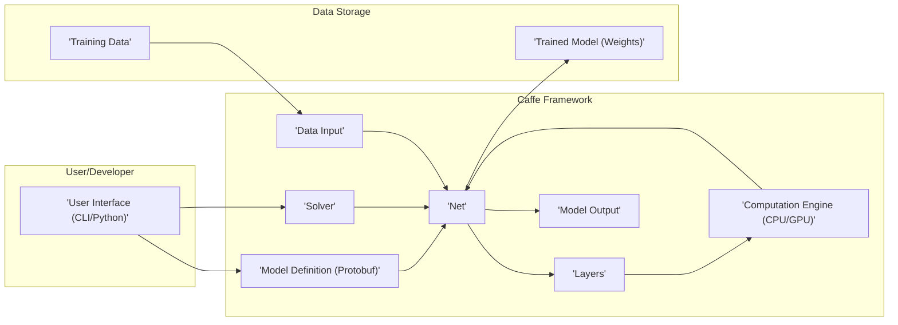
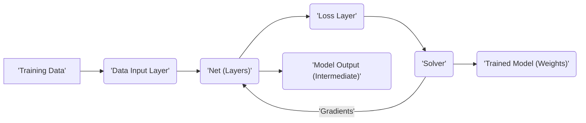
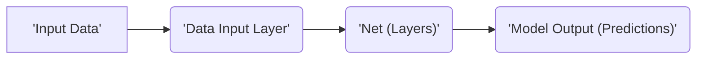

# Project Design Document: Caffe Deep Learning Framework

**Version:** 1.1
**Date:** October 26, 2023
**Author:** Gemini (AI Language Model)

## 1. Introduction

This document provides an enhanced and detailed design overview of the Caffe deep learning framework. It aims to capture the key architectural components, data flows, and interactions within the system with a specific focus on aspects relevant to security considerations and threat modeling. This document will serve as a robust foundation for subsequent threat modeling activities to identify potential security vulnerabilities and risks. The target project is the open-source Caffe framework available at [https://github.com/bvlc/caffe](https://github.com/bvlc/caffe).

## 2. Goals and Objectives

The primary goals of the Caffe framework are to:

* Provide a modular and efficient platform for deep learning research and development, enabling rapid prototyping and experimentation.
* Support a wide range of deep learning architectures, including but not limited to convolutional neural networks (CNNs), recurrent neural networks (RNNs), and other custom network topologies.
* Offer a clear, well-defined, and extensible interface for defining, training, validating, and deploying deep learning models.
* Enable high-performance computation by effectively leveraging available hardware resources, including multi-core CPUs and GPUs.
* Facilitate reproducibility of deep learning experiments through well-defined model definitions and training procedures.
* Provide tools for model visualization and analysis.

## 3. System Architecture

### 3.1. High-Level Architecture

### 3.2. Component Description

* **User Interface (CLI/Python):**
    * Provides the primary interaction point for users.
    * Command-line interface (CLI) allows for direct execution of training, testing, and deployment tasks.
    * Python API offers a more flexible and programmatic way to interact with the framework, enabling scripting and integration with other tools.
    * **Security Relevance:** Potential entry point for malicious commands or scripts if not properly secured or if user permissions are not managed.
* **Model Definition (Protobuf):**
    * Defines the structure and parameters of the neural network using Protocol Buffer files (`.proto`).
    * Specifies layers, their types, connections, and configuration parameters.
    * **Security Relevance:** Maliciously crafted `.proto` files could potentially lead to unexpected behavior or vulnerabilities if not properly validated by the framework.
* **Solver:**
    * Manages the training process of the neural network.
    * Configures the optimization algorithm (e.g., SGD, Adam), learning rate, momentum, and other hyperparameters.
    * Controls the iteration process and monitors training progress.
    * **Security Relevance:** Incorrectly configured solvers or manipulation of solver parameters could lead to ineffective training or even introduce vulnerabilities if exploited.
* **Net:**
    * Represents the instantiated neural network in memory.
    * Holds the layers and their connections as defined in the model definition.
    * Manages the flow of data through the network during forward and backward propagation.
    * **Security Relevance:**  A compromised `Net` object could lead to incorrect predictions or exposure of sensitive data.
* **Layers:**
    * The fundamental computational units of the neural network.
    * Implement various operations like convolution, pooling, activation functions, and loss calculations.
    * Caffe provides a library of built-in layer types, and users can potentially define custom layers.
    * **Security Relevance:** Vulnerabilities in layer implementations could be exploited to cause crashes or leak information. Custom layers, if not carefully implemented, could introduce security flaws.
* **Data Input:**
    * Responsible for loading, preprocessing, and transforming input data for training and inference.
    * Supports various data formats and provides mechanisms for data augmentation.
    * **Security Relevance:**  A critical component for security. Vulnerabilities here could allow for the injection of malicious data, leading to model poisoning or adversarial attacks. Improper handling of data paths or formats could also expose sensitive information.
* **Computation Engine (CPU/GPU):**
    * Executes the mathematical operations required for training and inference.
    * Leverages CPU and GPU resources for accelerated computation.
    * Relies on underlying libraries like BLAS and CUDA.
    * **Security Relevance:**  Vulnerabilities in the underlying computation libraries could be exploited. Resource exhaustion attacks targeting this component could lead to denial of service.
* **Model Output:**
    * The result of the network's computation, such as predictions, classifications, or feature embeddings.
    * The format and interpretation of the output depend on the specific task and network architecture.
    * **Security Relevance:**  Ensuring the integrity and confidentiality of the model output is crucial, especially in sensitive applications.
* **Training Data:**
    * The dataset used to train the neural network.
    * Its quality and representativeness directly impact the performance and reliability of the trained model.
    * **Security Relevance:**  Compromised or manipulated training data can lead to "model poisoning" attacks, where the model learns incorrect patterns or biases.
* **Trained Model (Weights):**
    * The learned parameters of the neural network after the training process.
    * These weights are stored persistently and loaded for inference.
    * **Security Relevance:**  Trained models are valuable assets. Unauthorized access or modification could lead to intellectual property theft or the deployment of backdoored models.

## 4. Data Flow

### 4.1. Training Data Flow

* **Training Data Ingestion:** Raw training data is accessed and loaded by the Data Input Layer. This may involve reading from files, databases, or network streams.
* **Data Preprocessing:** The Data Input Layer performs preprocessing steps such as normalization, augmentation, and shuffling to prepare the data for training.
* **Forward Propagation:** The preprocessed data is fed into the Net, and it flows through the network's layers. Each layer performs its specific computation, transforming the data.
* **Loss Calculation:** The output of the final layer is compared to the ground truth labels in the Loss Layer, and a loss value representing the error is calculated.
* **Backpropagation:** The Solver uses the calculated loss value to compute gradients, which indicate the direction and magnitude of adjustments needed for the network's weights.
* **Gradient Update:** The gradients are propagated backward through the network, and the Solver updates the weights of each layer to minimize the loss.
* **Iteration and Monitoring:** This forward and backward propagation process repeats iteratively. The Solver monitors the loss and other metrics to track training progress.
* **Trained Model Output:** Once training is complete, the final trained model weights are saved to persistent storage.

### 4.2. Inference Data Flow

* **Input Data Ingestion:** New data for which predictions are needed is loaded by the Data Input Layer. This could come from various sources, depending on the application.
* **Data Preprocessing:** Similar to training, the input data may undergo preprocessing steps to match the format expected by the trained model.
* **Forward Propagation:** The preprocessed input data is fed into the trained Net. The data flows through the layers, and each layer performs its computation using the learned weights.
* **Prediction Output:** The output of the final layer represents the model's prediction or classification for the given input data.

## 5. Deployment

Caffe models can be deployed in a variety of environments, each with its own security considerations:

* **Local Machine:** Running Caffe directly on a user's computer, primarily for development, experimentation, and personal use. Security relies on the user's local machine security practices.
* **Server Environment:** Deploying models on dedicated servers within a data center or cloud environment to serve predictions through APIs (e.g., REST) or other network services. This requires robust server security, network security, and access controls.
* **Cloud Platforms:** Utilizing cloud infrastructure (e.g., AWS, Google Cloud, Azure) for scalable deployment and management. Security relies on the shared responsibility model of the cloud provider, requiring careful configuration of cloud services and access policies.
* **Embedded Devices:** Deploying lightweight models on resource-constrained devices (e.g., mobile phones, IoT devices) for edge computing applications. Security considerations include device security, secure boot, and protection against physical tampering.

## 6. Security Considerations

This section expands on the initial security considerations, providing more specific examples of potential threats.

* **Data Security:**
    * **Training Data Integrity:**
        * **Threat:** Malicious actors could inject or modify training data to bias the model's behavior (model poisoning).
        * **Mitigation:** Implement data validation, provenance tracking, and access controls for training data.
    * **Model Confidentiality:**
        * **Threat:** Unauthorized access to trained models could lead to intellectual property theft or the deployment of compromised models.
        * **Mitigation:** Employ encryption for model storage and transmission, implement access controls, and consider watermarking techniques.
    * **Input Data Validation:**
        * **Threat:** Maliciously crafted input data during inference could cause unexpected behavior, crashes, or even expose vulnerabilities (adversarial attacks).
        * **Mitigation:** Implement robust input validation and sanitization techniques.
* **Code Security:**
    * **Dependency Management:**
        * **Threat:** Vulnerabilities in third-party libraries could be exploited through Caffe.
        * **Mitigation:** Regularly update dependencies, use vulnerability scanning tools, and carefully vet external libraries.
    * **Vulnerability Management:**
        * **Threat:** Unpatched vulnerabilities in the Caffe codebase itself could be exploited.
        * **Mitigation:** Stay updated with security patches, participate in security audits, and encourage responsible vulnerability disclosure.
    * **Input Sanitization (Model Definition):**
        * **Threat:** Maliciously crafted model definitions could exploit parsing vulnerabilities or lead to unexpected code execution.
        * **Mitigation:** Implement strict validation and sanitization of model definition files.
* **Access Control:**
    * **Authentication and Authorization:**
        * **Threat:** Unauthorized users could gain access to Caffe resources, models, or training data.
        * **Mitigation:** Implement strong authentication mechanisms and role-based access control (RBAC).
* **Computational Security:**
    * **Resource Exhaustion:**
        * **Threat:** Attackers could send a large number of requests or computationally intensive tasks to overwhelm the system.
        * **Mitigation:** Implement rate limiting, resource quotas, and monitoring for unusual activity.
* **Supply Chain Security:**
    * **Provenance of Models:**
        * **Threat:** Using pre-trained models from untrusted sources could introduce backdoors or vulnerabilities.
        * **Mitigation:** Verify the source and integrity of pre-trained models, and consider retraining models from trusted datasets.

## 7. Assumptions and Constraints

* **Open Source Nature:** Caffe's open-source nature allows for community scrutiny but also makes the codebase publicly available for potential attackers.
* **Language Focus:** The primary implementation in C++ with a Python interface introduces security considerations specific to these languages.
* **Dependency on Libraries:** Reliance on external libraries introduces a dependency chain that needs to be considered for security.
* **User Responsibility:** The security of the deployment environment and data is ultimately the responsibility of the user or organization deploying Caffe.

## 8. Future Considerations

* **Ongoing Development:** Continuous development of Caffe may introduce new features and potentially new security vulnerabilities.
* **Community Contributions:** Security vulnerabilities may be identified and addressed by the open-source community, requiring users to stay updated.
* **Integration with Other Frameworks:** Increased interoperability with other deep learning frameworks could introduce new attack vectors or complexities in security management.
* **Evolving Threat Landscape:** The landscape of potential threats to machine learning systems is constantly evolving, requiring ongoing vigilance and adaptation.

This enhanced document provides a more detailed and security-focused understanding of the Caffe framework's architecture and data flow. It serves as a more robust foundation for subsequent threat modeling activities aimed at identifying and mitigating potential security risks.