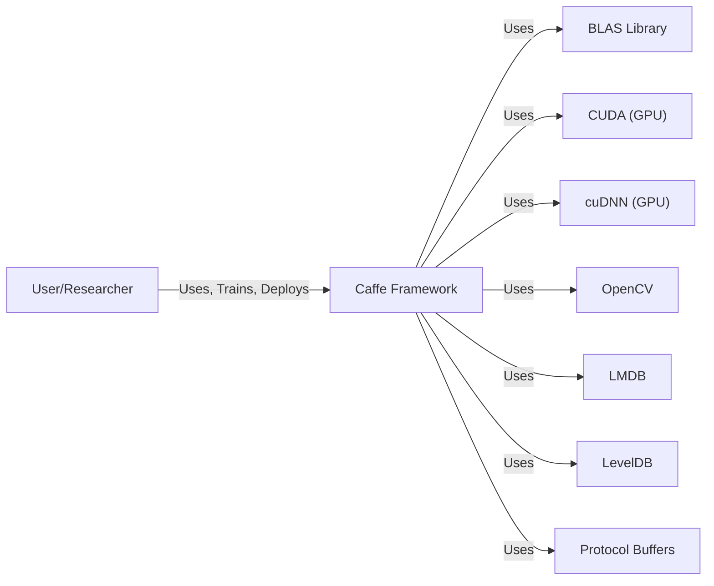
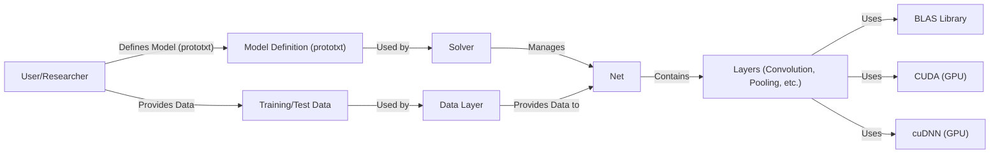
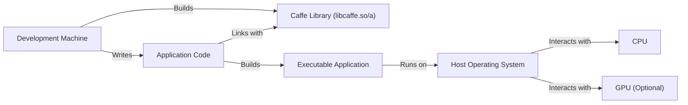
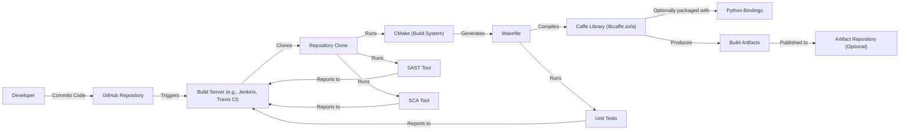

# Project Design Document: Caffe

## BUSINESS POSTURE

Caffe is a deep learning framework, and its primary business purpose is to provide a fast, modular, and expressive platform for researchers and developers to build, train, and deploy deep learning models. The project aims to accelerate research and development in the field of deep learning and facilitate the creation of AI-powered applications.

Business Priorities:

*   Performance: Caffe prioritizes speed and efficiency in model training and inference.
*   Modularity: The framework is designed to be modular, allowing users to easily define and customize models.
*   Community: Caffe benefits from a strong community of users and contributors.
*   Reproducibility: Enable researchers to reproduce results and build upon existing work.
*   Deployment: Facilitate the deployment of trained models in various environments.

Business Risks:

*   Incorrect Model Training: Bugs in the framework or user-defined models could lead to incorrect training results, impacting the accuracy and reliability of AI applications.
*   Vulnerabilities in Dependencies: Caffe relies on external libraries (e.g., BLAS, CUDA, cuDNN). Vulnerabilities in these dependencies could be exploited to compromise the framework or the applications built upon it.
*   Lack of Model Interpretability: Deep learning models can be "black boxes," making it difficult to understand their decision-making process. This can be a risk in applications where transparency and explainability are required.
*   Data Poisoning: Malicious actors could tamper with training data to introduce biases or vulnerabilities into trained models.
*   Supply Chain Attacks: Compromise of the build or distribution process could lead to the introduction of malicious code into the Caffe framework.

## SECURITY POSTURE

Existing Security Controls:

*   security control: Code Reviews: The Caffe project on GitHub likely uses a pull request system, which inherently includes code reviews by other developers before merging changes. (Described in GitHub contribution guidelines).
*   security control: Community Vetting: Being an open-source project, Caffe benefits from the scrutiny of a large community of users and contributors, who can identify and report potential security issues. (Implicit in the open-source nature of the project).
*   security control: Use of established libraries: Caffe uses well-known and widely used libraries like BLAS, CUDA, and cuDNN. These libraries are generally well-maintained and have their own security measures. (Described in Caffe documentation and build files).

Accepted Risks:

*   accepted risk: Reliance on Third-Party Libraries: Caffe's dependence on external libraries introduces the risk of vulnerabilities in those libraries. While the libraries themselves are generally secure, zero-day vulnerabilities are always a possibility.
*   accepted risk: Limited Input Validation: While Caffe likely performs some input validation, the complexity of deep learning models and data formats makes comprehensive input validation challenging.
*   accepted risk: No Built-in Sandboxing: Caffe does not have built-in sandboxing mechanisms to isolate model execution. This means that a compromised model could potentially affect the host system.

Recommended Security Controls:

*   security control: Static Analysis Security Testing (SAST): Integrate SAST tools into the build process to automatically scan the Caffe codebase for potential vulnerabilities.
*   security control: Software Composition Analysis (SCA): Use SCA tools to identify and track the versions of all third-party libraries used by Caffe, and to monitor for known vulnerabilities in those libraries.
*   security control: Fuzz Testing: Implement fuzz testing to systematically provide invalid or unexpected inputs to Caffe's APIs and components, to identify potential crashes or vulnerabilities.
*   security control: Security Training for Contributors: Provide security training to Caffe contributors to raise awareness of common security vulnerabilities and best practices.

Security Requirements:

*   Authentication: Not directly applicable to the Caffe framework itself, as it's a library, not a service. Authentication would be relevant for applications built *using* Caffe that require user access control.
*   Authorization: Not directly applicable to the core framework. Authorization would be relevant for applications built *using* Caffe that need to control access to specific functionalities or data.
*   Input Validation:
    *   Validate the structure and format of model definition files (prototxt).
    *   Validate the dimensions and data types of input data (e.g., images, text).
    *   Sanitize user-provided inputs to prevent injection attacks (if applicable, depending on how Caffe is used).
*   Cryptography:
    *   If Caffe is used to process sensitive data, consider using encryption to protect the data at rest and in transit. This is more relevant to applications *using* Caffe than to the framework itself.
    *   If model weights are considered sensitive intellectual property, consider encrypting them at rest.
*   Data Integrity:
    *   Ensure the integrity of training data to prevent data poisoning attacks. This could involve using checksums or digital signatures.

## DESIGN

### C4 CONTEXT

Element Descriptions:

*   Element:
    *   Name: User/Researcher
    *   Type: Person
    *   Description: Individuals who use Caffe to build, train, and deploy deep learning models.
    *   Responsibilities: Defining models, preparing data, training models, evaluating results, deploying models.
    *   Security controls: Not directly applicable, as this is the user. Security controls would apply to the systems and applications they use to interact with Caffe.

*   Element:
    *   Name: Caffe Framework
    *   Type: Software System
    *   Description: The core Caffe deep learning framework.
    *   Responsibilities: Providing APIs for model definition, training, and inference; managing data loading and processing; interacting with hardware (CPU/GPU).
    *   Security controls: Code reviews, community vetting, SAST (recommended), SCA (recommended), fuzz testing (recommended).

*   Element:
    *   Name: BLAS Library
    *   Type: Software Library
    *   Description: Basic Linear Algebra Subprograms, used for efficient matrix and vector operations.
    *   Responsibilities: Providing optimized linear algebra routines.
    *   Security controls: Relies on the security of the specific BLAS implementation used (e.g., OpenBLAS, MKL).

*   Element:
    *   Name: CUDA (GPU)
    *   Type: Hardware/Software
    *   Description: NVIDIA's parallel computing platform and API for using GPUs.
    *   Responsibilities: Providing low-level access to GPU hardware for accelerated computation.
    *   Security controls: Relies on NVIDIA's security measures for CUDA and the GPU driver.

*   Element:
    *   Name: cuDNN (GPU)
    *   Type: Software Library
    *   Description: NVIDIA's library for deep neural networks, providing optimized primitives for GPU acceleration.
    *   Responsibilities: Providing optimized routines for common deep learning operations (e.g., convolution, pooling).
    *   Security controls: Relies on NVIDIA's security measures for cuDNN.

*   Element:
    *   Name: OpenCV
    *   Type: Software Library
    *   Description: Open Source Computer Vision Library
    *   Responsibilities: Image and video processing
    *   Security controls: Relies on the security of the specific OpenCV implementation.

*   Element:
    *   Name: LMDB
    *   Type: Software Library
    *   Description: Lightning Memory-Mapped Database
    *   Responsibilities: Data storage
    *   Security controls: Relies on the security of the specific LMDB implementation.

*   Element:
    *   Name: LevelDB
    *   Type: Software Library
    *   Description: A fast key-value storage library
    *   Responsibilities: Data storage
    *   Security controls: Relies on the security of the specific LevelDB implementation.

*   Element:
    *   Name: Protobuf
    *   Type: Software Library
    *   Description: Protocol Buffers - a language-neutral, platform-neutral, extensible mechanism for serializing structured data.
    *   Responsibilities: Data serialization
    *   Security controls: Relies on the security of the specific Protobuf implementation.

### C4 CONTAINER

Element Descriptions:

*   Element:
    *   Name: User/Researcher
    *   Type: Person
    *   Description: (Same as in Context Diagram)
    *   Responsibilities: (Same as in Context Diagram)
    *   Security controls: (Same as in Context Diagram)

*   Element:
    *   Name: Model Definition (prototxt)
    *   Type: Configuration File
    *   Description: A text file that describes the architecture of the deep learning model, using Caffe's protocol buffer definition language.
    *   Responsibilities: Defining the layers of the network, their connections, and their parameters.
    *   Security controls: Input validation (structure and format).

*   Element:
    *   Name: Training/Test Data
    *   Type: Data
    *   Description: The data used to train and evaluate the deep learning model.
    *   Responsibilities: Providing the input and target values for the learning process.
    *   Security controls: Data integrity checks (checksums, digital signatures), input validation (data type and range checks).

*   Element:
    *   Name: Solver
    *   Type: Component
    *   Description: The component that orchestrates the training process, optimizing the model's parameters.
    *   Responsibilities: Implementing the optimization algorithm (e.g., stochastic gradient descent), managing learning rate, and controlling the training iterations.
    *   Security controls: Code reviews, SAST.

*   Element:
    *   Name: Data Layer
    *   Type: Component
    *   Description: The component responsible for loading and pre-processing data.
    *   Responsibilities: Reading data from various sources (e.g., files, databases), performing data augmentation, and providing data batches to the network.
    *   Security controls: Input validation, data sanitization.

*   Element:
    *   Name: Net
    *   Type: Component
    *   Description: The core component that represents the deep learning model.
    *   Responsibilities: Holding the layers of the network, managing forward and backward passes, and computing gradients.
    *   Security controls: Code reviews, SAST.

*   Element:
    *   Name: Layers (Convolution, Pooling, etc.)
    *   Type: Component
    *   Description: The building blocks of the deep learning model, performing specific operations on the data.
    *   Responsibilities: Implementing various types of layers (e.g., convolution, pooling, fully connected, activation functions).
    *   Security controls: Code reviews, SAST, fuzz testing.

*   Element:
    *   Name: BLAS Library
    *   Type: Software Library
    *   Description: (Same as in Context Diagram)
    *   Responsibilities: (Same as in Context Diagram)
    *   Security controls: (Same as in Context Diagram)

*   Element:
    *   Name: CUDA (GPU)
    *   Type: Hardware/Software
    *   Description: (Same as in Context Diagram)
    *   Responsibilities: (Same as in Context Diagram)
    *   Security controls: (Same as in Context Diagram)

*   Element:
    *   Name: cuDNN (GPU)
    *   Type: Software Library
    *   Description: (Same as in Context Diagram)
    *   Responsibilities: (Same as in Context Diagram)
    *   Security controls: (Same as in Context Diagram)

### DEPLOYMENT

Possible Deployment Solutions:

1.  Standalone C++ Application: Integrate Caffe as a library within a C++ application.
2.  Python API: Use Caffe's Python interface within a Python application or script.
3.  Server-Based Deployment: Deploy Caffe models on a server (e.g., using a framework like Flask or TensorFlow Serving) to provide inference as a service.
4.  Embedded Systems: Deploy Caffe models on embedded devices (e.g., using Caffe2 or other optimized frameworks).

Chosen Solution (for detailed description): Standalone C++ Application

Element Descriptions:

*   Element:
    *   Name: Development Machine
    *   Type: Hardware
    *   Description: The machine used by developers to build the Caffe library and the application.
    *   Responsibilities: Providing the development environment (compilers, build tools, etc.).
    *   Security controls: Standard development machine security practices (e.g., OS patching, antivirus).

*   Element:
    *   Name: Caffe Library (libcaffe.so/a)
    *   Type: Software Library
    *   Description: The compiled Caffe library.
    *   Responsibilities: Providing the core Caffe functionality.
    *   Security controls: SAST, SCA, fuzz testing (during the build process).

*   Element:
    *   Name: Application Code
    *   Type: Source Code
    *   Description: The C++ code that uses the Caffe library to perform inference or other tasks.
    *   Responsibilities: Loading models, processing input data, performing inference, handling output.
    *   Security controls: Code reviews, SAST, input validation.

*   Element:
    *   Name: Executable Application
    *   Type: Executable File
    *   Description: The compiled application that integrates the Caffe library.
    *   Responsibilities: Running the deep learning model and interacting with the user or other systems.
    *   Security controls: Secure coding practices, vulnerability management.

*   Element:
    *   Name: Host Operating System
    *   Type: Operating System
    *   Description: The operating system on which the application runs.
    *   Responsibilities: Providing the runtime environment for the application.
    *   Security controls: OS patching, security hardening, access controls.

*   Element:
    *   Name: CPU
    *   Type: Hardware
    *   Description: The central processing unit.
    *   Responsibilities: Executing instructions.
    *   Security controls: Hardware security features (if available).

*   Element:
    *   Name: GPU (Optional)
    *   Type: Hardware
    *   Description: The graphics processing unit (if used for accelerated inference).
    *   Responsibilities: Performing parallel computations.
    *   Security controls: Driver security, firmware updates.

### BUILD

Build Process Description:

1.  Developer commits code changes to the GitHub repository.
2.  A build server (e.g., Jenkins, Travis CI, GitHub Actions) is triggered by the commit.
3.  The build server clones the repository.
4.  CMake is used to generate build files (e.g., Makefiles) for the specific platform.
5.  The build system (e.g., Make) compiles the Caffe library and any associated tools.
6.  Unit tests are run to verify the correctness of the code.
7.  (Optional) Python bindings are built.
8.  Build artifacts (e.g., the Caffe library, executables, Python packages) are produced.
9.  (Optional) Build artifacts are published to an artifact repository.
10. SAST tools are run on the codebase to identify potential security vulnerabilities.
11. SCA tools are run to identify and track dependencies and their vulnerabilities.
12. Test, SAST and SCA results are reported to the build server, potentially failing the build if issues are found.

Security Controls:

*   security control: Build Automation: The build process is automated using a build server and build system (CMake, Make).
*   security control: Unit Tests: Unit tests are included in the build process to verify code correctness.
*   security control: SAST: Static analysis security testing is integrated into the build process.
*   security control: SCA: Software composition analysis is integrated into the build process.
*   security control: Version Control: The use of Git and GitHub provides version control and an audit trail of code changes.

## RISK ASSESSMENT

Critical Business Processes:

*   Model Training: The process of training accurate and reliable deep learning models.
*   Model Inference: The process of using trained models to make predictions on new data.
*   Research and Development: The ongoing process of improving the Caffe framework and developing new deep learning techniques.

Data Sensitivity:

*   Training Data: The sensitivity of training data can vary widely. It could range from publicly available datasets to highly sensitive proprietary data.
*   Model Weights: Model weights can be considered intellectual property and may need to be protected.
*   Inference Data: The sensitivity of data used for inference depends on the application. It could be public data or highly sensitive data (e.g., medical images, financial data).

Data Sensitivity Levels:

*   Public: Data that is freely available to the public.
*   Internal: Data that is only accessible to authorized personnel within an organization.
*   Confidential: Data that is highly sensitive and requires strict access controls.
*   Restricted: Data that is subject to legal or regulatory restrictions (e.g., PII, HIPAA data).

## QUESTIONS & ASSUMPTIONS

Questions:

*   What specific BLAS implementations are officially supported and tested with Caffe?
*   What are the recommended security configurations for the CUDA and cuDNN libraries when used with Caffe?
*   Are there any existing security audits or penetration testing reports for Caffe?
*   What is the process for reporting security vulnerabilities in Caffe?
*   What are the specific data formats and protocols used for data input and output in Caffe?
*   Are there plans to integrate any sandboxing or isolation mechanisms into Caffe?

Assumptions:

*   BUSINESS POSTURE: It is assumed that the primary users of Caffe are researchers and developers with a good understanding of deep learning concepts and security best practices.
*   SECURITY POSTURE: It is assumed that users are responsible for securing the environment in which Caffe is deployed and for protecting any sensitive data used with Caffe.
*   DESIGN: It is assumed that Caffe is primarily used as a library within other applications, rather than as a standalone service. It is assumed that the build process relies on CMake and Make. It is assumed that the deployment environment is a Linux-based system.