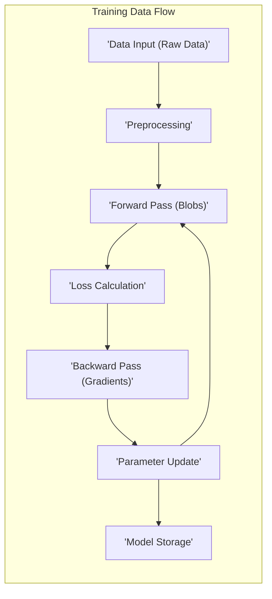
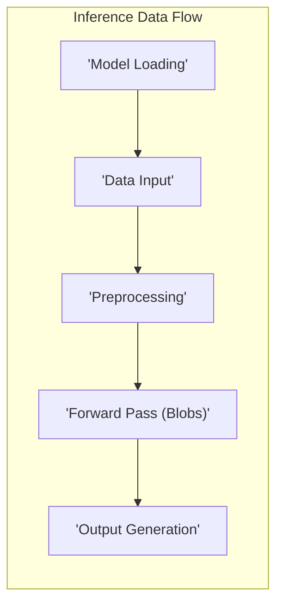
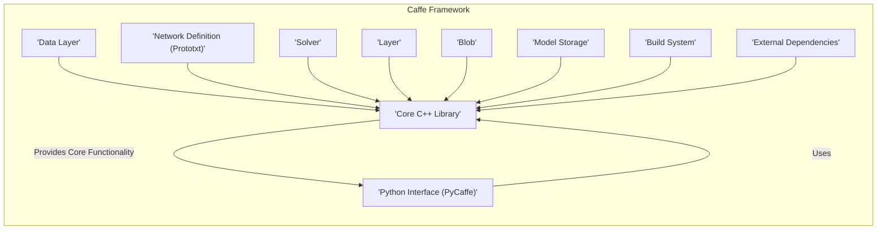
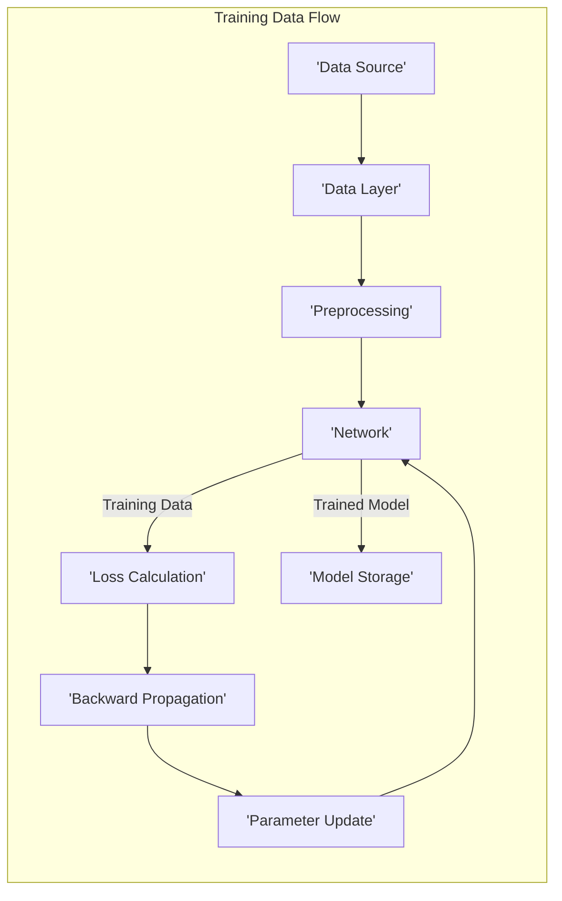
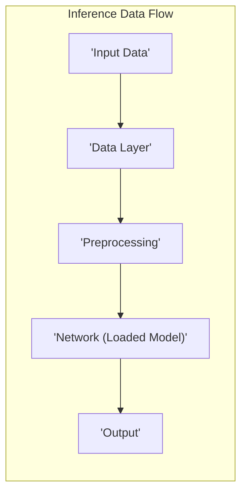

# Project Design Document: Caffe Deep Learning Framework

**Version:** 1.1
**Date:** October 26, 2023
**Prepared By:** AI Software Architect

## 1. Introduction

This document provides an enhanced architectural design of the Caffe deep learning framework. It aims to offer a more detailed and refined understanding of the system's components, their interactions, and data flow. This improved document will serve as a stronger foundation for subsequent threat modeling activities to identify potential security vulnerabilities and risks within the Caffe framework.

### 1.1. Purpose

The primary purpose of this document is to:

*   Provide a more detailed and clearer outline of the architecture of the Caffe deep learning framework.
*   Describe the key components and their functionalities with greater specificity.
*   Illustrate the data flow within the system for both training and inference with improved clarity.
*   Offer a more robust basis for identifying potential security threats and vulnerabilities.

### 1.2. Scope

This document covers the core architectural components of the Caffe framework in greater detail, including:

*   The core C++ library and its key responsibilities.
*   The Python interface and its role in user interaction.
*   Data input and output mechanisms, including common data formats.
*   Network definition and execution processes.
*   Model storage and loading procedures.
*   Key external dependencies and their potential security implications.

This document still does not cover:

*   Specific algorithms or models implemented within Caffe at a granular level.
*   Detailed code-level implementation specifics.
*   Deployment environments or infrastructure configurations.

### 1.3. Target Audience

This document is intended for:

*   Security engineers and architects responsible for conducting thorough threat modeling and security assessments.
*   Software developers actively working on or integrating with the Caffe framework.
*   Cloud architects designing and managing systems that incorporate Caffe components.

## 2. System Overview

Caffe (Convolutional Architecture for Fast Feature Embedding) is a widely-used deep learning framework originating from the Berkeley Vision and Learning Center (BVLC). It is primarily implemented in C++ and offers a Python interface for ease of use. Caffe's strengths lie in its performance and modular design, making it well-suited for various deep learning applications, particularly in the domain of computer vision.

### 2.1. Key Features

*   **Declarative Model Definition:** Models are defined using human-readable configuration files (prototxt).
*   **High Performance:**  Core is written in C++ for optimized execution speed.
*   **Modular Design:** Layers and solvers are designed as independent, reusable components.
*   **Open Source:**  Benefits from community contributions and transparency.
*   **Extensible Architecture:** Facilitates the addition of custom layers and functionalities.

## 3. Architectural Design

The Caffe architecture comprises several interconnected components, each with specific responsibilities:

*   **Core C++ Library:** The foundational layer providing core functionalities and performance.
*   **Python Interface (PyCaffe):** Enables Python-based interaction for model definition, training, and deployment.
*   **Data Layer:** Manages the ingestion and preprocessing of various data formats.
*   **Network Definition (Prototxt):** Defines the neural network structure using protocol buffer configurations.
*   **Solver:** Implements optimization algorithms to train the network parameters.
*   **Layer:** Represents individual computational units within the neural network.
*   **Blob:** The fundamental data container for storing and exchanging data within Caffe.
*   **Model Storage:** Handles the persistence of trained models.
*   **Build System:**  Utilizes CMake for cross-platform compilation and dependency management.
*   **External Dependencies:**  Relied upon for core functionalities and performance optimizations.

### 3.1. Component Descriptions

*   **Core C++ Library:**
    *   Implements fundamental data structures like `Blob` for data storage.
    *   Contains implementations of various `Layer` types (e.g., Convolution, Pooling, ReLU).
    *   Provides `Solver` implementations for optimization algorithms (e.g., SGD, Adam).
    *   Manages memory allocation and deallocation for efficient computation.
    *   Orchestrates the forward and backward passes during the training process.
*   **Python Interface (PyCaffe):**
    *   Provides Python bindings to the core C++ library, enabling scripting and automation.
    *   Allows users to define network architectures programmatically.
    *   Facilitates the training and evaluation of models using Python scripts.
    *   Enables seamless integration with other Python scientific computing libraries (e.g., NumPy, SciPy, Matplotlib).
*   **Data Layer:**
    *   Responsible for loading training and validation data from various sources (e.g., image files, LMDB/LevelDB databases, HDF5 files).
    *   Performs essential data preprocessing steps such as:
        *   Normalization (scaling pixel values).
        *   Mean subtraction.
        *   Data augmentation (e.g., cropping, flipping, rotation).
        *   Batching data for efficient processing.
    *   Supports different data formats commonly used in deep learning (e.g., images, numerical data).
*   **Network Definition (Prototxt):**
    *   Defines the architecture of the neural network using a text-based configuration file adhering to the Protocol Buffer format.
    *   Specifies the sequence of layers, their types, and their respective parameters (e.g., kernel size, number of filters).
    *   Defines the connections between layers, specifying the flow of data.
    *   Allows for the configuration of input data sources and transformations.
*   **Solver:**
    *   Implements various optimization algorithms used to update the network's weights and biases during training.
    *   Manages the training loop, including forward and backward passes.
    *   Configured through a separate prototxt file specifying parameters like learning rate, momentum, and weight decay.
    *   Handles snapshotting (saving) the model at regular intervals.
*   **Layer:**
    *   Represents a fundamental building block of a neural network, performing a specific computation on its input.
    *   Examples include: Convolutional layers, Pooling layers, Activation layers (e.g., ReLU, Sigmoid), Fully Connected layers.
    *   Each layer has specific input and output `Blob` types and performs a well-defined mathematical operation.
    *   Users can extend Caffe by defining custom layers.
*   **Blob:**
    *   A multi-dimensional array serving as the standard unit of data storage and communication within Caffe.
    *   Stores both the numerical data and its corresponding gradient.
    *   Provides metadata about the data, such as its shape (dimensions).
    *   Facilitates efficient data transfer between layers.
*   **Model Storage:**
    *   Handles saving the trained network's weights and biases to persistent storage.
    *   Typically saves models in a binary file format (`.caffemodel`).
    *   Provides functionality to load pre-trained models for fine-tuning or inference.
*   **Build System:**
    *   Utilizes CMake to automate the build process across different operating systems and compilers.
    *   Manages the compilation of C++ source code and linking with necessary libraries.
    *   Simplifies the process of configuring build options and generating build files.
*   **External Dependencies:**
    *   **BLAS Libraries (e.g., OpenBLAS, MKL):** Provide optimized routines for basic linear algebra operations, crucial for performance.
    *   **cuDNN and cuBLAS (for GPU support):** NVIDIA libraries for accelerating deep learning computations on GPUs.
    *   **Protocol Buffers:** Used for defining and serializing the network configuration (prototxt files).
    *   **Boost Libraries:** A collection of C++ libraries providing various utilities.
    *   **glog (Google Logging Library):** Provides a robust logging framework for debugging and monitoring.
    *   **gflags (Google Commandline Flags Library):** Enables parsing of command-line arguments.
    *   **LMDB or LevelDB:** Key-value store databases often used for efficient data loading.
    *   **OpenCV:** A comprehensive library for computer vision tasks, often used for image preprocessing.

## 4. Data Flow

The flow of data within Caffe differs depending on whether the framework is in the training or inference phase.

### 4.1. Training Data Flow

1. **Data Input:** The `Data Layer` loads raw training data from specified sources.
2. **Preprocessing:** The `Data Layer` applies necessary preprocessing steps to the raw data.
3. **Forward Pass:** Preprocessed data, packaged as `Blob` objects, is passed through the network, layer by layer. Each `Layer` performs its defined computation.
4. **Loss Calculation:** The output of the final layer is compared to the ground truth labels using a defined loss function.
5. **Backward Pass (Backpropagation):** The gradient of the loss with respect to the network's parameters is calculated and propagated backward through the network.
6. **Parameter Update:** The `Solver` uses the calculated gradients to update the network's weights and biases according to the chosen optimization algorithm.
7. **Iteration:** Steps 1 through 6 are repeated for a specified number of iterations or epochs.
8. **Model Storage (Snapshot):** Periodically, the trained model's parameters are saved to disk by the `Solver`.

### 4.2. Inference Data Flow

1. **Model Loading:** The trained model (network weights and biases) is loaded from storage.
2. **Data Input:** The `Data Layer` loads the input data for which inference is to be performed.
3. **Preprocessing:** The `Data Layer` applies the same preprocessing steps used during training to the input data.
4. **Forward Pass:** The preprocessed input data (`Blob`) is passed through the loaded network, layer by layer.
5. **Output Generation:** The final layer produces the inference result (e.g., classification probabilities, object detections).

## 5. Key Security Considerations

Based on the detailed architectural design, the following security considerations are crucial for threat modeling:

*   **Data Input Validation:**
    *   Thoroughly validate input data formats to prevent malformed data from causing errors or crashes.
    *   Sanitize input data to prevent injection attacks if data sources are external or user-provided.
    *   Validate data ranges and types to ensure they align with expected values, preventing unexpected behavior.
*   **Model Security:**
    *   **Model Poisoning:**  Assess the risk of attackers injecting malicious data into the training process to degrade model accuracy or introduce backdoors. Implement robust data validation and provenance tracking.
    *   **Model Extraction:** Evaluate the potential for attackers to steal or reverse-engineer trained models, potentially exposing sensitive information or intellectual property. Consider techniques like model obfuscation or access controls.
*   **Dependency Management:**
    *   Regularly scan external dependencies for known vulnerabilities.
    *   Implement a process for updating dependencies promptly to patch security flaws.
    *   Use dependency management tools to track and manage versions effectively.
*   **Build Process Security:**
    *   Secure the build environment to prevent the introduction of malicious code during compilation.
    *   Implement checks to ensure the integrity of build artifacts.
    *   Use trusted sources for dependencies and build tools.
*   **Access Control:**
    *   Implement strict access controls for model files, configuration files (prototxt), and data sources.
    *   Restrict access to sensitive components and data based on the principle of least privilege.
*   **Data Storage Security:**
    *   Encrypt training data and trained models at rest and in transit.
    *   Implement appropriate access controls and auditing for data storage locations.
*   **Python Interface Security:**
    *   Be cautious when loading external data or models through Python scripts, as this can introduce vulnerabilities if not handled carefully.
    *   Sanitize user inputs passed through the Python interface.
*   **Inference Security:**
    *   Protect against adversarial inputs designed to cause denial of service or generate incorrect predictions during inference.
    *   Implement rate limiting and input validation for inference services.
*   **Configuration File Security (Prototxt):**
    *   Ensure the integrity of network definition files to prevent malicious modifications that could alter model behavior or introduce vulnerabilities.
    *   Implement version control and access controls for prototxt files.

## 6. Diagrams

### 6.1. High-Level Architecture Diagram

### 6.2. Data Flow Diagrams

#### 6.2.1. Training Data Flow

#### 6.2.2. Inference Data Flow

## 7. Conclusion

This improved document provides a more detailed and refined understanding of the Caffe deep learning framework's architecture and data flow. By elaborating on the functionalities of each component and providing separate data flow diagrams for training and inference, this document offers a stronger foundation for identifying potential security vulnerabilities. The outlined security considerations serve as a starting point for a comprehensive threat modeling exercise, enabling security professionals to develop effective mitigation strategies and ensure the robust security of systems built upon the Caffe framework.