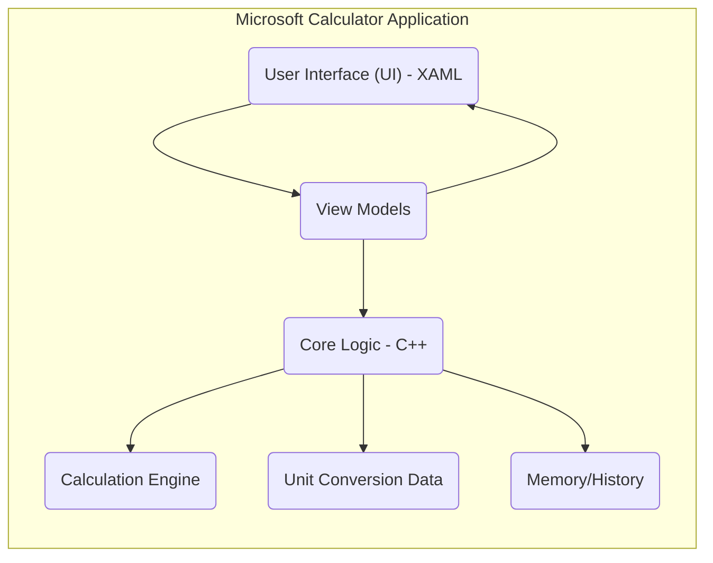
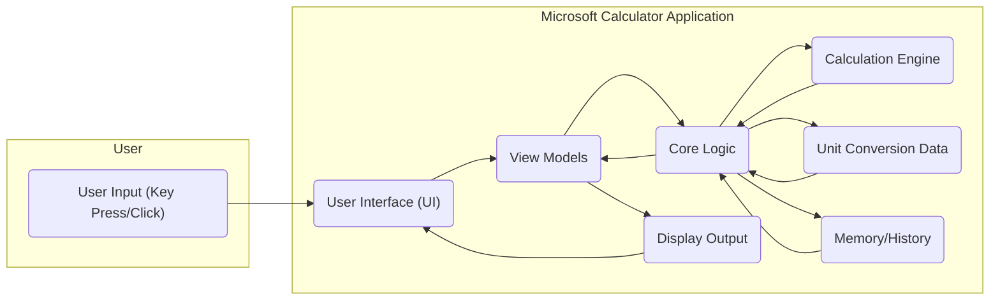

# Project Design Document: Microsoft Calculator

**Version:** 1.1
**Date:** October 26, 2023
**Prepared By:** Gemini AI (as per user request)

## 1. Introduction

This document provides a detailed architectural design overview of the Microsoft Calculator application, based on the source code available at [https://github.com/microsoft/calculator](https://github.com/microsoft/calculator). This document is intended to serve as a foundation for threat modeling activities, providing a clear understanding of the system's components, data flow, and potential attack surfaces.

## 2. Goals and Objectives

The primary goal of this document is to provide a comprehensive architectural description of the Microsoft Calculator application to facilitate effective threat modeling. Specific objectives include:

*   Identifying the major components and their interactions.
*   Mapping the data flow within the application.
*   Highlighting potential areas of security concern.
*   Providing a clear and concise representation of the system's architecture.

## 3. Scope

This design document focuses on the core functionality and architecture of the Microsoft Calculator application as represented in the provided GitHub repository. It primarily covers the client-side application logic and user interface. The scope explicitly excludes:

*   Build and deployment pipelines.
*   Telemetry and analytics collection (unless directly implemented within the core application).
*   External services or APIs the application might interact with (based on the provided repository, it appears to be a standalone application).
*   Operating system level security features.

## 4. High-Level Architecture

The Microsoft Calculator application follows a traditional desktop application architecture, likely employing a Model-View-ViewModel (MVVM) or similar pattern.

*   **User Interface (UI) - XAML:**  This layer is responsible for presenting the application to the user and handling user input (button clicks, keyboard input, etc.). It's likely built using XAML (Extensible Application Markup Language).
*   **View Models:** These act as intermediaries between the UI and the core logic. They contain the presentation logic and expose data and commands that the UI can bind to.
*   **Core Logic - C++:** This layer contains the main application logic, orchestrating the interactions between different components. It handles user requests, manages state, and interacts with the calculation engine and data sources.
*   **Calculation Engine:** This component performs the actual mathematical calculations. It likely implements various arithmetic operations, scientific functions, and programmer mode logic.
*   **Unit Conversion Data:** This component stores and manages data for unit conversions (e.g., currency, length, temperature). This data might be embedded within the application or loaded from a local file.
*   **Memory/History:** This component manages the application's memory functions (M+, M-, MR, MC) and the history of calculations. This data is likely stored locally within the application's process.

## 5. Component Details

This section provides a more detailed description of the key components identified in the high-level architecture.

*   **User Interface (UI) - XAML:**
    *   Responsible for rendering the calculator's visual elements (buttons, display, menus).
    *   Handles user input events (mouse clicks, keyboard presses).
    *   Binds to View Model properties to display data and reflect state changes.
    *   Likely organized into different views for standard, scientific, programmer, and other modes.
*   **View Models:**
    *   Contain properties that represent the state of the UI (e.g., current display value, selected mode).
    *   Expose commands that the UI can trigger (e.g., button press commands).
    *   Implement logic for formatting data for display.
    *   Orchestrate interactions with the Core Logic layer.
*   **Core Logic - C++:**
    *   Receives commands from the View Models.
    *   Manages the application's state and data.
    *   Invokes the Calculation Engine for mathematical operations.
    *   Accesses and manages Unit Conversion Data.
    *   Manages the Memory and History functionality.
    *   Potentially handles error conditions and user feedback.
*   **Calculation Engine:**
    *   Implements algorithms for various mathematical operations (addition, subtraction, multiplication, division, trigonometric functions, etc.).
    *   Handles different number representations (decimal, binary, hexadecimal).
    *   May include logic for handling operator precedence and parentheses.
    *   Needs to handle potential errors like division by zero or invalid input.
*   **Unit Conversion Data:**
    *   Stores mappings between different units of measurement.
    *   May be stored in data structures like dictionaries or lookup tables.
    *   Could be loaded from a configuration file or embedded within the application.
*   **Memory/History:**
    *   Stores values in memory slots (M+, M-, MR, MC).
    *   Maintains a history of performed calculations.
    *   Data is likely stored in memory during the application's runtime. Persistence across sessions might involve local file storage.

## 6. Data Flow

The primary data flow within the application involves user input, processing by the core logic and calculation engine, and output back to the user interface.

1. **User Input:** The user interacts with the UI by pressing buttons or using the keyboard.
2. **UI Event Handling:** The UI captures these events and passes them to the corresponding View Model.
3. **View Model Processing:** The View Model interprets the user input and invokes commands or updates properties.
4. **Core Logic Processing:** The Core Logic receives commands from the View Model and performs the necessary actions. This might involve:
    *   Sending data to the Calculation Engine for mathematical operations.
    *   Retrieving Unit Conversion Data.
    *   Updating the Memory or History.
5. **Calculation Engine:** Performs the requested calculations and returns the result to the Core Logic.
6. **Data Retrieval:** The Core Logic retrieves necessary data from the Unit Conversion Data or Memory/History components.
7. **View Model Update:** The Core Logic updates the View Model with the results of the calculations or data retrieval.
8. **UI Update:** The UI is notified of the changes in the View Model and updates the display accordingly.
9. **Display Output:** The calculated result or converted value is displayed to the user.

## 7. Security Considerations

Based on the architecture, potential security considerations for threat modeling include:

*   **Input Validation:**
    *   Improper validation of user input within the UI or Core Logic could lead to unexpected behavior or crashes.
    *   Maliciously crafted input strings could potentially exploit vulnerabilities in the calculation engine (e.g., format string bugs if string formatting is used unsafely) or unit conversion logic.
    *   Consider edge cases and boundary conditions for input values.
*   **Calculation Engine Vulnerabilities:**
    *   Bugs or vulnerabilities in the calculation engine's algorithms could lead to incorrect results, crashes, or even potential remote code execution if vulnerabilities like buffer overflows exist (though less likely in modern C++ with proper memory management).
    *   Integer overflows or underflows during calculations could lead to unexpected behavior or incorrect results that might be exploitable in specific contexts.
*   **Unit Conversion Data Integrity:**
    *   If the unit conversion data is stored in a modifiable file, tampering with this data could lead to incorrect and potentially misleading conversions. Consider the permissions and access controls on this data.
    *   If the data is fetched from an external source (less likely for a standalone app but worth noting for future extensions), the integrity and authenticity of that source become critical.
*   **Memory and History Management:**
    *   Sensitive information (though unlikely in a basic calculator) might be temporarily stored in memory or the calculation history. Improper handling could lead to information disclosure if the application's process memory is compromised.
    *   If the calculation history is persisted to disk, the storage mechanism should be secure, employing appropriate encryption and access controls to prevent unauthorized access.
*   **UI Security:**
    *   While less likely in a standalone desktop application built with native UI frameworks, vulnerabilities in any embedded web components or external UI libraries could be a concern.
    *   Consider potential for UI redressing or clickjacking attacks, though these are less common for desktop applications.
*   **Code Injection (Less likely but worth considering):**
    *   Although the application is likely written in compiled languages, it's worth considering if there are any areas where user-provided strings are used in dynamic code execution or command construction (e.g., passing strings to system calls).
*   **Dependency Vulnerabilities:**
    *   If the application relies on external libraries (even standard libraries), vulnerabilities in those libraries could pose a risk. This would require examining the project's dependencies and keeping them updated.
*   **Resource Exhaustion:**
    *   Maliciously crafted input or sequences of operations could potentially lead to excessive memory consumption or CPU usage, causing a denial-of-service condition on the local machine.

## 8. Deployment

The Microsoft Calculator application is typically deployed as a standalone desktop application on Windows. Common deployment methods include:

*   **Microsoft Store:** Users can download and install the application from the Microsoft Store. This provides a sandboxed environment and managed updates.
*   **MSI Package:**  The application can be distributed as an MSI (Microsoft Installer) package for direct installation. This requires more careful consideration of security during installation.
*   **Pre-installed with Windows:** The calculator is often pre-installed as part of the Windows operating system.

## 9. Technologies Used

Based on the GitHub repository, the primary technologies used are:

*   **C++:**  Likely used for the core logic and calculation engine, providing performance and control over system resources.
*   **XAML (Extensible Application Markup Language):** Used for declaratively defining the user interface, enabling separation of concerns between UI design and application logic.
*   **Potentially C#:**  May be used for parts of the application, related tooling, or testing frameworks.

## 10. Future Considerations

While this document focuses on the current architecture, future development might introduce new components and considerations:

*   **Cloud Integration:**  Future versions might integrate with cloud services for features like syncing history or unit conversion data across devices. This would introduce new security considerations related to authentication, authorization, and data transmission security.
*   **New Modes and Functionality:** Adding new calculator modes (e.g., graphing calculator, financial calculator) or features could introduce new attack surfaces and require careful security analysis of the new logic.
*   **Accessibility Features:**  Ensuring accessibility is important, but the implementation of accessibility features should be reviewed for potential security implications (e.g., information disclosure through accessibility APIs).
*   **Scripting or Automation:** If the application were to introduce scripting capabilities or allow for automation through external interfaces, this would significantly increase the attack surface and require careful design to prevent malicious scripts from compromising the system.

This design document provides a solid foundation for conducting a thorough threat model of the Microsoft Calculator application. By understanding the components, data flow, and potential vulnerabilities, security professionals can effectively identify and mitigate potential risks.
