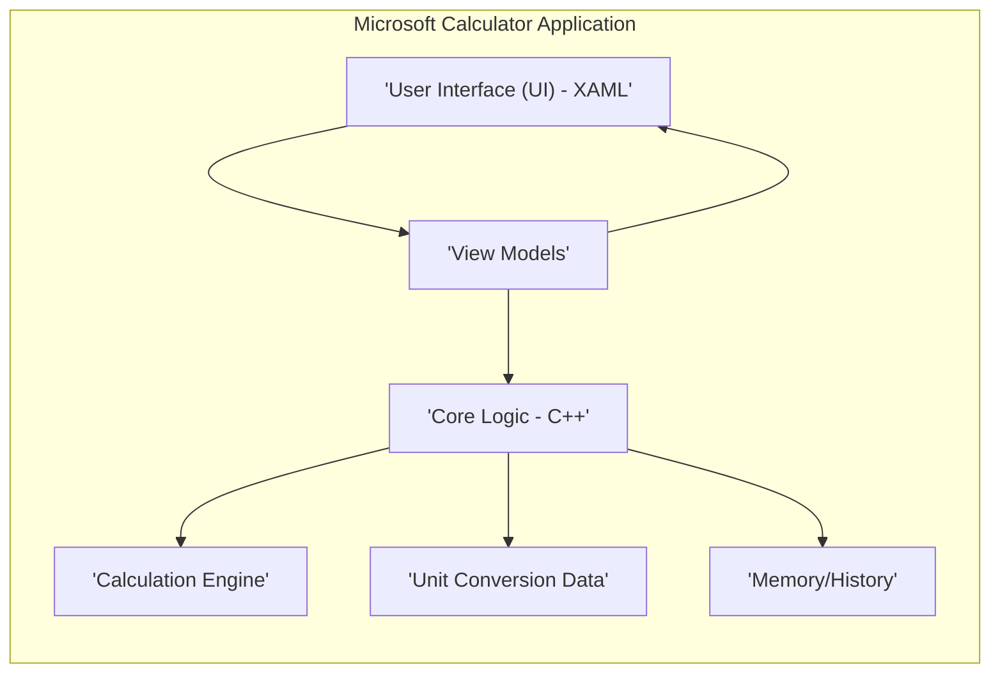
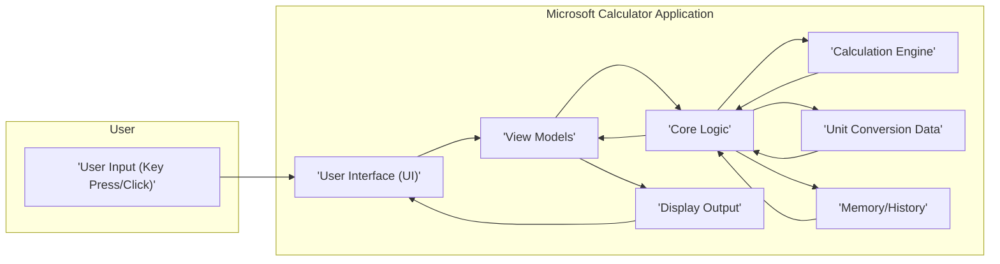

# Project Design Document: Microsoft Calculator

**Version:** 1.1
**Date:** October 26, 2023
**Prepared By:** Gemini AI (as per user request)

## 1. Introduction

This document provides an enhanced architectural design overview of the Microsoft Calculator application, based on the source code available at [https://github.com/microsoft/calculator](https://github.com/microsoft/calculator). This revised document aims to provide a more detailed and refined foundation for threat modeling activities, offering a clearer understanding of the system's components, data flow, and potential attack surfaces.

## 2. Goals and Objectives

The primary goal of this document remains to provide a comprehensive architectural description of the Microsoft Calculator application to facilitate effective threat modeling. Specific objectives include:

*   Providing a more granular identification of the major components and their interactions.
*   Offering a more precise mapping of the data flow within the application.
*   Highlighting potential areas of security concern with more specific examples.
*   Presenting a clear and concise representation of the system's architecture using improved descriptions and diagrams.

## 3. Scope

This design document continues to focus on the core functionality and architecture of the Microsoft Calculator application as represented in the provided GitHub repository. It primarily covers the client-side application logic and user interface. The scope explicitly excludes:

*   Build and deployment pipelines.
*   Telemetry and analytics collection (unless directly implemented within the core application).
*   External services or APIs the application might interact with (based on the provided repository, it appears to be a standalone application).
*   Operating system level security features.

## 4. High-Level Architecture

The Microsoft Calculator application employs a layered desktop application architecture, likely following a Model-View-ViewModel (MVVM) or a similar separation of concerns pattern.

*   **User Interface (UI) - XAML:** This layer is responsible for the visual presentation of the application and handling direct user interactions. It is built using XAML and defines the structure, layout, and appearance of the calculator's windows and controls.
*   **View Models:** These act as intermediaries, holding the presentation logic and data for the UI. They expose properties and commands that the UI can bind to, facilitating data display and user action handling without directly exposing the underlying business logic.
*   **Core Logic - C++:** This layer contains the central application logic, orchestrating the interactions between different components. It handles user requests initiated from the View Models, manages the application's state, and interacts with the Calculation Engine and data sources. This likely includes classes for managing different calculator modes (standard, scientific, programmer, etc.).
*   **Calculation Engine:** This component performs the actual mathematical computations. It implements algorithms for arithmetic operations, scientific functions, and logic for different programmer modes (e.g., bitwise operations). It needs to handle various data types and potential error conditions.
*   **Unit Conversion Data:** This component stores and manages the data required for unit conversions across different categories (e.g., currency, length, temperature). This data might be structured as lookup tables or dictionaries and could be embedded within the application or loaded from local files.
*   **Memory/History:** This component manages the calculator's memory functions (M+, M-, MR, MC) and the history of performed calculations. This data is typically stored in memory during the application's runtime, with potential persistence to local storage for history across sessions.

## 5. Component Details

This section provides a more detailed breakdown of the key components.

*   **User Interface (UI) - XAML:**
    *   Defines the visual elements such as buttons, the display area, menus, and mode selectors using XAML markup.
    *   Handles user input events like button clicks, keyboard input, and touch interactions.
    *   Utilizes data binding to connect UI elements to properties and commands exposed by the View Models.
    *   Likely organized into different XAML views or user controls for each calculator mode (e.g., `StandardCalculatorView.xaml`, `ScientificCalculatorView.xaml`).
*   **View Models:**
    *   Contain properties representing the current state of the calculator (e.g., `DisplayValue`, `CurrentMode`, `MemoryValue`).
    *   Expose commands that the UI can bind to, triggering actions in the Core Logic (e.g., `NumberInputCommand`, `OperationCommand`, `EqualsCommand`).
    *   Implement logic for formatting numerical values for display and handling user interface specific logic.
    *   Act as an intermediary, preventing the UI from directly interacting with the Core Logic, promoting modularity and testability.
*   **Core Logic - C++:**
    *   Receives commands from the View Models, such as a request to perform an addition or change the calculator mode.
    *   Manages the overall state of the calculator, including the current operands, operator, and calculation result.
    *   Invokes the Calculation Engine to perform the actual mathematical operations based on user input.
    *   Accesses and manages the Unit Conversion Data when a unit conversion operation is requested.
    *   Manages the Memory and History functionality, storing and retrieving values as needed.
    *   Handles error conditions, such as division by zero or invalid input, and provides feedback to the View Models for display.
*   **Calculation Engine:**
    *   Implements algorithms for basic arithmetic operations (+, -, *, /), as well as more complex scientific functions (trigonometry, logarithms, exponentiation).
    *   Handles different number representations, including decimal, binary, hexadecimal, and potentially others depending on the calculator mode.
    *   Includes logic for handling operator precedence (order of operations) and parentheses.
    *   Needs to implement robust error handling to prevent crashes or incorrect results due to invalid input or mathematical errors (e.g., square root of a negative number).
*   **Unit Conversion Data:**
    *   Stores mappings between different units of measurement within various categories (e.g., meters to feet, Celsius to Fahrenheit, USD to EUR).
    *   May be implemented using data structures like `std::map` or `std::unordered_map` in C++ for efficient lookups.
    *   Could be loaded from a configuration file (e.g., a JSON or XML file) at application startup or embedded directly within the application's code.
*   **Memory/History:**
    *   Stores values in memory slots, allowing users to save and recall numbers for later use.
    *   Maintains a history of performed calculations, allowing users to review past operations.
    *   Data is typically stored in-memory during the application's session. Persistence of history across sessions might involve writing to a local file (e.g., using file I/O operations in C++).

## 6. Data Flow

The primary data flow involves user interaction, processing through the different layers, and feedback to the user.

1. **User Input:** The user interacts with the calculator through the UI, either by clicking buttons with a mouse or using the keyboard.
2. **UI Event Handling:** The UI captures these input events and translates them into commands or data updates.
3. **View Model Processing:** The UI binds to commands and properties in the View Models. User input triggers commands in the View Model, or directly updates properties.
4. **Core Logic Processing:** The View Model invokes methods or updates properties in the Core Logic based on the user's action. The Core Logic interprets the request and orchestrates the necessary operations. This might involve:
    *   Passing operands and operators to the Calculation Engine for computation.
    *   Requesting unit conversion factors from the Unit Conversion Data component.
    *   Storing or retrieving values from the Memory or History.
5. **Calculation Engine:** Performs the requested mathematical calculation and returns the result to the Core Logic.
6. **Data Retrieval:** The Core Logic retrieves necessary data, such as conversion rates or stored memory values, from the respective data components.
7. **View Model Update:** The Core Logic updates the View Model with the results of calculations, data retrieval, or state changes.
8. **UI Update:** The UI is notified of changes in the View Model through data binding and updates the display to reflect the new state (e.g., showing the calculated result).
9. **Display Output:** The calculated result, converted value, or updated memory/history is displayed to the user through the UI.

## 7. Security Considerations

This section provides more specific examples of potential security considerations for threat modeling.

*   **Input Validation:**
    *   **Threat:** Maliciously crafted input strings (e.g., extremely long numbers, non-numeric characters where numbers are expected) could cause buffer overflows or unexpected behavior in the Calculation Engine or Core Logic.
    *   **Example:** Entering a string like "999999999999999999999999999999999999999999999999999999999999999999999999999999999999999999999999999999999999999999999999999999999999999999999999999999999999999999999999999999999999999999999999999999999999999999999999999999999999999999999999999999999999999999" could potentially crash the application if not handled correctly.
*   **Calculation Engine Vulnerabilities:**
    *   **Threat:** Bugs in the implementation of mathematical algorithms could lead to incorrect results, which might be exploited in specific scenarios, or potentially lead to crashes.
    *   **Example:** An integer overflow during a multiplication operation could lead to an unexpected result that bypasses intended limits or checks.
*   **Unit Conversion Data Integrity:**
    *   **Threat:** If the unit conversion data is stored in a local file without proper integrity checks, a malicious actor could modify this file to cause the calculator to perform incorrect conversions, potentially leading to financial or other errors if relied upon.
    *   **Example:** Tampering with the currency conversion rates could lead to incorrect currency calculations.
*   **Memory and History Management:**
    *   **Threat:** Sensitive information (e.g., recently calculated financial values) stored in memory could be vulnerable to memory dumping attacks if the application's process is compromised.
    *   **Threat:** If the calculation history is persisted to disk without encryption, this data could be accessed by unauthorized users.
    *   **Example:** A user calculating sensitive financial data might not want that history readily available in plain text on their hard drive.
*   **UI Security:**
    *   **Threat:** While less common in standalone desktop applications, if the UI relies on external rendering libraries, vulnerabilities in those libraries could be exploited.
    *   **Example:** A vulnerability in a third-party charting library (if used for advanced calculator modes) could be a potential attack vector.
*   **Code Injection (Less likely but worth considering):**
    *   **Threat:** Although the application is primarily written in compiled languages, if there are any areas where user-provided strings are used in dynamic code execution (e.g., through scripting engines, which is unlikely in this application), it could lead to code injection vulnerabilities.
*   **Dependency Vulnerabilities:**
    *   **Threat:** If the application uses third-party libraries for any functionality, vulnerabilities in those libraries could be exploited.
    *   **Example:** An outdated version of a math library with a known security flaw could be a risk.
*   **Update Mechanism (Out of Scope but relevant for a real-world application):**
    *   **Threat:** A compromised update mechanism could be used to distribute malware disguised as an update to the calculator application.

## 8. Deployment

The deployment methods remain consistent with the previous description.

*   **Microsoft Store:** Distribution and installation through the official Microsoft Store.
*   **MSI Package:** Direct installation using Microsoft Installer packages.
*   **Pre-installed with Windows:** Included as a default application in the Windows operating system.

## 9. Technologies Used

The core technologies used are:

*   **C++:** Primarily used for implementing the Core Logic, Calculation Engine, and potentially parts of the Memory/History management. C++ provides performance and control necessary for mathematical computations.
*   **XAML (Extensible Application Markup Language):** Used to declaratively define the structure, layout, and appearance of the User Interface. XAML facilitates the separation of UI design from the underlying application logic.
*   **Potentially C#:** While the core logic appears to be C++, C# might be used for related tooling, testing frameworks, or potentially for some higher-level application components or interop with other Windows APIs.

## 10. Future Considerations

Future development could introduce new security considerations.

*   **Cloud Integration:** Integrating with cloud services for features like syncing history or unit conversion data would introduce new attack surfaces related to authentication, authorization, and data transmission security.
*   **New Modes and Functionality:** Adding new calculator modes (e.g., a graphing calculator) or features could introduce new vulnerabilities specific to those functionalities.
*   **Accessibility Features:** While important, the implementation of accessibility features needs to be done carefully to avoid introducing new vulnerabilities (e.g., related to inter-process communication if assistive technologies are involved).

This enhanced design document provides a more detailed and refined understanding of the Microsoft Calculator's architecture, offering a stronger foundation for comprehensive threat modeling activities. The added specifics and examples aim to facilitate a more thorough identification and mitigation of potential security risks.
