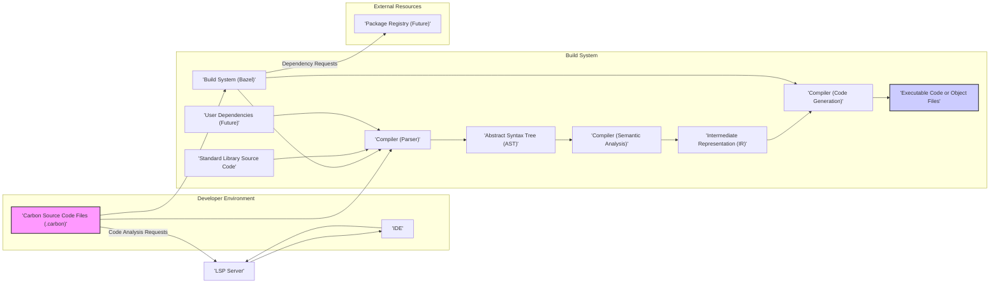

## Project Design Document: Carbon Language (Improved)

**Document Version:** 1.1
**Date:** October 26, 2023
**Prepared By:** Gemini (AI Model)

### 1. Introduction

This document provides an enhanced design overview of the Carbon Language project, an experimental successor to C++, as hosted on GitHub at [https://github.com/carbon-language/carbon-lang](https://github.com/carbon-language/carbon-lang). This improved version aims to provide a more detailed and security-focused understanding of the project's architecture, key components, and data flow. This document is specifically intended to serve as a foundation for subsequent threat modeling activities, enabling a comprehensive assessment of potential security vulnerabilities.

### 2. Project Overview

The Carbon Language project seeks to create a modern, evolution-friendly, and performant general-purpose programming language with strong C++ interoperability. It is designed to address perceived limitations in C++ while offering a smoother transition path for existing C++ codebases. The project is in active development, open-source, and relies on community contributions. Understanding its architecture is crucial for identifying potential security weaknesses early in the development lifecycle.

### 3. Key Components

The Carbon Language project comprises several interconnected components, each with its own security considerations:

*   **Compiler (`carbonc`):** The core component responsible for translating Carbon source code into executable code or an intermediate representation.
    *   **Parser:** Analyzes the lexical and syntactic structure of Carbon code. Potential vulnerabilities include denial-of-service through maliciously crafted input or exploitation of parsing logic flaws.
    *   **Semantic Analyzer:** Checks the meaning and correctness of the code, including type checking and scope resolution. Vulnerabilities here could lead to incorrect code generation or the bypassing of intended security mechanisms.
    *   **Intermediate Representation (IR) Generator:** Transforms the AST into an intermediate representation suitable for optimization and code generation. Bugs in this stage could introduce vulnerabilities in the generated code.
    *   **Optimizer:**  Attempts to improve the performance of the IR. Flaws in optimization passes could inadvertently introduce security vulnerabilities.
    *   **Code Generator:** Translates the IR into machine code for the target architecture. This is a critical stage where vulnerabilities could lead to exploitable binaries.
*   **Standard Library (`std`):** A collection of pre-built modules and functionalities providing essential utilities and data structures for Carbon programs.
    *   This includes fundamental types, input/output operations, string manipulation, and concurrency primitives. Security vulnerabilities in the standard library can have widespread impact on applications using it.
*   **Build System (Bazel):**  Manages the compilation process, linking dependencies, and creating executable artifacts.
    *   Bazel scripts define the build process. Vulnerabilities in these scripts or in the dependencies managed by Bazel can introduce supply chain risks.
*   **Language Server Protocol (LSP) Implementation:** A server providing language-specific features to IDEs and code editors.
    *   Enables features like autocompletion, go-to-definition, and error highlighting. Security concerns include potential for malicious code injection through the LSP interface or vulnerabilities in the server itself.
*   **Package Manager (Conceptual/Future):**  While not fully implemented, a package manager is anticipated for managing external dependencies and libraries.
    *   This will be crucial for code reuse but introduces risks related to dependency management, such as dependency confusion and malicious packages.
*   **Website and Documentation (`carbon.dev`):** Provides information about the language, its features, and usage instructions.
    *   Security considerations include common web vulnerabilities like Cross-Site Scripting (XSS) and Cross-Site Request Forgery (CSRF).
*   **GitHub Repository (`github.com/carbon-language/carbon-lang`):** The central repository hosting the source code, issues, and collaboration tools.
    *   Security concerns include access control, code integrity, and protection against malicious contributions.

### 4. Data Flow (Security Focused)

The primary data flow, particularly from a security perspective, centers around the compilation process and interactions with external resources:



**Detailed Data Flow with Security Implications:**

*   **Carbon Source Code Files (`.carbon`):**  The starting point. Maliciously crafted source code could exploit vulnerabilities in the compiler.
*   **Compiler (Parser):**  A vulnerable parser could be susceptible to denial-of-service attacks by providing extremely large or deeply nested code. Buffer overflows or other memory corruption issues could also arise from parsing unexpected input.
*   **Abstract Syntax Tree (AST):**  If the AST construction has vulnerabilities, it could be manipulated to bypass later security checks.
*   **Compiler (Semantic Analysis):**  Failure to correctly enforce type safety or scope rules could lead to vulnerabilities where code behaves unexpectedly or accesses unintended memory locations.
*   **Intermediate Representation (IR):**  Bugs in the IR generation or manipulation could introduce vulnerabilities that are then carried through to the generated code.
*   **Compiler (Code Generation):**  This is a critical point. Incorrect code generation can lead to buffer overflows, format string bugs, or other exploitable vulnerabilities in the final executable.
*   **Executable Code or Object Files:** The final output. If vulnerabilities exist in the preceding stages, the executable will inherit them.
*   **Build System (Bazel):**  Compromised Bazel scripts or dependencies could inject malicious code into the build process, leading to backdoored executables. Fetching dependencies from untrusted sources poses a significant risk.
*   **Standard Library Source Code:** Vulnerabilities in the standard library are particularly dangerous as they can be exploited by a wide range of Carbon programs.
*   **User Dependencies (Future):**  Similar to the standard library, vulnerabilities in external dependencies can be exploited by applications using them. The integrity and trustworthiness of these dependencies are crucial.
*   **IDE and LSP Server:** Communication between the IDE and LSP server could be a target for man-in-the-middle attacks if not properly secured. A compromised LSP server could potentially inject malicious code or provide incorrect information to the IDE.
*   **Package Registry (Future):**  A compromised package registry could serve malicious packages to unsuspecting developers, leading to supply chain attacks.

### 5. Technology Stack (Security Relevant Aspects)

The choice of technologies impacts the security posture of the Carbon Language project:

*   **Programming Languages:**
    *   **Carbon:**  The inherent safety and security features of the language itself will be a major factor in preventing vulnerabilities in applications written in Carbon.
    *   **C++:** The Carbon compiler is currently implemented in C++. Memory safety issues in the compiler implementation could lead to vulnerabilities.
*   **Build System:**
    *   **Bazel:**  Understanding Bazel's security model, including dependency management and sandboxing capabilities, is important for mitigating build-related risks.
*   **Compiler Infrastructure (Potentially LLVM):**
    *   If LLVM is used as a backend, any vulnerabilities in LLVM could potentially affect the security of Carbon executables.
*   **Version Control:**
    *   **Git:** Secure practices for managing the Git repository, including access control and code review processes, are essential for maintaining code integrity.
*   **Website and Documentation:**
    *   The security of the website infrastructure and the technologies used to build it (e.g., web frameworks, content management systems) needs to be considered.

### 6. Deployment Model (Security Implications)

The way Carbon is deployed and used introduces various security considerations:

*   **Local Development Environment:**  Developers' machines need to be secure to prevent the introduction of vulnerabilities during development.
*   **Continuous Integration/Continuous Deployment (CI/CD):**  The security of the CI/CD pipeline is critical. Compromised CI/CD systems could be used to inject malicious code into the build process.
*   **Distribution of Binaries:**  Ensuring the integrity and authenticity of distributed binaries is important to prevent users from downloading compromised versions. Mechanisms like code signing can help with this.
*   **Package Manager (Future):**  The design and implementation of the package manager will significantly impact the security of the Carbon ecosystem. Secure package distribution, verification, and update mechanisms are crucial.

### 7. Security Considerations (Detailed)

This section expands on the initial security considerations, providing more specific examples of potential threats:

*   **Compiler Vulnerabilities:**
    *   **Input Validation Flaws:**  Attackers could provide specially crafted Carbon code that exploits buffer overflows, integer overflows, or other memory corruption issues in the compiler.
    *   **Code Injection:**  Vulnerabilities in the code generation phase could allow attackers to inject arbitrary code into the generated executable.
    *   **Denial of Service:**  Maliciously large or complex code could crash the compiler or consume excessive resources.
*   **Standard Library Vulnerabilities:**
    *   **Buffer Overflows:**  In functions that handle strings or other data structures.
    *   **Format String Bugs:**  In logging or output functions.
    *   **Race Conditions:**  In concurrent programming primitives.
    *   **Cryptographic Weaknesses:**  If the standard library includes cryptographic functions.
*   **Build System Vulnerabilities:**
    *   **Dependency Confusion:**  An attacker could register a malicious package with the same name as an internal dependency, causing the build system to download and use the malicious version.
    *   **Compromised Build Tools:**  If the build tools themselves are compromised, they could inject malicious code into the build process.
    *   **Insecure Build Scripts:**  Vulnerabilities in Bazel scripts could be exploited to execute arbitrary commands during the build.
*   **Language Server Protocol (LSP) Vulnerabilities:**
    *   **Man-in-the-Middle Attacks:**  If communication between the IDE and LSP server is not encrypted.
    *   **Code Injection:**  A malicious LSP server could send commands to the IDE that inject malicious code into the developer's environment.
    *   **Information Disclosure:**  The LSP server might inadvertently expose sensitive information about the codebase.
*   **Package Manager Vulnerabilities (Future):**
    *   **Unsigned Packages:**  Lack of signature verification could allow attackers to distribute tampered packages.
    *   **Downgrade Attacks:**  Attackers might try to force users to install older, vulnerable versions of packages.
    *   **Namespace Squatting:**  Attackers could register package names to prevent legitimate developers from using them.
*   **Website and Documentation Vulnerabilities:**
    *   **Cross-Site Scripting (XSS):**  Attackers could inject malicious scripts into the website, which are then executed in the browsers of other users.
    *   **Cross-Site Request Forgery (CSRF):**  Attackers could trick users into performing unintended actions on the website.
    *   **Information Disclosure:**  Sensitive information about the project or its users could be exposed.
*   **GitHub Repository Security:**
    *   **Compromised Developer Accounts:**  Attackers could gain access to developer accounts and push malicious code.
    *   **Supply Chain Attacks via Pull Requests:**  Malicious code could be introduced through seemingly legitimate pull requests.
    *   **Branch Protection Bypass:**  Attackers might find ways to bypass branch protection rules and directly commit malicious code to protected branches.

### 8. Out of Scope

This design document focuses on the core infrastructure and development processes of the Carbon Language project. The following are explicitly considered out of scope:

*   Security analysis of specific applications or libraries built using Carbon.
*   Detailed implementation specifics of individual compiler passes or standard library functions beyond their general purpose and potential security implications.
*   Performance benchmarks or optimization strategies, unless directly related to security vulnerabilities.
*   Detailed security analysis of third-party dependencies used by the project, unless they are integral to the Carbon build or distribution process.
*   Specific security policies or procedures for the Carbon development team (these would be covered in separate documentation).

### 9. Diagrams

#### 9.1 High-Level Architecture (Security Perspective)

```mermaid
graph LR
    subgraph "Developer"
        A["'Developer Machine'"]
    end
    subgraph "Carbon Project Infrastructure"
        B["'GitHub Repository'"]
        C["'Build System (CI/CD)'"]
        D["'Compiler'"]
        E["'Standard Library'"]
        F["'Package Registry (Future)'"]
        G["'Website & Documentation'"]
    end

    A -- "Contributes Code" --> B
    A -- "Builds & Tests" --> C
    B -- "Source Code" --> C
    C -- "Builds" --> D
    C -- "Uses" --> E
    C -- "Manages Dependencies (Future)" --> F
    D --> A -- "Executables"
    F --> D -- "Dependencies"
    B -- "Hosts Information" --> G
    A -- "Accesses Information" --> G

    style D fill:#ffcc80,stroke:#333,stroke-width:2px
    style F fill:#ddeedd,stroke:#333,stroke-width:2px
```

#### 9.2 Compilation Process Data Flow (Detailed - Security Focus)

```mermaid
graph LR
    A["'Carbon Source Code (Potentially Malicious)'"]
    B["'Lexer (Input Validation)'"]
    C["'Tokens'"]
    D["'Parser (Syntax Checks)'"]
    E["'Abstract Syntax Tree (Vulnerability Potential)'"]
    F["'Semantic Analysis (Type & Scope Checks)'"]
    G["'Intermediate Representation (Optimization Risks)'"]
    H["'Optimizer (Potential for Introducing Bugs)'"]
    I["'Code Generator (Critical Security Point)'"]
    J["'Target Code (Executable/Object - Vulnerable Output)'"]

    A --> B
    B --> C
    C --> D
    D --> E
    E --> F
    F --> G
    G --> H
    H --> I
    I --> J

    style J fill:#ffaaaa,stroke:#333,stroke-width:2px
    linkStyle default stroke:#333, stroke-width: 1px;
```



This improved design document provides a more comprehensive and security-focused overview of the Carbon Language project. It highlights potential threat areas within each component and during the data flow, serving as a valuable resource for subsequent threat modeling activities.