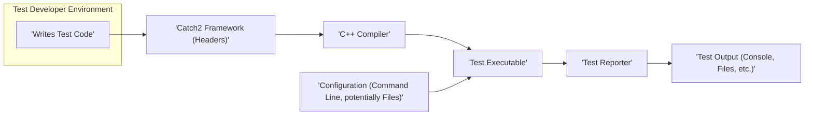

# Project Design Document: Catch2 Testing Framework

**Version:** 1.1
**Date:** October 26, 2023
**Author:** AI Software Architect

## 1. Introduction

This document provides an enhanced and more detailed design overview of the Catch2 testing framework (as represented by the codebase at [https://github.com/catchorg/catch2](https://github.com/catchorg/catch2)). The primary purpose of this document is to serve as a robust foundation for subsequent threat modeling activities. It meticulously outlines the key components, data flows, and interactions within the framework to facilitate the identification of potential security vulnerabilities and attack surfaces.

## 2. Goals

* Deliver a comprehensive and granular architectural overview of the Catch2 framework.
* Clearly define the responsibilities and functionalities of each key component.
* Accurately describe the sequence of execution and data transformations during test runs.
* Precisely pinpoint potential areas of security concern and attack vectors for future threat modeling exercises.

## 3. System Overview

Catch2 is a sophisticated, multi-paradigm testing framework specifically designed for C++. It empowers developers to construct test cases using an intuitive and expressive syntax, promoting readable and maintainable test code. The framework's header-only nature simplifies integration into a wide range of C++ projects.

### 3.1. High-Level Architecture

**Description:**

* **Test Developer Environment:**
    * **Writes Test Code:** The developer authors C++ source code that incorporates Catch2's macros and features to define test specifications.
* **Catch2 Framework (Headers):** A collection of header files that embody the core logic and functionalities of the Catch2 framework. These headers are directly included into the test code during compilation.
* **C++ Compiler:** The standard C++ compiler (e.g., g++, clang++) responsible for compiling the test code, which includes the Catch2 framework headers, into an executable program.
* **Test Executable:** The resulting compiled program. Upon execution, it orchestrates the running of the defined tests using the Catch2 framework. It also consumes configuration.
* **Test Reporter:** A modular component within Catch2 dedicated to formatting and presenting the test execution results. Catch2 supports a variety of built-in reporters (e.g., console, JUnit XML) and allows for custom implementations.
* **Test Output (Console, Files, etc.):** The final product of the test execution process, which can be displayed on the console, written to various file formats, or directed to other output streams, depending on the selected reporter.
* **Configuration (Command Line, potentially Files):** Settings that influence the behavior of the test execution, typically provided through command-line arguments but potentially also through configuration files (depending on how the user sets up their test execution).

### 3.2. Key Components

* **Core Framework:**
    * **Test Execution Management:**  Responsible for the overall control flow of test execution, including iterating through test cases and sections.
    * **Assertion Engine:** Provides the fundamental assertion macros (`REQUIRE`, `CHECK`, `WARN`, etc.) that form the basis of test validation.
    * **Exception Handling:** Manages exception propagation and catching during test execution, allowing for controlled handling of errors within tests.
    * **Test Case Discovery and Registration:** Implements the mechanism by which test cases, defined using macros like `TEST_CASE`, are registered and made available for execution.
* **Test Case Definition and Structure:**
    * **`TEST_CASE` Macro:** The primary mechanism for defining individual, independent test cases within the test suite.
    * **Tags:** A feature allowing developers to associate textual tags with test cases for categorization, filtering, and selective execution.
* **Assertion Handling and Reporting:**
    * **Assertion Macros:** A diverse set of macros that perform specific comparisons and checks within test cases, forming the core of test validation logic.
    * **Failure Information Capture:**  On assertion failure, the framework captures detailed information such as the file name, line number, and the evaluated expression, aiding in debugging.
* **Section Support for Test Organization:**
    * **`SECTION` Macro:** Enables the subdivision of test cases into logical, independent blocks of code, allowing for more granular testing and reporting.
    * **Scoped Execution:** Sections provide a mechanism for executing specific parts of a test case independently, potentially with different setup or teardown logic.
* **Tagging and Filtering:**
    * **Tagging Syntax:** Defines how tags are associated with test cases (e.g., `[tag1][tag2]`).
    * **Command-Line Filtering:** Allows users to specify tags to include or exclude during test execution, enabling focused testing.
* **Reporters and Output Generation:**
    * **Reporter Interface:** Defines a standard interface that concrete reporter implementations must adhere to, ensuring extensibility.
    * **Built-in Reporters:** Provides pre-built reporters for common output formats like console output, XML (JUnit), and others.
    * **Custom Reporter Support:** Allows developers to create their own reporters to tailor the output format and destination to specific needs.
* **Configuration and Command-Line Interface:**
    * **Command-Line Argument Parsing:**  Handles the parsing of command-line arguments to configure various aspects of test execution.
    * **Configuration Options:**  Provides options to control reporter selection, output verbosity, test case filtering, and other execution parameters.

## 4. Detailed Design

### 4.1. Component Breakdown

* **Core Framework:**
    * **Test Registry:** An internal data structure (likely a container like a vector or map) that stores metadata about all registered test cases, including their names, tags, and function pointers.
    * **Test Runner:**  The central component responsible for iterating through the Test Registry and executing the test case functions. It manages the setup and teardown phases of each test.
    * **Exception Translator Registry:** A mechanism for registering custom exception translators that can convert specific exception types into more informative Catch2 failure messages.
    * **Command Line Parser:** Utilizes libraries or custom logic to parse command-line arguments provided when the test executable is launched.
    * **Event Dispatcher:**  A component that broadcasts events throughout the test execution lifecycle (e.g., test case started, assertion failed, test case ended), allowing reporters and other listeners to react to these events.
* **Test Case Definition and Structure:**
    * The `TEST_CASE` macro typically expands to create a static instance of an internal test case class, which registers itself with the Test Registry during static initialization.
    * Tags are often stored as strings within the test case metadata.
* **Assertion Handling and Reporting:**
    * Assertion macros expand to code that performs the specified comparison or check. Upon failure, they create an instance of a failure information object containing details about the failure.
    * Different assertion levels (e.g., `REQUIRE` vs. `CHECK`) influence whether an exception is thrown upon failure, halting the current test case.
* **Section Support for Test Organization:**
    * The `SECTION` macro likely manipulates the control flow using techniques like `goto` (though this is an implementation detail and might vary) or by creating nested execution contexts.
    * State management for sections ensures that variables declared within a section are properly scoped.
* **Tagging and Filtering:**
    * Tag filtering logic within the Test Runner compares the tags associated with each test case against the tags specified in the command-line arguments.
* **Reporters and Output Generation:**
    * Concrete reporter classes implement virtual methods defined in the base `Reporter` interface to handle different test events.
    * Output is typically generated using standard output streams (e.g., `std::cout`) or by writing to files.
* **Configuration and Command-Line Interface:**
    * The Command Line Parser populates configuration objects or variables that are then accessed by other components of the framework.

### 4.2. Data Flow During Test Execution

1. **Test Code Compilation:** The C++ compiler processes the test code, including the Catch2 headers, and generates the test executable.
2. **Test Executable Invocation:** The user executes the compiled test executable, potentially providing command-line arguments for configuration.
3. **Configuration Parsing:** The Catch2 framework's Command Line Parser analyzes the provided command-line arguments to determine execution settings (e.g., selected reporter, tag filters, output preferences).
4. **Test Case Discovery and Registration:** During static initialization, `TEST_CASE` macros register the defined test cases with the Test Registry.
5. **Test Filtering (Optional):** Based on the provided tags in the command line, the Test Runner filters the registered test cases, selecting only those that match the specified criteria.
6. **Test Execution Loop:**
    * The Test Runner iterates through the selected test cases.
    * For each test case:
        * The test case function is executed.
        * When an assertion macro is encountered:
            * The assertion condition is evaluated.
            * If the assertion fails, failure information (expression, file, line) is captured.
            * Depending on the assertion level (`REQUIRE` throws, `CHECK` continues), execution might halt within the current test case.
        * When a `SECTION` is encountered, the code within that section is executed. The control flow might return to the beginning of the section for subsequent iterations if the section is entered multiple times.
        * Exception handling mechanisms within Catch2 catch unhandled exceptions, potentially translating them into test failures.
7. **Event Reporting:** Throughout the test execution, the Event Dispatcher notifies the active Test Reporter about significant events (e.g., test case started, assertion passed/failed, test case finished).
8. **Output Generation:** The Test Reporter, based on the received events, formats the test results and writes them to the configured output destination (console, file, etc.).
9. **Exit with Status Code:** The test executable terminates, returning an exit code that indicates the overall success or failure of the test run.

### 4.3. Key Interactions

* **Test Developer <-> Catch2 Framework (Headers):** Developers interact with Catch2 by using its macros and constructs within their test code.
* **Catch2 Framework <-> C++ Compiler:** The framework relies on the compiler to process its header files and integrate them into the test executable.
* **Test Executable <-> Operating System:** The executable interacts with the OS for standard input/output, memory allocation, and other system-level operations.
* **Test Executable <-> Command Line:** Command-line arguments serve as the primary interface for configuring the test execution.
* **Test Executable <-> Test Reporter:** The core framework communicates test execution events to the active reporter through a defined interface.
* **Test Runner <-> Test Registry:** The Test Runner queries the Test Registry to discover and manage the available test cases.

## 5. Security Considerations (For Threat Modeling)

This section provides a more detailed breakdown of potential security concerns to guide threat modeling activities.

* **Input Validation and Sanitization:**
    * **Command-Line Arguments:**  Thoroughly analyze how command-line arguments are parsed and validated. Consider vulnerabilities related to:
        * **Buffer overflows:** Can excessively long arguments cause memory corruption?
        * **Format string bugs:** Could specially crafted arguments be interpreted as format strings, leading to information disclosure or arbitrary code execution?
        * **Injection attacks:** Could arguments be crafted to inject commands or code into the testing environment (though less likely in a testing framework itself)?
    * **Configuration Files (If Supported):** If Catch2 were extended to support configuration files, analyze the parsing and validation of these files for similar vulnerabilities (e.g., injection, path traversal).
* **Output Handling and Information Disclosure:**
    * **Sensitive Information in Output:** Evaluate the potential for test output (console, logs, reports) to inadvertently expose sensitive information, such as:
        * **Credentials or secrets:**  If tests involve authentication or access to sensitive resources.
        * **Internal system details:**  Error messages or stack traces that reveal internal paths or configurations.
        * **Personally identifiable information (PII):** If the system under test handles PII.
    * **Reporter Vulnerabilities:**
        * **Path Traversal:** If reporters write to files, ensure proper sanitization of file paths to prevent writing to arbitrary locations.
        * **Denial of Service:** Could a malicious reporter consume excessive resources (disk space, CPU) leading to a denial of service?
        * **Cross-Site Scripting (XSS) or similar in HTML Reports:** If reporters generate HTML output, assess the risk of injecting malicious scripts.
* **Dependency Management and Supply Chain:**
    * While Catch2 is primarily header-only, consider any build-time dependencies or tools used in the development or distribution of Catch2 itself. Are these dependencies secure?
* **Code Injection and Malicious Test Cases:**
    * While Catch2 doesn't directly execute arbitrary external code, consider the impact of a deliberately malicious test case:
        * **Resource Exhaustion:** Could a test case be designed to consume excessive memory or CPU, causing a denial of service on the testing environment?
        * **Infinite Loops or Recursion:** Could a test case enter an infinite loop or recursive call, potentially hanging the test execution?
        * **System Calls:** While sandboxing is the responsibility of the test environment, consider if Catch2 provides any mechanisms to limit potentially harmful system calls made by test cases.
* **Resource Exhaustion and Denial of Service:**
    * **Large Number of Tests:** Could a very large number of test cases, even if not individually malicious, overwhelm the testing environment?
    * **Memory Leaks:** Could issues within Catch2 itself lead to memory leaks during test execution?
* **Information Disclosure through Error Messages and Stack Traces:**
    * Analyze the verbosity of error messages and stack traces generated by Catch2. Could these reveal sensitive information about the system under test or the testing environment?
* **Custom Reporter Security:**
    * If custom reporters are allowed, ensure there are mechanisms to validate or sandbox them to prevent malicious behavior. Could a malicious custom reporter be used to:
        * **Exfiltrate data:** Send test results or other information to an external server.
        * **Modify files:**  Alter files on the system running the tests.
        * **Execute arbitrary code:** If the custom reporter implementation has vulnerabilities.
* **Configuration Security:**
    * If configuration files are used, how are they protected from unauthorized modification? Could a compromised configuration file be used to alter test behavior or introduce vulnerabilities?

## 6. Deployment and Operational Aspects

* **Integration Process:**  Catch2's header-only nature simplifies integration, primarily involving including the necessary header file. However, consider potential security implications if the headers are sourced from an untrusted location.
* **Compilation Environment:** The security of the compilation environment (e.g., build servers) is crucial. A compromised build environment could lead to the injection of malicious code into the test executable.
* **Execution Environment:** The environment where tests are executed should be considered. Are tests run in isolated environments or with elevated privileges?
* **Configuration Management:** How is test configuration managed and distributed? Are there secure practices in place to prevent unauthorized modification of configuration settings?

## 7. Future Considerations

* **Plugin System:** The introduction of a plugin system would significantly expand the attack surface. Thorough security considerations would be needed for plugin loading, sandboxing, and communication.
* **Remote Execution and Reporting:** Implementing remote test execution or reporting would introduce network security concerns, including authentication, authorization, and data transmission security.
* **Web-Based Interface:** If a web interface for managing or viewing test results were introduced, standard web application security best practices would need to be followed (e.g., protection against XSS, CSRF, SQL injection).

This enhanced design document provides a more granular and comprehensive understanding of the Catch2 framework, specifically tailored for effective threat modeling. By considering the detailed components, data flows, and potential attack vectors outlined here, security professionals can conduct a more thorough and insightful analysis of the framework's security posture.