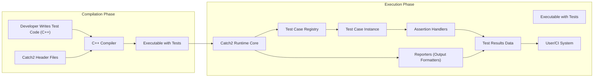
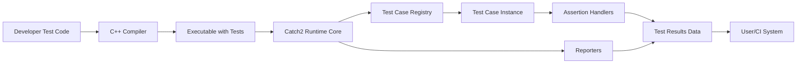

## Project Design Document: Catch2 Testing Framework (Improved)

**1. Introduction**

This document provides an enhanced and more detailed design overview of the Catch2 testing framework (https://github.com/catchorg/catch2). This iteration aims to provide a more granular understanding of the architectural components, data flows, and interactions within the system, specifically tailored for effective threat modeling.

**2. Project Overview**

Catch2 is a sophisticated, C++-native, header-only framework designed for unit-tests, Test-Driven Development (TDD), and Behavior-Driven Development (BDD). Its core strength lies in its expressive syntax, ease of use, and extensive configurability. The fundamental functionality revolves around the definition and execution of test cases, comprehensive result reporting, and a rich set of assertion mechanisms.

**3. Goals**

* Deliver a highly robust and adaptable framework for authoring and executing C++ tests across various testing methodologies.
* Offer an intuitive and expressive syntax for defining test cases, sections within tests, and detailed assertions.
* Seamlessly support diverse testing paradigms, including unit testing, TDD workflows, and BDD specifications.
* Facilitate straightforward integration into existing and new C++ projects with minimal overhead.
* Generate detailed and informative test results, aiding in debugging and quality assurance.
* Provide a highly extensible and customizable architecture to accommodate specific project needs.

**4. Target Audience**

* C++ developers engaged in writing unit tests, integration tests, and behavior-driven specifications.
* Quality assurance engineers leveraging automated testing frameworks for verification and validation.
* Teams implementing Continuous Integration/Continuous Deployment (CI/CD) pipelines that rely on automated test execution for build quality assessment.

**5. Architecture Overview**

The Catch2 framework operates primarily during the compilation and runtime phases within the context of the application under test. Key components interact during these phases to define, execute, and report on test outcomes.

**6. Component Details**

* **Developer Test Code (C++):**
    * Description: The C++ source code authored by developers, utilizing Catch2's domain-specific language (DSL) to define test cases, sections, and assertions.
    * Functionality: Encapsulates the specific logic to be tested, including setup and teardown procedures, and employs Catch2 macros (e.g., `TEST_CASE`, `SECTION`, `REQUIRE`) to structure the tests.
    * Security Considerations: While Catch2 primarily manages execution and reporting, vulnerabilities can exist within the test logic itself (e.g., resource leaks, incorrect assumptions about input).

* **Catch2 Header Files:**
    * Description: The core set of header files constituting the Catch2 library. As a header-only library, the majority of the framework's logic is contained within these files.
    * Functionality: Defines the macros, classes, and inline functions essential for writing and executing tests. This includes assertion macros, test case registration mechanisms, and configuration options for customizing test runs.
    * Security Considerations: A vulnerability within the Catch2 header files could have widespread impact across all projects using the framework. Potential risks include buffer overflows (if string manipulation is mishandled internally), format string vulnerabilities (in logging or reporting), or logic errors in the core test execution flow.

* **C++ Compiler:**
    * Description: The standard C++ compiler (e.g., g++, clang++, MSVC) used to compile the developer's test code, incorporating the Catch2 header files.
    * Functionality: Translates the C++ source code into machine code, linking the test logic with the Catch2 framework's implementation.
    * Security Considerations: Although not a direct component of Catch2, compiler vulnerabilities could indirectly affect the security of the resulting test executable. Compiler flags and security features play a role here.

* **Executable with Tests:**
    * Description: The compiled executable file that embeds the developer's test code and the Catch2 framework's runtime logic.
    * Functionality: Upon execution, this program initializes the Catch2 runtime and proceeds to discover and execute the defined test cases.
    * Security Considerations: This executable is a potential target for attackers. If it handles sensitive data during testing or if vulnerabilities exist in the test logic or Catch2 itself, it could be exploited.

* **Catch2 Runtime Core:**
    * Description: The central part of the Catch2 framework that orchestrates test execution at runtime. This is largely implemented through the code included from the header files.
    * Functionality: Manages the discovery of test cases, the execution lifecycle of each test, the evaluation of assertions, and the generation of test reports. It also handles command-line argument parsing for test filtering and reporting customization.
    * Security Considerations: Vulnerabilities in the runtime core could lead to crashes, incorrect test results, or even arbitrary code execution if input handling (e.g., command-line arguments, environment variables) is not robustly secured.

* **Test Case Registry:**
    * Description: An internal component within the Catch2 runtime that maintains a list of all defined test cases within the executable.
    * Functionality: Responsible for storing metadata about each test case, such as its name, tags, and the function to be executed.
    * Security Considerations: While generally internal, vulnerabilities in how the registry is managed could potentially lead to denial-of-service if an attacker could influence its state.

* **Test Case Instance:**
    * Description: A specific instantiation of a test case during runtime. Each test case can be run multiple times with different data (using parameterized tests).
    * Functionality: Holds the state and executes the code within a single run of a test case.
    * Security Considerations:  If test cases interact with external resources, vulnerabilities in those interactions could be exposed during test execution.

* **Assertion Handlers:**
    * Description: The components responsible for evaluating the truthiness of expressions within assertion macros (`REQUIRE`, `CHECK`, etc.).
    * Functionality: Upon assertion failure, these handlers record the failure details, including the expression, the values involved, and the location in the code.
    * Security Considerations:  While the handlers themselves are unlikely to be vulnerable, the expressions they evaluate could contain security flaws. Improper error handling within assertions could also lead to unexpected behavior.

* **Reporters (Output Formatters):**
    * Description: Pluggable components that format the test results into various output formats (e.g., console output, XML, JUnit).
    * Functionality: Take the aggregated test results data and generate reports according to the selected format.
    * Security Considerations: Vulnerabilities in reporter implementations could lead to issues like format string bugs or the inclusion of sensitive information in the output.

* **Test Results Data:**
    * Description: The structured data representing the outcome of the test execution, including the status of each test case and assertion.
    * Functionality: Stores information about passed, failed, and skipped tests, along with details about failures.
    * Security Considerations:  Care must be taken to prevent the unintentional exposure of sensitive data within the test results.

* **User/CI System:**
    * Description: The entity that initiates the execution of the test executable and consumes the generated test results. This can be a developer running tests locally or an automated CI/CD pipeline.
    * Functionality: Triggers test execution and utilizes the results to determine the success or failure of a build, deployment, or code change.
    * Security Considerations: The security of the test execution environment and the handling of test results are paramount. Compromised CI/CD systems could be used to inject malicious code or manipulate test outcomes, leading to the deployment of vulnerable software.

**7. Data Flow**

The primary data flow within the Catch2 framework involves the following stages:

1. **Test Definition:** Developers define test cases and assertions in C++ code using Catch2's DSL.
2. **Compilation:** The C++ compiler compiles the test code and integrates the Catch2 header files, producing an executable.
3. **Test Execution Initiation:** A user or CI system initiates the execution of the compiled test executable.
4. **Test Discovery:** The Catch2 runtime core within the executable discovers and registers the defined test cases using the Test Case Registry.
5. **Test Case Execution:** The runtime core iterates through the registered test cases, creating Test Case Instances for execution.
6. **Assertion Evaluation:** Within each test case instance, Assertion Handlers evaluate the expressions within assertion macros.
7. **Result Recording:** Assertion outcomes and test case status are recorded in the Test Results Data.
8. **Report Generation:** Reporters process the Test Results Data to generate output in the desired format.
9. **Result Consumption:** The user or CI system consumes the generated test reports to assess the testing outcome.

**8. Security Considerations (Detailed)**

This section provides a more detailed breakdown of security considerations for the Catch2 framework, categorized for clarity.

* **Confidentiality:**
    * **Exposure of Sensitive Data in Test Results:** Test cases or reporter configurations might inadvertently include sensitive information in the output logs or reports.
    * **Information Leakage through Assertion Messages:**  Detailed assertion failure messages could reveal internal implementation details or sensitive values.

* **Integrity:**
    * **Manipulation of Test Outcomes:**  Attackers could potentially tamper with the test executable or the Catch2 runtime to alter test results, masking vulnerabilities.
    * **Vulnerabilities in Reporters Leading to Data Corruption:** Bugs in reporter implementations could lead to corrupted or misleading test reports.

* **Availability:**
    * **Denial-of-Service through Malicious Test Cases:**  Crafted test cases could consume excessive resources or trigger crashes in the Catch2 runtime.
    * **Vulnerabilities in Command-Line Argument Parsing:**  Improper handling of command-line arguments could lead to crashes or unexpected behavior, disrupting test execution.

* **Code Injection:**
    * **Format String Vulnerabilities in Reporters or Logging:** If Catch2 uses format strings without proper sanitization, attackers could inject malicious code.
    * **Unsafe Handling of External Input in Test Cases:** Test cases that interact with external systems without proper validation could be vulnerable to injection attacks.

* **General Implementation Vulnerabilities:**
    * **Buffer Overflows:** Potential in string manipulation or data handling within the Catch2 header files or runtime.
    * **Logic Errors:** Flaws in the core test execution logic could lead to incorrect results or unexpected behavior.

**9. Deployment Model**

Catch2's primary deployment model is as a header-only library. Developers integrate it by simply including the necessary Catch2 header files in their C++ projects. This eliminates the need for separate compilation and linking steps in most scenarios. For larger projects, a single compilation unit can be created to pre-compile the Catch2 implementation, optimizing build times.

**10. Technologies Used**

* **C++ (C++11 and later):** The core programming language for both the Catch2 framework and the user's test code.
* **Standard Template Library (STL):**  Extensively used within Catch2 for data structures and algorithms.
* **C++ Preprocessor:** Utilized for macro expansion, conditional compilation, and the core DSL implementation.

**11. Assumptions and Constraints**

* It is assumed that the underlying C++ compiler and the test execution environment are reasonably secure and up-to-date with security patches.
* The primary focus of this design document is on the core Catch2 framework itself, and not on the specific security implications of the application code being tested.
* This document provides a detailed design overview but may not encompass every single implementation detail or edge case.
* It is assumed that developers using Catch2 have a basic understanding of C++ and software testing principles.

This improved design document provides a more granular and security-focused overview of the Catch2 testing framework, making it a more effective foundation for subsequent threat modeling activities. The enhanced component descriptions, detailed data flow diagrams, and categorized security considerations offer a deeper understanding of the system's architecture and potential vulnerabilities.