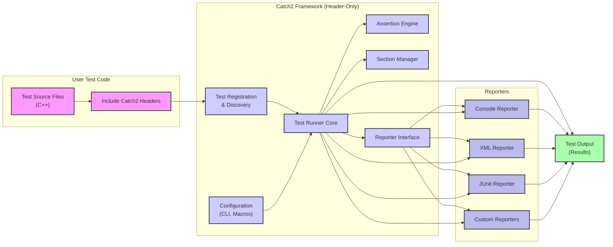
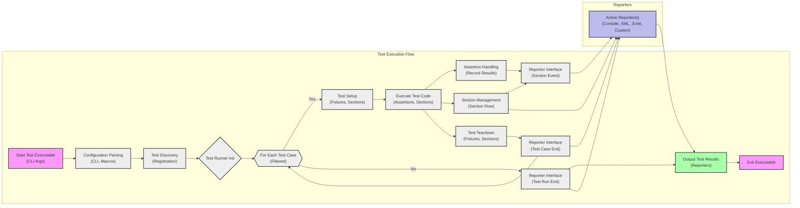

Okay, I will improve the Project Design Document for Catch2, focusing on clarity, conciseness, security relevance, and ensuring valid markdown and mermaid syntax.

```markdown
# Project Design Document: Catch2 Testing Framework

**Version:** 1.1
**Date:** 2023-10-27
**Author:** Gemini (AI Expert in Software, Cloud and Cybersecurity Architecture)

## 1. Project Overview

**Project Name:** Catch2

**Project Description:** Catch2 is a header-only, C++ testing framework designed for unit tests, Test-Driven Development (TDD), and Behavior-Driven Development (BDD).  Its key features include:

*   **Header-only distribution:** Simplifies integration into projects.
*   **Expressive test syntax:**  Uses macros for easy test definition and assertions.
*   **Rich assertion set:** Provides a variety of assertion types for different validation needs.
*   **Test organization:** Supports sections and scenarios for structuring tests.
*   **Flexible reporting:** Offers multiple built-in reporters and custom reporter support.
*   **Command-line options:**  Allows for test filtering and configuration.

**Project Repository:** [https://github.com/catchorg/catch2](https://github.com/catchorg/catch2)

**Purpose of this Document:** This document provides a detailed architectural design of the Catch2 framework to facilitate threat modeling and security analysis. It outlines the components, data flow, and potential security considerations for projects utilizing Catch2 for testing.

## 2. Architecture Overview

Catch2 is implemented as a header-only library, embedding its functionality directly within the compiled test executable.

The following diagram illustrates the high-level architecture of Catch2:



**Component Descriptions:**

*   **User Test Code:** C++ source files containing test definitions using Catch2 macros.
*   **Catch2 Headers:** Header files providing the Catch2 framework implementation, included directly in user test code.
*   **Test Registration & Discovery:**  Macros (`TEST_CASE`, `SECTION`, etc.) register test cases during compilation. Catch2 discovers these registered tests at runtime.
*   **Test Runner Core:**  The central engine that orchestrates test execution, manages test flow, and interacts with other components.
*   **Assertion Engine:** Handles assertion macros (`REQUIRE`, `CHECK`, etc.), evaluates conditions, and records assertion results.
*   **Section Manager:** Manages the execution of test sections, enabling structured test organization within test cases.
*   **Reporter Interface:** Defines the interface for reporting test results, allowing for different output formats.
*   **Configuration:**  Settings from command-line arguments and preprocessor macros that control test execution behavior.
*   **Reporters (Console, XML, JUnit, Custom):** Implementations of the Reporter Interface, responsible for formatting and outputting test results in various formats.
*   **Test Output (Results):** The final output generated by reporters, containing test execution status and details.

## 3. Component Details and Security Relevance

### 3.1. Test Registration & Discovery

*   **Functionality:**  Utilizes C++ macros to register test cases and sections at compile time.  At runtime, Catch2 discovers these registered entities to build the test suite.
*   **Security Relevance:**
    *   **Low Direct Risk:**  Primarily a compile-time process. Direct security vulnerabilities are unlikely within Catch2 itself.
    *   **Indirect Risk - Input Sanitization (Test Names):** Test case names and descriptions are user-provided strings. While not a direct Catch2 vulnerability, ensure downstream systems processing test reports (e.g., logging, dashboards) handle potentially long or unusual test names safely to prevent issues like buffer overflows or injection vulnerabilities in those systems.

### 3.2. Test Runner Core

*   **Functionality:**  Manages the overall test execution lifecycle. It iterates through discovered tests, initializes test environments, executes test code, handles assertion outcomes, and interacts with reporters.
*   **Security Relevance:**
    *   **Resource Management:**  The Test Runner executes user-provided test code.  While Catch2 itself doesn't impose resource limits, poorly designed tests could lead to resource exhaustion (CPU, memory). This is primarily a concern for test *design* and not a vulnerability in Catch2.
    *   **Test Isolation (Limited):** Catch2 runs tests within the same process.  Lack of strong test isolation means a crashing test *could* potentially affect the entire test run. However, Catch2's design focuses on robust error handling to minimize framework-level crashes.

### 3.3. Assertion Engine

*   **Functionality:**  Processes assertion macros within test cases. Upon assertion failure, it records failure details (expression, location) and determines test flow (continue or abort test case based on assertion type - `CHECK` vs. `REQUIRE`).
*   **Security Relevance:**
    *   **Information Disclosure (Test Output):** Assertion failure messages can include variable values and expression details.  Care should be taken in test design to avoid unintentionally logging sensitive information in assertion messages, especially in verbose reporting modes. This is a test design consideration, not a Catch2 vulnerability.
    *   **Robust Error Handling:** The Assertion Engine should handle unexpected conditions gracefully and avoid framework crashes upon assertion failures in user code. Catch2 is designed to be robust in this regard.

### 3.4. Reporter Interface & Reporters

*   **Functionality:**  The Reporter Interface defines a contract for reporting test events. Reporters implement this interface to generate output in different formats. Built-in reporters include Console, XML, and JUnit. Custom reporters can be created by users.
*   **Security Relevance:**
    *   **Output Vulnerabilities (Custom Reporters):**  Custom reporters, being user-provided code, are a potential area of concern.  Insecure custom reporter implementations could introduce vulnerabilities:
        *   **Format String Issues:**  If custom reporters use format strings with user-controlled data (test names, assertion messages) without proper sanitization, format string vulnerabilities are possible (though less common in modern C++).
        *   **File System Issues (File Reporters):** Reporters writing to files (XML, JUnit, custom file reporters) could be vulnerable to path traversal or file injection if filenames or paths are constructed from unsanitized user input. Built-in reporters are designed to avoid this, but custom reporters require careful review.
    *   **Information Leakage (Reporters):** Reporters output test results.  Ensure reporters are configured and used in a way that does not unintentionally expose sensitive information in test reports, especially when using verbose output or custom reporters.

### 3.5. Configuration

*   **Functionality:**  Configuration is managed through command-line arguments and preprocessor macros.  Options include test filtering, reporter selection, output verbosity, and global setup/teardown.
*   **Security Relevance:**
    *   **Command-Line Injection (Low Risk):** Catch2 primarily parses command-line arguments for its own configuration. Command-line injection vulnerabilities are less likely compared to applications executing external commands based on CLI input. However, robust parsing and validation of command-line arguments are still good practices.
    *   **Denial of Service (Configuration Abuse):**  Malicious or excessive configuration (e.g., extremely verbose output, logging to slow storage) *could* theoretically lead to resource exhaustion and DoS. This is more of a theoretical concern for Catch2 itself, but a general consideration for applications with extensive configuration options.

## 4. Data Flow Diagram (Detailed)



**Data Flow Description:** (Same as Version 1.0, no significant changes in data flow)

1.  **Start Test Executable:** Test executable starts, potentially with command-line arguments.
2.  **Configuration Parsing:** Catch2 parses configuration from CLI and macros.
3.  **Test Discovery:**  Discovers registered test cases.
4.  **Test Runner Init:** Test Runner initializes.
5.  **Test Case Loop:** Iterates through filtered test cases.
6.  **Test Setup:** Executes setup code (fixtures, sections).
7.  **Execute Test Code:** Runs user test code (assertions, sections).
8.  **Assertion Handling:** Processes assertion results.
9.  **Section Management:** Manages section execution flow.
10. **Reporter Interface (Assertion Event):** Notifies reporters of assertion results.
11. **Reporter Interface (Section Event):** Notifies reporters of section events.
12. **Test Teardown:** Executes teardown code.
13. **Reporter Interface (Test Case End):** Notifies reporters of test case completion.
14. **Test Run End Check:** Checks for more test cases.
15. **Reporter Interface (Test Run End):** Notifies reporters of test run completion.
16. **Output Test Results:** Reporters generate output.
17. **Exit Executable:** Test executable terminates.

## 5. Technology Stack

*   **Core Language:** C++ (C++11 and later recommended, aiming for broad compatibility).
*   **Dependencies:**  Minimal - primarily relies on the C++ Standard Library. This reduces the attack surface from external dependencies.
*   **Build System Integration:**  Designed to be build-system agnostic. Integrates with CMake, Make, and other build systems.  Security of the overall build process depends on the chosen build system and its configuration.
*   **Compiler Compatibility:**  Supports major C++ compilers (GCC, Clang, MSVC). Compiler security is a broader concern for the entire compiled application, not specific to Catch2.
*   **Platform Independence:**  Cross-platform design (Windows, Linux, macOS, etc.). Platform-specific security considerations may apply to the test environment, but Catch2 itself aims to be platform-neutral.

## 6. Deployment Model

Catch2 is deployed as a header-only library, simplifying integration:

1.  **Include Header:** Copy or include `catch.hpp` (or `catch2/catch_all.hpp` for v3) into your project's source tree.
2.  **Compile Test Executable:** Compile test source files that include the Catch2 header. No separate linking is needed.
3.  **Run Tests:** Execute the compiled test executable to run tests and generate reports.

**Security in Deployment Context:**

*   **Test Executable Security Context:** Catch2 operates within the security context of the compiled test executable.  Security considerations for the test environment (development, CI/CD) are paramount.
*   **CI/CD Pipeline Security:**  In CI/CD pipelines, ensure secure handling of test reports, especially if reports are processed or stored externally. Protect against unauthorized access to test results and potential modification of reports.
*   **Production Environment (Generally Not Deployed):** Unit tests using Catch2 are typically *not* deployed to production environments. However, if test executables or reports are inadvertently exposed in production, consider the potential information disclosure risks.

## 7. Security Considerations for Threat Modeling

This section summarizes key security considerations for threat modeling projects using Catch2:

*   **Custom Reporters (Highest Risk):**  Exercise caution with custom reporters. Thoroughly review custom reporter code for potential vulnerabilities:
    *   **Input Sanitization:**  Ensure proper sanitization of test names, assertion messages, and other user-provided data used in reporters to prevent format string issues or injection attacks.
    *   **File System Security:**  If writing to files, validate file paths and names to prevent path traversal or unauthorized file access.
*   **Test Design and Information Disclosure:**
    *   **Sensitive Data in Tests:** Avoid embedding or logging sensitive information directly within test cases or assertion messages. Review test output to ensure no unintentional information leakage occurs.
    *   **Verbose Reporting:** Be mindful of verbosity levels in reporting, especially in environments where test reports might be broadly accessible.
*   **Resource Management (Test Design):**
    *   **Resource Exhaustion:** Design tests to be resource-conscious to prevent accidental or malicious resource exhaustion during test execution. Monitor resource usage in CI/CD environments.
*   **Command-Line Configuration:**
    *   **Input Validation:** While lower risk, ensure robust parsing and validation of command-line arguments to prevent unexpected behavior.
*   **Dependency Management (Broader Context):**
    *   **Build Environment Security:**  Consider the security of the build environment and toolchain used to compile test executables, as these are broader dependencies of the testing process.

**Next Steps for Threat Modeling:**

1.  **Identify Threat Actors:** Define potential threat actors and their motivations.
2.  **Threat Identification:**  Use this design document to systematically identify potential threats for each component and data flow. Consider STRIDE or other threat modeling methodologies.
3.  **Vulnerability Analysis:** Analyze identified threats to determine potential vulnerabilities in Catch2 usage or custom extensions.
4.  **Mitigation Strategies:** Develop mitigation strategies for identified vulnerabilities.
5.  **Security Testing:**  Perform security testing of test infrastructure and custom reporters, if applicable.

This improved design document provides a more focused and actionable foundation for threat modeling Catch2 and projects that utilize it.