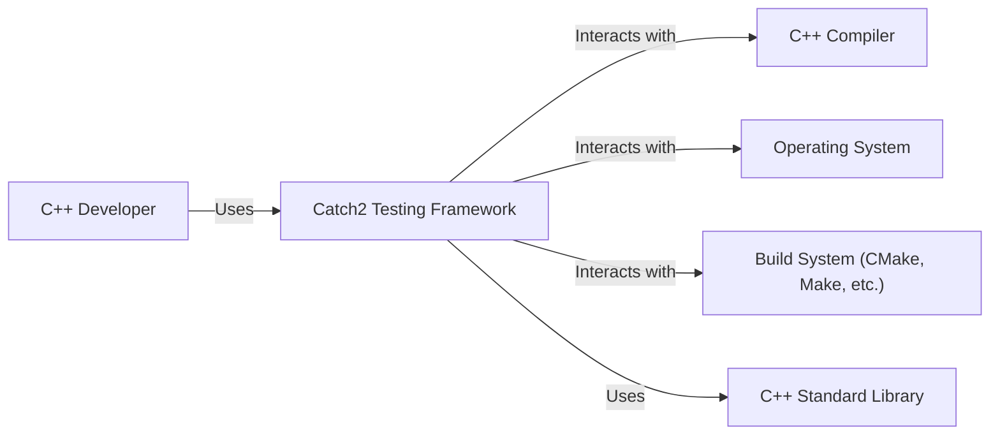
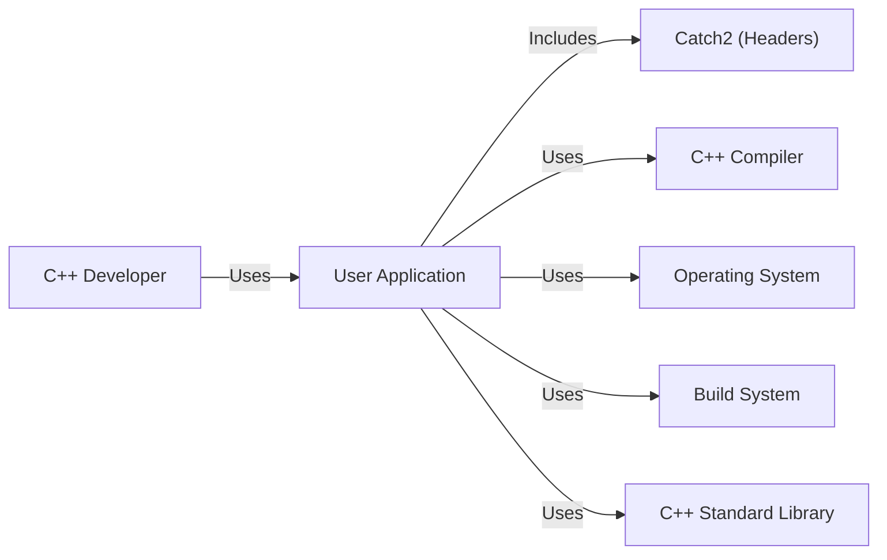
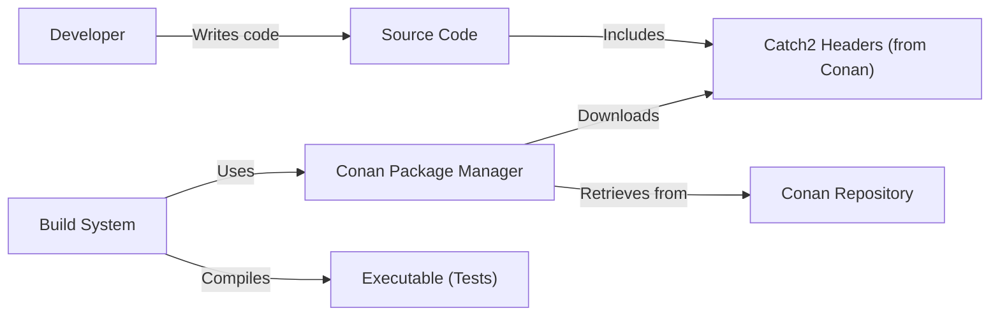
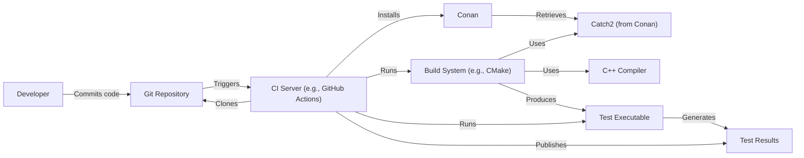

Okay, let's create a design document for the Catch2 project, a C++ testing framework.

# BUSINESS POSTURE

Catch2 is a widely used, open-source, header-only C++ testing framework. Its primary business goals are:

*   Provide a modern, easy-to-use, and powerful testing framework for C++ developers.
*   Maintain high quality and reliability of the framework itself.
*   Foster a strong community around the project, encouraging contributions and feedback.
*   Ensure broad compatibility across different compilers, operating systems, and build systems.
*   Minimize external dependencies to simplify integration into various projects.

Business priorities:

*   Ease of use and adoption by developers.
*   Correctness and reliability of test results.
*   Maintainability and extensibility of the framework.
*   Community engagement and growth.

Most important business risks:

*   Undetected bugs in Catch2 leading to incorrect test results, potentially masking critical issues in user code.
*   Compatibility issues with specific compilers or platforms, limiting adoption.
*   Lack of community engagement, leading to stagnation and reduced contributions.
*   Security vulnerabilities within the framework itself, although the attack surface is relatively small, could be exploited in specific contexts (e.g., if Catch2 is used in a security-sensitive environment).
*   Difficulty in integrating Catch2 into existing build systems or workflows.

# SECURITY POSTURE

Existing security controls:

*   security control: Extensive internal testing: Catch2 itself is heavily tested using itself, providing a strong foundation for reliability. This is evident in the project's own test suite.
*   security control: Continuous Integration (CI): The project uses CI (GitHub Actions, AppVeyor, etc.) to automatically build and test on various platforms and configurations, ensuring consistent quality. This is visible in the repository's CI configuration files.
*   security control: Static Analysis: The project likely uses static analysis tools (though this isn't explicitly stated in the top-level README, it's common practice for C++ projects of this nature). This can be inferred from the project's maturity and commitment to quality.
*   security control: Community Scrutiny: Being open-source, Catch2 benefits from community scrutiny, with users reporting issues and contributing fixes. This is evident in the project's issue tracker and pull requests.
*   security control: Header-only design: This minimizes the attack surface as there are no compiled libraries to target directly.

Accepted risks:

*   accepted risk: Limited fuzzing: While the project has good test coverage, dedicated fuzzing efforts might be limited.
*   accepted risk: Dependency vulnerabilities: Although Catch2 aims to minimize dependencies, it might still be indirectly affected by vulnerabilities in underlying system libraries or compilers.
*   accepted risk: Denial of Service (DoS) in test execution: Maliciously crafted test code could potentially cause excessive resource consumption, but this is generally considered a lower risk as it primarily affects the testing environment itself.

Recommended security controls:

*   security control: Integrate fuzzing: Incorporate fuzz testing into the CI pipeline to identify potential edge cases and vulnerabilities.
*   security control: Regular security audits: Conduct periodic security audits, even if informal, to proactively identify potential issues.
*   security control: Dependency analysis: Regularly scan for known vulnerabilities in any indirect dependencies.
*   security control: Consider using a code scanning tool like LGTM or SonarCloud.

Security requirements:

*   Authentication: Not directly applicable, as Catch2 is a testing framework, not a service or application requiring authentication.
*   Authorization: Not directly applicable, for the same reason as above.
*   Input Validation: Catch2 itself doesn't directly handle user input in the traditional sense. However, it's crucial that test assertions correctly handle various input types and edge cases to prevent false positives or negatives. This is more about the correct usage of Catch2 than a security feature of the framework itself.
*   Cryptography: Not directly applicable, as Catch2 is not involved in cryptographic operations.

# DESIGN

## C4 CONTEXT

C4 CONTEXT elements description:

*   Element:
    *   Name: C++ Developer
    *   Type: Person
    *   Description: A software developer writing and executing tests using Catch2.
    *   Responsibilities: Writes test cases, configures Catch2, runs tests, and analyzes results.
    *   Security controls: Not directly applicable.

*   Element:
    *   Name: Catch2 Testing Framework
    *   Type: Software System
    *   Description: The core header-only testing framework.
    *   Responsibilities: Provides macros and functions for defining and running tests, reporting results, and managing test execution.
    *   Security controls: Internal testing, CI, static analysis (likely), community scrutiny, header-only design.

*   Element:
    *   Name: C++ Compiler
    *   Type: Software System
    *   Description: The compiler used to build the user's code and Catch2 tests (e.g., GCC, Clang, MSVC).
    *   Responsibilities: Compiles C++ code into executable form.
    *   Security controls: Compiler-specific security features (e.g., stack protection, ASLR).

*   Element:
    *   Name: Operating System
    *   Type: Software System
    *   Description: The underlying operating system (e.g., Windows, Linux, macOS).
    *   Responsibilities: Provides system resources and APIs for the compiled code and Catch2.
    *   Security controls: OS-level security features (e.g., user permissions, memory protection).

*   Element:
    *   Name: Build System
    *   Type: Software System
    *   Description: The build system used to manage the compilation and linking process (e.g., CMake, Make, Meson).
    *   Responsibilities: Automates the build process, including compiling test code and linking with Catch2.
    *   Security controls: Build system-specific security features (if any).

*   Element:
    *   Name: C++ Standard Library
    *   Type: Software System
    *   Description: Standard library.
    *   Responsibilities: Provides standard functions.
    *   Security controls: Build in security.

## C4 CONTAINER

Since Catch2 is a header-only library, the container diagram is essentially the same as the context diagram. There aren't separate deployable units. The "container" in this case is the user's application that includes Catch2.

C4 CONTAINER elements description:

*   Element:
    *   Name: C++ Developer
    *   Type: Person
    *   Description: A software developer writing and executing tests using Catch2.
    *   Responsibilities: Writes test cases, configures Catch2, runs tests, and analyzes results.
    *   Security controls: Not directly applicable.

*   Element:
    *   Name: User Application
    *   Type: Software System
    *   Description: The developer C++ application that is using Catch2.
    *   Responsibilities: The application being tested.
    *   Security controls: Application specific.

*   Element:
    *   Name: Catch2 (Headers)
    *   Type: Library
    *   Description: The Catch2 header files included in the user's application.
    *   Responsibilities: Provides the testing framework functionality.
    *   Security controls: Internal testing, CI, static analysis (likely), community scrutiny, header-only design.

*   Element:
    *   Name: C++ Compiler
    *   Type: Software System
    *   Description: The compiler used to build the user's code.
    *   Responsibilities: Compiles C++ code into executable form.
    *   Security controls: Compiler-specific security features.

*   Element:
    *   Name: Operating System
    *   Type: Software System
    *   Description: The underlying operating system.
    *   Responsibilities: Provides system resources and APIs.
    *   Security controls: OS-level security features.

*   Element:
    *   Name: Build System
    *   Type: Software System
    *   Description: The build system used to manage the compilation.
    *   Responsibilities: Automates the build process.
    *   Security controls: Build system-specific security features (if any).

*   Element:
    *   Name: C++ Standard Library
    *   Type: Software System
    *   Description: Standard library.
    *   Responsibilities: Provides standard functions.
    *   Security controls: Build in security.

## DEPLOYMENT

Catch2, being a header-only library, doesn't have a traditional deployment process in the sense of deploying a server or application. Its "deployment" is simply the inclusion of the header files into the user's project. However, we can consider different ways a user might integrate Catch2:

Possible deployment solutions:

1.  Direct include: Copying the Catch2 header files directly into the project's source tree.
2.  Submodule/Subtree: Using Git submodules or subtrees to include Catch2 as a separate repository within the project.
3.  Package Manager: Using a package manager like Conan, vcpkg, or Hunter to manage Catch2 as a dependency.
4.  System-wide installation: Installing Catch2 system-wide (less common, and generally discouraged).

Chosen solution (Package Manager - Conan):

DEPLOYMENT elements description:

*   Element:
    *   Name: Developer
    *   Type: Person
    *   Description: The developer writing the code and tests.
    *   Responsibilities: Writes code, integrates Catch2, manages dependencies.
    *   Security controls: Not directly applicable.

*   Element:
    *   Name: Source Code
    *   Type: Code
    *   Description: The developer's application and test code.
    *   Responsibilities: Contains the application logic and test cases.
    *   Security controls: Application-specific.

*   Element:
    *   Name: Catch2 Headers (from Conan)
    *   Type: Library
    *   Description: The Catch2 header files, managed by Conan.
    *   Responsibilities: Provides the testing framework.
    *   Security controls: Inherited from Catch2 (internal testing, CI, etc.).

*   Element:
    *   Name: Conan Package Manager
    *   Type: Software System
    *   Description: The Conan package manager.
    *   Responsibilities: Downloads, manages, and provides Catch2 as a dependency.
    *   Security controls: Conan's own security mechanisms (e.g., checksum verification).

*   Element:
    *   Name: Conan Repository
    *   Type: Remote Server
    *   Description: A repository hosting Catch2 packages.
    *   Responsibilities: Stores and serves Catch2 packages.
    *   Security controls: Repository-specific security (e.g., access controls, integrity checks).

*   Element:
    *   Name: Build System
    *   Type: Software System
    *   Description: System that builds application.
    *   Responsibilities: Build application.
    *   Security controls: Build system security.

*   Element:
    *   Name: Executable (Tests)
    *   Type: Executable
    *   Description: The compiled test executable.
    *   Responsibilities: Runs the tests.
    *   Security controls: OS-level security (ASLR, DEP, etc.).

## BUILD

The build process for a project using Catch2 (via Conan) would typically involve the following:

Security controls in the build process:

*   security control: Version Control (Git): All code, including tests and Catch2 integration, is managed in a version control system.
*   security control: CI/CD (GitHub Actions, etc.): The build process is automated through a CI/CD pipeline.
*   security control: Dependency Management (Conan): Catch2 is managed as a dependency, ensuring consistent versions and potentially leveraging Conan's security features (checksums, etc.).
*   security control: Static Analysis (potentially integrated into CI): The CI pipeline could include static analysis tools to detect potential code quality and security issues.
*   security control: Automated Testing: The CI pipeline executes the Catch2 tests, ensuring that the code behaves as expected.

# RISK ASSESSMENT

*   Critical business process we are trying to protect: The ability for developers to write and execute reliable tests for their C++ code, ensuring the quality and correctness of their software.
*   Data we are trying to protect and their sensitivity:
    *   Test code itself: Generally not sensitive, but could potentially contain credentials or other secrets if developers are not careful (this is a user responsibility, not a Catch2 issue).
    *   Test results: Could reveal information about the behavior of the application being tested, potentially including vulnerabilities if the tests expose them. Sensitivity depends on the application being tested.
    *   Catch2 source code: Publicly available, but integrity is important to prevent malicious modifications.

# QUESTIONS & ASSUMPTIONS

*   Questions:
    *   Are there any specific compliance requirements (e.g., specific industry standards) that need to be considered?
    *   What specific static analysis tools are currently used (if any)?
    *   What is the current level of fuzzing coverage?
    *   Is there a documented process for handling security vulnerabilities reported by the community?

*   Assumptions:
    *   BUSINESS POSTURE: The primary goal is to provide a reliable and easy-to-use testing framework. Security is important, but not the absolute top priority (as it might be for a security-critical application).
    *   SECURITY POSTURE: The project follows good security practices, but there's always room for improvement. The header-only nature reduces the attack surface significantly.
    *   DESIGN: Developers are responsible for securing their own code and test environments. Catch2 provides the tools for testing, but doesn't inherently protect against all security threats. The use of a package manager like Conan is a common and recommended approach.