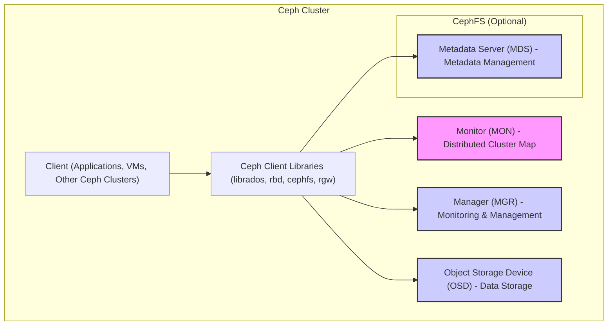
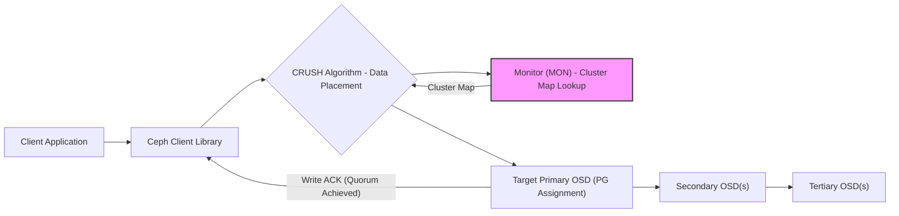
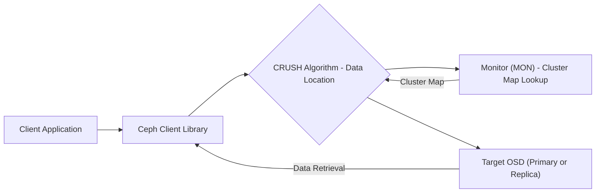

# Project Design Document: Ceph Distributed Storage System

**Version:** 1.1
**Date:** October 26, 2023
**Author:** AI Software Architect

## 1. Introduction

This document provides an enhanced architectural design of the Ceph distributed storage system, based on the project repository at [https://github.com/ceph/ceph](https://github.com/ceph/ceph). This improved document aims to provide a more detailed and precise description of the system's components and interactions, specifically for use in subsequent threat modeling activities. It builds upon the previous version by adding more granularity and clarity to key aspects of the architecture.

## 2. Goals and Objectives

The primary goals of Ceph are to provide:

*   **Scalability:**  Ability to scale storage capacity and performance linearly by adding more hardware resources.
*   **Reliability:** High availability and data durability through mechanisms like data replication and erasure coding techniques.
*   **Performance:**  Efficient data access patterns optimized for various workload types (e.g., object, block, file).
*   **Unified Storage:** Support for object storage, block storage, and file system interfaces from a single unified platform.
*   **Open Source:**  Leveraging community-driven development principles and ensuring transparency in the codebase.

## 3. High-Level Architecture

Ceph's architecture is fundamentally built upon the Reliable Autonomic Distributed Object Store (RADOS). The diagram below illustrates the primary components and their interrelationships within a Ceph cluster:

## 4. Key Components

This section provides a more detailed breakdown of the core components within the Ceph system:

*   **Ceph Clients:** These are the entities that interact with the Ceph storage cluster to access and manage data. Clients utilize specific Ceph libraries tailored to their access needs.
    *   **librados:**  Provides the foundational library for direct interaction with the RADOS object store, offering fine-grained control over data access.
    *   **RBD (RADOS Block Device):**  Presents block storage volumes that can be mounted and used by operating systems and applications as if they were physical block devices.
    *   **CephFS (Ceph File System):**  Offers a POSIX-compliant distributed file system, allowing multiple clients to concurrently access and modify files and directories.
    *   **RGW (RADOS Gateway):**  Provides object storage access through industry-standard APIs like Amazon S3 and OpenStack Swift, enabling integration with cloud-native applications.

*   **Monitor (MON):** The MON daemons maintain a consistent and authoritative map of the cluster's state. They form a distributed consensus (typically using Paxos or a variant) to ensure agreement on the cluster configuration.
    *   Maintains the cluster map, which includes information about the location of data, the health of OSDs, and the overall cluster topology.
    *   Forms a quorum to ensure fault tolerance and prevent split-brain scenarios.
    *   Provides authentication and authorization services for clients and other daemons using the `cephx` protocol.
    *   Distributes the latest cluster map to clients and other daemons, enabling them to make informed decisions about data placement and retrieval.

*   **Manager (MGR):** The MGR daemon provides essential monitoring, orchestration, and management functionalities for the Ceph cluster. It enhances the operational efficiency and observability of the system.
    *   Hosts various modules that provide insights into cluster performance, capacity utilization, and potential issues. Examples include the dashboard module, Prometheus exporter, and Grafana integration.
    *   Provides a RESTful API that allows administrators and external tools to interact with the cluster for management tasks.
    *   Handles tasks such as placement group peering and recovery orchestration, optimizing data availability and consistency.

*   **Object Storage Device (OSD):** The OSDs are the workhorses of the Ceph cluster, responsible for storing the actual data on physical storage devices. Each OSD manages a local file system (e.g., XFS, ext4, btrfs) and interacts directly with the underlying disks.
    *   Stores data as objects within logical containers called placement groups (PGs).
    *   Handles data replication or erasure coding based on the configured pool policies, ensuring data durability and availability.
    *   Performs data scrubbing (checking for inconsistencies) and recovery operations to maintain data integrity.
    *   Participates in the CRUSH algorithm to determine the optimal placement of data objects across the cluster.

*   **Metadata Server (MDS) (for CephFS):** The MDS daemons manage the metadata for the Ceph File System, such as directory structures, file names, permissions, and ownership information. They do not handle the actual file data itself.
    *   Manages the namespace of the file system, allowing clients to navigate directories and access files.
    *   Scales horizontally by sharding the metadata namespace across multiple MDS daemons, improving performance and availability for large file systems.
    *   Caches metadata to improve access latency for frequently accessed files and directories.

## 5. Data Flow

The following diagrams illustrate simplified data write and read operation flows within Ceph, highlighting the key interactions between components:

**Simplified Data Write Flow:**

**Detailed Data Write Flow:**

1. The client application initiates a write request to store data in Ceph.
2. The Ceph client library receives the write request and interacts with the MONs to obtain the latest cluster map.
3. The client library utilizes the CRUSH algorithm, along with the cluster map, to determine the appropriate placement group (PG) for the data object and identifies the primary OSD responsible for that PG.
4. The client sends the write request, containing the data, to the identified primary OSD.
5. The primary OSD writes the data to its local storage and then forwards the write request to the secondary and tertiary OSDs (or more, depending on the replication or erasure coding policy) that are also part of the PG.
6. The secondary and tertiary OSDs write the data to their local storage.
7. Once a quorum of OSDs (including the primary) have successfully written the data, the primary OSD sends an acknowledgment back to the client library, confirming the successful write operation.

**Simplified Data Read Flow:**

**Detailed Data Read Flow:**

1. The client application initiates a read request to retrieve data from Ceph.
2. The Ceph client library receives the read request and, similar to the write operation, uses the CRUSH algorithm and the cluster map to determine the location of the requested data object and the corresponding PG.
3. The client sends the read request to one of the OSDs that holds a copy of the data object (typically the primary OSD or a nearby replica for performance optimization).
4. The target OSD retrieves the data from its local storage.
5. The OSD sends the requested data back to the client library, which then delivers it to the client application.

## 6. Security Considerations (Pre-Threat Modeling)

This section outlines key security features and considerations inherent in the Ceph architecture, providing a foundation for subsequent threat modeling:

*   **Authentication:** Ceph employs a strong cryptographic authentication system called `cephx`.
    *   Clients and daemons authenticate to the MONs using shared secret keys.
    *   This prevents unauthorized access to the cluster and its data.
    *   Key management is crucial for maintaining the security of the authentication system.

*   **Authorization:** Ceph provides granular access control mechanisms to manage permissions.
    *   Access control lists (ACLs) can be applied to pools and namespaces, defining which users or applications have specific permissions (e.g., read, write, execute).
    *   User capabilities can be defined to restrict actions within the cluster.

*   **Data Encryption:** Ceph supports encryption at various levels.
    *   **Encryption in Transit:** Communication between Ceph daemons and between clients and daemons can be encrypted using TLS/SSL, protecting data confidentiality during transmission.
    *   **Encryption at Rest:** Data stored on the OSDs can be encrypted using technologies like dm-crypt, LUKS, or similar, safeguarding data even if the underlying storage is compromised.

*   **Network Segmentation:** Isolating the Ceph cluster network is a critical security practice.
    *   Separating the backend network (used for OSD communication and data replication) from the frontend network (used for client access) reduces the attack surface.
    *   Firewall rules should be implemented to restrict network access to only necessary ports and protocols.

*   **Auditing:** Ceph provides logging and auditing capabilities to track actions within the cluster.
    *   Logs can record authentication attempts, authorization decisions, and data access events, providing valuable information for security monitoring and incident response.

*   **Secure Erasure:** Ceph offers mechanisms for securely erasing data when it is deleted.
    *   This prevents the recovery of sensitive data after it has been marked for deletion.

*   **Quotas:** Implementing quotas can help prevent denial-of-service attacks by limiting the amount of storage resources that can be consumed by individual users or pools.

## 7. Technologies Used

*   **Core Programming Languages:** C++, Python (for tooling and some daemons)
*   **Distributed Consensus Algorithm:** Paxos (or a variant like Raft in specific contexts)
*   **Networking Protocols:** Primarily TCP/IP
*   **Data Serialization Format:** XDR (External Data Representation)
*   **Operating System Environment:** Primarily designed for and deployed on Linux-based systems
*   **Local File Systems (on OSDs):** Commonly used file systems include XFS, ext4, and btrfs

## 8. Deployment Considerations

Secure deployment of a Ceph cluster requires careful planning and configuration:

*   **Hardware Security:** Secure the physical servers hosting the Ceph daemons and storage devices.
*   **Network Configuration:** Implement proper network segmentation and firewall rules.
*   **Authentication and Authorization Setup:** Securely manage `cephx` keys and configure appropriate ACLs.
*   **Encryption Configuration:** Enable and properly configure encryption in transit and at rest.
*   **Regular Security Audits:** Conduct periodic security assessments and penetration testing to identify potential vulnerabilities.
*   **Software Updates:** Keep the Ceph software and underlying operating systems up-to-date with the latest security patches.
*   **Monitoring and Alerting:** Implement robust monitoring and alerting systems to detect suspicious activity and potential security breaches.
*   **Backup and Recovery Planning:** Develop and regularly test backup and recovery procedures to mitigate data loss in case of security incidents or failures.

This enhanced design document provides a more comprehensive and detailed understanding of the Ceph architecture, specifically tailored for threat modeling purposes. The added granularity in component descriptions, data flow diagrams, and security considerations will facilitate a more thorough and effective threat analysis of the Ceph distributed storage system.