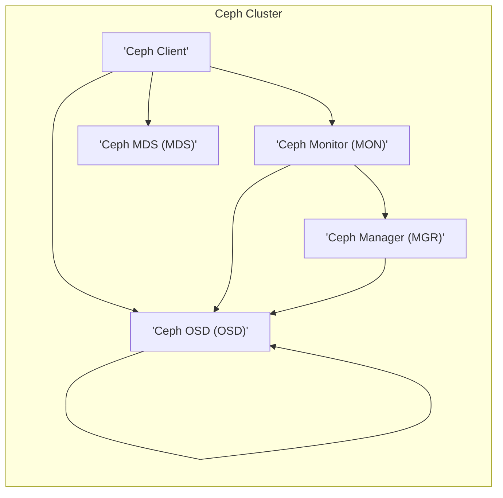
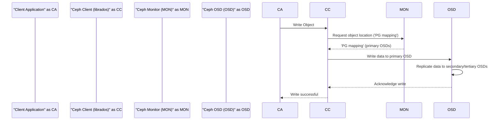
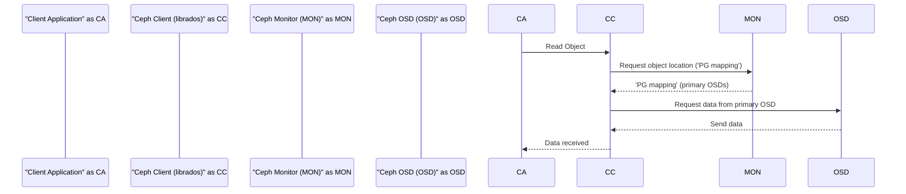

# Project Design Document: Ceph Distributed Storage System

**Version:** 1.1
**Date:** October 26, 2023
**Author:** AI Software Architect

## 1. Introduction

This document provides an enhanced architectural design of the Ceph distributed storage system, building upon the information available at [https://github.com/ceph/ceph](https://github.com/ceph/ceph). This refined design document will serve as a robust foundation for subsequent threat modeling activities, enabling a thorough identification of potential security vulnerabilities and risks.

Ceph is a unified distributed storage system renowned for delivering object, block, and file storage capabilities from a single, scalable platform. Its architecture emphasizes scalability, reliability, and high performance. This document delves into the core components, elucidates their interactions, and provides a comprehensive overview of the system's architecture, specifically tailored for security analysis.

## 2. Goals and Objectives

The fundamental goals of the Ceph project are:

*   To establish a highly scalable storage infrastructure capable of accommodating massive data growth.
*   To guarantee high availability and inherent fault tolerance, ensuring continuous data access.
*   To seamlessly support multiple storage interfaces, including object, block, and file storage paradigms.
*   To rigorously ensure data consistency and unwavering integrity across the distributed system.
*   To offer a robust and extensible platform for comprehensive storage management and administration.

## 3. High-Level Architecture

The Ceph architecture is composed of several interacting daemons and client interfaces that collectively provide storage services. The primary components are:

*   **Ceph OSD (Object Storage Daemon):** The workhorse of the system, responsible for storing data as objects on physical storage devices and managing data replication, recovery processes, and data rebalancing across the cluster.
*   **Ceph Monitor (MON):** The central authority maintaining the cluster map, a critical component that encompasses the current state of the cluster, the precise location of data objects, and the overall health status of the OSDs.
*   **Ceph Manager (MGR):** Provides essential monitoring, orchestration, and comprehensive management functionalities. This includes a user-friendly dashboard interface and a programmatic REST API for automation and integration.
*   **Ceph MDS (Metadata Server):** Specifically dedicated to managing the metadata for the Ceph File System (CephFS). This component is only active and relevant when the CephFS interface is utilized.
*   **Ceph Clients:** A diverse set of libraries and interfaces that enable applications to interact seamlessly with the Ceph cluster, abstracting the underlying distributed nature of the storage.

## 4. Component Details

### 4.1. Ceph OSD (Object Storage Daemon)

*   **Functionality:**
    *   Persistently stores data as individual objects on the underlying physical storage mediums.
    *   Implements data replication and erasure coding techniques based on the defined placement groups (PGs), ensuring data redundancy and durability.
    *   Conducts periodic data scrubbing operations to proactively verify and maintain data integrity, correcting any inconsistencies.
    *   Actively participates in data recovery procedures following failures and in rebalancing operations to optimize data distribution across the cluster.
    *   Directly manages the local storage devices attached to the server, such as hard disk drives (HDDs) and solid-state drives (SSDs).
*   **Key Responsibilities:**
    *   Ensuring the persistent storage and retrieval of data objects.
    *   Enforcing data redundancy through replication or erasure coding schemes.
    *   Managing data recovery processes to restore data availability after failures.
    *   Efficiently managing local storage resources and their utilization.
*   **Internal Components (Conceptual):**
    *   **Object Store:** The core component responsible for the actual storage and retrieval of individual data objects.
    *   **Replication/Erasure Coding Engine:** Implements the configured data redundancy strategy, handling the creation and reconstruction of data replicas or erasure code fragments.
    *   **Scrubber:** A background process that periodically examines stored data for errors and inconsistencies, ensuring long-term data integrity.
    *   **Heartbeat Mechanism:** Regularly transmits health status updates to the Ceph Monitors, allowing them to track the operational state of each OSD.

### 4.2. Ceph Monitor (MON)

*   **Functionality:**
    *   Maintains the authoritative and consistent cluster map, which includes critical information such as the CRUSH map (data placement algorithm), monitor map (list of monitors), OSD map (state of OSDs), and MDS map (state of MDSs).
    *   Achieves consensus on cluster state updates using a distributed consensus algorithm, typically a variant of Paxos, ensuring all monitors agree on the current state.
    *   Continuously monitors the health and operational status of other Ceph daemons, detecting failures and triggering recovery processes.
    *   Handles the authentication of clients and other daemons attempting to connect to the Ceph cluster, ensuring only authorized entities can access the system.
*   **Key Responsibilities:**
    *   Centralized management and distribution of the cluster's state information.
    *   Managing the membership of the cluster, tracking which daemons are active and participating.
    *   Providing authentication and authorization services to secure access to the cluster.
    *   Detecting failures within the cluster and initiating appropriate recovery actions.
*   **Internal Components (Conceptual):**
    *   **Paxos Implementation:** The core logic implementing the distributed consensus algorithm, ensuring agreement on state changes.
    *   **Cluster Map Store:** A persistent storage mechanism for the cluster map, ensuring its availability even in the event of monitor failures.
    *   **Authentication Service:** Handles the `cephx` authentication protocol, verifying the identity of clients and daemons.
    *   **Monitoring Service:** Continuously probes the health of other daemons and updates the cluster map accordingly.

### 4.3. Ceph Manager (MGR)

*   **Functionality:**
    *   Offers a comprehensive interface for monitoring the cluster's overall health, performance metrics, and capacity utilization.
    *   Hosts a variety of management modules that extend Ceph's functionality, including a web-based dashboard, a Prometheus exporter for integration with monitoring systems, and a REST API for programmatic management.
    *   Collects and aggregates performance statistics and telemetry data from other Ceph daemons, providing valuable insights into the system's operation.
    *   Provides a central point for cluster administration tasks, simplifying management and configuration.
*   **Key Responsibilities:**
    *   Providing comprehensive monitoring and metrics collection capabilities.
    *   Offering various management interfaces, including a command-line interface (CLI), a graphical dashboard, and a REST API.
    *   Orchestrating various management tasks and workflows within the cluster.
    *   Generating alerts and notifications based on predefined thresholds and events.
*   **Internal Components (Conceptual):**
    *   **Module Loader:** Dynamically loads and manages various management modules, extending the MGR's capabilities.
    *   **Metrics Collector:** Gathers and aggregates performance data from other daemons, making it available through monitoring interfaces.
    *   **REST API Server:** Exposes a programmatic interface for managing and monitoring the Ceph cluster.
    *   **Dashboard Interface:** Provides a user-friendly web-based interface for visualizing cluster status and performing management tasks.

### 4.4. Ceph MDS (Metadata Server)

*   **Functionality:**
    *   Specifically manages the metadata associated with the Ceph File System (CephFS), including file names, directories, permissions, and ownership information.
    *   Provides a POSIX-compliant file system interface, allowing applications to interact with Ceph storage using standard file system operations.
    *   Distributes metadata management responsibilities across multiple active MDS daemons to achieve scalability and high availability for metadata operations.
    *   Employs caching mechanisms to improve the performance of metadata lookups and operations, reducing latency.
*   **Key Responsibilities:**
    *   Efficiently storing and retrieving file system metadata.
    *   Managing the file system namespace, including directories and files.
    *   Ensuring POSIX compliance for the CephFS interface.
    *   Optimizing metadata access through caching strategies.
*   **Internal Components (Conceptual):**
    *   **Inode Table:** Stores the core metadata information for files and directories, including permissions, ownership, and data locations.
    *   **Directory Cache:** Caches frequently accessed directory structures to accelerate path lookups.
    *   **Locking Mechanism:** Implements mechanisms to manage concurrent access to metadata, ensuring consistency and preventing data corruption.

### 4.5. Ceph Clients

*   **Functionality:**
    *   Provide the necessary libraries and interfaces for applications to seamlessly interact with the Ceph cluster, abstracting the complexities of the underlying distributed storage.
    *   Support diverse access methods tailored to different storage paradigms, including `librados` for direct object storage access, RBD for block storage, and CephFS for file storage.
    *   Handle the authentication and authorization process with the Ceph cluster, ensuring secure access to storage resources.
*   **Types of Clients:**
    *   **librados:** A fundamental C library providing direct, low-level access to Ceph's object storage capabilities.
    *   **RBD (RADOS Block Device):** Presents block storage volumes that can be used like traditional block devices, often utilized with kernel modules or virtualization platforms like QEMU.
    *   **CephFS Client:** A kernel module or FUSE-based client enabling access to the Ceph File System, providing a POSIX-compliant interface.
    *   **S3/Swift Gateway (RGW - RADOS Gateway):** Offers object storage access through industry-standard S3 and Swift APIs, facilitating interoperability with existing applications and services.
*   **Key Responsibilities:**
    *   Establishing and maintaining communication with Ceph daemons.
    *   Performing authentication and authorization with the Ceph cluster.
    *   Managing the transfer of data to and from the OSDs.
    *   Translating application-level storage requests into the appropriate Ceph operations.

## 5. Data Flow

### 5.1. Object Storage Write Operation

### 5.2. Object Storage Read Operation

## 6. Security Considerations

This section expands upon the initial security considerations, providing more context relevant to threat modeling.

*   **Authentication and Authorization:**
    *   Ceph employs the `cephx` authentication protocol, a shared-secret key-based system, for secure communication between clients and daemons.
    *   Secure generation, distribution, and storage of `cephx` keys are paramount to prevent unauthorized access. Compromised keys can lead to significant security breaches.
    *   Consider the implications of key rotation and revocation procedures.
*   **Network Security:**
    *   Communication channels between Ceph components are potential targets for eavesdropping and man-in-the-middle attacks.
    *   Implementing network segmentation and utilizing encryption protocols (e.g., IPsec, TLS/SSL) for inter-daemon communication is crucial.
    *   Firewall rules should be configured to restrict access to Ceph ports to authorized hosts.
*   **Data at Rest Encryption:**
    *   Encrypting data stored on OSDs provides a strong defense against unauthorized access in cases of physical drive theft or compromise.
    *   Consider the key management strategy for data at rest encryption. Options include local key management or integration with external key management systems (KMS).
    *   Evaluate the performance impact of encryption.
*   **Data in Transit Encryption:**
    *   Encrypting data during transfer between clients and OSDs, and between OSDs during replication and recovery, protects data confidentiality.
    *   Ceph supports encryption for the CephFS client and can be configured for librados and RGW. Ensure these features are enabled and properly configured.
*   **Access Control:**
    *   Ceph provides mechanisms to control client access to specific storage pools and namespaces.
    *   Implementing fine-grained access control policies based on the principle of least privilege is essential.
    *   Regularly review and audit access control configurations.
*   **Auditing:**
    *   Enabling comprehensive logging and auditing of administrative actions, authentication attempts, and data access events provides valuable forensic information and helps in detecting security incidents.
    *   Securely store and regularly analyze audit logs.
*   **Input Validation:**
    *   All Ceph daemons should rigorously validate input data and commands to prevent injection attacks (e.g., command injection, SQL injection if using external databases for RGW).
    *   Pay particular attention to interfaces exposed to external entities, such as the RGW and the Manager API.
*   **Denial of Service (DoS) Protection:**
    *   Implement mechanisms to mitigate potential denial of service attacks targeting Ceph daemons. This may involve rate limiting, resource quotas, and proper network infrastructure configuration.
    *   Consider the impact of DoS attacks on cluster availability and data durability.
*   **Software Supply Chain Security:**
    *   Ensure the integrity and security of the Ceph software packages and their dependencies. Utilize trusted repositories and verify software signatures.
    *   Regularly update Ceph to the latest stable versions to patch known vulnerabilities.

## 7. Deployment Considerations

Security is deeply intertwined with deployment choices. Consider the following security implications during deployment:

*   **Network Topology:**
    *   Isolate the Ceph cluster on a private network to limit external access.
    *   Utilize VLANs or other network segmentation techniques to further isolate different Ceph components.
    *   Ensure sufficient bandwidth and low latency to avoid performance bottlenecks that could be exploited in DoS attacks.
*   **Hardware Selection:**
    *   Choose hardware components from reputable vendors with known security practices.
    *   Consider using self-encrypting drives (SEDs) for OSDs to simplify data at rest encryption.
    *   Secure the physical access to the hardware to prevent tampering.
*   **Operating System:**
    *   Harden the underlying operating system of all Ceph nodes by applying security patches, disabling unnecessary services, and configuring appropriate firewall rules.
    *   Implement intrusion detection and prevention systems (IDPS) on the Ceph network.
*   **Configuration Management:**
    *   Use secure configuration management tools (e.g., Ansible) to automate the deployment and configuration of Ceph, ensuring consistent and secure settings.
    *   Store configuration files securely and implement version control.
*   **Monitoring and Alerting:**
    *   Set up robust security monitoring and alerting systems to detect suspicious activity, unauthorized access attempts, and potential security breaches.
    *   Integrate Ceph's audit logs with a Security Information and Event Management (SIEM) system.

## 8. Assumptions and Constraints

*   This design document is based on publicly available information and general Ceph architectural principles. Specific implementation details can vary.
*   The threat modeling process will leverage this document to identify specific vulnerabilities and potential attack vectors based on the described architecture.
*   This document provides a high-to-medium level overview and does not delve into the intricate implementation details of every single component or feature.
*   We assume that standard security best practices will be followed during the development and deployment of applications interacting with the Ceph cluster.

## 9. Future Considerations

*   Exploring tighter integration with container orchestration platforms like Kubernetes, focusing on secure access and management within containerized environments.
*   Investigating and implementing more advanced security features, such as attribute-based access control (ABAC) for finer-grained authorization and enhanced encryption options like homomorphic encryption for data in use.
*   Continuously improving performance and scalability while maintaining a strong security posture.
*   Developing and refining management and monitoring tools with a strong emphasis on security auditing and vulnerability detection.

This enhanced design document provides a more detailed and security-focused overview of the Ceph distributed storage system architecture. This comprehensive foundation will be invaluable for conducting thorough threat modeling exercises and implementing robust security measures to protect the Ceph infrastructure and the data it stores.
