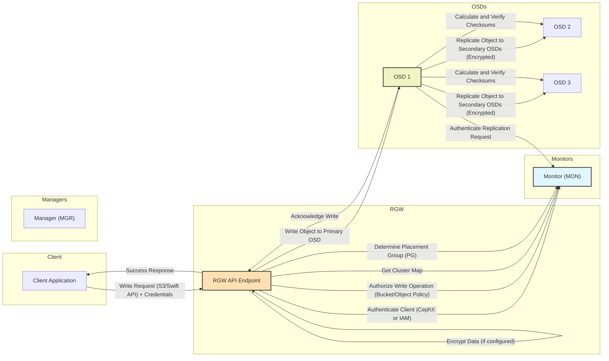
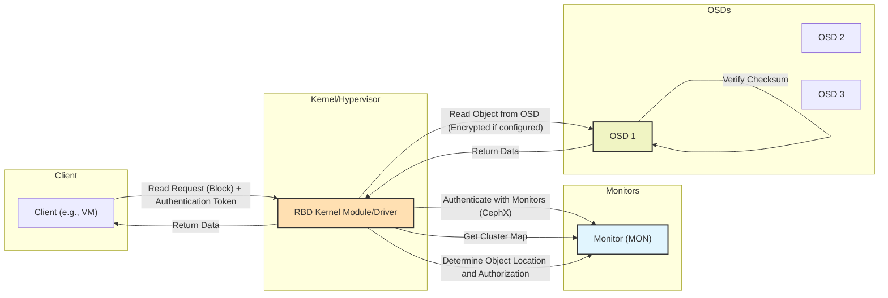
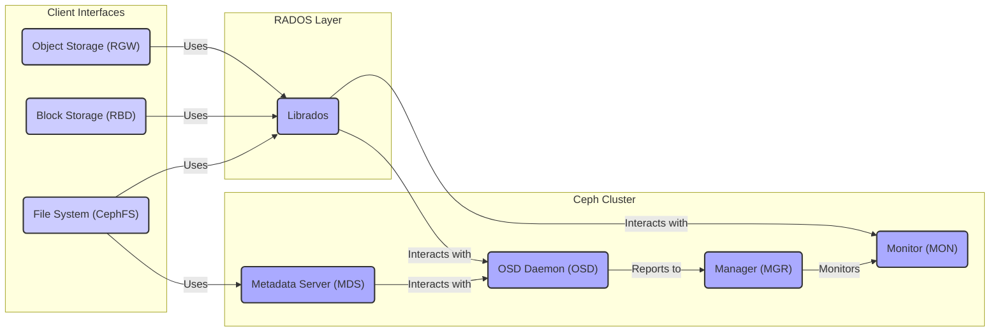
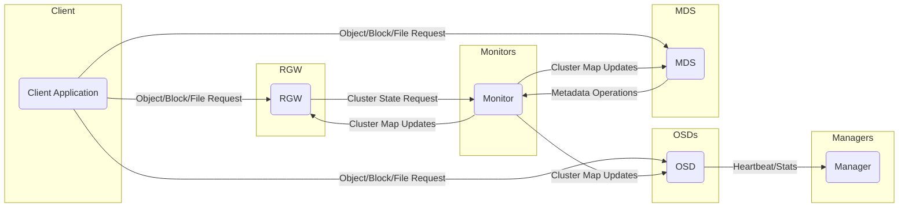

# Project Design Document: Ceph Distributed Storage System (Improved for Threat Modeling)

**Version:** 2.0
**Date:** October 26, 2023
**Author:** Gemini (AI Expert in Software, Cloud, and Cybersecurity Architecture)

## 1. Introduction

This document provides an enhanced architectural design of the Ceph distributed storage system, specifically tailored for threat modeling activities. Building upon the previous version, this document offers more granular details about component interactions, security responsibilities, and potential attack surfaces. The information presented here is crucial for identifying potential security vulnerabilities, understanding the system's attack vectors, and designing appropriate security mitigations.

This design is based on the information available in the official Ceph repository: [https://github.com/ceph/ceph](https://github.com/ceph/ceph).

## 2. Goals

* Provide a detailed and clear overview of the Ceph architecture, focusing on security-relevant aspects.
* Identify the major components and their specific security responsibilities and trust boundaries.
* Describe the data flow within the system for read and write operations, highlighting security checkpoints and potential vulnerabilities.
* Explicitly outline potential attack surfaces and security considerations for each component.
* Serve as a comprehensive basis for future threat modeling exercises, including identifying assets, threats, and vulnerabilities.
* Define the system's security boundaries and key trust zones.

## 3. Target Audience

* Security engineers and architects responsible for threat modeling, security assessments, and penetration testing.
* Developers working on or integrating with the Ceph storage system, requiring a deep understanding of its security architecture.
* Operations teams managing and maintaining Ceph deployments, needing to understand security implications of operational procedures.

## 4. System Overview

Ceph is a highly scalable and resilient distributed storage platform offering object, block, and file storage capabilities. Its core, RADOS, ensures data reliability and distribution. Understanding the interactions between its components is vital for effective threat modeling.

Key security characteristics of Ceph include:

* **Authentication:** CephX provides authentication between clients and daemons.
* **Authorization:** Access control lists (ACLs) and capabilities manage access to data and operations.
* **Data Protection:** Replication and erasure coding ensure data durability and availability.
* **Encryption:** Support for data-at-rest and data-in-transit encryption.
* **Auditing:** Logging mechanisms for tracking events and activities.

## 5. Architectural Components (Detailed for Security)

* **Ceph Monitors (MON):**
    * **Function:** Maintain the authoritative cluster map, manage cluster membership, and provide authentication services via CephX.
    * **Security Responsibilities:**
        * Authenticating clients and other daemons.
        * Distributing cryptographic keys for CephX.
        * Maintaining the integrity of the cluster map.
        * Participating in quorum to prevent split-brain scenarios.
    * **Potential Attack Surfaces:**
        * Compromise of a majority of monitors leading to control of the cluster.
        * Denial-of-service attacks targeting the quorum.
        * Exploitation of vulnerabilities in the Paxos implementation.
        * Man-in-the-middle attacks intercepting authentication credentials.
    * **Trust Boundary:** Forms a critical trust boundary for the entire cluster.

* **Ceph Managers (MGR):**
    * **Function:** Provide monitoring, management interfaces (including a REST API), and host various management modules.
    * **Security Responsibilities:**
        * Enforcing access control for management operations.
        * Securely storing and managing sensitive configuration data.
        * Providing audit logs of management activities.
    * **Potential Attack Surfaces:**
        * Compromise of the manager leading to unauthorized cluster modifications.
        * Exploitation of vulnerabilities in the management modules or REST API.
        * Exposure of sensitive information through insecure API access.
    * **Trust Boundary:**  Manages the operational aspects of the cluster and requires strong access controls.

* **Ceph OSD Daemons (OSD):**
    * **Function:** Store and retrieve data objects, handle data replication and recovery, and perform data scrubbing.
    * **Security Responsibilities:**
        * Enforcing authorization policies for data access.
        * Performing data encryption at rest (if configured).
        * Ensuring data integrity through checksums.
        * Securely communicating with other OSDs for replication.
    * **Potential Attack Surfaces:**
        * Unauthorized access to underlying storage devices.
        * Exploitation of vulnerabilities in the OSD daemon leading to data corruption or loss.
        * Man-in-the-middle attacks during data replication.
        * Insider threats gaining physical access to OSD nodes.
    * **Trust Boundary:** Holds the actual data and requires strong physical and logical security.

* **Ceph Metadata Servers (MDS):** (Only for CephFS)
    * **Function:** Manage metadata for the Ceph File System, handling file and directory operations.
    * **Security Responsibilities:**
        * Enforcing permissions for file system operations.
        * Protecting the integrity of the metadata.
        * Securely communicating with clients and OSDs.
    * **Potential Attack Surfaces:**
        * Compromise of the MDS leading to unauthorized file system modifications.
        * Exploitation of vulnerabilities in the MDS daemon.
        * Denial-of-service attacks targeting metadata operations.
    * **Trust Boundary:** Controls access to the file system namespace.

* **Librados:**
    * **Function:** Provides a library for direct interaction with the RADOS object store.
    * **Security Responsibilities:**
        * Providing secure access to RADOS based on configured permissions.
        * Ensuring data integrity during data transfer.
    * **Potential Attack Surfaces:**
        * Vulnerabilities in the Librados library itself.
        * Improper use of the library by applications leading to security issues.
    * **Trust Boundary:** Acts as a secure interface to the underlying storage.

* **RGW (RADOS Gateway):**
    * **Function:** Provides object storage interfaces compatible with S3 and Swift APIs.
    * **Security Responsibilities:**
        * Authenticating and authorizing API requests.
        * Enforcing bucket and object permissions.
        * Supporting secure communication protocols (HTTPS).
        * Potentially integrating with external identity providers.
    * **Potential Attack Surfaces:**
        * Exploitation of vulnerabilities in the RGW API implementation.
        * Credential compromise leading to unauthorized access to buckets and objects.
        * Server-side request forgery (SSRF) attacks.
        * Insecure configuration of bucket policies.
    * **Trust Boundary:** Acts as the entry point for external object storage access.

* **RBD (RADOS Block Device):**
    * **Function:** Provides block storage functionality accessible as virtual disks.
    * **Security Responsibilities:**
        * Enforcing access control for block devices.
        * Potentially supporting encryption for block devices.
    * **Potential Attack Surfaces:**
        * Unauthorized access to block devices leading to data compromise.
        * Exploitation of vulnerabilities in the RBD kernel module or driver.
    * **Trust Boundary:** Provides secure block storage volumes.

* **CephFS (Ceph File System):**
    * **Function:** A POSIX-compliant distributed file system built on RADOS.
    * **Security Responsibilities:**
        * Enforcing POSIX permissions for file and directory access.
        * Securely managing metadata through MDS.
    * **Potential Attack Surfaces:**
        * Exploitation of vulnerabilities in the CephFS client or kernel module.
        * Privilege escalation through file system vulnerabilities.
    * **Trust Boundary:** Provides a secure shared file system.

## 6. Data Flow (Detailed for Security)

### 6.1 Write Operation (Object Storage via RGW - Security Focus)

* The client application sends a write request to the RGW API endpoint, including authentication credentials.
* **Authentication:** RGW authenticates the client using CephX or an integrated Identity and Access Management (IAM) system, potentially interacting with the Monitors for CephX authentication.
* **Authorization:** RGW authorizes the write operation based on bucket and object policies, potentially consulting the Monitors for policy information.
* RGW retrieves the cluster map from the monitors to determine the placement group (PG) and the primary OSD for the object.
* **Encryption (Optional):** RGW encrypts the data before sending it to the OSDs if encryption-in-transit is configured.
* RGW sends the data to the primary OSD.
* **Replication Authentication:** The primary OSD authenticates with the Monitors before initiating replication.
* **Secure Replication:** The primary OSD replicates the data to secondary OSDs, ensuring the replication traffic is potentially encrypted.
* **Integrity Check:** OSDs calculate and verify checksums to ensure data integrity during replication.
* Once the required number of replicas are written, the primary OSD acknowledges the write to RGW.
* RGW sends a success response to the client.

### 6.2 Read Operation (Block Storage via RBD - Security Focus)

* The client (e.g., a virtual machine) sends a read request for a specific block, including an authentication token.
* **Authentication:** The RBD kernel module or driver authenticates with the Monitors using CephX.
* The driver retrieves the cluster map from the monitors.
* **Authorization:** The driver determines the OSD(s) where the requested data is located and verifies authorization to access the data.
* **Secure Read:** The driver sends a read request to one of the OSDs containing the data, potentially over an encrypted connection.
* **Integrity Check:** The OSD retrieves the data and verifies its checksum before returning it.
* The OSD returns the data to the driver.
* The driver returns the data to the client.

## 7. Security Considerations (Component-Specific)

* **Monitors:** Critical for cluster security. Compromise allows full control. Secure deployment, access control, and regular audits are essential.
* **Managers:** Secure access to the management interface is paramount. Implement strong authentication, authorization, and audit logging.
* **OSDs:** Physical security of OSD nodes is important. Implement data-at-rest encryption and secure communication channels.
* **MDS:** Secure access to MDS nodes and protect metadata integrity. Implement appropriate file system permissions.
* **RGW:** Secure API endpoints with HTTPS, enforce strong authentication and authorization, and regularly review bucket policies.
* **RBD:** Control access to RBD images and ensure secure communication between clients and OSDs.
* **CephFS:** Implement and enforce POSIX permissions, and secure the communication between clients and MDS/OSDs.

## 8. Deployment Model Impact on Security

* **On-Premise:** Organizations have greater control over physical security and network infrastructure but are responsible for all security aspects.
* **Cloud-Based:** Security responsibilities are shared with the cloud provider. Secure configuration of cloud resources and understanding the provider's security model are crucial. Network security groups and access control policies are vital.
* **Hybrid Cloud:** Combines the complexities of both models. Secure communication and identity management across environments are critical.

## 9. Technology Stack Security Implications

* **C++:** Potential for memory safety vulnerabilities. Requires secure coding practices and regular security audits.
* **Python:** Potential for scripting vulnerabilities. Secure dependency management and input validation are important.
* **TCP/IP:** Subject to network-based attacks. Proper network segmentation and firewall rules are necessary.
* **Paxos/Raft:** Implementation vulnerabilities could compromise cluster consensus.
* **XDR:** Potential for serialization vulnerabilities.
* **Linux:** Requires regular patching and hardening.
* **CephX:** Secure key management is critical. Key rotation and secure storage are essential.

## 10. Diagrams

**(Same diagrams as previous version, ensuring quoted node names)**

### 10.1 High-Level Architecture

### 10.2 Component Interaction

## 11. Threat Modeling Integration

This document serves as a crucial input for the threat modeling process. It provides a detailed understanding of the system's components, their interactions, data flows, and security responsibilities. Threat modeling exercises using this document will aim to:

* **Identify Assets:** Determine the valuable components and data within the Ceph system (e.g., cluster map, stored data, authentication keys).
* **Identify Threats:** Determine potential threats that could impact these assets (e.g., unauthorized access, data breaches, denial of service).
* **Identify Vulnerabilities:** Identify weaknesses in the design or implementation that could be exploited by threats (e.g., insecure API endpoints, unpatched software).
* **Analyze Attack Vectors:** Understand the paths an attacker could take to exploit vulnerabilities and compromise assets.
* **Prioritize Risks:** Assess the likelihood and impact of identified threats.
* **Develop Mitigation Strategies:** Design and implement security controls to reduce or eliminate identified risks.

## 12. Conclusion

This enhanced design document provides a comprehensive overview of the Ceph architecture with a strong focus on security considerations. It details the security responsibilities of each component, highlights potential attack surfaces, and outlines the security implications of different deployment models and technologies. This document is a vital resource for conducting thorough threat modeling exercises, enabling security professionals to proactively identify and mitigate potential security risks within Ceph deployments.